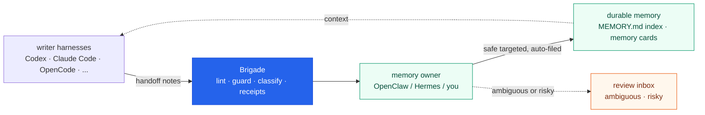

<p align="center">
  
</p>

<h1 align="center">Brigade</h1>

<p align="center">
  <strong>One canonical source for the MCP servers, tools, and memory your AI coding agents share, merged into each tool's native config with a review gate and a receipt for every change. Local files, no daemon, no lock-in.</strong>
</p>

<p align="center">
  <a href="https://brigade.tools">Website</a> &middot; <a href="https://brigade.tools/docs">Docs</a> &middot; <a href="#try-it-in-60-seconds">Quickstart</a> &middot; <a href="https://escoffierlabs.dev/cookbook/">Cookbook</a>
</p>

<p align="center">
  
  
  
  
</p>

Your agents run loops. Brigade keeps the receipts.

<p align="center">
  
</p>

<p align="center"><em><code>brigade operator quickstart</code> wires a repo and <code>operator doctor</code> reports ready, in seconds.</em></p>

## What it does

You run more than one agent CLI. Each one keeps its MCP servers in its own config file, its memory in its own silo, and writes to both without review. Brigade is the local layer that fixes that. You keep one canonical source for your MCP servers, your tool and skill catalog, and your memory, and Brigade merges each into the tools you actually use: MCP servers into each tool's native config, tools and skills projected into each harness, and one shared memory owned in one place. A review gate sits in front of anything that gets written, and every consequential change lands a receipt you can grep, diff, and roll back. No daemon, no hosted service, no vendor lock-in: it writes plain files in your repo when you run a command, and that is all it does.

## Install

`brigade operator quickstart` (in [Try it in 60 seconds](#try-it-in-60-seconds)) wires one code repo for one harness. For an OpenClaw or Hermes workspace instead:

```bash
brigade operator quickstart --target ~/agent-workspace --depth workspace --harnesses openclaw,hermes --owner openclaw
```

Use `--dry-run` first to preview the planned steps without writing anything. Pass more harnesses as a comma-separated list; quickstart only wires the harnesses you select and leaves the rest alone.

Write a handoff and check the wiring:

```bash
brigade handoff draft --target ./my-repo --inbox codex \
  --title "What changed" \
  --summary "Short note future agents should know." \
  --content "The durable note itself goes here."
brigade handoff lint --target ./my-repo
brigade handoff doctor --target ./my-repo
```

New here? Start with [QUICKSTART.md](QUICKSTART.md) for the five-minute install, then [docs/first-10-minutes.md](docs/first-10-minutes.md) for the guided first session. Already have a homegrown setup with scripts, crons, and handoff folders? Brigade has an adoption path that inventories what you have before changing anything: start with `brigade operator adopt plan` and see the [technical guide](docs/technical-guide.md). Want an agent to set this up for you? Point it at this repo; [AGENTS.md](AGENTS.md) tells it exactly what to do and where to stop.

## Try it in 60 seconds

```bash
pipx install brigade-cli
pipx ensurepath          # then open a new shell so `brigade` is on PATH
brigade operator quickstart --target ./my-repo --harnesses codex      # wire one repo
brigade operator doctor --target ./my-repo --profile local-operator   # verify
```

That installs the CLI, wires memory, handoffs, and local guardrails into one repo for a single harness, and prints a readiness check. Nothing leaves your machine and no daemon is started. Add `--dry-run` to preview the file-by-file plan before anything is written. More harnesses, workspace setups, and the homegrown-adoption path are under [Install](#install).

The run ends with a readiness verdict (the recording above shows the full report):

```
operator doctor: ~/my-repo
profile: local-operator
ready: yes
blocking_issues: 0
next: brigade daily plan --target .
content_guard: missing hook=not-enabled policy=public-repo
```

content-guard is an optional sidecar in its own repo; doctor reports it missing until you install it (`brigade add guard`) and stays ready regardless.

## One MCP catalog, synced into every tool

Every agent tool reads its MCP servers from a different file in a different shape. The same servers wired across Claude Code, Cursor, Codex, VS Code, OpenCode, and Antigravity means hand-editing six configs and keeping them in sync forever. Brigade keeps one canonical catalog and merges it into each tool's native config for you.

```bash
brigade mcp init                  # scaffold .brigade/mcp.json
brigade mcp add --name github --command npx \
  --args "-y @modelcontextprotocol/server-github" \
  --env GITHUB_TOKEN=ref:GITHUB_TOKEN
brigade mcp sync                  # dry-run: show the diff for every tool
brigade mcp sync --write          # merge into each tool's config
```

Run `brigade mcp sync` and you get the per-tool plan, server by server, before a single file changes. Two servers in the catalog, projected across the harnesses wired in this repo:

```
brigade mcp sync (dry-run): ~/my-repo
claude       github               missing        -> create
claude       sentry               missing        -> create
cursor       github               missing        -> create
cursor       sentry               missing        -> create
codex        github               missing        -> create
codex        sentry               missing        -> create
vscode       github               missing        -> create
vscode       sentry               missing        -> create
opencode     github               missing        -> create
opencode     sentry               missing        -> create
```

One catalog (`.brigade/mcp.json`), six native targets. If you are evaluating options first, read the focused comparison page: [sync MCP servers across coding agents](https://brigade.tools/compare/sync-mcp-servers-across-coding-agents).

| Tool | File it writes |
|---|---|
| Claude Code | `.mcp.json` |
| Cursor | `.cursor/mcp.json` |
| Codex CLI | `.codex/config.toml` (merged surgically, other tables preserved) |
| VS Code | `.vscode/mcp.json` (secrets become `inputs[]`) |
| OpenCode | `opencode.json` |
| Antigravity | `~/.gemini/config/mcp_config.json` (user-scoped, `--user-scope`) |

It is dry-run by default and never runs from `doctor` or `brief`. It merges by server key, so servers you added by hand are never touched, and ones you edited are left alone unless you pass `--force`. Secrets are written as `${VAR}` references (or VS Code `${input:VAR}`), never inlined. Ownership is tracked in a gitignored sidecar, so re-syncing on a fresh clone does not spuriously conflict. Full behavior in [docs/mcp-sync.md](docs/mcp-sync.md).

Tools and skills get the same treatment: `brigade tools sync` projects one reviewed catalog into each harness's native format.

> `brigade mcp` requires brigade 0.13.0 or newer (`pipx upgrade brigade-cli`).

## Shared memory, with a guard in front

Writer harnesses leave handoff notes as they work. Brigade lints, guards, and classifies each one, then files the safe, targeted notes into durable memory on its own. A memory owner (OpenClaw, Hermes, or just you) only steps in for the ambiguous few. Every consequential action lands a receipt in a plain file you can grep, diff, and prune.

1. agents write handoff notes into their own local inboxes
2. Brigade lints and classifies each one before it can become memory
3. safe, targeted notes file themselves into durable memory automatically
4. only the ambiguous or risky few wait for your review
5. future sessions start with better context, and receipts show what happened



Memory has two layers: knowledge cards under `memory/cards/` hold the detail, and `MEMORY.md` stays a slim one-line-per-card index that loads every session. `brigade memory care scan` flags stale, contradictory, or undersourced cards for review instead of letting them rot. Brigade never edits canonical memory itself; the owner does the writing. It all runs on the machine you control: laptop, workstation, or VPS.

## Verified learning

Filing notes is the first loop. The second loop earns trust. Brigade can promote a learned skill on its own, but only when a real signal proves it helped, and it rolls one back the moment a signal says it broke. The model never grades its own work.

**Your daily loop.** `brigade init` wires a `brigade-work` skill into each harness so your agent runs this without being told, but it is three commands by hand:

```bash
brigade work brief --target .                                  # 1. what's pending (+ whether the loop is being fed)
brigade work verify run --target . --command "pytest -q" --capture <skill-or-card>   # 2. verify + capture in one step
# 3. write a Memory Handoff for anything durable, then let the ratchet run on its own
```

Skip this and Brigade is installed-but-dormant: the brief is empty and `outcome rank` says "ranking: none". `brigade work brief` reports the loop's own health, so you can see at a glance whether verify runs are piling up while the ledger stays empty.

- `brigade outcome capture` records the result of a verify run (a real exit code, not an opinion) against the skill that produced it.
- `brigade outcome score` ranks each skill by a Wilson lower bound, so something that passed twice never outranks something vetted across twenty runs.
- `brigade outcome reconcile` is the gate. Dry-run by default; with `--apply` it installs a skill that earned it across your harnesses, or rolls a regressed one back to its last good version.
- `brigade outcome explain` prints the full signal trail behind any decision: which run produced each result, the threshold it crossed, and the reversible action taken.

The whole ledger is plain JSON and markdown under `memory/outcome/`, tracked in git and readable without Brigade. Schedule `brigade outcome reconcile` in your own cron to run it hands-off; Brigade still installs no daemon.

## Sidecars

Brigade is the hub. Each station wires an optional standalone tool, installed with `brigade add <station>` and health-checked by `brigade status` and `brigade doctor`. Every tool is its own repo, independently installable, with no library coupling back into Brigade.

Use `brigade profiles list` to see built-in station bundles and `brigade stations list` to see which stations are selected by the default repo profile before installing any sidecar tools.

Fresh repo installs use the `repo` profile: core, skills, memory, guard, security, tokens, evidence, and search are selected up front. `brigade init` wires the built-in skills immediately, including `brigade-work` and `ultra-work-scout`, so new Codex users can run the Brigade work loop and broad Scout scoping from the start. External sidecars stay in their own repos and install only when you run `brigade add <station>`.

| `brigade add` | Tool | What it does |
|---|---|---|
| `skills` | built-in Scout skills; optional Skillet roster | wires `brigade-work` and `ultra-work-scout` on init; use `npx skills add escoffier-labs/skillet` for the full sidecar skill roster |
| `guard` | content-guard | scans handoffs and content for secrets and PII before anything leaves the machine |
| `tokens` | token-glace | tracks token spend across your harnesses and compacts noisy output |
| `memory` | memory-doctor, bootstrap-doctor | validates memory cards and bootstrap files for staleness and contradictions |
| `pantry` | agentpantry | syncs browser sessions and auth across an agent's machine |
| `search` | code-search | local semantic code search over your repos |
| `evidence` | miseledger | a local-first evidence ledger with receipts and source exporters |

## Harness support

Each writer gets its own local inbox; one canonical owner ingests. Brigade keeps the note format consistent so different tools can contribute without inventing their own styles.

| Writer | Harness id | Inbox |
|---|---|---|
| Codex CLI | `codex` | `.codex/memory-handoffs/` |
| Claude Code | `claude` | `.claude/memory-handoffs/` |
| OpenCode | `opencode` | `.opencode/memory-handoffs/` |
| Antigravity | `antigravity` | `.antigravity/memory-handoffs/` |
| Pi | `pi` | `.pi/memory-handoffs/` |
| Cursor | `cursor` | `.cursor/memory-handoffs/` |
| Aider | `aider` | `.aider/memory-handoffs/` |
| Goose | `goose` | `.goose/memory-handoffs/` |
| Continue | `continue` | `.continue/memory-handoffs/` |
| GitHub Copilot CLI | `copilot` | `.copilot/memory-handoffs/` |
| Qwen Code | `qwen` | `.qwen/memory-handoffs/` |
| Kimi Code | `kimi` | `.kimi/memory-handoffs/` |
| AdaL | `adal` | `.adal/memory-handoffs/` |
| OpenHands | `openhands` | `.openhands/memory-handoffs/` |
| Grok CLI | `grok` | `.grok/memory-handoffs/` |
| Amp | `amp` | `.amp/memory-handoffs/` |
| Crush | `crush` | `.crush/memory-handoffs/` |
| Hermes | `hermes` | `.hermes/memory-handoffs/` |
| OpenClaw | `openclaw` | usually the memory owner, not a writer |

All of them get handoff templates and ingest source coverage. Most also get projected tools and skills in their native format; the per-harness matrix is in the [technical guide](docs/technical-guide.md). Hermes is validated against a real install: handoffs land in `.hermes/memory-handoffs/`, and reviewed skills install into your Hermes store (`~/.hermes/skills`).

## More

The same review-and-receipt pattern covers the rest of an operator's day, and you can ignore all of it until you need it.

- **Cross-model runs**: `brigade run "<task>"` plans, dispatches, and synthesizes one bounded task across the agent CLIs in your roster, so an expensive model can think while cheaper ones do the grunt work. `--worktree` runs everything in a detached git checkout that comes back as a reviewable `changes.patch`.
- **Daily loop**: `brigade work brief` shows pending work, imports, and warnings; `brigade daily status` keeps it bounded and cheap.
- **Friction logs**: `brigade friction scan` mines recent notes, handoffs, and session artifacts for reviewable workflow friction.
- **Security and scrub**: `brigade security scan` is a local read-only scanner for agent workspaces; `brigade scrub` gates content before it leaves the machine.
- **Research**: `brigade research run` turns a question into a cited local report and a reviewable memory handoff.
- **Fleet and release**: health evidence across your local repos and release-readiness receipts, with no publish step.

The full tour of every station lives in [docs/overview.md](docs/overview.md).

## Why not something else?

- **mem0, Letta, agentmemory, and friends** are memory layers for apps you are building, usually behind an API or a server. Brigade is for the agent CLIs you already run, and it is file-first: your memory is markdown in your repo, reviewable in git, readable without Brigade.
- **add-mcp, chezmoi, and config-sync scripts** move MCP or dotfiles around, but they sync one thing with no review gate and no receipt, and they do not touch memory or skills. Brigade keeps one canonical source for MCP servers, tools, skills, and memory together, shows the per-tool diff before any write, and leaves a receipt you can roll back.
- **Native harness memory** (each tool's own auto-memory) is a per-tool silo. It does not cross harnesses, and it writes without review. Brigade gives every tool one shared format and one canonical owner, with a review gate in between.
- **Already running Hermes, or any self-improving agent?** Keep it. Brigade is not a replacement, it is the verification layer on top. A built-in learning loop grades its own work and keeps what it learns inside one tool. Brigade promotes a skill only when a real signal confirms it, keeps every learned skill as portable markdown in your git, and runs one loop across your whole fleet.
- **A plain CLAUDE.md / AGENTS.md** works great until it bloats past the context budget and goes stale. Brigade keeps bootstrap files slim, moves detail into indexed cards, and flags staleness instead of trusting last month's facts forever.
- **A daemon or hosted service** would be simpler to demo and worse to trust. Brigade writes local files when you run a command, and that is all it does.

At a glance, against the tools people reach for first:

| | Across harnesses | MCP, tools, and memory in one source | Review gate + receipts | Local files, no daemon |
|---|:---:|:---:|:---:|:---:|
| **Brigade** | yes | yes | yes | yes |
| mem0 / Letta / agentmemory | per-SDK | memory only | no | usually hosted or a server |
| add-mcp / chezmoi / config-sync | partial | MCP or dotfiles only | no | yes |
| Native harness memory | no | memory only | no | yes |

## What Brigade is not

Brigade is not a hosted memory service, a daemon, or an automatic release bot.

It does not:

- run in the background or install schedulers (one scoped exception: `brigade tools runtime start` launches a local runtime process, only when you start it, until you stop it)
- push to GitHub or publish packages
- send notifications by default
- save every note automatically
- turn memory ingest into a silent background process
- skip review for ambiguous, risky, or failed notes

That pause is the point. Agent memory should be useful, not noisy.

And it is not the other projects that share the name. This Brigade is the AI-agent operator CLI, installed with `pipx install brigade-cli` from [`escoffier-labs/brigade`](https://github.com/escoffier-labs/brigade). It is not the CNCF/Microsoft **Brigade** for event-driven scripting on Kubernetes (archived in 2022), the Spinabot **Brigade** agent crew, or the 2017 `brigade` Python package that became Nornir. Same word, different tool.

## Why I built this

<p align="center">
  
</p>

I run an always-on OpenClaw agent next to daily Codex and Claude Code sessions. Every one of those tools wakes up empty, and whatever a session learned scattered across tool-specific folders and died there. Two incidents shaped the design: a "dreaming" job that promoted raw session fragments straight into memory bloated `MEMORY.md` past the bootstrap budget, so every session started truncated and nobody noticed for weeks; and 195 handoff notes that sat unread across 35 repos because an ingester had a hardcoded allowlist and nothing warned about the gap. Silence is the failure mode. Every part of Brigade that lints, warns, or writes a receipt exists because something once failed in silence. The full production stack, now 482 cards across daily multi-agent work, is documented in the [Cookbook](https://escoffierlabs.dev/cookbook/).

## Docs

- [First 10 minutes](docs/first-10-minutes.md): shortest path from install to healthy setup.
- [Overview](docs/overview.md): the full tour of every station and diagram.
- [Technical guide](docs/technical-guide.md): the detailed command walkthrough.
- [MCP sync](docs/mcp-sync.md): the canonical catalog, supported tools, and merge rules.
- [Security and Content Guard](docs/security.md): scanner policies, handoff guards, import flow.
- [Handoff promotion](docs/handoff-promotion.md): how notes move toward memory.
- [Repo fleet](docs/repo-fleet.md) and [Tool catalog](docs/tool-catalog.md).
- [Command inventory](docs/command-inventory.md): every public CLI command.
- [Maintainers](MAINTAINERS.md), [Governance](GOVERNANCE.md), [Security](SECURITY.md), and [Contributing](CONTRIBUTING.md).
- [Roadmap](ROADMAP.md) and [roadmap archive](docs/roadmap-archive.md).

## License

MIT. See [LICENSE](LICENSE).

Project identity: GitHub [`escoffier-labs/brigade`](https://github.com/escoffier-labs/brigade), website [brigade.tools](https://brigade.tools), PyPI [`brigade-cli`](https://pypi.org/project/brigade-cli/), command `brigade`. The name comes from the kitchen: a *brigade de cuisine* runs the line, and *mise en place* means the station is prepped before service. Set up the rules, memory, tools, and receipts before the session gets expensive.

It is early-stage and moving fast. If you hit a broken workflow, a confusing command, or a setup issue, [open an issue](https://github.com/escoffier-labs/brigade/issues) and I will get it fixed.
