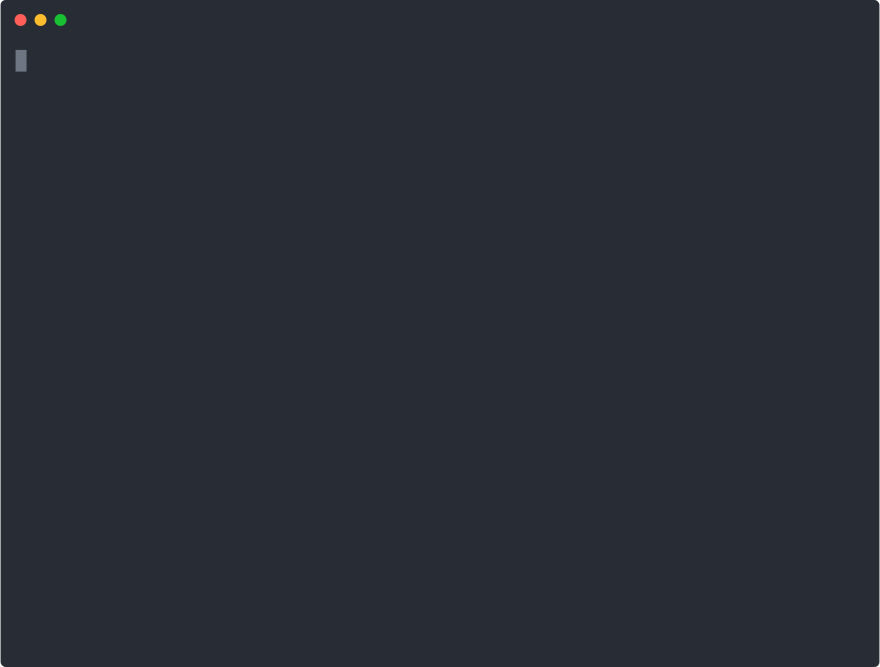
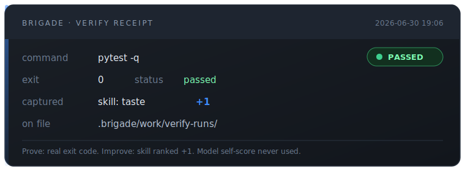
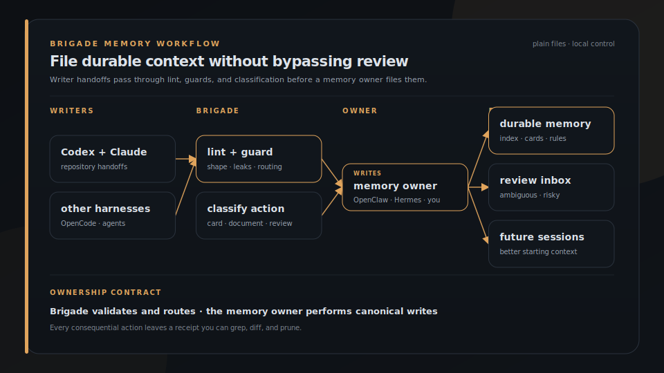

<p align="center">
  
</p>

<h1 align="center">Brigade</h1>

<p align="center">
  <strong>Your agents run loops. Brigade keeps the receipts.</strong>
</p>

<p align="center">
  Local control plane for multi-agent coding: share MCP, tools, and memory; remember across sessions; prove runs with file receipts; improve only from real exit codes. Optional stations (GraphTrail, MiseLedger, Agent Pantry) plug into that loop. Diff before every write. No daemon, no lock-in.
</p>

<p align="center">
  <a href="https://brigade.tools">Website</a> &middot; <a href="https://brigade.tools/docs">Docs</a> &middot; <a href="#install">Install</a> &middot; <a href="https://escoffierlabs.dev/cookbook/">Cookbook</a>
</p>

<p align="center">
  
  
  
  
  
</p>

<p align="center">
  
  
  
</p>

## Install

```bash
pipx install brigade-cli
pipx ensurepath          # then open a new shell so `brigade` is on PATH
brigade operator quickstart --target ./my-repo --harnesses codex
brigade operator doctor --target ./my-repo --profile local-operator
```

That wires memory, handoffs, a local MCP catalog, the work loop, and guardrails into one repo for one harness, then prints ready. Default footprint is small: `AGENTS.md`, `SAFETY_RULES.md`, a handoff template, and `.brigade/` state. Add `--dry-run` to preview; `--full` for the whole kit. Nothing leaves your machine.

```
operator doctor: ~/my-repo
profile: local-operator
ready: yes
blocking_issues: 0
next: brigade daily plan --target .
```

<p align="center">
  
</p>

<p align="center"><em><code>brigade operator quickstart</code> then <code>operator doctor</code>. Install first, deepen later.</em></p>

Workspace / multi-harness (OpenClaw, Hermes, more agents):

```bash
brigade operator quickstart --target ~/agent-workspace \
  --depth workspace --harnesses openclaw,hermes --owner openclaw
```

New here? [QUICKSTART.md](QUICKSTART.md) and [docs/first-10-minutes.md](docs/first-10-minutes.md). Homegrown setup already? `brigade operator adopt plan`. Point an agent at this repo; [AGENTS.md](AGENTS.md) tells it what to do and where to stop. Content guard is built in (`brigade scrub`); set `CONTENT_GUARD_DIR` only for an external checkout.

## What it does

| | Job | What you get |
|---|---|---|
| **Share** | One catalog of MCP servers, tools, and skills | Merged into each harness's native config after a dry-run diff |
| **Remember** | Handoffs between sessions and agents | Linted notes, shared memory, slim bootstrap instead of silo bloat |
| **Prove** | Verify and run through Brigade | File receipts: command, real exit code, what changed |
| **Improve** | Promote or roll back what worked | Skills and cards only rank up on those exit codes, never on model self-score |

<p align="center">
  
</p>

<p align="center"><em><code>verify run --capture</code> → receipt + skill score → <code>rank</code> / <code>reconcile</code> promote only on real exits. Not model self-score.</em></p>

Self-improving means the fleet gets better from measured work, not from the model grading itself. Brigade is a CLI, not an MCP server and not a hosted memory product. Plain files when you run a command.

## Stations: how the fleet plugs in

<p align="center">
  <a href="https://brigade.tools"></a>
  &nbsp;
  <a href="https://brigade.tools/graphtrail"></a>
  &nbsp;
  <a href="https://brigade.tools/miseledger"></a>
  &nbsp;
  <a href="https://brigade.tools/agentpantry"></a>
  &nbsp;
  <a href="https://brigade.tools/content-guard"></a>
  &nbsp;
  <a href="https://brigade.tools/skillet"></a>
  &nbsp;
  <a href="https://brigade.tools/token-glace"></a>
</p>

<p align="center"><em>Hub marks (circular + hairline). Each links to its <code>brigade.tools/…</code> page.</em></p>

Brigade is the hub. Optional tools stay in their own repos; `brigade add <station>` installs them, and `status` / `doctor` health-check what is present. Core works with zero sidecars.

| | Station | Install | Plugs into | Role |
|---|---|---|---|---|
| <a href="https://brigade.tools/graphtrail"></a> | **[GraphTrail](https://brigade.tools/graphtrail)** | `brigade add search` (bundle: code-search + GraphTrail) | **Prove** | Code graph; `brigade run` prepends a context pack when a graph exists |
| <a href="https://brigade.tools/miseledger"></a> | **[MiseLedger](https://brigade.tools/miseledger)** | `brigade add evidence` | **Prove** / **Remember** | Evidence ledger; export briefs into the next work context |
| <a href="https://brigade.tools/agentpantry"></a> | **[Agent Pantry](https://brigade.tools/agentpantry)** | `brigade add pantry` | **Share** | Encrypted browser-session / secret sync across machines |
| <a href="https://brigade.tools/content-guard"></a> | **[Content Guard](https://brigade.tools/content-guard)** | built in (`guard` / `scrub`) | **Share** / **Remember** | Secrets and PII scan before publish ([docs](docs/security.md)) |
| <a href="https://brigade.tools/skillet"></a> | **[Skills / Skillet](https://brigade.tools/skillet)** | built-in on init; Skillet roster optional | **Improve** | Portable skills; reconcile promotes or rolls them back |
| <a href="https://brigade.tools/token-glace"></a> | **[Token Glace](https://brigade.tools/token-glace)** | `brigade add tokens` | **Prove** | Compact noisy tool output before it burns context |

```bash
brigade add pantry && brigade add evidence && brigade add search
brigade add tokens
brigade status --target .
```

Station pages: [GraphTrail](https://brigade.tools/graphtrail) · [MiseLedger](https://brigade.tools/miseledger) · [Agent Pantry](https://brigade.tools/agentpantry) · [Content Guard](https://brigade.tools/content-guard) · [Skillet](https://brigade.tools/skillet) · [Token Glace](https://brigade.tools/token-glace). Full station reference (install, profiles, `brigade add`, contract): [docs/station-contract.md](docs/station-contract.md).

## One MCP catalog, synced into every tool

Every agent tool reads its MCP servers from a different file in a different shape. The same servers wired across Claude Code, Cursor, Codex, VS Code, OpenCode, and Antigravity means hand-editing six configs and keeping them in sync forever. Brigade keeps one canonical catalog and merges it into each tool's native config for you.

```bash
brigade mcp init                  # scaffold .brigade/mcp.json
brigade mcp add --name github --command npx \
  --args "-y @modelcontextprotocol/server-github" \
  --env GITHUB_AUTH_ENV=ref:BRIGADE_GITHUB_AUTH_ENV
brigade mcp sync                  # dry-run: show the diff for every tool
brigade mcp sync --write          # merge into each tool's config
```

Run `brigade mcp sync` and you get the per-tool plan, server by server, before a single file changes. Two servers in the catalog, projected across the harnesses wired in this repo:

```
brigade mcp sync (dry-run): ~/my-repo
claude       github               missing        -> create
claude       sentry               missing        -> create
cursor       github               missing        -> create
cursor       sentry               missing        -> create
codex        github               missing        -> create
codex        sentry               missing        -> create
vscode       github               missing        -> create
vscode       sentry               missing        -> create
opencode     github               missing        -> create
opencode     sentry               missing        -> create
```

One catalog (`.brigade/mcp.json`), six native targets. If you are evaluating options first, read the focused comparison page: [sync MCP servers across coding agents](https://brigade.tools/compare/sync-mcp-servers-across-coding-agents).

| Tool | File it writes |
|---|---|
| Claude Code | `.mcp.json` |
| Cursor | `.cursor/mcp.json` |
| Codex CLI | `.codex/config.toml` (merged surgically, other tables preserved) |
| Grok CLI | `.grok/config.toml` (same TOML shape as Codex; `~/.grok/config.toml` via `--user-scope`) |
| VS Code | `.vscode/mcp.json` (secrets become `inputs[]`) |
| OpenCode | `opencode.json` |
| Antigravity | `~/.gemini/config/mcp_config.json` (user-scoped, `--user-scope`) |

It is dry-run by default and never runs from `doctor` or `brief`. It merges by server key, so servers you added by hand are never touched, and ones you edited are left alone unless you pass `--force`. Secrets are written as `${VAR}` references (or VS Code `${input:VAR}`), never inlined. Ownership is tracked in a gitignored sidecar, so re-syncing on a fresh clone does not spuriously conflict. Full behavior in [docs/mcp-sync.md](docs/mcp-sync.md).

Tools and skills get the same treatment: `brigade tools sync` projects one reviewed catalog into each harness's native format.

> `brigade mcp` requires brigade 0.13.0 or newer (`pipx upgrade brigade-cli`).

## Shared memory, with a guard in front

Writer harnesses leave handoff notes as they work. Brigade lints, guards, and classifies each one, then files the safe, targeted notes into durable memory on its own. A memory owner (OpenClaw, Hermes, or just you) only steps in for the ambiguous few. Every consequential action is logged to a plain file you can grep, diff, and prune.

1. agents write handoff notes into their own local inboxes
2. Brigade lints and classifies each one before it can become memory
3. safe, targeted notes file themselves into durable memory automatically
4. only the ambiguous or risky few wait for your review
5. future sessions start with better context, and the paper trail shows what happened

<p align="center">
  
</p>

<p align="center"><em>Brigade validates and routes. The memory owner performs canonical writes.</em></p>

Memory has two layers: knowledge cards under `memory/cards/` hold the detail, and `MEMORY.md` stays a slim one-line-per-card index that loads every session. `brigade memory care scan` flags stale, contradictory, or undersourced cards for review instead of letting them rot. Brigade never edits canonical memory itself; the owner does the writing. It all runs on the machine you control: laptop, workstation, or VPS.

## Verified learning

Filing notes is the first loop. The second loop earns trust. Brigade can promote a learned skill on its own, but only when a real signal proves it helped, and it rolls one back the moment a signal says it broke. The model never grades its own work.

**Your daily loop.** `brigade init` wires a `brigade-work` skill into each harness so your agent runs this without being told, but it is three commands by hand:

```bash
brigade work brief --target .                                  # 1. what's pending (+ whether the loop is being fed)
brigade work verify run --target . --command "pytest -q" --capture <skill-or-card>   # 2. verify + capture in one step
# 3. write a Memory Handoff for anything durable, then let the ratchet run on its own
```

Skip this and Brigade is installed-but-dormant: the brief is empty and `outcome rank` says "ranking: none". `brigade work brief` reports the loop's own health, so you can see at a glance whether verify runs are piling up while the ledger stays empty.

When Claude Code is selected during project setup, Brigade also installs project-scoped work-loop hooks in `.claude/settings.json`. The hooks brief once per session and repository, redirect direct test commands to `brigade work verify run`, and check for a verification receipt after write work. Use `brigade work hooks status --target .` to inspect the package, or `install`, `update`, and `uninstall` to manage it. Unrelated Claude settings and hooks are preserved.

- `brigade outcome capture` records the result of a verify run (a real exit code, not an opinion) against the skill that produced it.
- `brigade outcome score` ranks each skill by a Wilson lower bound, so something that passed twice never outranks something vetted across twenty runs.
- `brigade outcome reconcile` is the gate. Dry-run by default; with `--apply` it installs a skill that earned it across your harnesses, or rolls a regressed one back to its last good version.
- `brigade outcome explain` prints the full signal trail behind any decision: which run produced each result, the threshold it crossed, and the reversible action taken.

The whole ledger is plain JSON and markdown under `memory/outcome/`, tracked in git and readable without Brigade. Schedule `brigade outcome reconcile` in your own cron to run it hands-off; Brigade still installs no daemon.

## Harness support

Each writer gets its own local inbox; one canonical owner ingests. Brigade keeps the note format consistent so different tools can contribute without inventing their own styles.

| Writer | Harness id | Inbox |
|---|---|---|
| Codex CLI | `codex` | `.codex/memory-handoffs/` |
| Claude Code | `claude` | `.claude/memory-handoffs/` |
| OpenCode | `opencode` | `.opencode/memory-handoffs/` |
| Antigravity | `antigravity` | `.antigravity/memory-handoffs/` |
| Pi | `pi` | `.pi/memory-handoffs/` |
| Cursor | `cursor` | `.cursor/memory-handoffs/` |
| Aider | `aider` | `.aider/memory-handoffs/` |
| Goose | `goose` | `.goose/memory-handoffs/` |
| Continue | `continue` | `.continue/memory-handoffs/` |
| GitHub Copilot CLI | `copilot` | `.copilot/memory-handoffs/` |
| Qwen Code | `qwen` | `.qwen/memory-handoffs/` |
| Kimi Code | `kimi` | `.kimi/memory-handoffs/` |
| AdaL | `adal` | `.adal/memory-handoffs/` |
| OpenHands | `openhands` | `.openhands/memory-handoffs/` |
| Grok CLI | `grok` | `.grok/memory-handoffs/` |
| Amp | `amp` | `.amp/memory-handoffs/` |
| Crush | `crush` | `.crush/memory-handoffs/` |
| Hermes | `hermes` | `.hermes/memory-handoffs/` |
| OpenClaw | `openclaw` | usually the memory owner, not a writer |

All of them get handoff templates and ingest source coverage. Most also get projected tools and skills in their native format; the per-harness matrix is in the [technical guide](docs/technical-guide.md). Hermes is validated against a real install: handoffs land in `.hermes/memory-handoffs/`, and reviewed skills install into your Hermes store (`~/.hermes/skills`).

## More

The same review-and-receipt pattern covers the rest of an operator's day, and you can ignore all of it until you need it. Most of these live behind `brigade extras on`, one command that adds the 18 operator-suite groups (release trains, fleet health, mission control, research, chat archives) to the CLI; until then `brigade --help` stays at the 24 core groups.

- **Cross-model runs**: `brigade run "<task>"` plans, dispatches, and synthesizes one bounded task across the agent CLIs in your roster, so an expensive model can think while cheaper ones do the grunt work. It can attach GraphTrail and upstream-drift context under a shared brief budget, then records which briefs attached in `run.json`. `--worktree` runs everything in a detached git checkout that comes back as a reviewable `changes.patch`.
- **Daily loop**: `brigade work brief` shows pending work, imports, and warnings; `brigade daily status` keeps it bounded and cheap.
- **Friction logs**: `brigade friction scan` mines recent notes, handoffs, and session artifacts for reviewable workflow friction.
- **Security and scrub**: `brigade security scan` is a local read-only scanner for agent workspaces. `brigade scrub` gates content before it leaves the machine, and `brigade guard` exposes the embedded content guard CLI.
- **Research**: `brigade research run` turns a question into a cited local report and a reviewable memory handoff.
- **Fleet and release**: health evidence across your local repos and release-readiness receipts, with no publish step.

The full tour of every station lives in [docs/overview.md](docs/overview.md).

## Why not something else?

- **mem0, Letta, agentmemory, and friends** are memory layers for apps you are building, usually behind an API or a server. Brigade is for the agent CLIs you already run, and it is file-first: your memory is markdown in your repo, reviewable in git, readable without Brigade.
- **add-mcp, chezmoi, and config-sync scripts** move MCP or dotfiles around, but they sync one thing with no review gate and no receipt, and they do not touch memory or skills. Brigade keeps one canonical source for MCP servers, tools, skills, and memory together, shows the per-tool diff before any write, and leaves a receipt you can roll back.
- **Native harness memory** (each tool's own auto-memory) is a per-tool silo. It does not cross harnesses, and it writes without review. Brigade gives every tool one shared format and one canonical owner, with a review gate in between.
- **Already running Hermes, or any self-improving agent?** Keep it. Brigade is not a replacement, it is the verification layer on top. A built-in learning loop grades its own work and keeps what it learns inside one tool. Brigade promotes a skill only when a real signal confirms it, keeps every learned skill as portable markdown in your git, and runs one loop across your whole fleet.
- **A plain CLAUDE.md / AGENTS.md** works great until it bloats past the context budget and goes stale. Brigade keeps bootstrap files slim, moves detail into indexed cards, and flags staleness instead of trusting last month's facts forever.
- **A daemon or hosted service** would be simpler to demo and worse to trust. Brigade writes local files when you run a command, and that is all it does.

At a glance, against the tools people reach for first:

| | Across harnesses | MCP, tools, and memory in one source | Review gate + receipts | Local files, no daemon |
|---|:---:|:---:|:---:|:---:|
| **Brigade** | yes | yes | yes | yes |
| mem0 / Letta / agentmemory | per-SDK | memory only | no | usually hosted or a server |
| add-mcp / chezmoi / config-sync | partial | MCP or dotfiles only | no | yes |
| Native harness memory | no | memory only | no | yes |

## What Brigade is not

Brigade is not a hosted memory service, a daemon, or an automatic release bot.

It does not:

- run in the background or install schedulers (one scoped exception: `brigade tools runtime start` launches a local runtime process, only when you start it, until you stop it)
- push to GitHub or publish packages
- send notifications by default
- save every note automatically
- turn memory ingest into a silent background process
- skip review for ambiguous, risky, or failed notes

That pause is the point. Agent memory should be useful, not noisy.

And it is not the other projects that share the name. This Brigade is the AI-agent operator CLI, installed with `pipx install brigade-cli` from [`escoffier-labs/brigade`](https://github.com/escoffier-labs/brigade). It is not the CNCF/Microsoft **Brigade** for event-driven scripting on Kubernetes (archived in 2022), the Spinabot **Brigade** agent crew, or the 2017 `brigade` Python package that became Nornir. Same word, different tool.

## Why I built this

<p align="center">
  
</p>

I run an always-on OpenClaw agent next to daily Codex and Claude Code sessions. Every one of those tools wakes up empty, and whatever a session learned scattered across tool-specific folders and died there. Two incidents shaped the design: a "dreaming" job that promoted raw session fragments straight into memory bloated `MEMORY.md` past the bootstrap budget, so every session started truncated and nobody noticed for weeks; and 195 handoff notes that sat unread across 35 repos because an ingester had a hardcoded allowlist and nothing warned about the gap. Silence is the failure mode. Every part of Brigade that lints, warns, or writes a receipt exists because something once failed in silence. The full production stack, now 482 cards across daily multi-agent work, is documented in the [Cookbook](https://escoffierlabs.dev/cookbook/).

## Docs

- [First 10 minutes](docs/first-10-minutes.md): shortest path from install to healthy setup.
- [Overview](docs/overview.md): the full tour of every station and diagram.
- [Technical guide](docs/technical-guide.md): the detailed command walkthrough.
- [MCP sync](docs/mcp-sync.md): the canonical catalog, supported tools, and merge rules.
- [Security and Content Guard](docs/security.md): scanner policies, handoff guards, import flow.
- [Handoff promotion](docs/handoff-promotion.md): how notes move toward memory.
- [Repo fleet](docs/repo-fleet.md) and [Tool catalog](docs/tool-catalog.md).
- [Station contract](docs/station-contract.md): how `brigade stations verify` checks a sidecar's `station.json` (isolation, manifest rules, exit codes).
- [Command inventory](docs/command-inventory.md): every public CLI command.
- [Maintainers](MAINTAINERS.md), [Governance](GOVERNANCE.md), [Security](SECURITY.md), and [Contributing](CONTRIBUTING.md).
- [Roadmap](ROADMAP.md) and [roadmap archive](docs/roadmap-archive.md).

## License

MIT. See [LICENSE](LICENSE).

Project identity: GitHub [`escoffier-labs/brigade`](https://github.com/escoffier-labs/brigade), website [brigade.tools](https://brigade.tools), PyPI [`brigade-cli`](https://pypi.org/project/brigade-cli/), command `brigade`. The name comes from the kitchen: a *brigade de cuisine* runs the line, and *mise en place* means the station is prepped before service. Set up the rules, memory, tools, and receipts before the session gets expensive.

It is early-stage and moving fast. If you hit a broken workflow, a confusing command, or a setup issue, [open an issue](https://github.com/escoffier-labs/brigade/issues) and I will get it fixed.
