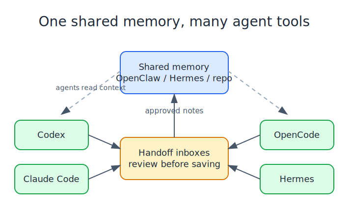
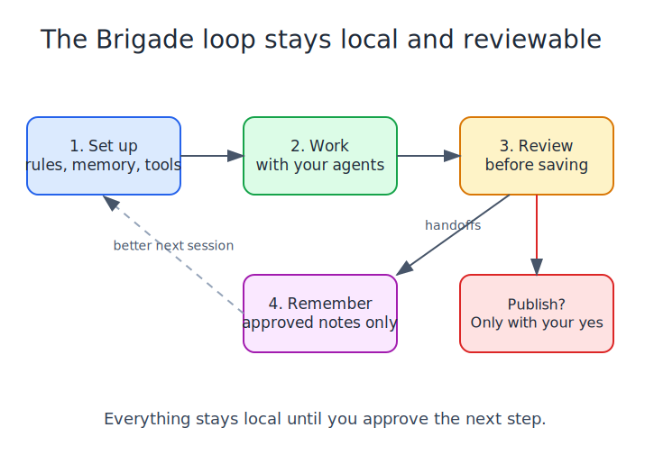

<p align="center">
  
</p>

<h1 align="center">Brigade</h1>

<p align="center">
  <strong>Shared memory and local guardrails for people using AI agent tools.</strong>
</p>

<p align="center">
  
  
  
</p>

Brigade helps AI agent tools work from the same memory without turning that memory into a junk drawer.

If you use OpenClaw, Hermes, Codex, Claude Code, OpenCode, or a mix of them, Brigade gives those tools a shared local pattern:

1. agents write handoff notes
2. you review the notes
3. useful notes become durable memory
4. future sessions start with better context

It is intentionally local. Brigade writes files and review queues on your machine. It does not run a background service, publish releases, push to GitHub, send notifications, or rewrite permanent memory unless you explicitly run the command that does it.

## Why This Exists

Agent tools are getting good enough that people use more than one of them. That creates a boring but important problem: each tool learns a little bit, but the learning is scattered.

Brigade gives the setup a home base.

- OpenClaw or Hermes can be the main memory owner.
- Codex, Claude Code, OpenCode, and Hermes can write handoff notes.
- You can inspect and lint those notes before saving them.
- Local receipts show what happened during work, scans, and reviews.
- Risky actions stay manual.

The goal is not to make a giant automation machine. The goal is to make agent memory understandable, reviewable, and portable across harnesses.

## Start Small

Install:

```bash
pipx install brigade-cli
```

Set up a repo:

```bash
brigade init --target ./my-repo --depth repo --harnesses openclaw,codex
brigade doctor --target ./my-repo
```

Write a handoff note:

```bash
brigade handoff draft \
  --target ./my-repo \
  --inbox codex \
  --title "What changed" \
  --summary "Short note future agents should know." \
  --content "### What changed

Put the durable note here."
```

Then review the draft before adding it to long-term memory.

That is the simplest useful version of Brigade: shared handoffs, local review, durable memory.

## How Memory Handoffs Work

Each writer harness gets its own local inbox:

- `.codex/memory-handoffs/`
- `.claude/memory-handoffs/`
- `.opencode/memory-handoffs/`
- `.hermes/memory-handoffs/`

The memory owner, usually OpenClaw or Hermes, can ingest reviewed handoffs into the permanent memory files. Brigade keeps the handoff format consistent so different tools can contribute without each one inventing its own note style.



The important part is the review step. Brigade does not assume every agent note deserves to become permanent memory.

## The Local Loop

Brigade is built around a simple daily loop:

1. set up the repo
2. let agents work
3. review what they produced
4. save only the parts worth remembering



This loop scales from one person using one repo to a more serious operator setup with scanner inboxes, work receipts, release checks, and repo-fleet summaries. You do not need all of that on day one.

## What Brigade Can Handle

For memory:

- install shared memory files, rules, and handoff templates
- keep one canonical memory owner
- lint handoff drafts before ingest
- scan handoff drafts with Content Guard before they become durable memory
- track which local inboxes the ingestor should watch
- support OpenClaw, Hermes, Codex, Claude Code, and OpenCode conventions

For local work:

- record work sessions and verification receipts
- collect scanner findings into reviewable inboxes
- keep release-readiness evidence local and explicit
- project shared tool docs into harness-specific folders
- summarize repo/operator state before a work session

For safety:

- run Content Guard before push, release review, or handoff ingest
- import Content Guard findings into the work inbox for review
- keep generated state ignored by default
- avoid publishing, pushing, or mutating remotes automatically
- keep notification sending opt-in
- make risky actions visible as operator decisions

## What Brigade Is Not

Brigade is not a hosted memory service, a daemon, or an automatic release bot.

It does not:

- run in the background
- install schedulers
- push to GitHub
- publish packages
- send notifications by default
- save every note automatically
- replace the human review step

That pause is the point. Agent memory should be useful, not noisy.

## For OpenClaw Users

OpenClaw can be the memory owner. Brigade gives nearby tools a way to contribute reviewed notes back into that owner memory without forcing every tool to know OpenClaw internals.

A typical setup is:

```bash
brigade init --target ./my-repo --depth repo --harnesses openclaw,codex,claude,opencode
brigade handoff sources init --target ./my-repo
brigade handoff doctor --target ./my-repo
```

Then writer tools leave handoffs in their own inboxes, and the memory owner ingests only what you approve.

## For Hermes Users

Hermes now has a first-class Brigade handoff inbox:

```bash
brigade handoff draft --target . --inbox hermes \
  --title "Hermes note" \
  --summary "Hermes can write a local Brigade handoff." \
  --content "### Hermes note

Durable context goes here."
```

Check the local wiring with:

```bash
brigade operator verify-harness --harness hermes --target .
```

See [Hermes handoffs](docs/hermes-handoffs.md) for the current boundaries.

## Content Guard

Brigade handles the memory and operator workflow. Content Guard checks whether content is safe to publish or save.

Use it at three points:

- before memory ingest: `brigade handoff lint --content-guard`
- before publishing: `brigade scrub --policy public-repo`
- after findings appear: `brigade work import content-guard`

Policy names are intentionally plain:

- `personal`: local/internal working notes
- `public-repo`: code and docs before push
- `public-content`: stricter checks for blog, social, and site copy

`brigade operator doctor` and `brigade operator status` show whether Content Guard is installed, which policy is expected, which pre-push hook is active, and the latest local scan summary when available.

## Where The Detailed Docs Went

The full technical walkthrough still exists; it is just not the README anymore.

- [Technical guide](docs/technical-guide.md): the detailed command walkthrough.
- [Security and Content Guard](docs/security.md): scanner policies, handoff guards, and import flow.
- [Handoff promotion](docs/handoff-promotion.md): how reviewed notes move toward memory.
- [OpenClaw memory ingest checklist](docs/openclaw-memory-ingest-checklist.md): the review gate before handoffs become memory.
- [Hermes handoffs](docs/hermes-handoffs.md): Hermes writer inbox setup.
- [Internal dogfood loop](docs/internal-dogfood.md): how this repo uses Brigade on itself.
- [Command inventory](docs/command-inventory.md): every public CLI command.
- [Roadmap](ROADMAP.md): current direction.

## Tiny Glossary

- **Harness**: an agent tool such as OpenClaw, Hermes, Codex, Claude Code, or OpenCode.
- **Handoff**: a note an agent writes for later review.
- **Inbox**: the local folder where handoff notes wait.
- **Memory owner**: the place that keeps durable shared memory.
- **Operator**: the human deciding what gets saved, run, or published.
