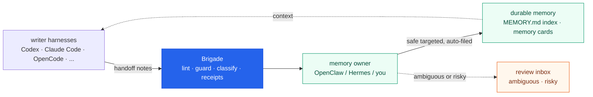

<p align="center">
  
</p>

<h1 align="center">Brigade CLI</h1>

<p align="center">
  <strong>AI agent memory, handoffs, and local guardrails for Codex, Claude Code, OpenCode, and over a dozen other harnesses.</strong>
</p>

<p align="center">
  
  
  
  
</p>

Your agents run loops. Brigade keeps the receipts.

## Try it in 60 seconds

```bash
pipx install brigade-cli
pipx ensurepath          # then open a new shell so `brigade` is on PATH
brigade operator quickstart --target ./my-repo --harnesses codex      # wire one repo
brigade operator doctor --target ./my-repo --profile local-operator   # verify
```

That installs the CLI, wires memory, handoffs, and local guardrails into one repo for a single harness, and prints a readiness check. Nothing leaves your machine and no daemon is started. Add `--dry-run` to preview the file-by-file plan before anything is written. More harnesses, workspace setups, and the homegrown-adoption path are under [Install](#install).

## Why I built this

I run an always-on OpenClaw agent next to daily Codex and Claude Code sessions, and I have since January. Every one of those tools wakes up empty. Whatever a session learned about my machine, my rules, or yesterday's dead ends scattered across tool-specific folders and died there.

So I hand-rolled the fixes, one incident at a time: a slim `MEMORY.md` index pointing at small memory cards instead of one giant file, a handoff note format every harness could write, an ingest cron that filed the good notes into durable memory every 30 minutes, staleness checks so old cards stopped being trusted forever.

Two incidents shaped the design more than anything I planned. First, a nightly "dreaming" job that promoted raw session fragments straight into memory bloated `MEMORY.md` to 41KB, way past the 12KB bootstrap budget, so every session started with truncated memory and nobody noticed for weeks. Blind auto-promotion died that day. Now nothing reaches memory unlinted: a note has to name a target and clear the guards, the safe ones file themselves, and only the risky few wait for review. Second, I found 195 handoff notes sitting unread across 35 repos because the ingester had a hardcoded three-repo allowlist and nothing warned about the coverage gap. Silence is the failure mode. Every part of Brigade that lints, warns, or writes a receipt exists because something once failed in silence.

That system now runs 482 memory cards and survives daily multi-agent work. But explaining it to anyone meant: clone six repos, write these crons, keep your index slim, watch for staleness, and never let a note reach memory unlinted. Brigade is that setup packaged as one installable CLI. The full production stack is documented in the [solos-cookbook](https://github.com/escoffier-labs/solos-cookbook) if you want to see where it came from.

## The loop

Writer harnesses leave handoff notes as they work. Brigade lints, guards, and classifies each one, then files the safe, targeted notes into durable memory on its own. A memory owner (OpenClaw, Hermes, or just you) only steps in for the ambiguous few. Every consequential action lands a receipt in a plain file you can grep, diff, and prune.

1. agents write handoff notes into their own local inboxes
2. Brigade lints and classifies each one before it can become memory
3. safe, targeted notes file themselves into durable memory automatically
4. only the ambiguous or risky few wait for your review
5. future sessions start with better context, and receipts show what happened



Memory has two layers: knowledge cards under `memory/cards/` hold the detail, and `MEMORY.md` stays a slim one-line-per-card index that loads every session. `brigade memory care scan` flags stale, contradictory, or undersourced cards for review instead of letting them rot. Brigade never edits canonical memory itself; the owner does the writing.

It all runs on the machine you control: laptop, workstation, or VPS. Local by default, loud about the exceptions.

## Verified learning

The loop above files notes. The next loop earns trust. Brigade can promote a learned skill on its own, but only when a real signal proves it helped, and it rolls one back the moment a signal says it broke. The model never grades its own work.

- `brigade outcome capture` records the result of a verify run (a real exit code, not an opinion) against the skill that produced it.
- `brigade outcome score` ranks each skill by a Wilson lower bound, so something that passed twice never outranks something vetted across twenty runs.
- `brigade outcome reconcile` is the gate. Dry-run by default: it shows what it would promote or revert and writes nothing. With `--apply` it installs a skill that earned it across your harnesses, or rolls a regressed one back to its last good version (and uninstalls a bad first install that has nothing to fall back to).
- `brigade outcome explain` prints the full signal trail behind any decision: which run produced each result, the threshold it crossed, and the reversible action taken.

The whole ledger is plain JSON and markdown under `memory/outcome/`, tracked in git and readable without Brigade. Promotion you can audit, reversal you can trust, learned skills you can take anywhere. This is the same lesson as the 41KB incident, finished: blind auto-promotion was the bug, verified and reversible and receipted promotion is the fix.

To run it hands-off, schedule `brigade outcome reconcile` in your own cron. Keep it in dry-run for a week and read the receipts, then add `--apply`. Brigade still installs no daemon; the loop runs on the scheduler you already have. `brigade outcome rank` lists the most-proven skills first, so retrieval can surface what worked rather than just what matched.

## Install

```bash
pipx install brigade-cli
pipx ensurepath          # then open a new shell so `brigade` is on PATH
brigade operator quickstart --target ./my-repo --harnesses codex
brigade operator doctor --target ./my-repo --profile local-operator
```

For an OpenClaw or Hermes workspace instead of a code repo:

```bash
brigade operator quickstart --target ~/agent-workspace --depth workspace --harnesses openclaw,hermes --owner openclaw
```

Use `--dry-run` first to preview the planned steps without writing anything; `brigade init --target ./my-repo --harnesses codex --dry-run` shows the full file-by-file list. Pass more harnesses as a comma-separated list. Quickstart only wires the harnesses you select and leaves the rest alone.

Write a handoff and check the wiring:

```bash
brigade handoff draft --target ./my-repo --inbox codex \
  --title "What changed" \
  --summary "Short note future agents should know." \
  --content "The durable note itself goes here."
brigade handoff lint --target ./my-repo
brigade handoff doctor --target ./my-repo
```

New here? Start with [QUICKSTART.md](QUICKSTART.md) for the five-minute install, then [docs/first-10-minutes.md](docs/first-10-minutes.md) for the guided first session. Already have a homegrown setup with scripts, crons, and handoff folders? Brigade has an adoption path that inventories what you have before changing anything: start with `brigade operator adopt plan` and see the [technical guide](docs/technical-guide.md). Want an agent to set this up for you? Point it at this repo; [AGENTS.md](AGENTS.md) tells it exactly what to do and where to stop.

## Harness support

Each writer gets its own local inbox; one canonical owner ingests. Brigade keeps the note format consistent so different tools can contribute without inventing their own styles.

| Writer | Harness id | Inbox |
|---|---|---|
| Codex CLI | `codex` | `.codex/memory-handoffs/` |
| Claude Code | `claude` | `.claude/memory-handoffs/` |
| OpenCode | `opencode` | `.opencode/memory-handoffs/` |
| Antigravity | `antigravity` | `.antigravity/memory-handoffs/` |
| Pi | `pi` | `.pi/memory-handoffs/` |
| Cursor | `cursor` | `.cursor/memory-handoffs/` |
| Aider | `aider` | `.aider/memory-handoffs/` |
| Goose | `goose` | `.goose/memory-handoffs/` |
| Continue | `continue` | `.continue/memory-handoffs/` |
| GitHub Copilot CLI | `copilot` | `.copilot/memory-handoffs/` |
| Qwen Code | `qwen` | `.qwen/memory-handoffs/` |
| Kimi Code | `kimi` | `.kimi/memory-handoffs/` |
| AdaL | `adal` | `.adal/memory-handoffs/` |
| OpenHands | `openhands` | `.openhands/memory-handoffs/` |
| Grok CLI | `grok` | `.grok/memory-handoffs/` |
| Amp | `amp` | `.amp/memory-handoffs/` |
| Crush | `crush` | `.crush/memory-handoffs/` |
| Hermes | `hermes` | `.hermes/memory-handoffs/` |
| OpenClaw | `openclaw` | usually the memory owner, not a writer |

All of them get handoff templates and ingest source coverage. Most also get projected tools and skills in their native format (some as `rules` or `instructions`, a few not yet); the per-harness matrix is in the [technical guide](docs/technical-guide.md).

## Beyond memory

The memory loop is the core. Around it, the same review-and-receipt pattern covers the rest of an operator's day, and you can ignore all of it until you need it:

- **Daily loop**: `brigade work brief` shows pending work, imports, and warnings; `brigade daily status` keeps it bounded and cheap.
- **Friction logs**: `brigade friction scan --days 30 --import-candidates` mines recent notes, handoffs, session artifacts, and optional local agent logs for reviewable workflow friction.
- **Security**: `brigade security scan` is a local read-only scanner for agent workspaces (secrets, risky hooks, MCP configs, prompt-injection patterns); `brigade scrub` gates content before it leaves the machine.
- **Tools and skills**: one reviewed catalog projected into every harness's native format, with approval gates for anything that executes.
- **Research**: `brigade research run` turns a question into a cited local report and a reviewable memory handoff.
- **Cross-model runs**: `brigade run "<task>"` plans, dispatches, and synthesizes one bounded task across the agent CLIs in your roster, so an expensive model can think while cheaper ones do the grunt work. Rosters pin a model per agent, plans can stage dependent workers, and `--worktree` runs everything in a detached git checkout that comes back as a reviewable `changes.patch`. A dirty-tree guard and a run lock keep agents away from your work in progress.
- **Fleet and release**: health evidence across your local repos and release-readiness receipts, with no publish step.

The full tour of every station lives in [docs/overview.md](docs/overview.md).

## Why not something else?

- **mem0, Letta, and friends** are memory layers for apps you are building, usually behind an API or a server. Brigade is for the agent CLIs you already run, and it is file-first: your memory is markdown in your repo, reviewable in git, readable without Brigade.
- **Native harness memory** (each tool's own auto-memory) is a per-tool silo. It does not cross harnesses, and it writes without review. Brigade gives every tool one shared format and one canonical owner, with a review gate in between.
- **Already running Hermes, or any self-improving agent?** Keep it. Brigade is not a replacement, it is the verification layer on top. A built-in learning loop grades its own work and keeps what it learns inside one tool. Brigade promotes a skill only when a real signal confirms it, keeps every learned skill as portable markdown in your git, and runs one loop across your whole fleet instead of one agent.
- **A plain CLAUDE.md / AGENTS.md** works great until it bloats past the context budget and goes stale. Brigade exists because mine hit 41KB. It keeps bootstrap files slim, moves detail into indexed cards, and flags staleness instead of trusting last month's facts forever.
- **A daemon or hosted service** would be simpler to demo and worse to trust. Brigade writes local files when you run a command, and that is all it does.

## What Brigade is not

Brigade is not a hosted memory service, a daemon, or an automatic release bot.

It does not:

- run in the background or install schedulers
- push to GitHub or publish packages
- send notifications by default
- save every note automatically
- turn memory ingest into a silent background process
- skip review for ambiguous, risky, or failed notes

That pause is the point. Agent memory should be useful, not noisy.

## Docs

- [First 10 minutes](docs/first-10-minutes.md): shortest path from install to healthy setup.
- [Overview](docs/overview.md): the full tour of every station and diagram.
- [Technical guide](docs/technical-guide.md): the detailed command walkthrough.
- [Security and Content Guard](docs/security.md): scanner policies, handoff guards, import flow.
- [Handoff promotion](docs/handoff-promotion.md): how notes move toward memory.
- [Repo fleet](docs/repo-fleet.md) and [Tool catalog](docs/tool-catalog.md).
- [Command inventory](docs/command-inventory.md): every public CLI command.
- [Maintainers](MAINTAINERS.md), [Governance](GOVERNANCE.md), [Security](SECURITY.md), and [Contributing](CONTRIBUTING.md).
- [Roadmap](ROADMAP.md) and [roadmap archive](docs/roadmap-archive.md).

Project identity: GitHub [`escoffier-labs/brigade`](https://github.com/escoffier-labs/brigade), website [brigade.tools](https://brigade.tools), PyPI [`brigade-cli`](https://pypi.org/project/brigade-cli/), command `brigade`. The name comes from the kitchen: a *brigade de cuisine* runs the line, and *mise en place* means the station is prepped before service. Set up the rules, memory, tools, and receipts before the session gets expensive.

It is early-stage and moving fast. If you hit a broken workflow, a confusing command, or a setup issue, [open an issue](https://github.com/escoffier-labs/brigade/issues) and I will get it fixed.
