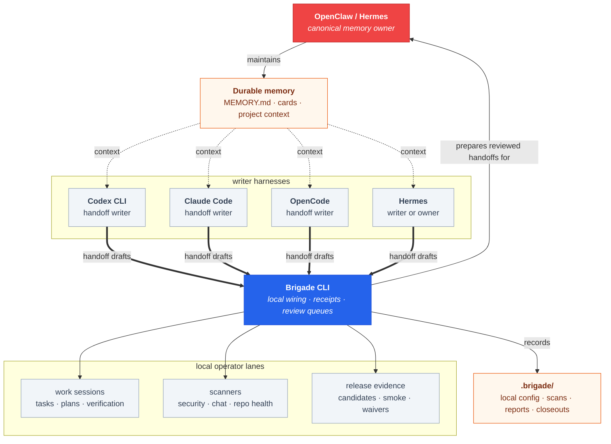
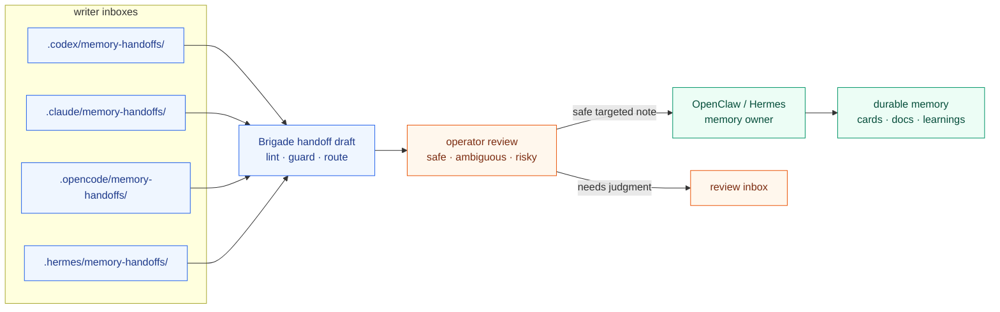
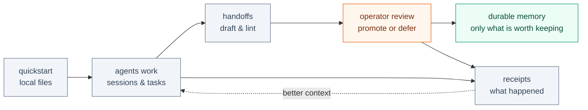
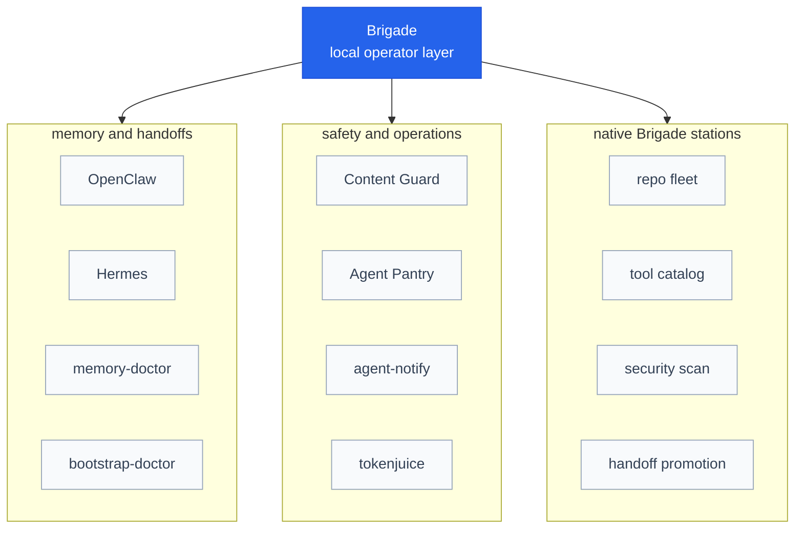
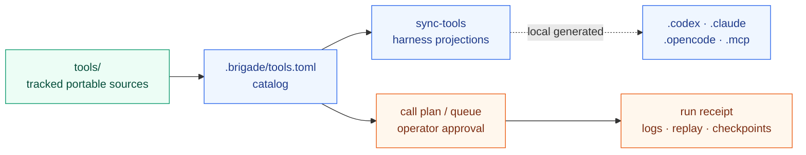
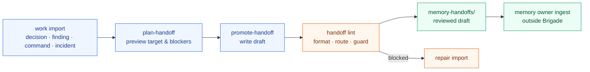
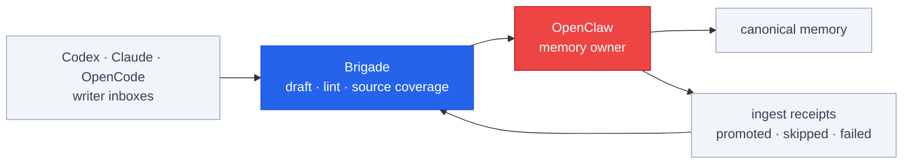
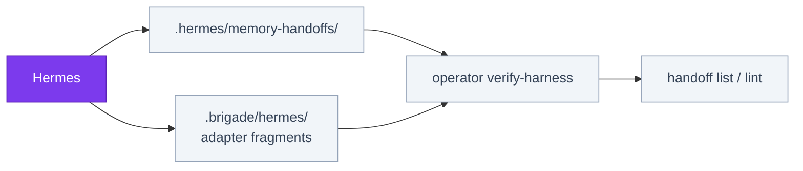
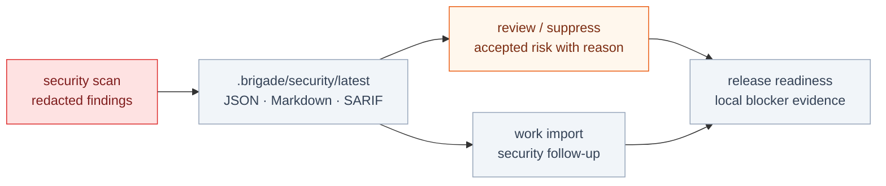

<p align="center">
  
</p>

<h1 align="center">Brigade CLI</h1>

<p align="center">
  <strong>AI agent memory, handoffs, and local guardrails for Codex, Claude Code, OpenCode, Hermes, and OpenClaw.</strong>
</p>

<p align="center">
  
  
  
  
</p>

Brigade is a local-first operator CLI for AI agent workspaces. The public GitHub repo is [`escoffier-labs/brigade`](https://github.com/escoffier-labs/brigade), the PyPI package is [`brigade-cli`](https://pypi.org/project/brigade-cli/), and the command is `brigade`.

Brigade helps AI agent tools work from the same memory without turning that memory into a junk drawer.

## Current Status

Brigade is usable now for real first-run workflows. The tested path is installing the CLI, running `operator quickstart` in a repo, checking `operator doctor --profile local-operator`, writing memory handoffs, projecting portable skills and tools, and using the local security scanner.

It is still early-stage and being actively fleshed out. The current focus is hardening the first-run path, roadmap and command drift checks, daily operator loop, and local evidence closeouts. Expect sharp edges around advanced workflows, new harness adapters, repo-fleet evidence, and release-candidate evidence. If you hit a broken workflow, confusing command, missing adapter, or setup issue, open a GitHub issue in [`escoffier-labs/brigade`](https://github.com/escoffier-labs/brigade/issues) and I will get it addressed as soon as I can.

Want an agent to set this up for you? Point it at this repository. The root [`AGENTS.md`](AGENTS.md) tells agents how to install Brigade, verify with doctor, adapt your existing homegrown workflow instead of replacing it, keep local generated folders out of commits, and stop before any remote or destructive action. The fuller walkthrough is in [`docs/agent-assisted-setup.md`](docs/agent-assisted-setup.md).

Good first install:

```bash
pipx install brigade-cli
brigade operator quickstart --target ./my-repo --harnesses codex
brigade operator doctor --target ./my-repo --profile local-operator
```

For multiple agent surfaces:

```bash
brigade operator quickstart --target ./my-repo --harnesses codex,claude,opencode
```

If you use [OpenClaw](https://github.com/solomonneas/openclaw), Hermes, Codex, Claude Code, OpenCode, or a mix of them, Brigade gives those tools a shared local pattern:

1. agents write handoff notes
2. the memory ingester scans, lints, and routes them
3. safe targeted notes become durable memory
4. ambiguous or risky notes wait for review
5. future sessions start with better context

It is intentionally local. Brigade writes files and review queues on your machine. It does not run a background service, publish releases, push to GitHub, send notifications, or rewrite permanent memory unless you explicitly run the command that does it.

## Stack At A Glance



> Brigade was extracted from the [**solos-cookbook**](https://github.com/solomonneas/solos-cookbook), a documented 24/7 multi-agent stack running in production. If you want the full picture of how Brigade fits into a real setup, start there, and a star helps other people find it.
>
> [](https://github.com/solomonneas/solos-cookbook)

## Project Identity

- GitHub: [`escoffier-labs/brigade`](https://github.com/escoffier-labs/brigade)
- Website: [`brigade.solomonneas.dev`](https://brigade.solomonneas.dev)
- Cookbook: [`solomonneas/solos-cookbook`](https://github.com/solomonneas/solos-cookbook), the real-world multi-agent stack Brigade grew out of
- PyPI package: [`brigade-cli`](https://pypi.org/project/brigade-cli/)
- CLI command: `brigade`
- Core search terms: AI agent memory, agent handoffs, Codex memory, Claude Code memory, OpenCode handoffs, local-first agent workflow, AGENTS.md, agent guardrails

## Why This Exists

Agent tools are getting good enough that people use more than one of them. That creates a boring but important problem: each tool learns a little bit, but the learning is scattered.

Brigade gives the setup a home base.

- OpenClaw or Hermes can be the main memory owner.
- Codex, Claude Code, OpenCode, and Hermes can write handoff notes.
- You can inspect and lint those notes before saving them.
- Local receipts show what happened during work, scans, and reviews.
- Risky actions stay manual.

The goal is not to make a giant automation machine. The goal is to make agent memory understandable, reviewable, and portable across harnesses.

## Start Small

Install:

```bash
pipx install brigade-cli
```

Set up a repo:

```bash
brigade operator quickstart --target ./my-repo --harnesses codex
brigade operator doctor --target ./my-repo --profile local-operator
```

Use `--dry-run` first if you want to preview the local files Brigade will write. To wire more than one agent surface, pass a comma-separated list such as `--harnesses codex,claude,opencode`.

For a fuller first-run walkthrough and troubleshooting checklist, see [`docs/new-user-quickstart.md`](docs/new-user-quickstart.md). If quickstart fails, use the Quickstart setup problem issue form and include the redacted `issue_report` from `brigade operator quickstart --json`.

Write a handoff note:

```bash
brigade handoff draft \
  --target ./my-repo \
  --inbox codex \
  --title "What changed" \
  --summary "Short note future agents should know." \
  --content "### What changed

Put the durable note here."
```

Then run your memory owner's ingester. Safe targeted notes can be filed into long-term memory; ambiguous or risky notes stay visible for review.

That is the simplest useful version of Brigade: shared handoffs, local review, durable memory.

## How Memory Handoffs Work

Each writer harness gets its own local inbox:

- `.codex/memory-handoffs/`
- `.claude/memory-handoffs/`
- `.opencode/memory-handoffs/`
- `.hermes/memory-handoffs/`

The memory owner, usually OpenClaw or Hermes, can ingest handoffs into the permanent memory files. Brigade keeps the handoff format consistent so different tools can contribute without each one inventing its own note style.



The important part is the boundary. The ingester should be conservative: safe card handoffs can become cards, targeted updates can append to the right file, and ambiguous material should be kicked back for review instead of trusted automatically.

## The Local Loop

Brigade is built around a simple daily loop:

1. set up the repo
2. let agents work
3. run the memory ingester
4. review anything skipped, flagged, or ambiguous
5. save only the parts worth remembering



This loop scales from one person using one repo to a more serious operator setup with scanner inboxes, work receipts, release checks, and repo-fleet summaries. You do not need all of that on day one.

## What Brigade Can Handle

For memory:

- install shared memory files, rules, and handoff templates
- keep one canonical memory owner
- lint handoff drafts before ingest
- scan handoff drafts with Content Guard before they become durable memory
- track which local inboxes the ingestor should watch
- reconcile ingester receipts so skipped, failed, routed, and promoted notes stay visible
- support OpenClaw, Hermes, Codex, Claude Code, and OpenCode conventions

For local work:

- record work sessions and verification receipts
- collect scanner findings into reviewable inboxes
- keep release-readiness evidence local and explicit
- project shared tool docs into harness-specific folders
- summarize repo/operator state before a work session

For safety:

- run Content Guard before push, release review, or handoff ingest
- import Content Guard findings into the work inbox for review
- keep generated state ignored by default
- avoid publishing, pushing, or mutating remotes automatically
- keep notification sending opt-in
- make risky actions visible as operator decisions

## Ecosystem

Brigade is the local operator layer. It integrates with nearby tools instead of trying to absorb all of them.



Memory and handoff tools:

- [OpenClaw](https://github.com/solomonneas/openclaw): personal AI assistant and memory owner.
- Hermes: local memory owner and handoff writer convention.
- [memory-doctor](https://github.com/escoffier-labs/memory-doctor): focused maintenance CLI for Claude Code / OpenClaw memory.
- [bootstrap-doctor](https://github.com/escoffier-labs/bootstrap-doctor): audits and trims oversized OpenClaw bootstrap files.

Safety and operations tools:

- [Content Guard](https://github.com/solomonneas/content-guard): policy-driven content scanning and publish checks.
- [Agent Pantry](https://github.com/escoffier-labs/agentpantry): encrypted browser session, cookie, and secret sync for agent machines.
- [agent-notify](https://github.com/solomonneas/agent-notify): optional notification hooks for long-running agent work.
- [tokenjuice](https://github.com/solomonneas/tokenjuice): output compaction for terminal-heavy agent workflows.

Brigade also has native local workflows for [repo fleet operations](docs/repo-fleet.md), [portable tool catalogs](docs/tool-catalog.md), [security scans](docs/security.md), and [handoff promotion](docs/handoff-promotion.md). The highlights are below.

## Repo Fleet

`brigade repos` watches a configured set of local repositories and turns their state into reviewable evidence: health scans, sweeps, reports, fleet actions, and release trains.

```mermaid
flowchart LR
    CONFIG[".brigade/repos.toml<br/>configured local repos"]
    SCAN["repos scan / sweep<br/>safe metadata only"]
    REPORT["fleet report<br/>health evidence"]
    ACTIONS["reviewed actions<br/>start · done · defer"]
    RELEASE["release train<br/>manual checklist"]

    CONFIG --> SCAN --> REPORT --> ACTIONS --> RELEASE
    RELEASE -. no publish step .-> MANUAL["operator publishes manually"]

    classDef local fill:#eff6ff,stroke:#2563eb,color:#1e3a8a;
    classDef review fill:#fff7ed,stroke:#ea580c,color:#7c2d12;
    class CONFIG,SCAN,REPORT local;
    class ACTIONS,RELEASE,MANUAL review;
```



- Repos live in a gitignored `.brigade/repos.toml`. Nothing is cloned, pushed, or mutated remotely.
- `brigade repos scan` and `brigade repos sweep` collect local health evidence.
- Reports become fleet actions you start, finish, defer, or dispatch by hand.
- Release trains gather readiness evidence and checklists without publishing anything.

Full command list in [Repo fleet](docs/repo-fleet.md).

## Tool Catalog

`brigade tools` describes local callable tools, slash commands, skills, scripts, and MCP configs across harnesses, then gates execution behind an approval queue. `brigade tools defaults` refreshes built-in portable tool entries while preserving custom repo tools.



- Discovery is read-only: `list`, `search`, `describe`, `contracts`.
- Projections write reviewed harness-specific tool docs. There is no auto-sync.
- Script calls move through plan, queue, approve, run, with run receipts and replay.
- Runtimes are supervised explicitly. Brigade never auto-starts MCP servers or stores auth.

Details in [Tool catalog](docs/tool-catalog.md).

## Handoff Promotion

Reviewed scanner imports can be promoted into memory handoff drafts instead of being retyped by hand.



- Works for durable non-task imports: decisions, preferences, links, commands, findings, incidents.
- `brigade work import plan-handoff` previews the target and blockers, `promote-handoff` writes the draft and lints it.
- Drafts land in the normal handoff inbox. Canonical memory is never edited directly.
- Raw private chat fields are rejected and secret-looking values are redacted before the draft is written.

See [Handoff promotion](docs/handoff-promotion.md).

## Agent Pantry

The `pantry` station (alias `larder`) wires [Agent Pantry](https://github.com/escoffier-labs/agentpantry) into the same operator workflow: encrypted browser session, cookie, and secret sync between agent machines.

- `brigade add pantry` installs agentpantry.
- `brigade pantry status` gives a pantry-specific health readout.
- `brigade pantry setup plan --role source|sink` previews or writes a reviewed setup plan.
- Pantry checks are advisory. An unwired install warns but never fails a workspace run.

## What Brigade Is Not

Brigade is not a hosted memory service, a daemon, or an automatic release bot.

It does not:

- run in the background
- install schedulers
- push to GitHub
- publish packages
- send notifications by default
- save every note automatically
- turn memory ingest into a silent background process
- skip review for ambiguous, risky, or failed notes

That pause is the point. Agent memory should be useful, not noisy.

## For OpenClaw Users

OpenClaw can be the memory owner. Brigade gives nearby tools a way to contribute checked handoffs back into that owner memory without forcing every tool to know OpenClaw internals.



A typical setup is:

```bash
brigade init --target ./my-repo --depth repo --harnesses openclaw,codex,claude,opencode
brigade handoff sources init --target ./my-repo
brigade handoff doctor --target ./my-repo
```

Then writer tools leave handoffs in their own inboxes, and the memory owner ingests the safe targeted notes while Brigade keeps receipts for promoted, routed, skipped, failed, malformed, and warning outcomes.

## For Hermes Users

Hermes now has a first-class Brigade handoff inbox:



```bash
brigade init --target . --depth workspace --harnesses hermes
brigade handoff sources init --target . --force
```

```bash
brigade handoff draft --target . --inbox hermes \
  --title "Hermes note" \
  --summary "Hermes can write a local Brigade handoff." \
  --content "### Hermes note

Durable context goes here."
```

Check the local wiring with:

```bash
brigade operator verify-harness --harness hermes --target .
brigade handoff list --target .
```

The verifier checks both the `.hermes/memory-handoffs/` writer inbox and the `.brigade/hermes/` adapter fragments.

See [Hermes handoffs](docs/hermes-handoffs.md) for the current boundaries.

## Content Guard

Brigade handles the memory and operator workflow. Content Guard checks whether content is safe to publish or save.



Use it at three points:

- before memory ingest: `brigade handoff lint --content-guard`
- before publishing: `brigade scrub --policy public-repo`
- after findings appear: `brigade work import content-guard`

Policy names are intentionally plain:

- `personal`: local/internal working notes
- `public-repo`: code and docs before push
- `public-content`: stricter checks for blog, social, and site copy

`brigade operator doctor` and `brigade operator status` show whether Content Guard is installed, which policy is expected, which pre-push hook is active, and the latest local scan summary when available.

Brigade also ships a read-only local security scanner. `brigade security scan` produces redacted findings you can review, suppress with a reason, or import into the work inbox. See [Security and Content Guard](docs/security.md).

## Where The Detailed Docs Went

The full technical walkthrough still exists; it is just not the README anymore.

- [Technical guide](docs/technical-guide.md): the detailed command walkthrough.
- [Security and Content Guard](docs/security.md): scanner policies, handoff guards, and import flow.
- [Handoff promotion](docs/handoff-promotion.md): how notes move toward memory.
- [OpenClaw memory ingest checklist](docs/openclaw-memory-ingest-checklist.md): the ingest boundary and receipt checks for handoffs.
- [Hermes handoffs](docs/hermes-handoffs.md): Hermes writer inbox setup.
- [Repo fleet](docs/repo-fleet.md): local multi-repo health, actions, and release evidence.
- [Tool catalog](docs/tool-catalog.md): portable tools, projections, approvals, and run receipts.
- [Internal dogfood loop](docs/internal-dogfood.md): how this repo uses Brigade on itself.
- [Command inventory](docs/command-inventory.md): every public CLI command.
- [Roadmap](ROADMAP.md): current direction.
- [Roadmap archive](docs/roadmap-archive.md): completed or intentionally closed roadmap items.

## Tiny Glossary

- **Harness**: an agent tool such as OpenClaw, Hermes, Codex, Claude Code, or OpenCode.
- **Handoff**: a note an agent writes for later review.
- **Inbox**: the local folder where handoff notes wait.
- **Memory owner**: the place that keeps durable shared memory.
- **Operator**: the human deciding what gets saved, run, or published.
