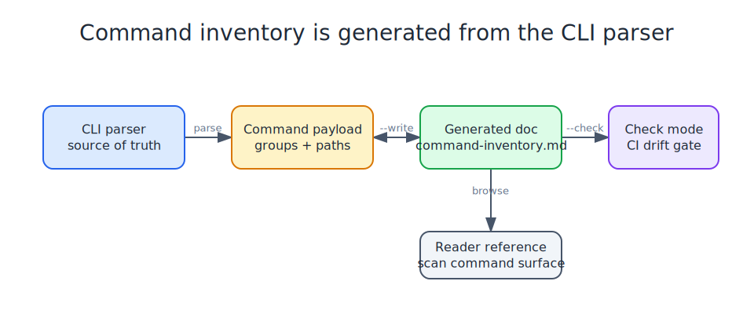

# Brigade Command Inventory

This file is generated from the Brigade CLI parser.



Regenerate with:

```bash
brigade roadmap commands --write
```

Commands marked `(extras)` register only when the extras surface is
enabled: run `brigade extras on` once, or set `BRIGADE_EXTRAS=1`.

## Command Groups

- `brigade add`: 1 command path(s)
- `brigade budgets` (extras): 2 command path(s)
- `brigade center` (extras): 29 command path(s)
- `brigade chat` (extras): 7 command path(s)
- `brigade completions`: 1 command path(s)
- `brigade context` (extras): 8 command path(s)
- `brigade daily`: 26 command path(s)
- `brigade doctor`: 1 command path(s)
- `brigade dogfood` (extras): 1 command path(s)
- `brigade evidence`: 4 command path(s)
- `brigade extras`: 3 command path(s)
- `brigade friction` (extras): 3 command path(s)
- `brigade guard`: 1 command path(s)
- `brigade handoff`: 17 command path(s)
- `brigade handoff-template`: 1 command path(s)
- `brigade hermes-fragments` (extras): 1 command path(s)
- `brigade ingest`: 1 command path(s)
- `brigade init`: 1 command path(s)
- `brigade learn` (extras): 13 command path(s)
- `brigade mcp`: 8 command path(s)
- `brigade memory`: 14 command path(s)
- `brigade model`: 6 command path(s)
- `brigade notifications` (extras): 4 command path(s)
- `brigade openclaw-fragments` (extras): 1 command path(s)
- `brigade operator`: 24 command path(s)
- `brigade outcome`: 10 command path(s)
- `brigade pantry` (extras): 5 command path(s)
- `brigade profiles`: 2 command path(s)
- `brigade projects` (extras): 10 command path(s)
- `brigade receipts`: 5 command path(s)
- `brigade reconfigure`: 1 command path(s)
- `brigade release` (extras): 23 command path(s)
- `brigade repos` (extras): 73 command path(s)
- `brigade research` (extras): 11 command path(s)
- `brigade roadmap` (extras): 4 command path(s)
- `brigade roster`: 2 command path(s)
- `brigade route`: 1 command path(s)
- `brigade run`: 1 command path(s)
- `brigade runbook` (extras): 5 command path(s)
- `brigade runs`: 8 command path(s)
- `brigade scrub`: 1 command path(s)
- `brigade search`: 3 command path(s)
- `brigade security`: 15 command path(s)
- `brigade skills`: 29 command path(s)
- `brigade stations`: 3 command path(s)
- `brigade status`: 1 command path(s)
- `brigade tokens`: 3 command path(s)
- `brigade tools`: 48 command path(s)
- `brigade untrusted` (extras): 2 command path(s)
- `brigade work`: 144 command path(s)
- `brigade workflow` (extras): 3 command path(s)

## Commands

- `brigade add`
- `brigade budgets check` (extras)
- `brigade budgets show` (extras)
- `brigade center actions archive` (extras)
- `brigade center actions build` (extras)
- `brigade center actions defer` (extras)
- `brigade center actions doctor` (extras)
- `brigade center actions done` (extras)
- `brigade center actions import-issues` (extras)
- `brigade center actions list` (extras)
- `brigade center actions plan` (extras)
- `brigade center actions show` (extras)
- `brigade center actions start` (extras)
- `brigade center activity` (extras)
- `brigade center readiness closeout` (extras)
- `brigade center readiness import-issues` (extras)
- `brigade center readiness list` (extras)
- `brigade center readiness plan` (extras)
- `brigade center readiness show` (extras)
- `brigade center report archive` (extras)
- `brigade center report build` (extras)
- `brigade center report closeout` (extras)
- `brigade center report compare` (extras)
- `brigade center report diff` (extras)
- `brigade center report list` (extras)
- `brigade center report plan` (extras)
- `brigade center report review` (extras)
- `brigade center report show` (extras)
- `brigade center reviews` (extras)
- `brigade center schema` (extras)
- `brigade center status` (extras)
- `brigade center templates` (extras)
- `brigade chat surfaces doctor` (extras)
- `brigade chat surfaces init` (extras)
- `brigade chat surfaces list` (extras)
- `brigade chat surfaces show` (extras)
- `brigade chat sweep import-issues` (extras)
- `brigade chat sweep ingest` (extras)
- `brigade chat sweep validate` (extras)
- `brigade completions`
- `brigade context archive` (extras)
- `brigade context build` (extras)
- `brigade context doctor` (extras)
- `brigade context import-issues` (extras)
- `brigade context list` (extras)
- `brigade context plan` (extras)
- `brigade context show` (extras)
- `brigade context sync` (extras)
- `brigade daily approvals approve`
- `brigade daily approvals archive`
- `brigade daily approvals compare`
- `brigade daily approvals hold`
- `brigade daily approvals list`
- `brigade daily approvals reject`
- `brigade daily approvals show`
- `brigade daily closeout`
- `brigade daily doctor`
- `brigade daily hardening audit`
- `brigade daily hardening closeout`
- `brigade daily hardening import-issues`
- `brigade daily hardening plan`
- `brigade daily history`
- `brigade daily init`
- `brigade daily plan`
- `brigade daily protocol`
- `brigade daily repair`
- `brigade daily resume`
- `brigade daily review`
- `brigade daily run`
- `brigade daily schema`
- `brigade daily show`
- `brigade daily status`
- `brigade daily telemetry doctor`
- `brigade daily unblock`
- `brigade doctor`
- `brigade dogfood` (extras)
- `brigade evidence crawl plan`
- `brigade evidence doctor`
- `brigade evidence export plan`
- `brigade evidence status`
- `brigade extras off`
- `brigade extras on`
- `brigade extras status`
- `brigade friction add` (extras)
- `brigade friction scan` (extras)
- `brigade friction show` (extras)
- `brigade guard`
- `brigade handoff archive`
- `brigade handoff closeout`
- `brigade handoff doctor`
- `brigade handoff draft`
- `brigade handoff import-issues`
- `brigade handoff issues`
- `brigade handoff lint`
- `brigade handoff list`
- `brigade handoff migrate`
- `brigade handoff receipt plan`
- `brigade handoff receipt record`
- `brigade handoff reconcile`
- `brigade handoff run-show`
- `brigade handoff runs`
- `brigade handoff show`
- `brigade handoff sources init`
- `brigade handoff sync-issues`
- `brigade handoff-template`
- `brigade hermes-fragments` (extras)
- `brigade ingest`
- `brigade init`
- `brigade learn closeout` (extras)
- `brigade learn closeout-show` (extras)
- `brigade learn closeouts` (extras)
- `brigade learn doctor` (extras)
- `brigade learn import-issues` (extras)
- `brigade learn import-learnings` (extras)
- `brigade learn plan` (extras)
- `brigade learn propose-skill` (extras)
- `brigade learn replay compare` (extras)
- `brigade learn replay export` (extras)
- `brigade learn replay list` (extras)
- `brigade learn replay show` (extras)
- `brigade learn skill-candidates` (extras)
- `brigade mcp add`
- `brigade mcp doctor`
- `brigade mcp import`
- `brigade mcp init`
- `brigade mcp list`
- `brigade mcp plan`
- `brigade mcp sync`
- `brigade mcp verify`
- `brigade memory care backfill`
- `brigade memory care closeout`
- `brigade memory care doctor`
- `brigade memory care import-issues`
- `brigade memory care init`
- `brigade memory care plan-fixes`
- `brigade memory care scan`
- `brigade memory care status`
- `brigade memory compact`
- `brigade memory init-git`
- `brigade memory lint`
- `brigade memory search`
- `brigade memory serve-mcp`
- `brigade memory status`
- `brigade model scorecard`
- `brigade model trial plan`
- `brigade model trial resume`
- `brigade model trial run`
- `brigade model trial show`
- `brigade model trial summary`
- `brigade notifications event plan` (extras)
- `brigade notifications event record` (extras)
- `brigade notifications setup plan` (extras)
- `brigade notifications status` (extras)
- `brigade openclaw-fragments` (extras)
- `brigade operator adopt capture`
- `brigade operator adopt import-issues`
- `brigade operator adopt plan`
- `brigade operator bootstrap-portable`
- `brigade operator checkup`
- `brigade operator doctor`
- `brigade operator guide`
- `brigade operator init`
- `brigade operator migration consolidate`
- `brigade operator migration doctor`
- `brigade operator migration import-issues`
- `brigade operator migration status`
- `brigade operator plan`
- `brigade operator quickstart`
- `brigade operator status`
- `brigade operator surfaces capture`
- `brigade operator surfaces doctor`
- `brigade operator surfaces import-issues`
- `brigade operator surfaces list`
- `brigade operator surfaces review`
- `brigade operator surfaces reviews`
- `brigade operator sync-mcp`
- `brigade operator sync-tools`
- `brigade operator verify-harness`
- `brigade outcome capture`
- `brigade outcome diff`
- `brigade outcome doctor`
- `brigade outcome explain`
- `brigade outcome fork`
- `brigade outcome rank`
- `brigade outcome rebuild-status`
- `brigade outcome reconcile`
- `brigade outcome record`
- `brigade outcome score`
- `brigade pantry doctor` (extras)
- `brigade pantry expiry-alert` (extras)
- `brigade pantry service plan` (extras)
- `brigade pantry setup plan` (extras)
- `brigade pantry status` (extras)
- `brigade profiles list`
- `brigade profiles show`
- `brigade projects audit` (extras)
- `brigade projects closeout` (extras)
- `brigade projects closeout-show` (extras)
- `brigade projects closeouts` (extras)
- `brigade projects doctor` (extras)
- `brigade projects import-issues` (extras)
- `brigade projects readiness list` (extras)
- `brigade projects readiness plan` (extras)
- `brigade projects readiness record` (extras)
- `brigade projects readiness show` (extras)
- `brigade receipts export miseledger`
- `brigade receipts export openinference`
- `brigade receipts export otel-genai`
- `brigade receipts keygen`
- `brigade receipts verify`
- `brigade reconfigure`
- `brigade release candidate archive` (extras)
- `brigade release candidate audit` (extras)
- `brigade release candidate build` (extras)
- `brigade release candidate closeout` (extras)
- `brigade release candidate compare` (extras)
- `brigade release candidate import-issues` (extras)
- `brigade release candidate list` (extras)
- `brigade release candidate plan` (extras)
- `brigade release candidate show` (extras)
- `brigade release ci doctor` (extras)
- `brigade release ci import-issues` (extras)
- `brigade release doctor` (extras)
- `brigade release plan` (extras)
- `brigade release run` (extras)
- `brigade release runs` (extras)
- `brigade release schema` (extras)
- `brigade release show` (extras)
- `brigade release smoke doctor` (extras)
- `brigade release smoke list` (extras)
- `brigade release smoke plan` (extras)
- `brigade release smoke record` (extras)
- `brigade release smoke show` (extras)
- `brigade release version-sync` (extras)
- `brigade repos actions archive` (extras)
- `brigade repos actions build` (extras)
- `brigade repos actions context` (extras)
- `brigade repos actions defer` (extras)
- `brigade repos actions dispatch` (extras)
- `brigade repos actions done` (extras)
- `brigade repos actions list` (extras)
- `brigade repos actions plan` (extras)
- `brigade repos actions reconcile` (extras)
- `brigade repos actions show` (extras)
- `brigade repos actions start` (extras)
- `brigade repos discover plan` (extras)
- `brigade repos doctor` (extras)
- `brigade repos first-run plan` (extras)
- `brigade repos friction scan` (extras)
- `brigade repos friction show` (extras)
- `brigade repos health-commands` (extras)
- `brigade repos import-issues` (extras)
- `brigade repos ingest` (extras)
- `brigade repos init` (extras)
- `brigade repos list` (extras)
- `brigade repos rearm` (extras)
- `brigade repos release actions archive` (extras)
- `brigade repos release actions build` (extras)
- `brigade repos release actions defer` (extras)
- `brigade repos release actions done` (extras)
- `brigade repos release actions list` (extras)
- `brigade repos release actions plan` (extras)
- `brigade repos release actions show` (extras)
- `brigade repos release actions start` (extras)
- `brigade repos release activity` (extras)
- `brigade repos release archive` (extras)
- `brigade repos release audit` (extras)
- `brigade repos release build` (extras)
- `brigade repos release checklist` (extras)
- `brigade repos release closeout` (extras)
- `brigade repos release compare` (extras)
- `brigade repos release evidence list` (extras)
- `brigade repos release evidence plan` (extras)
- `brigade repos release evidence record` (extras)
- `brigade repos release evidence show` (extras)
- `brigade repos release hygiene` (extras)
- `brigade repos release import-issues` (extras)
- `brigade repos release list` (extras)
- `brigade repos release manifest` (extras)
- `brigade repos release matrix` (extras)
- `brigade repos release plan` (extras)
- `brigade repos release ready` (extras)
- `brigade repos release reconcile` (extras)
- `brigade repos release report` (extras)
- `brigade repos release show` (extras)
- `brigade repos release summary` (extras)
- `brigade repos release waivers doctor` (extras)
- `brigade repos release waivers import-issues` (extras)
- `brigade repos release waivers list` (extras)
- `brigade repos release waivers record` (extras)
- `brigade repos release waivers renew` (extras)
- `brigade repos release waivers revoke` (extras)
- `brigade repos release waivers show` (extras)
- `brigade repos release waivers templates` (extras)
- `brigade repos report archive` (extras)
- `brigade repos report build` (extras)
- `brigade repos report closeout` (extras)
- `brigade repos report list` (extras)
- `brigade repos report plan` (extras)
- `brigade repos report show` (extras)
- `brigade repos scan` (extras)
- `brigade repos show` (extras)
- `brigade repos sweep closeout` (extras)
- `brigade repos sweep plan` (extras)
- `brigade repos sweep run` (extras)
- `brigade repos sweep runs` (extras)
- `brigade repos sweep show` (extras)
- `brigade research cancel` (extras)
- `brigade research export-handoff` (extras)
- `brigade research handoffs doctor` (extras)
- `brigade research handoffs import-issues` (extras)
- `brigade research list` (extras)
- `brigade research open` (extras)
- `brigade research resume` (extras)
- `brigade research run` (extras)
- `brigade research show` (extras)
- `brigade research sources doctor` (extras)
- `brigade research sources list` (extras)
- `brigade roadmap archive` (extras)
- `brigade roadmap audit` (extras)
- `brigade roadmap commands` (extras)
- `brigade roadmap patterns` (extras)
- `brigade roster doctor`
- `brigade roster init`
- `brigade route`
- `brigade run`
- `brigade runbook closeout` (extras)
- `brigade runbook pin` (extras)
- `brigade runbook plan` (extras)
- `brigade runbook resume` (extras)
- `brigade runbook run` (extras)
- `brigade runs interrupt`
- `brigade runs latest`
- `brigade runs list`
- `brigade runs recover`
- `brigade runs resume`
- `brigade runs show`
- `brigade runs steer`
- `brigade runs watch`
- `brigade scrub`
- `brigade search doctor`
- `brigade search status`
- `brigade search sync plan`
- `brigade security closeout`
- `brigade security config`
- `brigade security diff`
- `brigade security doctor`
- `brigade security enrich`
- `brigade security findings`
- `brigade security fix`
- `brigade security init`
- `brigade security review`
- `brigade security sarif`
- `brigade security scan`
- `brigade security show`
- `brigade security suppress`
- `brigade security template-audit`
- `brigade security unsuppress`
- `brigade skills adapters init`
- `brigade skills adapters list`
- `brigade skills adapters show`
- `brigade skills compatibility`
- `brigade skills diff`
- `brigade skills doctor`
- `brigade skills fleet status`
- `brigade skills history`
- `brigade skills import`
- `brigade skills import-issues`
- `brigade skills inbox accept`
- `brigade skills inbox add`
- `brigade skills inbox diff`
- `brigade skills inbox list`
- `brigade skills inbox reject`
- `brigade skills inbox show`
- `brigade skills install`
- `brigade skills lint`
- `brigade skills pack archive`
- `brigade skills pack build`
- `brigade skills pack import`
- `brigade skills pack list`
- `brigade skills pack show`
- `brigade skills publish`
- `brigade skills rollback`
- `brigade skills search`
- `brigade skills serve-mcp`
- `brigade skills sync`
- `brigade skills uninstall`
- `brigade stations discover`
- `brigade stations list`
- `brigade stations verify`
- `brigade status`
- `brigade tokens doctor`
- `brigade tokens status`
- `brigade tokens wire plan`
- `brigade tools apply`
- `brigade tools call approve`
- `brigade tools call hold`
- `brigade tools call list`
- `brigade tools call plan`
- `brigade tools call queue`
- `brigade tools call reject`
- `brigade tools call run`
- `brigade tools call show`
- `brigade tools checkpoint approve`
- `brigade tools checkpoint list`
- `brigade tools checkpoint reject`
- `brigade tools checkpoint resume`
- `brigade tools checkpoint show`
- `brigade tools contracts`
- `brigade tools defaults`
- `brigade tools describe`
- `brigade tools doctor`
- `brigade tools import-issues`
- `brigade tools init`
- `brigade tools list`
- `brigade tools pack archive`
- `brigade tools pack build`
- `brigade tools pack import`
- `brigade tools pack list`
- `brigade tools pack show`
- `brigade tools parity closeout`
- `brigade tools parity status`
- `brigade tools plan`
- `brigade tools policy doctor`
- `brigade tools policy init`
- `brigade tools policy show`
- `brigade tools run latest`
- `brigade tools run list`
- `brigade tools run replay`
- `brigade tools run show`
- `brigade tools runtime doctor`
- `brigade tools runtime init`
- `brigade tools runtime list`
- `brigade tools runtime restart`
- `brigade tools runtime show`
- `brigade tools runtime start`
- `brigade tools runtime status`
- `brigade tools runtime stop`
- `brigade tools search`
- `brigade tools show`
- `brigade tools sync apply`
- `brigade tools sync plan`
- `brigade untrusted scan` (extras)
- `brigade untrusted wrap` (extras)
- `brigade work acceptance`
- `brigade work backup closeout`
- `brigade work backup contract`
- `brigade work backup doctor`
- `brigade work backup import-issues`
- `brigade work backup init`
- `brigade work backup status`
- `brigade work bootstrap`
- `brigade work brief`
- `brigade work closeout`
- `brigade work doctor`
- `brigade work end`
- `brigade work hook-run`
- `brigade work hooks install`
- `brigade work hooks status`
- `brigade work hooks uninstall`
- `brigade work hooks update`
- `brigade work import add`
- `brigade work import chat-sweep`
- `brigade work import content-guard`
- `brigade work import context`
- `brigade work import dismiss`
- `brigade work import ingest`
- `brigade work import issue-repairs`
- `brigade work import list`
- `brigade work import memory-care`
- `brigade work import memory-refresh`
- `brigade work import plan`
- `brigade work import plan-handoff`
- `brigade work import promote`
- `brigade work import promote-handoff`
- `brigade work import provenance`
- `brigade work import show`
- `brigade work import triage`
- `brigade work import validate`
- `brigade work inbox archive`
- `brigade work inbox doctor`
- `brigade work latest`
- `brigade work list`
- `brigade work next`
- `brigade work note`
- `brigade work phases actions archive` (extras)
- `brigade work phases actions build` (extras)
- `brigade work phases actions defer` (extras)
- `brigade work phases actions done` (extras)
- `brigade work phases actions import-issues` (extras)
- `brigade work phases actions list` (extras)
- `brigade work phases actions plan` (extras)
- `brigade work phases actions show` (extras)
- `brigade work phases actions start` (extras)
- `brigade work phases closeout` (extras)
- `brigade work phases compare` (extras)
- `brigade work phases complete` (extras)
- `brigade work phases defer` (extras)
- `brigade work phases doctor` (extras)
- `brigade work phases evidence add` (extras)
- `brigade work phases goal scaffold` (extras)
- `brigade work phases handoff` (extras)
- `brigade work phases import-issues` (extras)
- `brigade work phases init` (extras)
- `brigade work phases list` (extras)
- `brigade work phases next` (extras)
- `brigade work phases plan` (extras)
- `brigade work phases privacy` (extras)
- `brigade work phases reconcile` (extras)
- `brigade work phases report build` (extras)
- `brigade work phases report closeout` (extras)
- `brigade work phases report compare` (extras)
- `brigade work phases report list` (extras)
- `brigade work phases report show` (extras)
- `brigade work phases schema` (extras)
- `brigade work phases session activity` (extras)
- `brigade work phases session audit` (extras)
- `brigade work phases session checkpoint` (extras)
- `brigade work phases session checkpoints archive` (extras)
- `brigade work phases session checkpoints compare` (extras)
- `brigade work phases session checkpoints import-issues` (extras)
- `brigade work phases session checkpoints list` (extras)
- `brigade work phases session checkpoints show` (extras)
- `brigade work phases session closeout` (extras)
- `brigade work phases session gate` (extras)
- `brigade work phases session handoffs` (extras)
- `brigade work phases session import-issues` (extras)
- `brigade work phases session list` (extras)
- `brigade work phases session next` (extras)
- `brigade work phases session privacy` (extras)
- `brigade work phases session progress` (extras)
- `brigade work phases session protocol` (extras)
- `brigade work phases session recovery-note` (extras)
- `brigade work phases session recovery-notes closeout` (extras)
- `brigade work phases session recovery-notes list` (extras)
- `brigade work phases session recovery-notes show` (extras)
- `brigade work phases session report build` (extras)
- `brigade work phases session report list` (extras)
- `brigade work phases session report show` (extras)
- `brigade work phases session resume` (extras)
- `brigade work phases session risk` (extras)
- `brigade work phases session show` (extras)
- `brigade work phases session start` (extras)
- `brigade work phases session verification` (extras)
- `brigade work phases show` (extras)
- `brigade work phases start` (extras)
- `brigade work phases status` (extras)
- `brigade work phases verify plan` (extras)
- `brigade work phases verify record` (extras)
- `brigade work plan-promote`
- `brigade work plan-proposals`
- `brigade work plans`
- `brigade work recap`
- `brigade work resume`
- `brigade work review closeout`
- `brigade work review finding-show`
- `brigade work review findings`
- `brigade work review import-findings`
- `brigade work review init`
- `brigade work review plan`
- `brigade work review run`
- `brigade work review runs`
- `brigade work review show`
- `brigade work run`
- `brigade work scanners doctor`
- `brigade work scanners init`
- `brigade work scanners list`
- `brigade work scanners plan`
- `brigade work scanners run`
- `brigade work scanners run-show`
- `brigade work scanners runs`
- `brigade work scanners show`
- `brigade work show`
- `brigade work start`
- `brigade work status`
- `brigade work sweep`
- `brigade work sweep-review`
- `brigade work sweep-show`
- `brigade work sweeps`
- `brigade work task add`
- `brigade work task done`
- `brigade work task plan`
- `brigade work task show`
- `brigade work tasks`
- `brigade work verify plan`
- `brigade work verify run`
- `brigade work verify runs`
- `brigade work verify show`
- `brigade workflow propose-runbook` (extras)
- `brigade workflow scan` (extras)
- `brigade workflow show` (extras)
