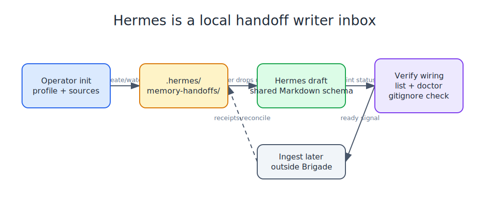

# Hermes Handoffs

Brigade treats Hermes as a local Memory Handoff writer through `.hermes/memory-handoffs/`.
The inbox uses the same Markdown handoff schema as Claude Code, Codex, and OpenCode.



## Local Setup

```bash
brigade operator init --profile internal-dogfood --target .
brigade handoff sources init --target . --force
```

`operator init` writes local `.brigade/` config. `handoff sources init` records the local inboxes that the canonical ingestor is expected to scan, including `.hermes/memory-handoffs/`.

## Draft A Hermes Handoff

```bash
brigade handoff draft \
  --target . \
  --inbox hermes \
  --title "Hermes smoke handoff" \
  --summary "Hermes can write a local Brigade Memory Handoff." \
  --content "### Hermes smoke handoff

Hermes uses the shared Brigade handoff format."
```

This creates a local ignored file under `.hermes/memory-handoffs/` and lints it before returning success.

## Verify The Wiring

```bash
brigade operator verify-harness --harness hermes --target .
brigade handoff list --target .
brigade handoff doctor --target .
```

Expected ready state:

- `.hermes/memory-handoffs/` exists
- `.hermes/memory-handoffs/` is gitignored
- `.brigade/handoff-sources.json` watches `.hermes/memory-handoffs/`
- pending Hermes drafts pass `brigade handoff lint`

## Boundaries

This is repo-local writer wiring. Brigade does not start Hermes, install a Hermes container, call a live Hermes API, or ingest handoffs into canonical memory automatically. The live Hermes runtime still needs a separate smoke test once a Hermes environment is available.
