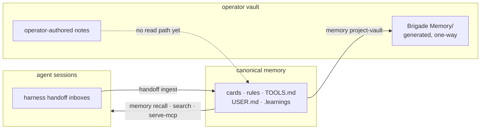

# Memory operations

Memory Operations is the read-only topology and inventory surface for Brigade-wired memory. Current main / **0.27 beta**. Stable v0.26.1 still has handoffs, care scan/plan, and owner-mediated filing. This page covers the operations facade added on the 0.27 line.

## Topology

```bash
brigade memory topology --target .
brigade memory topology --target . --json
```

Topology reports how writer inboxes, care jobs, evidence, and canonical destinations connect for one target. It assembles existing health helpers. It does not invent a new memory store or start a daemon.

## Inventory

```bash
brigade memory inventory --target .
brigade memory inventory --target . --json --limit 100
```

Inventory pages durable stores (cards, rules, tools, user, learnings) with freshness, review, and evidence filters. Default page size is 100. The maximum is 500. Field values are truncated for safe display.

## Recall

```bash
brigade memory recall --target <hub-or-mirror> --cwd <session-cwd> --limit 5
```

Bounded session-start recall returns index-level matches only: title, tags, path. Card bodies never appear. Fail-open: missing or unreadable targets do not block the harness. Repo-depth installs need an explicit `memory_recall_target` in `.brigade/config.json`. Details: [memory care](memory-care.md#session-start-recall-466-slice-1).

## Evidence projection and identity audit

```bash
brigade evidence memory audit . --json
brigade evidence crawl memory . --dry-run --json
brigade evidence crawl memory . --json
```

The identity audit is read-only. It reports explicit card ids versus path fallbacks and duplicate coverage without calling the evidence engine or rewriting frontmatter. New cards mint `card-<uuid4>` IDs; consumers dual-read those IDs and legacy path/stem/topic aliases. `brigade memory care backfill` emits a dry-run old-to-new mapping receipt before any reviewed rewrite.

The crawl command projects memory into the evidence log only when the installed engine advertises `memory-projection.v1`. It accepts `--dry-run`, `--json`, `--rebuild`, and a positive `--limit`. It rejects the broader `--full` scan. Completed scans may tombstone missing projection rows. Failed or interrupted scans preserve the last completed projection and mark it stale instead of deleting it. Evidence projection status also appears inside Memory Operations inventory rows when evidence artifacts are present or missing.

## Obsidian vault projection

```bash
brigade memory project-vault --target . --vault /path/to/vault
brigade memory project-vault --target . --vault /path/to/vault --json
```

One-way projection of canonical memory into a `Brigade Memory/` subfolder of an operator-supplied vault: one note per store item with care-state frontmatter and tags, category and harness maps, and a topology canvas. Writes go through the projection transaction kernel, so a failed run restores the vault. A manual edit inside the projection is untrusted data: Brigade preserves it, writes a conflict copy, and reports drift instead of merging.

Note titles come from a card's leading heading when its frontmatter has no `title`, falling back to the inventory title. Related links are ranked (explicit refs, then shared tags, then shared category) and capped per note, so a large shared category does not turn into a complete graph. A map that would cover every note is omitted. The vault path stays out of topology output as `redacted:operator-vault`.

Rerunning is idempotent: unchanged notes produce no mutation.

### Where memory flows



Brigade writes into a vault and does not read back from one. Retrieval from operator-authored vault notes is tracked in [#943](https://github.com/escoffier-labs/brigade/issues/943); writing agent-proposed notes back into a vault is tracked in [#945](https://github.com/escoffier-labs/brigade/issues/945). Until those land, a vault is a projection target, not a memory source.

## Care

Care remains a separate mutating/planning family:

```bash
brigade memory care scan --target .
brigade memory care plan-fixes --target .
brigade memory care status --target .
```

Care does not auto-edit card bodies on scan. Scheduling stays operator-owned. See [scheduled care](scheduled-care.md) and [execution model](execution-model.md).

## Ownership boundaries

| Owner | Role |
| --- | --- |
| Canonical memory system | Long-term cards, rules, `MEMORY.md` index |
| Brigade | Receipts, queues, topology/inventory views, review gate plumbing |
| Scheduler | External cron, systemd, launchd, or CI that invokes Brigade |
| Manual process | Human or agent commands run on demand |
| External adapter | Harness-native memory that is not the Brigade owner |

Safe targeted handoffs may auto-file under owner policy. Ambiguous or risky notes wait for review. Brigade does not replace OpenClaw, Hermes, or another chosen memory owner unless the operator asks for that migration.

## Center view

The Center dashboard Memory Operations view reads `memory topology --json` and paginated `memory inventory --json`. It does not perform filesystem writes, cron installs, or card body reads beyond the inventory contract.

Related: [memory care](memory-care.md), [handoff promotion](handoff-promotion.md), [outcome scoring](outcome-scoring.md), [comparison](comparison.md).
