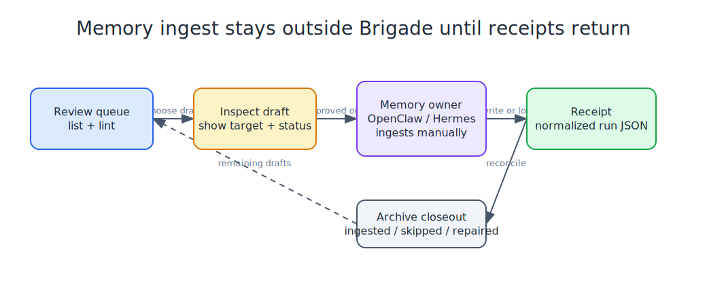

# OpenClaw Memory Ingest Checklist

Use this checklist when Brigade handoffs are ready to become durable memory through OpenClaw or another memory owner.



## Review Queue

```bash
brigade handoff list --target .
brigade handoff lint --content-guard --guard-policy personal --target .
```

Requirements before ingest:

- Brigade lint is available before ingest, and lint-failing drafts stay review items.
- Content Guard is run with the `personal` policy when configured.
- The target memory card or document is explicit for anything the ingester files.
- Ambiguous, risky, malformed, or private-looking drafts are skipped or routed for operator review instead of being trusted automatically.
- Raw transcripts, tokens, host-private paths, and private identifiers are absent or redacted before durable memory is written.

## Inspect A Draft

```bash
brigade handoff show <handoff-id-or-path> --target .
```

Review:

- target card or target document
- suggested action
- source import id and source fingerprint when present
- scanner provenance when present
- stale age and latest ingestion status

## Ingest Boundary

Brigade does not write canonical memory. OpenClaw, Hermes, or another memory owner performs the actual ingest as an explicit operator-approved action. Safe targeted handoffs may be filed by the ingester; skipped, failed, malformed, warning, or ambiguous outcomes remain review work.

Treat every file under `.claude/memory-handoffs/`, `.codex/memory-handoffs/`, `.opencode/memory-handoffs/`, `.antigravity/memory-handoffs/`, `.pi/memory-handoffs/`, `.cursor/memory-handoffs/`, `.aider/memory-handoffs/`, `.goose/memory-handoffs/`, `.continue/memory-handoffs/`, `.copilot/memory-handoffs/`, `.qwen/memory-handoffs/`, `.kimi/memory-handoffs/`, `.adal/memory-handoffs/`, `.openhands/memory-handoffs/`, `.grok/memory-handoffs/`, `.amp/memory-handoffs/`, `.crush/memory-handoffs/`, and `.hermes/memory-handoffs/` as pending ingest or review until it has an ingestion receipt or manual archive record.

## Reconcile Receipts

After the memory owner runs, record what happened:

```bash
brigade handoff reconcile --target .
brigade handoff runs --target .
brigade handoff run-show <run-id> --target .
```

Receipts should show processed, promoted, routed, skipped, failed, malformed, unreachable-source, warning, and no-reply events when the ingestor reports them.

OpenClaw can either leave a parseable latest-run log and let `brigade handoff reconcile` normalize it, or write a normalized receipt directly to:

```text
.brigade/handoffs/ingest-runs/<run_id>.json
```

The normalized receipt shape is:

```json
{
  "run_id": "openclaw-ingest-20260603T210000Z",
  "started_at": "2026-06-03T21:00:00Z",
  "completed_at": "2026-06-03T21:00:12Z",
  "source_root": ".",
  "inbox_paths": [".claude/memory-handoffs", ".codex/memory-handoffs", ".opencode/memory-handoffs", ".antigravity/memory-handoffs", ".pi/memory-handoffs", ".cursor/memory-handoffs", ".aider/memory-handoffs", ".goose/memory-handoffs", ".continue/memory-handoffs", ".copilot/memory-handoffs", ".qwen/memory-handoffs", ".kimi/memory-handoffs", ".adal/memory-handoffs", ".openhands/memory-handoffs", ".grok/memory-handoffs", ".amp/memory-handoffs", ".crush/memory-handoffs", ".hermes/memory-handoffs"],
  "processed_handoff_paths": [".hermes/memory-handoffs/20260603-210000-hermes-note.md"],
  "promoted_card_targets": [],
  "routed_document_targets": [{"handoff_path": ".hermes/memory-handoffs/20260603-210000-hermes-note.md", "target": ".learnings/LEARNINGS.md"}],
  "skipped_handoff_paths": [],
  "failed_handoff_paths": [],
  "malformed_handoff_paths": [],
  "unreachable_sources": [],
  "warning_events": [],
  "warning_count": 0,
  "no_reply": false,
  "safe_summary": "OpenClaw ingested one reviewed Hermes handoff into durable memory.",
  "log_path": ".brigade/handoff-ingest/openclaw-20260603T210000Z.log"
}
```

A tracked example lives at `src/brigade/templates/handoff/openclaw-ingest-receipt.example.json`.

## Archive Closeout

```bash
brigade handoff archive <handoff-id-or-path> --target .
brigade handoff archive --all-reviewed --target .
```

Archive only after the handoff is either ingested, intentionally skipped, or replaced by a better draft. Invalid drafts stay in the inbox for repair.

## Fast Path

```bash
brigade handoff list --target .
brigade handoff lint --content-guard --guard-policy personal --target .
brigade handoff show <handoff-id-or-path> --target .
# memory owner ingests outside Brigade, then review skipped or flagged outcomes
brigade handoff reconcile --target .
brigade handoff archive <handoff-id-or-path> --target .
```
