# Brigade Overview

The full tour: every station, diagram, and workflow. The [README](../README.md) covers the core memory loop and install; this document goes deeper. The detailed command walkthrough is in the [technical guide](technical-guide.md).

## Stack At A Glance

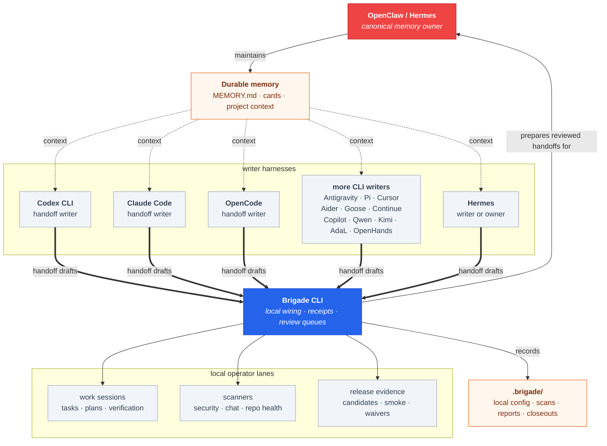

> Brigade was extracted from the [**solos-cookbook**](https://github.com/escoffier-labs/solos-cookbook), a documented 24/7 multi-agent stack running in production. If you want the full picture of how Brigade fits into a real setup, start there, and a star helps other people find it.
>
> [](https://github.com/escoffier-labs/solos-cookbook)

## Why This Exists

Agent tools are getting good enough that people use more than one of them. That creates a boring but important problem: each tool learns a little bit, but the learning is scattered.

Brigade gives the setup a home base.

- OpenClaw or Hermes can be the main memory owner.
- Codex, Claude Code, OpenCode, Antigravity, Pi, Cursor, Aider, Goose, Continue, GitHub Copilot CLI, Qwen Code, Kimi Code, AdaL, OpenHands, and Hermes can write handoff notes.
- You can inspect and lint those notes before saving them.
- Local receipts show what happened during work, scans, and reviews.
- Risky actions stay manual.

The goal is not to make a giant automation machine. The goal is to make agent memory understandable, reviewable, and portable across harnesses.

## Mise En Place

The name comes from the kitchen. A *brigade de cuisine* is the staff that runs the line, and *mise en place*, pronounced "meez", means everything is in its place before the work starts.

In a kitchen, that is the chef's first job: prep the station, label the ingredients, sharpen the tools, and make sure service does not depend on hunting for basics mid-rush. For agents, it is the same job: rules, memory, handoff inboxes, tools, guards, receipts, and verification paths set up before the session gets expensive.

That is the idea Brigade is built on. The chef owns the station, and every agent working in it should leave the setup clearer, safer, and easier for the next agent to use.

## Start Small

Install:

```bash
pipx install brigade-cli
```

Set up a repo:

```bash
brigade operator quickstart --target ./my-repo --harnesses codex
brigade operator doctor --target ./my-repo --profile local-operator
```

Set up an agent workspace:

```bash
brigade operator quickstart --target ~/agent-workspace --depth workspace --harnesses openclaw,hermes --owner openclaw
brigade operator doctor --target ~/agent-workspace --profile local-operator
```

Use `--dry-run` first if you want to preview the local files Brigade will write. To wire more than one agent surface, pass a comma-separated list such as `--harnesses codex,claude,opencode,antigravity,pi,cursor,aider,goose,continue,copilot,qwen,kimi,adal,openhands`.

If you already have a homegrown setup with scripts, handoff folders, crons, or process managers, use the adoption loop before changing it:

```bash
brigade operator adopt plan --target ~/agent-workspace --json
brigade operator adopt capture --target ~/agent-workspace --json
brigade operator adopt import-issues --target ~/agent-workspace --json
brigade operator migration status --target ~/agent-workspace --json
brigade operator migration doctor --target ~/agent-workspace --json
brigade operator migration consolidate --target ~/agent-workspace --surface shell_crontab --review-status needs-owner
brigade operator surfaces capture --target ~/agent-workspace --json
brigade operator surfaces doctor --target ~/agent-workspace --json
brigade operator surfaces review --target ~/agent-workspace --surface shell_crontab --status external-ok --all --reason reviewed-external-ownership
brigade operator surfaces reviews --target ~/agent-workspace --json
brigade operator surfaces import-issues --target ~/agent-workspace --json
```

`adopt plan` is read-only. `adopt capture` writes a redacted local snapshot under `.brigade/operator/adoption/`. `adopt import-issues` routes adoption gaps into the normal work inbox so the migration shows up in `work brief` and the daily loop. `operator migration status/doctor/import-issues/consolidate` rolls adoption state, surface review state, and pending migration work into one replacement-progress view, then lets a reviewed rollup supersede tiny record-level imports. `operator surfaces capture/list/doctor/review/reviews/import-issues` keeps a separate redacted registry for shell crontab, OpenClaw cron, and PM2 coverage under `.brigade/operator/surfaces/`. Scheduler and process surfaces are reported as counts, status totals, ordinal labels, review decisions, and fingerprints, not raw scheduler lines, job names, process names, command paths, host details, or environment values.

For a fuller first-run walkthrough and troubleshooting checklist, see [`docs/new-user-quickstart.md`](new-user-quickstart.md). For the shortest path, use [`docs/first-10-minutes.md`](first-10-minutes.md). If quickstart fails, use the Quickstart setup problem issue form and include the redacted `issue_report` from `brigade operator quickstart --json`.

Write a handoff note:

```bash
brigade handoff draft \
  --target ./my-repo \
  --inbox codex \
  --title "What changed" \
  --summary "Short note future agents should know." \
  --content "### What changed

Put the durable note here."
```

Then run your memory owner's ingester. Safe targeted notes can be filed into long-term memory; ambiguous or risky notes stay visible for review.

That is the simplest useful version of Brigade: shared handoffs, local review, durable memory.

## How Memory Handoffs Work

Each writer harness gets its own local inbox. Use `brigade handoff draft --inbox <id>` to write to the matching inbox, or select the harness with `brigade operator quickstart --harnesses ...`.

| Writer | `--inbox` / harness id | Local inbox | Brigade support |
|---|---|---|---|
| Codex CLI | `codex` | `.codex/memory-handoffs/` | handoff template, ingest source, dogfood adapter, tools, skills |
| Claude Code | `claude` | `.claude/memory-handoffs/` | handoff template, ingest source, tools, skills |
| OpenCode | `opencode` | `.opencode/memory-handoffs/` | handoff template, ingest source, dogfood adapter, tools, skills |
| Antigravity | `antigravity` | `.antigravity/memory-handoffs/` | handoff template, ingest source, dogfood adapter, tools, skills |
| Pi | `pi` | `.pi/memory-handoffs/` | handoff template, ingest source, dogfood adapter, tools, skills |
| Cursor | `cursor` | `.cursor/memory-handoffs/` | handoff template, ingest source, dogfood adapter, rules, skills |
| Aider | `aider` | `.aider/memory-handoffs/` | handoff template, ingest source, dogfood adapter, tools, skills |
| Goose | `goose` | `.goose/memory-handoffs/` | handoff template, ingest source, dogfood adapter, tools, skills |
| Continue | `continue` | `.continue/memory-handoffs/` | handoff template, ingest source, dogfood adapter, rules, skills |
| GitHub Copilot CLI | `copilot` | `.copilot/memory-handoffs/` | handoff template, ingest source, dogfood adapter, instructions, skills |
| Qwen Code | `qwen` | `.qwen/memory-handoffs/` | handoff template, ingest source, dogfood adapter, tools, skills |
| Kimi Code | `kimi` | `.kimi/memory-handoffs/` | handoff template, ingest source, dogfood adapter, tools, skills |
| AdaL | `adal` | `.adal/memory-handoffs/` | handoff template, ingest source, dogfood adapter, tools, skills |
| OpenHands | `openhands` | `.openhands/memory-handoffs/` | handoff template, ingest source, dogfood adapter, instructions, skills |
| Hermes | `hermes` | `.hermes/memory-handoffs/` | handoff template, ingest source, owner adapter fragments |

OpenClaw is usually the canonical memory owner rather than a writer inbox. Add it with `--harnesses openclaw,...` when the workspace should own durable memory.

The memory owner, usually OpenClaw or Hermes, can ingest handoffs into the permanent memory files. Brigade keeps the handoff format consistent so different tools can contribute without each one inventing its own note style.

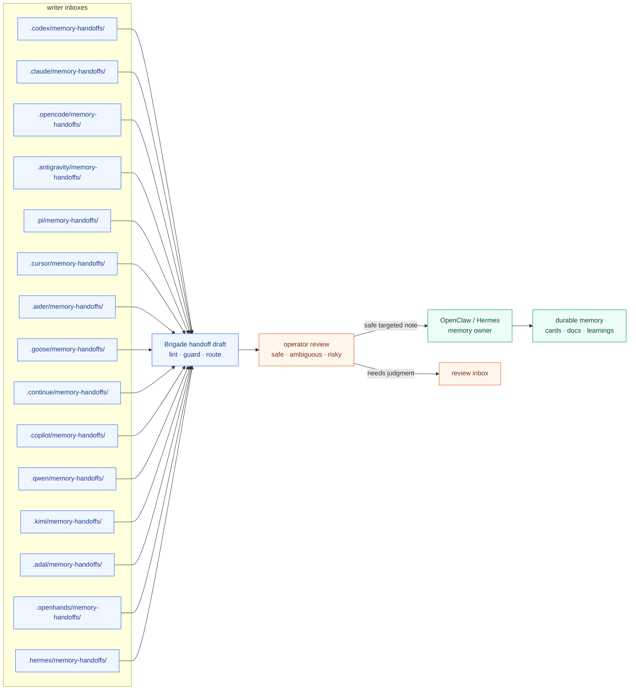

The important part is the boundary. The ingester should be conservative: safe card handoffs can become cards, targeted updates can append to the right file, and ambiguous material should be kicked back for review instead of trusted automatically.

### Card Promotion And MEMORY.md

Long-term memory has two layers. Knowledge cards under `memory/cards/` hold the detail: YAML frontmatter (`topic`, `category`, `tags`, `created`, `updated`) plus the durable facts. `MEMORY.md` is the index: one line per card, loaded at session start, never holding card content itself. When the ingester promotes a handoff, it creates or updates the card first, then adds or refreshes the one-line index entry. No-card handoffs append to the right document instead. Brigade records the receipt for every outcome but never edits `MEMORY.md` or cards itself; the memory owner does the writing.

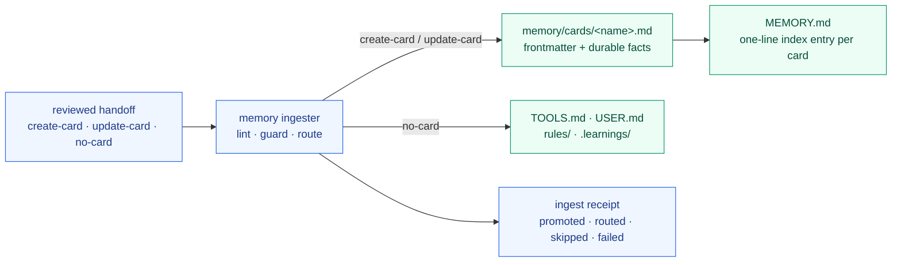

### Keeping Cards Fresh

Memory degrades. Cards go stale, lose their backing evidence, or get superseded. `brigade memory care scan` is a read-only sweep over the card roots that checks freshness metadata (`reviewed`, `fresh_until`, confidence, evidence) and flags stale, expired, undersourced, contradictory, orphaned, and oversized cards. Flagged cards land in a refresh queue that routes into the work inbox, so a card that needs review shows up in the daily plan instead of rotting unnoticed. Brigade never edits or deletes a card automatically: the operator either refreshes it with a new reviewed date or archives it and drops the index entry.

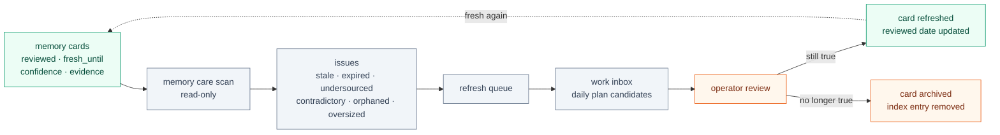

## The Local Loop

Brigade is built around a simple daily loop:

1. set up the repo or operator workspace
2. let agents work
3. run the memory ingester
4. review anything skipped, flagged, or ambiguous
5. save only the parts worth remembering

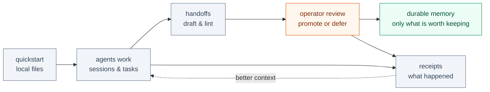

This loop scales from one person using one repo or OpenClaw/Hermes workspace to a more serious operator setup with scanner inboxes, work receipts, release checks, and repo-fleet summaries. You do not need all of that on day one.

## What Brigade Can Handle

For memory:

- install shared memory files, rules, and handoff templates
- keep one canonical memory owner
- lint handoff drafts before ingest
- scan handoff drafts with Content Guard before they become durable memory
- track which local inboxes the ingestor should watch
- reconcile ingester receipts so skipped, failed, routed, and promoted notes stay visible
- support OpenClaw, Hermes, Codex, Claude Code, OpenCode, Antigravity, Pi, Cursor, Aider, Goose, Continue, GitHub Copilot CLI, Qwen Code, Kimi Code, AdaL, and OpenHands conventions

For local work:

- record work sessions and verification receipts
- collect scanner findings into reviewable inboxes
- keep release-readiness evidence local and explicit
- project shared tool docs into harness-specific folders
- summarize repo/operator state before a work session

For safety:

- run Content Guard before push, release review, or handoff ingest
- import Content Guard findings into the work inbox for review
- keep generated state ignored by default
- avoid publishing, pushing, or mutating remotes automatically
- keep notification sending opt-in
- make risky actions visible as operator decisions

## Ecosystem

Brigade is the local operator layer. It integrates with nearby tools instead of trying to absorb all of them.

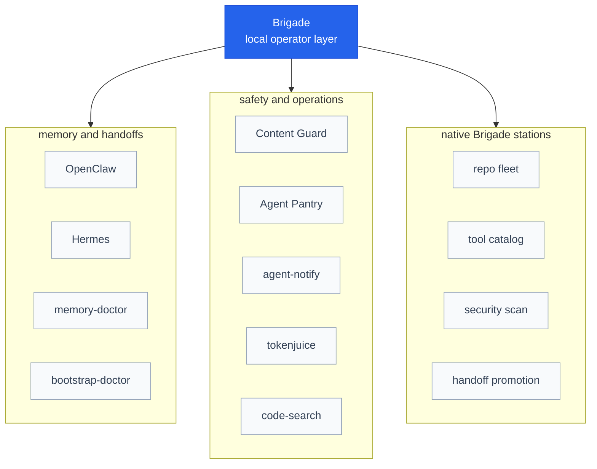

Memory and handoff tools:

- [OpenClaw](https://github.com/solomonneas/openclaw): personal AI assistant and memory owner.
- Hermes: local memory owner and handoff writer convention.
- [memory-doctor](https://github.com/escoffier-labs/memory-doctor): focused maintenance CLI for Claude Code / OpenClaw memory.
- [bootstrap-doctor](https://github.com/escoffier-labs/bootstrap-doctor): audits and trims oversized OpenClaw bootstrap files.

Safety and operations tools:

- [Content Guard](https://github.com/escoffier-labs/content-guard): policy-driven content scanning and publish checks.
- [Agent Pantry](https://github.com/escoffier-labs/agentpantry): encrypted browser session, cookie, and secret sync for agent machines.
- [agent-notify](https://github.com/escoffier-labs/agent-notify): optional notification hooks for long-running agent work.
- [tokenjuice](https://github.com/vincentkoc/tokenjuice): output compaction for terminal-heavy agent workflows. Third-party tool by Vincent Koc; Brigade integrates with it but does not maintain it.

Evidence ledger tools:

- [MiseLedger](https://github.com/escoffier-labs/miseledger): local-first evidence ledger that imports `miseledger.adapter.v1` JSONL into SQLite, searches with FTS5, and emits Brigade-ready evidence bundles.
- [StationTrail](https://github.com/escoffier-labs/stationtrail): agent-session log exporter that normalizes Codex, Claude, OpenClaw, OpenCode, and Hermes sessions into adapter JSONL for MiseLedger.
- [SourceHarvest](https://github.com/escoffier-labs/sourceharvest): source-system record exporter that normalizes notes, files, git history, and generic exports into adapter JSONL for MiseLedger.

Search and context tools:

- [code-search-api](https://github.com/escoffier-labs/code-search-api): local semantic code-search service backed by SQLite and Ollama embeddings.
- [code-search-mcp](https://github.com/escoffier-labs/code-search-mcp): read-only MCP bridge for a running code-search-api service. The GitHub repo lives under Escoffier Labs; the npm package remains `@solomonneas/code-search-mcp`.

Brigade also has native local workflows for [repo fleet operations](repo-fleet.md), [portable tool catalogs](tool-catalog.md), [security scans](security.md), and [handoff promotion](handoff-promotion.md). The highlights are below.

## Repo Fleet

`brigade repos` watches a configured set of local repositories and turns their state into reviewable evidence: health scans, sweeps, reports, fleet actions, and release trains.

```mermaid
flowchart LR
    CONFIG[".brigade/repos.toml<br/>configured local repos"]
    SCAN["repos scan / sweep<br/>safe metadata only"]
    REPORT["fleet report<br/>health evidence"]
    ACTIONS["reviewed actions<br/>start · done · defer"]
    RELEASE["release train<br/>manual checklist"]

    CONFIG --> SCAN --> REPORT --> ACTIONS --> RELEASE
    RELEASE -. no publish step .-> MANUAL["operator publishes manually"]

    classDef local fill:#eff6ff,stroke:#2563eb,color:#1e3a8a;
    classDef review fill:#fff7ed,stroke:#ea580c,color:#7c2d12;
    class CONFIG,SCAN,REPORT local;
    class ACTIONS,RELEASE,MANUAL review;
```

- Repos live in a gitignored `.brigade/repos.toml`. Nothing is cloned, pushed, or mutated remotely.
- `brigade repos scan` and `brigade repos sweep` collect local health evidence.
- Reports become fleet actions you start, finish, defer, or dispatch by hand.
- Release trains gather readiness evidence and checklists without publishing anything.

Full command list in [Repo fleet](repo-fleet.md).

## Tool Catalog

`brigade tools` describes local callable tools, slash commands, skills, scripts, and MCP configs across harnesses, then gates execution behind an approval queue. `brigade tools defaults` refreshes built-in portable tool entries while preserving custom repo tools.

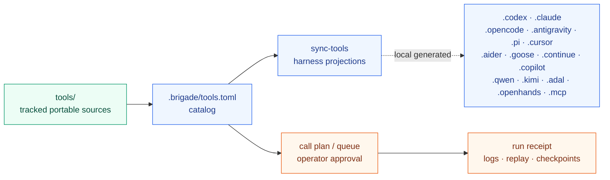

- Discovery is read-only: `list`, `search`, `describe`, `contracts`.
- Projections write reviewed harness-specific tool docs. There is no auto-sync.
- Script calls move through plan, queue, approve, run, with run receipts and replay.
- Runtimes are supervised explicitly. Brigade never auto-starts MCP servers or stores auth.

Details in [Tool catalog](tool-catalog.md).

## Handoff Promotion

Reviewed scanner imports can be promoted into memory handoff drafts instead of being retyped by hand.

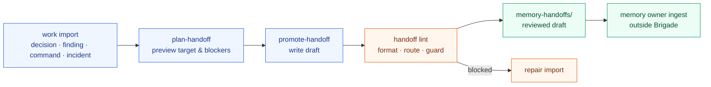

- Works for durable non-task imports: decisions, preferences, links, commands, findings, incidents.
- `brigade work import plan-handoff` previews the target and blockers, `promote-handoff` writes the draft and lints it.
- Drafts land in the normal handoff inbox. Canonical memory is never edited directly.
- Raw private chat fields are rejected and secret-looking values are redacted before the draft is written.

See [Handoff promotion](handoff-promotion.md).

## Deep Research

`brigade research` turns a research question into a local report and a reviewed Memory Handoff. Trusted local files and configured CLI lanes are used first; browser or web sources are opt-in with `--web` and labeled as untrusted source material.

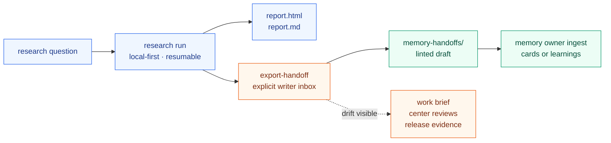

```bash
brigade research run "what should we remember about this topic?" --corpus docs
brigade research export-handoff <run-id> --inbox codex
brigade research handoffs doctor
brigade research handoffs import-issues
brigade research show <run-id>
```

Exports are explicit and receipt-backed. Brigade records the source fingerprint for the handoff artifact, then warns when a completed research run has no export, a missing export path, or a stale export after the run artifact changes. The doctor is read-only; import routing creates reviewable work inbox items instead of exporting or ingesting memory automatically.

## Agent Pantry

The `pantry` station (alias `larder`) wires [Agent Pantry](https://github.com/escoffier-labs/agentpantry) into the same operator workflow: encrypted browser session, cookie, and secret sync between agent machines. The pantry is where the chef stores the cookies and the secret recipes.

- `brigade add pantry` installs agentpantry.
- `brigade pantry status` gives a pantry-specific health readout.
- `brigade pantry setup plan --role source|sink` previews or writes a reviewed setup plan.
- Pantry checks are advisory. An unwired install warns but never fails a workspace run.

## For OpenClaw Users

OpenClaw can be the memory owner. Brigade gives nearby tools a way to contribute checked handoffs back into that owner memory without forcing every tool to know OpenClaw internals.

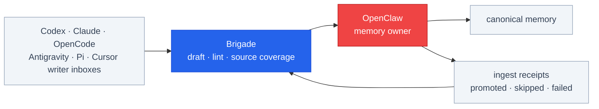

A repo-adjacent setup is:

```bash
brigade init --target ./my-repo --depth repo --harnesses openclaw,codex,claude,opencode,antigravity,pi,cursor,aider,goose,continue,copilot,qwen,kimi,adal,openhands
brigade handoff sources init --target ./my-repo
brigade handoff doctor --target ./my-repo
```

An OpenClaw workspace setup does not need to be inside a code repo:

```bash
brigade init --target ~/agent-workspace --depth workspace --harnesses openclaw,hermes --owner openclaw
brigade handoff sources init --target ~/agent-workspace
brigade handoff doctor --target ~/agent-workspace
```

Then writer tools leave handoffs in their own inboxes, and the memory owner ingests the safe targeted notes while Brigade keeps receipts for promoted, routed, skipped, failed, malformed, and warning outcomes.

## For Hermes Users

Hermes now has a first-class Brigade handoff inbox:

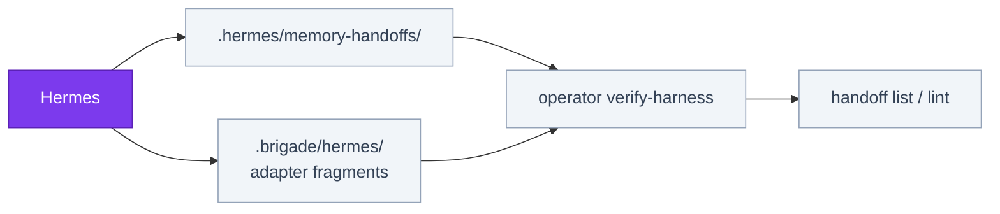

```bash
brigade init --target . --depth workspace --harnesses hermes
brigade handoff sources init --target . --force
```

```bash
brigade handoff draft --target . --inbox hermes \
  --title "Hermes note" \
  --summary "Hermes can write a local Brigade handoff." \
  --content "### Hermes note

Durable context goes here."
```

Check the local wiring with:

```bash
brigade operator verify-harness --harness hermes --target .
brigade handoff list --target .
```

The verifier checks both the `.hermes/memory-handoffs/` writer inbox and the `.brigade/hermes/` adapter fragments.

See [Hermes handoffs](hermes-handoffs.md) for the current boundaries.

## Content Guard

Brigade handles the memory and operator workflow. Content Guard checks whether content is safe to publish or save.

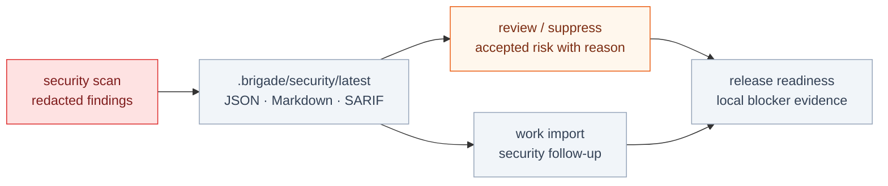

Use it at three points:

- before memory ingest: `brigade handoff lint --content-guard`
- before publishing: `brigade scrub --policy public-repo`
- after findings appear: `brigade work import content-guard`

Policy names are intentionally plain:

- `personal`: local/internal working notes
- `public-repo`: code and docs before push
- `public-content`: stricter checks for blog, social, and site copy

`brigade operator doctor` and `brigade operator status` show whether Content Guard is installed, which policy is expected, which pre-push hook is active, and the latest local scan summary when available.

Brigade also ships a read-only local security scanner. `brigade security scan` produces redacted findings you can review, suppress with a reason, or import into the work inbox. See [Security and Content Guard](security.md).

## Tiny Glossary

- **Harness**: an agent tool such as OpenClaw, Hermes, Codex, Claude Code, OpenCode, Antigravity, Pi, or Cursor.
- **Handoff**: a note an agent writes for later review.
- **Inbox**: the local folder where handoff notes wait.
- **Memory owner**: the place that keeps durable shared memory.
- **Operator**: the human deciding what gets saved, run, or published.
