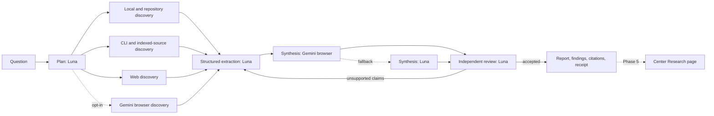

# First-Class Multi-Lane Research

## Status

- Design approved: 2026-08-13
- Implementation: not started
- Dashboard: explicitly deferred to Phase 5
- Supersedes the narrow scope in `docs/phase-oracle-browser-researcher.md`
  without removing that adapter or its history

## Goal

Make `brigade research` a first-class orchestration lane. Brigade should gather
and label evidence, Gemini in a browser should synthesize it, and Luna should
plan, extract, review, and take over when the browser lane is unavailable.

The result must use the same run lifecycle, receipts, cancellation, recovery,
budgets, and operator vocabulary as `brigade run`. Research keeps its own
operator-facing command and domain artifacts.

## Decision record

These decisions were confirmed during design:

| Question | Decision |
|---|---|
| What owns source discovery? | Brigade is the default evidence backbone. |
| What is Gemini's default job? | Synthesis through the browser-backed Oracle adapter. |
| Can Gemini perform discovery? | Yes, through an explicit browser-AI discovery mode. |
| What does Luna do? | Planning, structured extraction, independent review, and fallback synthesis. |
| Which lifecycle owns research runs? | The standard Brigade run kernel. |
| What command does the operator use? | `brigade research`. |
| Is Oracle a required dependency? | No. It is an optional browser transport selected by a profile. |
| Is Center part of the first implementation? | No. A read-only Research page is reserved for Phase 5. |

Historical evidence for the original Oracle adapter is Brigade evidence item
`6e071cdf4080bfe74cd7c64e`. No Brigade evidence records a later integration of
that adapter with the standard run lifecycle.

## Existing state

Brigade already has most of the pieces, but they stop at separate boundaries:

- `brigade research` owns a domain engine, source providers, citation checks,
  and legacy artifacts under `.brigade/research/`.
- `brigade run` owns the durable scheduler, journals, worker records, budgets,
  cancellation, recovery, and receipt projection under `.brigade/runs/`.
- The Oracle adapter can send a one-shot prompt to Gemini's browser UI through
  `oracle --engine browser`.
- The roster can select a `researcher`, but the role is a single string and
  cannot express planning, extraction, synthesis, and review separately.
- Center has no Research surface and should not infer state by reading research
  files directly.

The first Oracle phase deliberately scoped itself to one adapter. It did not
join research to the run kernel, add a multi-seat graph, expose provider health,
or define a Center projection. That explains why the integration feels absent
now even though its adapter code and history still exist.

## Operator contract

The default command stays small:

```bash
brigade research run "What changed in browser agent orchestration this month?"
```

Default behavior:

1. Luna plans the investigation.
2. Brigade gathers evidence from configured local, CLI, and web sources.
3. Luna extracts structured findings from untrusted source material.
4. Gemini browser synthesizes the cited report when its profile is healthy.
5. Luna independently audits claims and citations.
6. Brigade repairs rejected or unsupported claims, then publishes artifacts.
7. If Gemini browser is unavailable, Luna performs synthesis and the receipt
   records the fallback.

Gemini-led discovery is opt-in:

```bash
brigade research run "Map the browser-agent market" --browser-ai-research
```

That mode adds Gemini browser as a discovery lane. Its output is untrusted
source material until Brigade extracts, labels, and reviews it. It does not
bypass the evidence ledger or become a citation by itself.

Useful operator controls:

```bash
brigade research doctor
brigade research run "..." --profile grounded
brigade research run "..." --profile local-only
brigade research run "..." --synthesizer luna
brigade research status <run-id> --json
brigade research cancel <run-id>
brigade research resume <run-id>
brigade research open <run-id>
```

`--profile grounded` is the default. A roster or repository may choose a
different default, but the resolved profile and every resolved seat must be
written into the run receipt.

## Research graph



The graph is domain-defined. The general run planner does not invent the phase
shape. The standard scheduler executes it, journals transitions, applies
budgets, dispatches seats, and handles cancellation and recovery.

## Lane model

Roster entries need capabilities in addition to the existing human-readable
`role` field. A seat may have more than one capability.

```toml
[agents.luna_research]
cli = "codex"
model = "gpt-5.6-luna"
capabilities = [
  "research.plan",
  "research.extract",
  "research.review",
  "research.synthesize",
]

[agents.gemini_browser]
cli = "oracle"
model = "gemini-3.1-pro"
capabilities = [
  "research.synthesize",
  "research.browser-discover",
]
timeout_seconds = 300

[research.lanes]
planner = ["luna_research"]
extractor = ["luna_research"]
synthesizer = ["gemini_browser", "luna_research"]
reviewer = ["luna_research"]
```

Compatibility rules:

- Existing `role = "researcher"` entries remain valid for one compatibility
  window and map to a `research.general` capability. That compatibility
  capability may plan, extract, or synthesize, but it cannot independently
  review or activate browser discovery.
- Explicit capability matches win over the compatibility mapping.
- `--synthesizer`, `--reviewer`, and profile selection are run-local overrides.
- Every chosen seat, model, transport, fallback, and retry is recorded.
- A synthesizer cannot review its own output in the same invocation or hidden
  session. Luna fallback synthesis gets a fresh review invocation with only the
  cited artifact packet as input.

The browser adapter remains hard read-only. Brigade invokes Oracle without
output-file flags, API flags, or a filesystem-writing tool surface.

## Discovery modes

### Grounded, default

Brigade gathers sources first. Gemini receives a bounded evidence packet and
writes the synthesis. This keeps source ownership, trust labels, citations, and
replay inside Brigade.

### Browser-AI research, opt-in

Gemini may search or navigate using the browser product. Brigade records the
prompt, requested model, session reference, returned citations, and content
digest. The returned material enters the same extraction and review boundary
as any other web source.

Browser-AI discovery cannot silently activate because it changes provenance,
latency, provider exposure, and reproducibility.

### Local-only

No network or browser source is used. The run may still use a model transport
if the selected profile permits it. A stricter offline profile can restrict
both sources and model transports.

## Shared execution kernel

Research should reuse the single-seat invocation path that powers standard run
assignments. It must not recursively launch a complete `brigade run` for every
model call.

The shared invocation contract returns:

- resolved seat, model, CLI, and transport
- start and end timestamps
- stdout or structured final output
- exit status and typed failure
- cancellation result
- retry and quarantine decisions
- token, time, and cost measurements when available
- log and artifact references

The research engine remains responsible for source planning, extraction,
citation resolution, repair prompts, and final report assembly. The run kernel
owns execution mechanics and durable state.

Before implementation, Brigade Code must map the impact of extracting this
shared invocation path. The expected impact includes `agents.py`, the run
transport, research LLM resolution, run receipts, and their focused tests.

## Run and artifact contract

New research runs live in the standard container:

```text
.brigade/runs/<run-id>/
  run.json
  plan.json
  journal.jsonl
  workers/
  logs/
  research.json
  findings.json
  citation-audit.json
  report.md
  handoff.md
```

`run.json` gains a preserved `kind` field. Existing runs without it are treated
as `kind = "work"`. Research runs use `kind = "research"`.

`research.json` is a versioned sidecar with:

- schema version, question, profile, and discovery mode
- phase graph and current phase
- resolved seats, transports, requested models, and observed models
- source counts by provenance and trust class
- budget limits and consumption
- fallback and retry history
- finding, citation, report, and handoff references
- unresolved citation count and review result

`findings.json` contains structured claims. Each claim links to source IDs,
content digests, extraction lane, timestamps, and trust metadata.

`citation-audit.json` maps every published citation to one or more findings and
records accepted, rejected, unresolved, or repaired status.

Raw cookies, profile paths, bearer tokens, browser storage, and unredacted
authentication errors must never appear in run artifacts, exports, or Center.

## Provenance boundary

Every source and generated artifact gets a provenance envelope. The minimum
fields are:

- origin: local, repository, indexed-cli, web, or browser-ai
- acquisition method and provider
- source URI or stable local identifier
- content digest
- acquired timestamp
- trust class
- producing lane and model, when generated
- parent source IDs for summaries or transforms

Source text remains untrusted after summarization. Prompts that pass summaries
to Gemini or Luna must preserve the untrusted-source wrapper and source IDs.

Browser-AI output may suggest links and claims. A claim becomes publishable
only after Brigade resolves it to stored evidence and the independent review
accepts it. Unresolved claims stay visibly unresolved or are removed.

## Truthful failures and fallbacks

The first implementation must correct the current command boundary while it
joins the run kernel:

- A failed seat result produces a failed phase, not a successful empty answer.
- CLI failures exit nonzero and preserve `failure_phase`, `failure_kind`, and
  operator-safe detail.
- `reasoning`, `read_only`, timeout, and model pins reach the selected adapter.
- A run with no viable source route fails admission unless the selected mode
  explicitly permits browser-AI discovery.
- Gemini failure may fall back to Luna only when the profile allows it.
- Fallback is visible in status, report metadata, and receipts.
- Oracle's requested model and observed model are recorded separately. If the
  observed model cannot be verified, the receipt says `unverified`. It does not
  claim that the requested model ran.
- Cancellation stops queued work and requests termination of active seat calls.
- Resume starts from the last durable phase boundary and does not repeat an
  accepted source acquisition unless the operator asks for refresh.

Browser authentication problems retain the existing `browser-auth` failure
kind and direct the operator to the profile or cookie health check. They are
not recast as workspace trust failures.

## Profiles and doctor

Oracle stays optional. Brigade does not install Node, Oracle, a browser, or
cookies during a research run.

`brigade research doctor` reports each lane separately:

- configuration present
- executable and version
- authentication state without exposing secrets
- requested model availability
- observed model attestation support
- read-only enforcement class
- timeout and concurrency policy
- last live smoke, if one exists

Suggested profiles:

| Profile | Discovery | Synthesis | Review | Intended use |
|---|---|---|---|---|
| `grounded` | Brigade sources | Gemini browser, Luna fallback | Luna | Default connected research |
| `browser-ai` | Brigade plus Gemini browser | Gemini browser, Luna fallback | Luna | Broad current-web scouting |
| `local-only` | Local and repository | Luna | Luna | Private or disconnected work |
| `luna-only` | Configured Brigade sources | Luna | A separate Luna attempt | Browser lane outage |

The Gemini browser transport gets a default concurrency limit of one until a
live lane survey proves a higher value is reliable. Provider throttling should
not turn parallel research into shared-session corruption.

## Legacy compatibility

The old `.brigade/research/` store remains readable during migration.

- `research list`, `show`, and `open` read both stores and label legacy runs.
- New runs always use `.brigade/runs/<run-id>`.
- Legacy resume uses the legacy engine during the compatibility window.
- No automatic destructive migration occurs.
- A later explicit migration command may copy legacy metadata into a standard
  run container while retaining the original directory and source digests.

## Delivery phases

### Phase 1: truthful command and shared seat invocation

- Propagate typed seat failures to the research CLI.
- Forward reasoning, read-only, timeout, and model controls.
- Extract the shared single-seat invocation contract.
- Add hermetic Oracle adapter tests through the real research command.

### Phase 2: standard research run container

- Add `kind = "research"` and the versioned `research.json` sidecar.
- Journal phase transitions through the standard lifecycle.
- Add cancel, resume, budgets, logs, and receipt projection.
- Dual-read legacy research runs.

### Phase 3: multi-lane graph

- Add capability-based seat resolution and research profiles.
- Run Brigade discovery lanes in parallel where source constraints allow it.
- Add Gemini browser synthesis, Luna review, repair, and recorded fallback.
- Add opt-in browser-AI discovery.

### Phase 4: live acceptance and migration readiness

- Validate Oracle stdout, authentication errors, requested model, and observed
  model on a real browser session.
- Validate one live grounded run and one browser-AI discovery run.
- Publish a migration plan for legacy runs after dual-read has settled.

### Phase 5: Center Research page, deferred

Center receives a seventh top-level view named **Research**. Its operator
question is: "What are we researching, what has it found, and can I trust the
evidence?"

The first dashboard slice is read-only and contains:

- active, blocked, completed, and failed research counts
- provider and lane health, including Gemini browser and Luna fallback
- a phase pipeline for each active run
- recent reports and unresolved citation counts
- a run inspector for findings, sources, citations, fallbacks, and receipts
- clear legacy-run and unverified-model labels

Center consumes only versioned CLI JSON, beginning with:

```bash
brigade research status --all --json
brigade research show <run-id> --json
brigade research doctor --json
```

Center must not read `.brigade/research/`, `.brigade/runs/`, Oracle sessions,
or browser profiles directly. This keeps the CLI contract authoritative and
lets Center remain a projection rather than a second research engine.

Start, cancel, resume, and profile-edit controls are a separate dashboard phase
after the read-only view proves the status contract.

## Verification matrix

| Claim | Required proof |
|---|---|
| Research uses the standard lifecycle | Hermetic end-to-end run with journal, worker, receipt, and research sidecar assertions. |
| Failed workers fail the command | Nonzero CLI tests for dispatch, auth, timeout, invalid output, and no-source admission. |
| Gemini is the default synthesizer | Profile resolution test plus receipt assertion. |
| Luna reviews independently | Test that synthesis and review cannot resolve to the same attempt identity. |
| Fallback is truthful | Forced Gemini failure with Luna success and visible fallback metadata. |
| Browser discovery is opt-in | Default argv and plan omit it. The explicit flag adds a browser-ai source lane. |
| Source injection stays contained | Adversarial fixture survives extraction and synthesis without changing instructions. |
| Citations resolve to evidence | Published citation audit has zero unresolved entries in the passing fixture. |
| Cancellation is durable | Cancel during active synthesis, then inspect journal and resume boundary. |
| Legacy runs stay visible | Dual-store list, show, and open tests. |
| Center can project without disk access | JSON schema fixtures for status, show, and doctor. |
| Oracle works live | Separate live acceptance receipt, never substituted by a stub. |

All counted verification must run through `brigade work verify run`, followed
by outcome capture for the implementation card or skill.

## Out of scope for the first implementation

- Center UI code
- dashboard action controls
- automatic Oracle, Node, browser, or cookie installation
- multi-user browser profiles
- fleet-wide shared browser sessions
- silent API-key fallback
- trusting model-generated citations without source resolution
- deleting or rewriting legacy research runs
- replacing the current evidence providers with Gemini browser discovery

## Implementation exit criteria

The research lane is ready for its first release when:

- one command creates a standard `kind = "research"` run
- default grounded research completes through Brigade discovery, Gemini browser
  synthesis, and Luna review
- Luna fallback completes when Gemini is unavailable and is visibly recorded
- browser-AI discovery requires explicit opt-in
- citations map to stored evidence with no hidden unresolved claims
- failure, cancellation, resume, and budget behavior match standard runs
- legacy research remains readable
- the three JSON contracts reserved for Center are versioned and tested
- a real Oracle browser acceptance run is attached as evidence

Phase 5 remains in this tracked spec until the Center Research page ships. It
must not be dropped from roadmap planning when Phases 1 through 4 are cut into
implementation cards.
