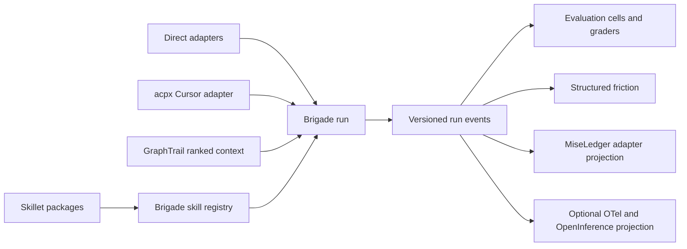

# Brigade Upstream Pattern Integration

Status: approved for implementation  
Date: 2026-07-12  
Scope: Brigade, GraphTrail, Skillet, first-class station manifests, and the optional Cursor ACP transport

## Decision

Implement the audit as owner-specific changes instead of creating another sidecar.

- Brigade owns run identity, normalized events, evaluation cells, graders, acceptance, friction, receipt projection, and transport selection.
- GraphTrail owns personalized, token-budgeted repository context.
- Skillet owns distributable skill packages and its station manifest.
- MiseLedger keeps accepting `miseledger.adapter.v1`. Brigade projects richer receipts into that existing contract. The first implementation does not require MiseLedger production code.
- `acpx` remains a user-installed external executable. Brigade gets an opt-in Cursor transport adapter around one-shot `acpx exec`.

There is no new ACP project in this phase. Extraction becomes eligible only when 2 independent consumers need the same adapter and persistent session lifecycle, cancellation, or queue recovery has entered scope.

## Goals

1. Make Brigade's top-level status agree with the sidecars it reports.
2. Separate process completion, adapter failure, deterministic verification, grader results, and human acceptance.
3. Make model comparisons reproducible across cases, seats, and repeated trials.
4. Feed friction analysis from typed receipts before regex-scanned prose.
5. Close the Skillet install, registry, promotion, and rollback loop while matching Agent Skills format facts.
6. Improve GraphTrail context recall under Brigade's 4,000-character budget.
7. Add a bounded ACP path for Composer and Grok Cursor seats without placing Node or an ACP SDK in Brigade.

## Constraints

- Brigade keeps zero runtime dependencies and Python 3.10 support.
- Existing run artifacts and rosters remain readable.
- Direct CLI transports remain the default and fallback.
- Runtime status stays offline and read-only.
- Shared receipts omit prompts, model output, command catalogs, tool arguments, and retrieved source by default.
- Raw provider and ACP streams stay local, private, and opt-in.
- No model result counts as verified work without deterministic command evidence.
- No new top-level harness, depth, or include is introduced.

## Options Considered

### A. One new orchestration sidecar

This would place evaluation, receipt conversion, skill metadata, context ranking, and ACP in a new repository. It creates duplicate ownership for contracts that already have clear homes. Brigade would still need most of the integration code.

### B. Changes in the owning repositories

Brigade gains the shared run contract and optional transport. GraphTrail gains ranking. Skillet gains packaging metadata and a station manifest. MiseLedger receives the new evidence through its existing adapter format.

This is the selected approach.

### C. External wrappers only

Brigade could call Inspect, Promptfoo, Aider, skills-ref, and acpx as subprocesses. Inspect and Promptfoo bring large runtimes, Aider brings a broad parsing and graph stack, and skills-ref conflicts with Brigade's dependency and Python boundaries. Wrapper-only integration also leaves Brigade's current run evidence and scorecard defects in place.

## Ownership and Data Flow



## Contract 1: Versioned Run Evidence

Keep current filenames for compatibility and add schema discriminators. Legacy readers continue accepting missing schema fields.

Initial schema names:

- `brigade.run.v1`
- `brigade.run_event.v1`
- `brigade.eval_manifest.v1`
- `brigade.eval_cell.v1`
- `brigade.eval_summary.v1`
- `brigade.grader_result.v1`

The normalized run and event records carry:

- Run, attempt, trace, span, parent, and link identifiers.
- Operation kind and stable operation name.
- Start time, end time, and seat duration.
- Status, exit code, error class, and stop reason.
- Seat, adapter, transport, requested model, effective model, and reasoning level.
- Token counts only when the adapter reports them.
- Artifact path, SHA-256 digest, media type, byte size, and privacy class.
- Deterministic verification state.
- Research-task acceptance state.
- Adapter-native fields inside a namespaced extension object.

Provider events are normalized into `brigade.run_event.v1`. Raw Codex app-server or ACP messages go to a separate private log only when raw logging is enabled.

OpenTelemetry-compatible trace and span identifiers are used in Brigade records. OTel GenAI and OpenInference field names are export projections, not Brigade's storage authority. Each export records the mapping version and audited upstream revision.

## Contract 2: Cases, Seats, Trials, and Resume

Add a model-trial surface under the existing `brigade model` command with plan, run, resume, show, and summary operations.

An evaluation manifest defines:

- A stable schema and experiment name.
- Cases with explicit IDs and prompt text or a relative prompt file.
- A roster or selected seat IDs.
- Default trial count and per-case overrides.
- Grader definitions.
- Operational limits such as timeout and concurrency.

Experiment conditions are separated from operational settings. A cell ID is the SHA-256 digest of normalized case content, normalized seat execution spec, trial index, grader contract, and schema version. Array position and wall-clock time do not enter the identity.

A resume operation:

1. Recomputes the expected cell set.
2. Skips terminal cells whose identity and receipt digest still match.
3. Reruns missing or interrupted cells.
4. Reports stale cells when case, seat, transport, reasoning, or grader identity changed.
5. Appends retries and keeps the earlier attempts.

The summary counts scored, unscored, execution error, adapter error, grader error, rejected, and accepted cells separately. Trial statistics include raw values, count, mean, median, minimum, maximum, and standard deviation using the Python standard library.

## Contract 3: Mechanical Graders and Acceptance

The first grader set is dependency-free:

- Exit status.
- Exact output.
- Regular-expression output.
- JSON field comparison.
- File existence.
- Diff constraints.
- A Brigade verification receipt reference.

Every grader result records its identity and version, cell linkage, status, exit code, score bounds, component checks, duration, and digested output references. `score: 0` remains distinct from an execution that was never graded.

Human or cross-model judgment is stored as acceptance evidence. It reports its own model, prompt digest, errors, and decision. It never replaces deterministic verification.

## Contract 4: Structured Friction

Friction v2 consumes sources in this order:

1. Brigade run, evaluation, grader, and verification receipts.
2. `miseledger.adapter.v1` records supplied through an explicit local path.
3. Existing regex scanning as a fallback.

The importer normalizes source, event type, adapter, error class, operation, timestamp, recurrence key, and evidence reference. Root-cause identity excludes source path and line position.

Before truncation, each source family gets a quota. Candidates are then ranked by recurrence, recency, severity, and whether a deterministic failure supports the claim. Scan output reports structured hits, regex hits, duplicates, rejected noise, skipped files, and quota use.

Acceptance fixtures include a large generated `.brigade/work` history plus smaller Codex and Claude logs. The generated history cannot consume every candidate slot.

## Contract 5: Agent Skills and Skillet

Brigade implements the observable Agent Skills format rules with standard-library parsing:

- `name` is required, matches the directory, and follows the 1 to 64 character lowercase identifier rules.
- `description` is required and limited to 1,024 characters.
- `license` and `compatibility` are accepted.
- `metadata` retains string-to-string values.
- `allowed-tools` is parsed as a declared requirement and never grants permission.
- `SKILL.md` casing is exact.

Two modes are required:

- Strict authoring mode rejects malformed known fields.
- Lenient import mode retains unknown fields and emits field-specific diagnostics.

Brigade keeps richer fields in its registry: source repository and revision, content digest, version, trust, required tools, required MCP servers, tests, install receipt, promotion history, and rollback history.

Skillet changes:

- Add an active `brigade.station.v1` root manifest with `tool.kind = "skill-roster"`.
- Make its linter require version and trust metadata.
- Declare the repository license in skill frontmatter.
- Validate the Agent Skills name and description rules locally.
- Add one reviewed import path into Brigade's registry, including source revision and content digest.
- Prove that an imported Skillet skill can be installed, scored, promoted, and rolled back.

External install counts do not affect skill quality.

## Contract 6: Personalized GraphTrail Context

GraphTrail adds opt-in `context --personalized --max-chars 4000`, with equivalent MCP arguments. Existing output stays unchanged when personalization is off.

The first ranker uses existing resolved call edges and no new crate:

1. Seed files named in the task and files containing FTS entry points.
2. Weight FTS seeds by reciprocal result position.
3. Run bounded file-level personalized PageRank with stable path tie-breaking.
4. Reorder entry points, call edges, and related files by file rank.
5. Render complete lines up to the character budget.
6. Compact long task headings so the heading cannot consume the whole budget.

The fixed acceptance corpus uses these 6 Brigade runs and their 28 changed files:

- `20260708-154455-c6f30720`
- `20260708-173209-7d72e243`
- `20260708-185910-45b8c1ab`
- `20260708-193719-351f1e95`
- `20260709-050926-2399675f`
- `20260709-062906-8e8b3cee`

The current macro hit rate is 0.654 with 16 of 28 changed files present. The new ranker must exceed 0.654, exceed 16 of 28 total hits, avoid a per-case regression, and improve at least 2 cases. A synthetic fixture proves that a task-seeded file outranks an unrelated high-degree hub.

Brigade opts into personalized context only after this corpus passes.

## Contract 7: Cursor over ACP

Add a per-seat roster field:

```toml
[[agents]]
name = "cursor-composer"
cli = "cursor"
model = "composer-2.5"
transport = "acpx"
transport_version = "0.12.0"
```

The first adapter supports Cursor one-shot execution only. Brigade invokes a user-installed `acpx` binary with:

- An exact version check.
- `--cwd` set to the scoped checkout or worktree.
- `--format json --json-strict`.
- `--no-terminal`.
- `--approve-reads` for read-only work.
- `--approve-all` only for an already-authorized writable worktree.
- An explicit timeout and requested model.
- `cursor exec` with no persistent session name.

The adapter stores protocol version, acpx version, ACP session ID, request ID, stop reason, requested model, acknowledged effective model, exit code, duration, and projected safe events. The final text is extracted from the protocol stream. Missing final text is an adapter or task-contract failure, never a successful worker result.

The direct Cursor adapter remains available. If `acpx` is absent, has the wrong version, emits invalid NDJSON, cannot negotiate protocol 1, or requests unsupported capabilities, Brigade fails that seat with a specific diagnostic and does not switch transports silently.

Persistent ACP sessions, terminal capability, automatic package installation, protocol 2, and an embedded ACP SDK remain out of scope.

## Control-Plane Work

The upstream-pattern work depends on honest status and roster behavior. Complete these fixes before publishing model comparisons:

- Replace the `empty` status with `not-installed`, `not-configured`, `unchecked`, `ok`, `degraded`, or `failed`.
- Derive top-level station health from fast read-only payloads already exposed by the tool.
- Make any warning produce `degraded` unless a failure takes precedence.
- Resolve the same local and user roster fallback in `run` and `roster doctor`.
- Generate Brigade's bundled managed-tool snapshot from reviewed station manifests during release work.
- Keep the bundled snapshot at runtime so status and install stay offline.
- Add or repair manifests for GraphTrail, MiseLedger, Skillet, Agent Pantry, and Token Glace.
- Record Content Guard as embedded and name Brigade as its maintained owner.

Existing issue prerequisites are included:

- #213: roster fallback parity.
- #222: warnings only for selected direct-worker seats.
- #223: correct writable sandbox classification for hard read-only adapters.
- #224: explicit, compatible Codex reasoning for pinned models.
- #225: score only dispatched workers and use seat duration.
- #226: preserve exit code plus full stdout and stderr logs.
- #231: classify empty Cursor output as failure and cover the Grok path.

## Implementation Sequence

### Phase 0: Baselines and isolated worktrees

- Create one worktree and branch per modified repository.
- Record clean or pre-existing dirty state before edits.
- Run each repository's completion gate before code changes.
- Use only temporary workspaces for Brigade and MiseLedger integration checks.

### Phase 1: Status and station authority

- Land explicit status states and roster fallback parity in Brigade.
- Add or repair sidecar manifests.
- Add managed-snapshot generation and drift tests.
- Verify each active manifest with `--check-managed`.

### Phase 2: Common adapter evidence

- Extend the common agent result with exit code, duration, transport, requested and effective model, reasoning, stop reason, and log references.
- Fix #222 through #226 and #231 at the shared adapter seam.
- Version current run artifacts and add legacy normalization tests.

### Phase 3: Evaluation and grading

- Add deterministic manifest expansion and cell IDs.
- Execute one cell through the existing direct-worker path.
- Add resume and stale-cell reporting.
- Add the mechanical grader envelope and summary statistics.
- Update the documented model-rating battery to use the machine contract.

### Phase 4: Receipts and friction

- Add safe MiseLedger, OTel GenAI, and OpenInference projections.
- Prove the MiseLedger projection through a temporary archive.
- Make friction v2 prefer typed receipts and enforce source quotas.

### Phase 5: Skillet and Agent Skills

- Add the Skillet station manifest and local format validation.
- Add strict and lenient Brigade validation modes.
- Add reviewed registry import, install receipt, promotion, and rollback coverage.

### Phase 6: GraphTrail ranking

- Add the opt-in personalized ranker and budgeted renderer.
- Run the 6-case corpus and synthetic high-degree-hub fixture.
- Enable Brigade's opt-in only after the thresholds pass.

### Phase 7: ACP pilot

- Add the isolated `acpx` adapter and roster fields.
- Test parser, permissions, version mismatch, timeout, invalid output, empty output, and effective-model acknowledgment with fixtures.
- Run the same fixed Composer and Grok rating cases through direct Cursor and acpx when credentials and the local binary are available.
- Keep ACP opt-in until its accepted-cell rate and diagnostic coverage meet or beat direct Cursor on the battery.

### Phase 8: Cross-repo closeout

- Run every repository completion gate.
- Run Brigade verification through `brigade work verify run` and capture outcomes.
- Run an independent review on each write set.
- Update the ecosystem audit with measured before and after results.
- Write Memory Handoffs for Brigade, GraphTrail, Skillet, and any station repo changed.

## Verification Gates

Brigade:

```bash
./scripts/verify
```

GraphTrail:

```bash
cargo fmt --check
cargo clippy --all-targets --all-features -- -D warnings
cargo test --all-features
cargo build --release
```

Skillet:

```bash
bash tests/lint-skills.sh
```

Other station repositories use their repo-local `AGENTS.md` completion gate. Cross-repo tests use temporary directories and do not inspect a live MiseLedger archive, home directory, or operator workspace.

## License and Reuse Boundary

| Upstream | License | Treatment |
| --- | --- | --- |
| OpenTelemetry GenAI | Apache-2.0 | Public field-shape compatibility and export ideas. No vendored schema or runtime. |
| OpenInference | Apache-2.0 | Role and privacy vocabulary for an optional export projection. No instrumentation dependency. |
| Inspect AI | MIT | Independently implement run identity, resume, resolved config, and trial statistics. |
| Promptfoo | MIT | Independently implement cases by seats by trials and grader status separation. |
| Agent Skills | Apache-2.0 code, CC-BY-4.0 docs with an ambiguous spec-file boundary | Implement observable format facts. Do not copy specification prose. |
| skills-ref | Apache-2.0 | No dependency and no vendored code. |
| Aider repository map | Apache-2.0 core with mixed query provenance | Independently implement a GraphTrail ranker. Do not copy queries, constants, or source. |
| ACP protocol and official SDKs | Apache-2.0 | Treat protocol 1 as an external interface. Do not add an SDK. |
| acpx | MIT | Execute an exact, user-installed version as an optional process transport. Do not vendor or auto-install it. |

Any later copied source must retain its license and notices and mark modifications. This plan expects independent implementation, published interface names where interoperability requires them, and a recorded upstream revision for every export mapping.

## Completion Criteria

The program is complete when:

- Top-level status matches sidecar-specific health on the acceptance fixtures.
- Every first-class sidecar has a verified manifest or an explicit embedded lifecycle record.
- Run artifacts are versioned and old fixtures still load.
- Adapter success cannot hide an empty result, missing exit code, or missing logs.
- A repeated evaluation resumes without rerunning matching terminal cells.
- Scorecard and evaluation summaries include only dispatched cells and seat durations.
- Friction fixtures preserve agent-log candidates after generated Brigade history reaches its cap.
- A Skillet skill completes registry import, install, outcome, promotion, and rollback tests.
- GraphTrail clears the stated 6-case recall thresholds under 4,000 characters.
- Cursor over acpx passes parser and failure fixtures plus the available live battery.
- Brigade, GraphTrail, Skillet, and each changed station repository pass their completion gates.

The ACP result at closeout is one of 2 explicit states: `optional-brigade-adapter` or `extraction-candidate`. `extraction-candidate` requires the 2-consumer and session-lifecycle gate stated in the decision. The expected result for this phase is `optional-brigade-adapter`.
