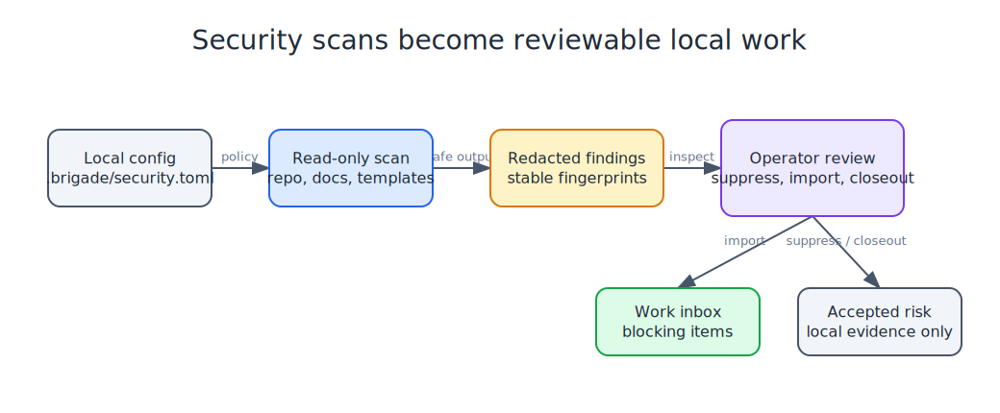

# Security Scanner

Brigade includes a read-only local security scanner for agent workspaces. It is designed to produce redacted findings that can be reviewed, suppressed, or imported into the local work inbox.



## Content Guard

Content Guard is Brigade's publish and memory-safety scanner. Brigade shells out to the local scanner instead of importing it as a library, so the boundary stays explicit.

Use it in three places:

- `brigade handoff lint --content-guard --guard-policy personal` checks pending handoffs before memory ingest. The flag runs content-guard for secret and identity leaks and Brigade injection heuristics for instruction-shaped payloads in handoff bodies (for example override phrases, fake system blocks, and base64-decode chains). Injection hits are reported as line-numbered warnings; benign discussion of prompt injection may appear as info-level notes.
- `brigade handoff draft --guard --guard-policy personal ...` writes a draft and returns failure if Content Guard blocks it.
- `brigade work import content-guard --policy public-repo` runs a scan and turns blocking findings into reviewable work imports.

`brigade operator status` and `brigade operator doctor` report whether Content Guard is installed, the expected policy, the active pre-push hook path, the hook mode, suggested repair commands, and the latest local scan summary when available.

Policy guidance:

- `personal`: local/internal working notes and memory handoffs.
- `public-repo`: code and docs before push.
- `public-content`: stricter checks for blog, social, site copy, and other user-facing content.
- `strict`: high-sensitivity review where false positives are acceptable.

The memory-owner boundary is: ingest only handoffs that pass Brigade lint, Content Guard when configured, and have an explicit safe route. OpenClaw or Hermes should leave ambiguous, risky, malformed, or failed inbox files pending for operator review instead of treating raw handoffs as permanent memory.

## Local Config

`brigade security init` writes `.brigade/security.toml`. The file is host-local and should stay gitignored.

Supported fields:

- `policy`: `personal`, `public-repo`, `ci`, or `strict`.
- `scan_profile`: `public-repo`, `internal-workspace`, or `local-only-audit`.
- `fail_on`: `none`, `low`, `medium`, `high`, or `critical`.
- `include_templates`: whether public template files are scanned.
- `enabled_checks`: any of `automation`, `mcp`, `permissions`, `prompt-injection`, `secrets`, and `supply-chain`.
- `include_paths` and `exclude_paths`: relative path prefixes.
- `severity_threshold`: minimum severity retained in reports.
- `output_path`: relative path for the latest local evidence bundle.
- `[suppressions]` and `[suppression_reasons]`: reviewed finding fingerprints and reasons.

Keep tokens, private URLs, hostnames, mount paths, repo paths, and credentials out of this config. Use labels or local paths only when they are safe to expose in local command output.

## Review Flow

```bash
brigade security scan --target .
brigade security findings
brigade security sarif
brigade security template-audit
brigade security show <finding-id>
brigade security suppress <finding-id-or-fingerprint> --reason "reviewed false positive"
brigade security unsuppress <finding-id-or-fingerprint>
brigade security doctor
```

Findings include stable `id`, `fingerprint`, `rule_id`, `severity`, `category`, `path`, `line`, `safe_excerpt`, `remediation_hint`, and optional `response_options` fields. Secret-looking values are redacted before JSON reports, Markdown reports, SARIF, work imports, docs, or session artifacts are written.

Secret findings include a small response playbook. Typical options are moving active credentials into a gitignored `.env` file or environment variable, scrubbing tracked files and rotating exposed values, showing the redacted finding to the operator so they can preserve the real value in KeePass before deciding, and redacting or archiving chat/session transcripts when a session log contains an exposed key.

First response checklist for a likely real credential:

1. Treat the redacted finding as sensitive until reviewed. Do not paste raw scan output into an issue, chat, or committed doc.
2. Show the redacted finding id, path, rule, and response options to the operator.
3. If the value is still needed, move active use to a gitignored `.env` file, shell environment variable, or other local secret store.
4. If the real value is not already safely stored, let the operator save it in KeePass before deleting or rotating it.
5. Scrub tracked files, session logs, and chat transcripts that contain the raw value.
6. Rotate the credential if it was committed, shared, synced, pasted into a session transcript, or exposed to another user.
7. Record the chosen response as a suppression, accepted-risk closeout, or promoted work item without storing the secret value.

Security scans write `security-report.sarif` next to the JSON and Markdown reports. `brigade security sarif` can regenerate that SARIF file from an existing local evidence bundle without rescanning.

`brigade security template-audit` is a focused public artifact audit. It scans `src/brigade/templates`, `templates`, and `docs` for private paths, private-looking URLs, and secret-looking values, while allowing placeholders, reserved example domains, loopback examples, template variables, and environment labels. The audit is read-only and its summary is included in `brigade security doctor` and release readiness evidence.

Harness wiring checks inspect repo-local agent configuration JSON under `.brigade/`, `.claude/`, `.codex/`, `.opencode/`, `.antigravity/`, `.pi/`, `.cursor/`, `.aider/`, `.goose/`, `.continue/`, `.copilot/`, `.qwen/`, `.kimi/`, `.adal/`, `.openhands/`, `.grok/`, `.amp/`, `.crush/`, `.openclaw/`, `.hermes/`, and Brigade template folders. They flag path traversal, host-private absolute paths, broad filesystem roots, insecure or private-looking remote URLs, remote shell bootstrap commands, and shell metacharacters in command fields. `brigade security scan` includes those findings in normal reports, and `brigade security doctor` summarizes harness wiring health even before a fresh report bundle exists.

Guardrail surfaces distinguish repo guidance, Claude command files, Codex skills, subagents, and tool wrappers. Public template findings keep `confidence: template`, while active workspace guidance and wrapper files report runtime confidence.

Session and chat transcript paths such as `.codex/sessions/`, `.claude/chats/`, or transcript folders are classified as `surface: session-chat`. API keys, tokens, passwords, private keys, and plaintext password assignments found there are reported as high-severity secret findings with transcript-specific scrub guidance.

Security closeouts include policy-pack evidence: policy name, fail threshold, template inclusion, blocker count, warning count, and whether open findings were accepted as local risk. An accepted-risk closeout quiets only findings with the same stable fingerprints. A later scan activates new or changed fingerprints. Harness-wiring health follows the configured template-inclusion policy, so excluded template findings remain visible in raw counts without becoming active health issues. Release readiness and release candidates include the latest closeout.

## Inbox Flow

`brigade security scan --import-findings` writes the local evidence bundle and imports unsuppressed findings into the existing work inbox with source `security-scan`.

Imported records preserve safe metadata:

- finding id
- rule id
- severity and category
- path and line
- safe detail
- remediation hint
- response options
- local evidence path
- stable source key and fingerprint

Repeated scans dedupe equivalent pending findings. Dismissed imports stay dismissed until the finding materially changes.

Repeated security imports can become reviewed skill proposals through the learning loop:

```bash
brigade security scan --target . --import-findings
brigade learn skill-candidates --source security-scan
brigade learn propose-skill <candidate-id> --dry-run
brigade learn propose-skill <candidate-id>
```

This is useful when the same security problem keeps recurring, for example API keys in session or chat transcripts. The generated skill proposal preserves redacted response options such as `.env` storage, scrub or rotate, KeePass review, and transcript redaction, but it still lands in the skill inbox for review and is never installed automatically.

## Boundaries

The scanner is local and read-only. It does not call external SaaS scanners, perform network scanning, store secrets, start a daemon, schedule scans, mutate GitHub issues, or remediate findings automatically.
