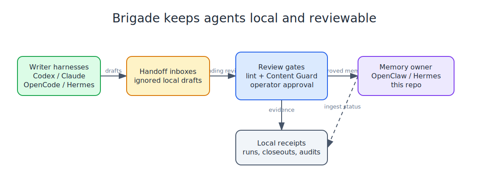

<p align="center">
  
</p>

# Brigade Technical Guide

This guide preserves the detailed command walkthroughs and operational notes that used to live on the project front page. The README now stays short; the nitty gritty lives here.

<h1 align="center">Brigade</h1>

<p align="center">
  <strong>Run your agent brigade.</strong>
</p>

<p align="center">
  <em>Public-safe workspace bootstrap, memory handoffs, and publish guards for real agent setups.</em>
</p>

<p align="center">
  
  
  
  
</p>

<p align="center">
  <code>brigade</code> is a local operator-system CLI for agent workspaces.
  It bootstraps the workspace, runs bounded multi-agent work, routes scanner
  findings into reviewable queues, records release evidence, and keeps publish
  decisions manual.
</p>

## What this is

Mise en place means "everything in its place before the work starts."
In a kitchen, that is chopped mirepoix, clean pans, labels, and a station that does not make you hunt for salt mid-service.
For agents, it is the same idea: rules, memory, tools, handoff inboxes, publish guards, and boring verification already laid out before the session gets expensive.

This package lays down a clean starting point for an agent workspace or a repo that needs durable memory handoffs, local work receipts, scanner inboxes, portable tool review, repo-fleet evidence, and release gates.
It is meant for people running real tools, real docs, and real automation across OpenClaw, Claude Code, Codex, OpenCode, Hermes, or a similar harness.

The cookbook explains the why. This package gives you the kitchen.

## Plain-English glossary

This README is dense, and a handful of words carry most of the weight. Learn these and the rest reads cleanly:

| Word | What it actually means |
|---|---|
| **harness** | An AI agent program: Claude Code, Codex, OpenCode, OpenClaw, Hermes. |
| **operator** | You, the human running the agents. |
| **dogfood** | Brigade used on itself or another trusted repo. |
| **handoff** | A memory note an agent writes to be saved long-term. |
| **ingest / ingester** | Reading those notes and filing them into permanent memory. |
| **scanner** | An automation that goes looking for useful work (chat, backups, code). |
| **import / inbox** | A holding queue where found work waits for your review. |
| **promote** | Move an item out of the queue into a real task or memory note. |
| **receipt** | A local file logging that something happened, kept for audit and proof. |
| **closeout** | Marking something reviewed or done so it stops nagging you. |
| **gate** | A manual approval checkpoint; nothing risky happens without your yes. |
| **AFK** | Away from keyboard, a long unattended run the agent does solo. |
| **station** | A subsystem of Brigade (memory, security, tokens, pantry) with its own commands. |

The one rule behind all of it: Brigade writes local files and review queues, but it does not publish, edit canonical memory, run background daemons, run arbitrary commands, or touch remote servers on its own. Everything waits for an explicit operator command. That is the "deliberate friction" the rest of this doc keeps repeating.

## The design

One memory owner stays canonical.
That is typically OpenClaw or Hermes when present, otherwise `this-repo`.
Writer harnesses drop handoffs into their own inboxes, and the ingester scans all of them.



The ingester is intentionally conservative.
Safe card handoffs become cards.
Targeted updates append to the right file.
Ambiguous material gets kicked out for review instead of being trusted automatically.

For users running multiple agent homes, treat the owner workspace as the hub.
Remote or secondary workspaces can write handoffs into their own per-harness inboxes.
A trusted sync can pull those files into a staging inbox on the owner.
That keeps agents informed without creating multiple canonical memories.

Token-heavy terminal work gets the same treatment.
Make the wrapper explicit, make the escape hatch obvious, and tell every harness what is happening.
The TokenJuice starter card documents Claude Code's PreToolUse wrapper path, Codex's hook setup, and the savings model.

## What you get

> **In plain terms:** the list below is everything Brigade can do today. Skim the bold labels; each one is a "station" documented in detail later. You do not need most of them on day one.

Brigade has grown from a bootstrap kit into a local control plane for agent work. The current public surface includes:

- Bootstrap and memory layout: sanitized `AGENTS.md`, safety, tool, identity, user, memory, rule, handoff, and harness files with a canonical memory-owner model.
- Multi-harness handoffs: `.claude/memory-handoffs/`, `.codex/memory-handoffs/`, `.opencode/memory-handoffs/`, source coverage checks, linting, reconciliation receipts, issue imports, sync repair, and archive closeouts.
- Work loop: dogfood runs, work sessions, task ledgers, issue imports, acceptance criteria, verification receipts, review closeouts, sweep closeouts, and work closeout receipts.
- Scanner inbox: explicit local scanner registry, scanner runs, scanner sweeps, import validation, provenance checks, dedupe, dismiss-until-changed behavior, handoff promotion, and inbox hygiene.
- Daily driver: `brigade daily status/plan/review/run/closeout` plus approvals, resume, repair, unblock, protocol, telemetry, and hardening audits for one bounded local action at a time.
- Operator center: local status, activity, reviews, templates, reports, report diffs, action queues, readiness closeouts, and wrapper-facing schemas.
- Release gates: release readiness receipts, CI deprecation checks, install-smoke receipts, release candidates, candidate audit and compare, candidate closeouts, manual-only publish plans, and schema contracts.
- Repo fleet: local repo discovery plans, repo health scans, fleet sweeps, reports, actions, action dispatch, context packs, release trains, train evidence, waivers, manifests, audits, and ready gates.
- AFK phase ledger: phase records, reports, closeouts, compares, action queues, sessions, checkpoints, recovery notes, risk, verification, privacy, handoff, progress, protocol, audit, gate, and release evidence.
- Portable tool catalog: tool discovery, contracts, call planning, approval queues, explicit script and local MCP execution, run receipts, replay candidates, checkpoints, runtimes, host-local policy, parity, packs, sync, and projection health.
- Shared skills: reviewed `SKILL.md` packs with metadata, provenance, linting, fingerprints, trust score, changelog, install history, diffs, portable packs, publish proposals, and one-command installation across Codex, Claude, OpenCode, Gemini, OpenClaw, Hermes, and MCP-resource targets.
- Local producers: memory care, chat export sweeps, backup health, code review, context packs, project consolidation, learning candidates and replay, and security scans.
- Operator notifications: optional `agent-notify` status and setup planning for private Discord, Telegram, or Signal notifications, with no sending from doctor/status flows.
- Security and publish guards: content-guard integration, template audit, SARIF output, suppressions, accepted-risk closeouts, policy presets, prompt and instruction checks, MCP checks, supply-chain checks, and redacted reports.

The common rule is deliberate friction: Brigade writes local receipts and review queues, but it does not start daemons, mutate remotes, edit canonical memory, run arbitrary commands, publish releases, or auto-promote findings without an explicit operator command.

Browse the public template index in [`templates/`](../templates/).
The installable source files live under `src/brigade/templates/`; root workspace files are local dogfood state and stay ignored.

See [`ROADMAP.md`](../ROADMAP.md) for the daily-driver, scanner inbox, chat-surface scanner, and memory-card decay roadmap. The active phase queue for roadmap completion hardening is tracked in [`docs/phase-61-100-plan.md`](phase-61-100-plan.md).
The production-hardening queue for the daily operator system is tracked in [`docs/phase-115-164-plan.md`](phase-115-164-plan.md).

Long unattended phase work is audited through the local phase execution ledger described in [`docs/phase-execution-ledger.md`](phase-execution-ledger.md). Future multi-phase work is not complete unless each phase has ledger evidence or an explicit deferral.
The next simplification review is scoped in [`docs/simplification-audit-plan.md`](simplification-audit-plan.md), with current findings in [`docs/simplification-audit-report.md`](simplification-audit-report.md); use those before applying any automated code simplifier to Brigade.
Phase ledger closeouts let an operator mark completed phase evidence as reviewed, deferred, blocked, or archived, and stale unreviewed completed phases surface in doctor output.

Phase execution sessions group a declared AFK range into one local record with current phase, status, commit and test counts, report references, closeout state, and the next recommended command.
Session next/resume commands identify the safest next local command and record resume metadata without executing hidden work.
Session checkpoints record local recovery points with safe summaries, notes, current next-step state, and suggested commands without executing the suggested command.
Session checkpoint list/show/compare commands inspect those local recovery points and detect stale saved next-step state without executing their suggested commands.
Session checkpoint import commands route blocked or stale checkpoint issues into the normal work inbox as deduped local tasks.
Session next/resume output includes the latest checkpoint summary and issue counts when checkpoint recovery metadata exists.
Session recovery notes record safe summaries, notes, and evidence labels for AFK resume context, with list/show/closeout commands and activity timeline entries.

Daily planning can surface checkpoint issues as local candidates that point at checkpoint import commands instead of hiding AFK recovery drift.
Daily run can also write one local phase session checkpoint as its single bounded action when the selected session needs safe AFK recovery metadata.
Session risk output summarizes next-step blockers, checkpoint drift, open recovery notes, and phase doctor issues in one read-only view.
Session verification output rolls up expected, passed, failed, skipped, and deferred verification across a whole AFK session range.
Session privacy output rolls up clean, blocked, and missing privacy checks across a whole AFK session range.
Session handoff output rolls up linted, drafted, failed, deferred, and missing handoff evidence across a whole AFK session range.
Session report bundles collect the phase records, checks, actions, imports, commits, tests, and blockers into local Markdown and JSON evidence.

The daily driver can surface active phase sessions and run exactly one safe session step, such as building a session report or writing session closeout metadata.
Release and operator review surfaces include phase session state so stale or unreported AFK work blocks publish review visibly.
Release doctor also reports blocked or stale phase-session checkpoint evidence before publish review.
Release candidate evidence includes latest phase-session checkpoint and compare summaries for later review.
Center reviews include blocked or stale phase-session checkpoint items with local inspect commands.
Work brief includes the latest phase-session checkpoint and compare summary in the phase ledger block.
Phase action planning can turn blocked or stale phase-session checkpoint issues into local phase actions.
Session checkpoint archive moves old recovery points into local JSONL metadata so they stop driving latest-checkpoint health.
Session report bundles include a recovery section with checkpoint and recovery-note summaries.

`brigade work phases evidence add` appends local files, tests, report ids, handoff paths, and notes to a phase record without running commands.
`brigade work phases verify plan/record` keeps expected verification and recorded outcomes visible without executing tests.
`brigade work phases reconcile` checks recorded commit and push evidence against local git state without changing git.
`brigade work phases privacy` scans phase evidence for protected private or reference values and records only redacted finding summaries.
`brigade work phases handoff` drafts and optionally lints a local Memory Handoff from phase evidence, then records the draft as phase evidence without editing canonical memory.
`brigade work phases session activity` gives a chronological read-only ledger for AFK session starts, resumes, phase completions, tests, commits, reports, actions, imports, closeouts, and handoff drafts.
`brigade work phases session progress` shows read-only completion percentage, blockers, current phase, next command, test coverage, commit and push coverage, and estimated remaining local steps.
`brigade work phases session import-issues` routes unresolved AFK session blockers into the work inbox with phase-session provenance and dedupe.
`brigade work phases goal scaffold` writes a local editable `/goal` draft from ledger state, session evidence, blockers, and roadmap references without copying private evidence.
`brigade work phases session gate` is the final read-only AFK claim check, and release evidence includes its latest result.

Phase ledger compare checks make it clear when local HEAD, referenced files, reports, or doctor issue counts drift after a phase is recorded.
Phase ledger action queues turn those ledger issues into local metadata-only next steps without executing commands.
The daily driver can select those phase-ledger actions when they block AFK or release completion, then start one action or build one phase report as a bounded local step.

Release readiness and candidate compare include phase closeout and report references so publish review can catch unreviewed or stale phase evidence.
Phase report closeouts let an operator review, defer, supersede, or archive a generated phase report without changing its evidence.
Phase report compare checks saved report bundles against current ledger state before relying on them.
Work brief and center status include open phase action counts so ledger follow-ups stay visible in the daily loop.

Open phase actions can be imported into the normal work inbox when they need a reviewed task.
Release candidate evidence includes the latest phase report compare summary.
The current AFK ledger hardening tranche is described in [`docs/phase-226-250-plan.md`](phase-226-250-plan.md).
See [`docs/workflow-rules.md`](workflow-rules.md) for the public-safe repo workflow rule templates installed under `rules/`.

## What you do not get

- private hostnames, IPs, account IDs, or personal details
- live auth profiles or OAuth tokens
- cron jobs that post publicly by default
- destructive automation or write-enabled integrations without explicit opt-in

## Install

```bash
pipx install brigade-cli
```

Or, to track `main`:

```bash
pipx install git+https://github.com/escoffier-labs/brigade
```

The workspace config directory is `.brigade` (older `.solo-mise` installs are still read), and the `solo-mise` command is a deprecated alias for `brigade`.

## Quick path

Run `brigade init` with no flags for the interactive picker:

```bash
brigade init --target ~/agent-kitchen
```

For CI or scripts, pass flags directly:

```bash
brigade init --target ~/agent-kitchen --depth workspace --harnesses claude,codex,openclaw
brigade init --target ./repo --depth repo --harnesses codex
brigade init --target ./repo --harnesses none           # generic install
```

Once installed, `brigade doctor` verifies the wiring and `brigade status` reports over the station registry.
For machines that ingest handoffs from multiple repos, copy `.brigade/handoff-sources.example.json` to `.brigade/handoff-sources.json` and list the repo roots and writer inboxes the canonical ingestor scans.
`brigade handoff doctor` reports pending `.claude/memory-handoffs/`, `.codex/memory-handoffs/`, and `.opencode/memory-handoffs/` files that are not covered by that local source list.
Run `brigade handoff lint` before ingesting pending handoffs when you want to catch action/target mismatches early.
If your ingestor writes a latest-run log, set `ingestor.last_run_log` in that local config so the doctor can warn on stale runs, skipped or malformed handoffs, failed ingests, unreachable sources, and warning summaries hidden behind no-reply cron output.
Use `brigade handoff issues` to group those warnings with repair guidance, then `brigade handoff sync-issues` to import new issues and close stale local handoff tasks/imports once the latest scan no longer reports them. Handoff source coverage issues carry stable source keys and fingerprints, so dismissed uncovered-inbox repairs stay dismissed until the pending coverage state changes.
Use `brigade work import issue-repairs` when issue-backed local tasks need review because `gh` is unavailable, issue metadata is incomplete, a remote issue is closed, or stored issue context is stale. The command creates local repair imports only and never mutates GitHub.

## Run a brigade

> **In plain terms:** you give one plain-language task, a lead agent ("orchestrator") plans it and farms pieces out to worker agents through their own CLIs, then the lead stitches the results into one answer. It is deliberately bounded: two lead calls plus the planned worker calls, so it cannot run away. ("Aboyeur" is the kitchen expediter who calls out orders.)

`brigade run "<task>"` is the aboyeur path.
One orchestrator plans the work, Brigade dispatches assigned workers through their own CLIs, then the orchestrator synthesizes the final answer.
It is intentionally bounded: two orchestrator calls plus the worker calls in the plan.

Start with a roster:

```bash
brigade roster init
brigade roster doctor
```

That writes `.brigade/roster.toml` with a Codex orchestrator, a Codex coder, and an optional Ollama local researcher:

```toml
orchestrator = "chef"

[agents.chef]
cli = "codex"
role = "Plan the work, choose useful workers, and synthesize the final answer."

[agents.local_researcher]
cli = "ollama:llama3.3"
role = "Research locally and summarize useful findings."
timeout_seconds = 300

[agents.coder]
cli = "codex"
role = "Make precise code changes and report what changed."

[limits]
max_workers = 4
timeout_seconds = 600
allow_models = ["codex", "ollama:*"]
```

Edit the roles, CLI refs, and timeouts to match the tools on your machine.
`limits.timeout_seconds` is the default per-agent timeout.
`agents.<name>.timeout_seconds` overrides it for one agent.
Then run:

```bash
brigade run "review this repo and suggest the next implementation step"
brigade run "plan the migration" --dry-run
brigade run "review this repo" --show-plan
brigade run "review this repo" --verbose
brigade run "review this repo" --cwd /path/to/repo
brigade run "review this repo" --handoff
brigade run "review this repo" --read-only
brigade run "review this repo" --read-only --inspect
```

The eight examples above all drive the same `brigade run` command to show its main flags. Brigade's full surface (work loop, scanners, handoffs, tools, release gates, repo fleet, and more) is documented section by section below. For the complete, auto-generated list of every command, see [`docs/command-inventory.md`](command-inventory.md), and regenerate it with `brigade roadmap commands --write`.

Common `brigade run` flags:

- `--dry-run` prints planned assignments as JSON and stops before worker dispatch.
- `--show-plan` prints assignments before a normal run.
- `--verbose` prints the plan, worker statuses, and synthesis status.
- `--cwd` sets the working directory for agent CLI calls.
- `--handoff` writes a Memory Handoff for a successful non-dry run.
- `--inspect` prints the same artifact summary as `brigade runs show`.
- `--read-only` tells the orchestrator and workers to inspect and recommend only.

For `codex` agents, `--read-only` also passes `codex exec --sandbox read-only`.
Other adapters receive the prompt policy only.

The `cli` values are adapters for installed command-line tools:
`codex`, `claude`, and `ollama:<model>`. Brigade shells out to those tools and keeps no provider keys.
Run `brigade roster doctor` to validate roster syntax and check which CLIs are on `PATH`.

### Dogfood

`brigade dogfood` is the shortcut for using Brigade on itself or another trusted repo.
It uses a built-in Codex-only roster, read-only prompt policy, normal run artifacts, a default Memory Handoff, and an artifact summary.

Set it up once:

```bash
brigade dogfood init --target /path/to/repo
```

That writes local defaults to `.brigade/dogfood.toml`, which is gitignored because it stores machine-local paths and preferences.
New dogfood configs default handoffs to `.codex/memory-handoffs/` because the dogfood roster is Codex-driven.
Pass `--handoff-inbox` if your memory owner ingests a different path.

Daily commands:

- `brigade dogfood` runs the configured daily path from the repo.
- `brigade dogfood "review today's changes"` overrides only the task.
- `brigade dogfood status` checks paths, sandbox mode, CLI availability, ignore rules, and the latest run.
- `brigade dogfood latest` shows the latest configured dogfood run.
- `brigade dogfood next` prints the latest extracted next step.

Dogfood writes `summary.md` beside each run's JSON artifacts when a final answer or next step exists.
It defaults to a 600 second per-agent timeout.
Trusted-workspace runs use Codex's `danger-full-access` sandbox setting by default so repo inspection works on hosts where native read-only sandboxing blocks shell inspection.

Useful switches:

- `--no-handoff` skips the dogfood handoff.
- `--no-inspect` skips the artifact summary.
- `--native-read-only-sandbox` uses Codex's native read-only sandbox when the host supports it.

CLI runs write artifacts by default under `.brigade/runs/<id>` below `--cwd`; dogfood runs use `.brigade/runs/<id>` below the configured target:

| File | Contents |
|---|---|
| `run.json` | task, cwd, orchestrator, mode flags, status, artifact path, handoff path, timestamps, and duration |
| `roster.json` | effective orchestrator, agents, limits, allow-list, and timeouts |
| `plan-attempts.json` | raw planner outputs, parse status, and parse errors from initial/correction attempts |
| `plan.json` | parsed worker assignments |
| `worker-results.json` | worker status, details, and text output for non-dry runs |
| `synthesis.json` | orchestrator synthesis status, detail, and raw text for non-dry runs |
| `final.txt` | final synthesized answer for non-dry runs |
| `summary.md` | dogfood summary with run metadata, final answer, and extracted next step when present |

Use `--output-dir <path>` to pick the artifact directory, or `--no-artifacts` for a throwaway run.

### Deep research

`brigade research run "<question>"` drives an iterative research loop (gather, read, extract, synthesize) and turns the answer into durable, cited memory instead of a throwaway reply.
It grounds in your trusted local sources first, for example a class corpus or a project's notes, so the operator's own data and trusted material stay local.
Configured CLI sources can add local tool output when `research.toml` declares a `[[source]]` adapter.
The browser/web tier is opt-in with `--web` and is treated as untrusted: fetched pages are quarantined as data, never instructions, and rendered in a separate, labeled section of the report.

The loop uses the cloud `researcher` model from your `.brigade/roster.toml`; Brigade never runs a model locally.
Each run persists under `.brigade/research/`, is cancellable and resumable so a long run survives interruption, and emits two artifacts: a self-contained HTML report and a memory handoff that flows into the usual ingest pipeline.
Run manifests record the corpus, source globs, configured CLI routes, web provider, and caps so `brigade research resume` keeps the original route instead of quietly falling back to an empty run.
Exporting the handoff is explicit. `brigade research export-handoff <run-id> --inbox codex` copies the completed run's linted handoff into a selected writer inbox such as Codex, Claude Code, OpenCode, or Hermes. Use `--handoff-inbox <path>` for a custom writer. Brigade records the export fingerprint on the run and surfaces missing, stale, or missing-path exports in `research show`, `work brief`, `center reviews`, and release readiness evidence. `brigade research handoffs doctor` gives a focused export-health check, and `brigade research handoffs import-issues` routes export repairs into the normal work inbox with stable source fingerprints.

```bash
brigade research run "summarize the key themes" --corpus cs101
brigade research run "latest on X" --web
brigade research sources list
brigade research sources doctor
brigade research show <run-id>
brigade research export-handoff <run-id> --inbox codex
brigade research handoffs doctor
brigade research handoffs import-issues
```

CLI source adapters are foreground commands. Brigade substitutes `{query}`, captures stdout and stderr, and labels the extracted findings as configured CLI evidence:

```toml
[[source]]
id = "local-search"
type = "cli"
command = ["my-search-tool", "--json", "{query}"]
timeout = 60
```

Antigravity is supported as a named CLI lane. The Antigravity CLI binary is `agy`; because it is an interactive TUI by default, configure the exact non-interactive command or local wrapper you want Brigade to call:

```toml
[[source]]
id = "antigravity"
type = "antigravity"
command = ["agy-research-wrapper", "{query}"]
timeout = 180
```

The web tier needs the optional browser dependency, installed once:

```bash
pip install 'brigade[research]' && playwright install chromium
```

Local-only runs need no extra dependency. Without the extra, `--web` records a blocker telling you to install it rather than crashing.

### Daily Work Loop

> **In plain terms:** this section is long because it lists every command in the daily routine, but the spine is short. `brigade work bootstrap` once per repo, `brigade work brief` to start the day, `brigade work run` to do a task, `brigade work closeout` to confirm it met its "done" criteria. Everything else (inbox, scanners, sweeps, reviews, backups, tools, the daily driver, phase ledgers) is an optional station you reach for only when you need it. Read for the command you want and ignore the rest.

Use `brigade work bootstrap` once per repo.
It writes or verifies `.brigade/dogfood.toml`, creates local artifact directories, creates the handoff inbox, updates `.gitignore`, and reports readiness.

Start-of-day commands:

- `brigade work brief` shows branch state, active sessions, pending tasks, import counts, latest dogfood run, and the command to continue.
- `brigade work status` is the quick dashboard for branch state, dogfood readiness, paths, latest run, and extracted next step.
- `brigade work doctor` checks dogfood config, security config, evidence bundles, Codex CLI, artifact paths, handoff inbox, task acceptance, issue-backed tasks, stale active sessions, ignore coverage, and latest run context.
- `brigade work resume` shows the active or latest session, latest dogfood run, extracted next step, and suggested command.
- `brigade work inbox` groups pending scanner imports by source, kind, priority, age, and acceptance coverage, then suggests plan, promote, dismiss, or run commands.
- `brigade work backup status` reads local backup health summaries and reports snapshot, check, prune, and restore rehearsal risk without running backup commands.
- `brigade work scanners plan` inspects the local scanner registry and suggests staggered run windows.
- `brigade work scanners run --due` explicitly runs due enabled scanner producers, writes local receipts, and leaves promotion to the operator.
- `brigade work sweep` explicitly runs due scanner producers, ingests configured JSONL outputs by default, and writes one local sweep report for review.
- `brigade work sweep-review latest` shows created imports, skipped or dismissed fingerprints, grouping, and next commands for the latest sweep.
- `brigade work sweep closeout latest` records that all actionable sweep imports were promoted, dismissed, archived, or explicitly deferred.
- `brigade roadmap audit` reports roadmap status, stale phase sections, documented command drift, and optional roadmap-audit work imports.
- `brigade roadmap patterns` shows neutral inspiration pattern coverage and source-pattern decisions without naming private references.
- `brigade roadmap commands` shows parser-derived command groups, writes `docs/command-inventory.md`, and can fail stale inventory checks for docs drift.
- `brigade repos scan` inspects configured local repos for safe setup metadata, and `brigade repos import-issues` routes repo-fleet gaps into the work inbox.
- `brigade chat sweep import-issues <surface-id>` converts a local chat export sweep into public-safe scanner inbox imports.
- `brigade handoff draft --title "..." --summary "..." --content "..."` writes and lints a local Memory Handoff draft in the repo's expected section style.
- `brigade tools doctor` inspects the local portable tool catalog and reports source, projection, schema, MCP, auth-field, and command-shape issues without invoking tools.
- `brigade skills search "mcp security review"` searches reviewed reusable skill packs.
- `brigade operator guide` prints the agent-facing Brigade startup sequence, onboarding command, handoff expectations, and boundaries.
- `brigade operator plan` shows which gitignored local operator configs are missing before writing anything.
- `brigade operator adopt plan` builds a read-only adoption plan for an existing homegrown operator workspace. It reports guidance files, harness roots, handoff inboxes, local state directories, shell crontab counts, OpenClaw cron counts, and PM2 process counts without including raw scheduler lines, job names, process names, command paths, or environment values.
- `brigade operator adopt capture` writes that redacted adoption snapshot under `.brigade/operator/adoption/` as local evidence.
- `brigade operator adopt import-issues` converts adoption gaps into `operator-adoption` work imports with stable source fingerprints so the migration appears in `work brief` and the daily loop.
- `brigade operator migration status/doctor/import-issues/consolidate` rolls adoption status, redacted surface review state, pending operator imports, and pending operator tasks into one replacement-progress view without exposing raw scheduler or process details. Consolidation dismisses tiny `operator-surface-review` imports only when a pending `operator-migration` rollup import exists.
- `brigade operator surfaces capture/list/doctor/review/reviews/import-issues` keeps a separate redacted registry for external scheduler and process coverage under `.brigade/operator/surfaces/`. It records count totals, status totals, ordinal labels, review decisions, and fingerprints for shell crontab, OpenClaw cron, and PM2, without storing raw scheduler lines, job names, process names, command paths, host details, or environment values.
- `brigade operator init --profile internal-dogfood` bootstraps the repo-local production dogfood path, including dogfood config and a read-only security evidence refresh.
- `brigade operator sync-tools` projects tracked `tools/*.md` sources into local Claude, Codex, and OpenCode harness folders.
- `brigade operator status --profile internal-dogfood` shows what is wired into the repo versus the source machine: local configs, gitignore state, Brigade/Codex paths, dogfood readiness, daily health, security evidence, notification config, and local readiness.
- `brigade operator doctor --profile internal-dogfood` prints a compact ready/not-ready verdict, blocker count, next command, and local-only tracked-vs-generated notes.
See [`docs/internal-dogfood.md`](internal-dogfood.md) for the repo onboarding contract, daily agent loop, handoff expectations, and boundaries.
- `brigade work next` prints only the next task. Add `--json` for wrappers.

First run in a repo:

```bash
brigade operator quickstart --target . --harnesses codex
brigade operator quickstart --target . --harnesses codex,claude,opencode --dry-run
brigade operator adopt plan --target . --json
brigade operator adopt capture --target . --json
brigade operator adopt import-issues --target . --json
brigade operator migration status --target . --json
brigade operator migration doctor --target . --json
brigade operator migration consolidate --target . --surface shell_crontab --review-status needs-owner
brigade operator surfaces capture --target . --json
brigade operator surfaces doctor --target . --json
brigade operator surfaces review --target . --surface shell_crontab --status external-ok --all --reason reviewed-external-ownership
brigade operator surfaces reviews --target . --json
brigade operator surfaces import-issues --target . --json
brigade operator init --profile internal-dogfood --target .
brigade operator sync-tools --target .
brigade operator doctor --profile internal-dogfood --target .
brigade operator status --profile internal-dogfood --target .
brigade daily status --target .
```

`brigade operator quickstart` is the first-user path. It runs the repo template install, writes local operator config, imports built-in portable tools and skills, projects harness files, verifies handoff writer inboxes for selected harnesses, and prints the next commands. It is local-only: no daemons, hooks, publishing, pushing, tagging, or remote mutation. JSON output includes a compact `issue_report` object that users can review, redact, and paste into the GitHub quickstart issue form.

Task ledger commands:

- `brigade work tasks` lists `.brigade/work/tasks.json`.
- `brigade work task add "..."` queues a task manually.
- `brigade work task add "..." --type feature --priority high --acceptance "..."` queues typed work with repeatable acceptance criteria.
- `brigade work task add "..." --template bugfix --acceptance "Regression test passes"` adds template acceptance criteria while preserving explicit acceptance criteria.
- `brigade work task add --from-issue 42` imports a GitHub issue with `gh issue view` when `gh` is available, including acceptance criteria parsed from issue-body checkboxes or acceptance/test sections.
- `brigade work task add --from-next` promotes the latest extracted dogfood next step.
- `brigade work task plan <task-id>` shows the task metadata, acceptance checklist, template guidance, and suggested run command. Add `--write` to persist a plan artifact (plan.md plus a JSON receipt under `.brigade/work/plans/`) capturing assumptions, acceptance, risks, steps, and the next safe command; `--meta` writes a plan-for-the-plan that stops before the deliverable; `--step` captures steps; and `--from-research <run-id>` attaches a research run report as quarantined untrusted-web evidence.
- `brigade work plans` lists persisted plan artifacts.
- `brigade work plan-promote <task-id> --as template|rule|skill` writes a local DRAFT proposal under `.brigade/work/plan-proposals/` from an accepted plan, and never installs templates, rules, or skills; `brigade work plan-proposals` lists them.
- `brigade learn skill-candidates --source security-scan` detects repeated local learning evidence that may deserve a reusable skill, and `brigade learn propose-skill <candidate-id> --dry-run` previews the generated source before writing. Without `--dry-run`, `propose-skill` writes an unreviewed generated skill source plus a normal `.brigade/skills/inbox/` proposal. It does not import, accept, install, or publish the skill.
- `brigade work task done <task-id>` closes queued work.

Available task templates are `vertical-slice`, `bugfix`, `red-green-refactor`, `docs`, and `security-follow-up`.
Issue-backed tasks keep issue URL, number, title, labels, state, and source metadata in the local gitignored ledger.
Issue body text is not stored, and Brigade does not poll, sync, mutate, or refresh GitHub issues in the background.

Import inbox commands:

- `brigade work import add "..."` creates a scanner-ready local import.
- `brigade work import context` frames raw links, transcripts, or terminal errors as untrusted local context, flags prompt-injection signals for review, and always lands the result in the inbox.
- `brigade work import validate imports.jsonl` checks scanner output against [`docs/import-schema.md`](import-schema.md).
- `brigade work import ingest imports.jsonl` ingests scanner output.
- `brigade memory care scan` scans local memory cards for stale, expired, undersourced, contradictory, missing-index-link, orphaned, oversized, missing-frontmatter, missing-reviewed, and missing-freshness issues without editing memory.
- `brigade memory care plan-fixes` plans low-risk reviewed/freshness metadata repairs, reports safety blockers, and writes no card files.
- `brigade memory care import-issues` routes the latest memory-care refresh queue into the work inbox.
- `brigade work import memory-care` converts `memory/cards/decay/refresh-queue.json` into imports.
- `brigade work import memory-refresh` converts memory-refresh candidates into task imports with card identity, reason, evidence summary, and acceptance criteria.
- `brigade work import chat-sweep` converts `.brigade/chat-memory-sweeps/latest.json` issues into imports. Actionable sweep issues become task imports with acceptance criteria, while raw private chat text is omitted.
- `brigade work import triage` groups pending imports by source and kind; use `--source`, `--kind`, and repeatable `--metadata key=value` to narrow noisy queues.
- `brigade work import provenance` audits producer imports for stable source identity, source fingerprints, safe summaries, evidence references, and scanner run provenance.
- `brigade work import show <import-id>` inspects one import.
- `brigade work import plan <import-id>` previews the exact task or handoff promotion would create, including acceptance criteria, template guidance, or handoff target.
- `brigade work import plan-handoff <import-id>` previews the Memory Handoff draft target for durable non-task imports.
- `brigade work import dismiss <import-id>` removes one noisy item, while `dismiss --all` closes filtered batches.
- `brigade work import promote <import-id>` promotes one reviewed import into the task ledger.
- `brigade work import promote-handoff <import-id>` promotes one reviewed durable import into a linted Memory Handoff draft.
- `brigade work import promote --run <import-id>` promotes exactly one task import, then immediately runs that task through the normal work-session loop.
- `brigade work import promote --all --source memory-care --kind task` batch-promotes filtered imports; metadata filters also work for scanner-specific fields such as `handoff_issue_category=route-skip`.
- `brigade work inbox doctor` reports missing scanner provenance, cross-producer provenance contract gaps, stale pending imports, broken promoted task links, changed dismissed fingerprints, noisy sources, scanner runs that produced no imports, missing sweep references, and unclosed sweeps.
- `brigade work inbox archive` moves old promoted, dismissed, and superseded imports into `.brigade/work/imports/archive.jsonl` while preserving pending imports.

Imports are stored under `.brigade/work/imports/inbox.jsonl`, stay gitignored, and do not write memory directly.
Scanner-authored task imports may include `type`, `priority`, `template`, and `acceptance`; promotion preserves those fields so imported tasks can enter the normal TDD work loop.
Durable non-task imports such as decisions, preferences, links, commands, findings, and incidents can be promoted only into reviewed Memory Handoff drafts. Brigade writes the draft to the configured local handoff inbox, lints it, stores the handoff path and target document on the promoted import, and does not edit `MEMORY.md`, memory cards, or canonical memory.
Scanner producer imports use source item keys and fingerprints when available. Repeated ingestion skips equivalent pending or promoted imports, and dismissed imports stay dismissed unless the source item changes materially. Imports created during scanner runs carry provenance metadata when Brigade can attach it, including scanner id, source, run id, receipt path, output snapshot, import path, and source fingerprint.
`brigade work doctor` warns when scanner queues go stale, task imports lack acceptance criteria, or a source produces many dismissed imports.
For handoff-ingest issues, prefer `brigade handoff sync-issues` over repeated raw imports. It imports only issue ids that have not already been seen locally and marks stale handoff-ingest imports/tasks resolved when the latest log no longer contains them.

Handoff draft queue commands:

- `brigade handoff list` lists local Memory Handoff drafts from `.claude/memory-handoffs/`, `.codex/memory-handoffs/`, `.opencode/memory-handoffs/`, and configured source inboxes.
- `brigade handoff show <handoff-id-or-path>` shows lint status, target card or document, source import id, source fingerprint, scanner provenance, and stale age.
- `brigade handoff archive <handoff-id-or-path>` moves one reviewed draft into `.brigade/handoffs/archive/` and records closeout metadata in `.brigade/handoffs/archive.jsonl`.
- `brigade handoff archive --all-reviewed` archives lint-valid drafts only. It does not run the canonical ingestor or edit memory.
- `brigade handoff runs` and `brigade handoff run-show <run-id>` read normalized local ingestion receipts from `.brigade/handoffs/ingest-runs/`.
- `brigade handoff reconcile` parses the configured `ingestor.last_run_log`, writes a normalized local receipt, and connects ingested, skipped, failed, malformed, unreachable-source, and no-reply outcomes back to draft and archive metadata. It does not run the ingestor or edit canonical memory.
- `brigade handoff import-issues --category untracked-inbox` routes uncovered local writer inboxes into reviewed work imports with source fingerprints. Re-running the import respects dismissed unchanged coverage issues and resurfaces changed coverage fingerprints.

Scanner registry commands:

- `brigade work scanners init` writes gitignored `.brigade/scanners.toml` with local producer entries for chat sweep, memory refresh, handoff ingest sync, security findings, backup health, and tool catalog health.
- `brigade work scanners list` and `show <scanner-id>` inspect configured scanner commands, sources, cadence, timeout, output paths, and conflict windows.
- `brigade work scanners plan` calculates intended run windows, reports overlaps or clustered jobs, and prints a suggested staggered schedule.
- `brigade work scanners run <scanner-id>`, `run --all`, and `run --due` execute configured enabled scanner entries explicitly, never through a shell, and refuse disabled, risky, or overlapping runs unless the matching review flag is present.
- `brigade work scanners run <scanner-id> --ingest-output` validates and ingests the scanner's configured JSONL `import_path` after a successful run. Without the flag, Brigade records the receipt and leaves output ingestion explicit.
- `brigade work scanners runs` and `run-show <run-id>` inspect receipts under `.brigade/scanners/runs/`, including exit code, timeout state, stdout/stderr summaries, log paths, output snapshots, and pending import counts after the run.
- `brigade work sweep` is the daily operator action for scanner review. It runs due scanners by default, or `--all` / `--scanner <id>` when selected, ingests configured JSONL outputs unless `--no-ingest` is present, and writes one report under `.brigade/scanners/sweeps/`.
- `brigade work sweeps` and `brigade work sweep-show <sweep-id>` review sweep reports, including scanner run receipt paths, import counts, inbox hygiene, and suggested next commands.
- `brigade work sweep-review <sweep-id>` and `sweep-review latest` triage one sweep by grouping created imports by source, kind, priority, acceptance coverage, provenance completeness, and status. Pending imports show exact plan, promote, dismiss, promote-run, plan-handoff, or promote-handoff commands as appropriate.
- `brigade work sweep closeout <sweep-id|latest>` marks a sweep reviewed only after all actionable imports are no longer pending, or after the operator records explicit deferrals with `--defer <import-id>` or `--defer-all`.
- `brigade work scanners doctor --import-issues` reports missing config, disabled required producers, bad commands, missing or stale output paths, schedule conflicts, failed or timed-out runs, malformed receipts, missing logs, and due scanners, then can import those health issues as local task imports.

The scanner registry is explicit and local. Brigade does not install cron jobs, start a daemon, run scanners from `brief` or `doctor`, promote scanner output automatically, or mutate scanner output beyond the configured command's own behavior. `brigade work sweep` is still explicit foreground execution, not a scheduler, `sweep-review` is read-only, and sweep closeout records review state only.

Roadmap and repo-fleet commands:

- `brigade roadmap audit` parses `ROADMAP.md`, classifies roadmap bullets, detects stale current or next phase sections, compares documented commands with the CLI, and can import roadmap hygiene issues with `--import-issues`.
- `brigade roadmap patterns` shows neutral pattern-family coverage and local source-pattern decisions: `bake-in`, `integrate`, `catalog-only`, `move-candidate`, and `leave-alone`.
- `brigade roadmap commands` reports the public command documentation contract in text or JSON for wrappers and docs drift checks. Use `--write` to regenerate `docs/command-inventory.md` from the CLI parser and `--check` to fail when the inventory is missing or stale.
- `brigade repos init` writes gitignored `.brigade/repos.toml`.
- `brigade repos list`, `show <repo-id>`, and `scan` report safe repo metadata only: repo labels, branch, dirty counts, guidance-file presence, docs presence, test hints, handoff inboxes, publish-guard hook presence, Brigade config presence, and local receipt references.
- `brigade repos doctor` reports setup gaps, and `brigade repos import-issues` creates `source: repo-fleet` task imports with stable source fingerprints.
- `brigade repos discover plan` dry-runs repo discovery under explicit configured roots only, applies include/exclude rules, reports safe labels, redacts private paths, and never clones or writes config.
- `brigade repos health-commands` inspects optional configured read-only health commands, reports labels, timeouts, latest sweep receipt status, stale receipts, and failed command receipts without exposing raw command paths or logs.
- `brigade repos sweep plan/run/runs/show/closeout` explicitly refreshes safe local evidence across configured repos, writes one fleet sweep receipt under `.brigade/repos/sweeps/`, can include optional configured read-only health commands, and records only repo ids, safe labels, command labels, status counts, receipt labels, and local log labels.
- `brigade repos report plan/build/list/show/archive/closeout` builds local fleet operator reports under `.brigade/repos/reports/`, using safe repo ids, labels, counts, statuses, and receipt labels only.
- `brigade repos actions plan/build/list/show/start/done/defer/archive` turns reviewed fleet reports into local fleet action queues under `.brigade/repos/actions/` without executing the suggested commands.
- `brigade repos actions dispatch plan/apply/report`, `dispatch --all-reviewed`, `reconcile`, and `context plan/build` route reviewed fleet actions into target repo work imports, explain dismissed, superseded, changed, or broken dispatch state, build action-scoped context packs, and reconcile target repo progress back to the fleet action queue without promoting, running, fixing, cloning, or mutating remotes.
- `brigade repos release plan/build/list/show/compare/closeout/archive` builds local fleet release train bundles under `.brigade/repos/releases/`, classifies each configured repo as ready, blocked, needing review or dispatch, in progress, stale, missing a release candidate, or deferred, and writes a manual-only publish checklist without pushing, tagging, publishing, or mutating remotes.
- `brigade repos release actions plan/build/list/show/start/done/defer/archive` and `brigade repos release evidence plan/record/list/show` turn reviewed release trains into local train action queues and manual publish evidence records without executing verification, publishing, or remote-mutating commands.
- `brigade repos release reconcile` and `brigade repos release summary` reconcile train actions against manual evidence records and summarize unresolved, missing, blocked, skipped, deferred, and completed release evidence.
- `brigade repos release report/matrix/checklist/hygiene/import-issues/ready/activity/manifest/audit` builds local review reports, writes matrix tables across repo readiness, evidence, actions, and waivers, shows manual evidence checklists, reports train hygiene, routes unresolved train evidence into the work inbox, gates manual publish readiness, records bundle manifests, and audits train bundles without running any publish step.
- `brigade repos release waivers record/list/show/revoke/renew/templates/doctor/import-issues` records explicit local waivers for blocked repos, unresolved actions, missing evidence, or blocked evidence. Active non-expired waivers are visible in the ready gate with owner and expiry metadata, policy gaps surface as health issues, and waiver follow-up can be routed into the work inbox.

Repo fleet and pattern registry output is local and privacy preserving.

It records presence, counts, labels, fingerprints, command labels, log labels, and receipt references, but does not copy repo guidance files, private paths, raw logs, scanner output, private config, owner names, exact private repo names, or raw evidence into public artifacts.

Fleet sweeps and fleet release trains run only explicit foreground local read/report commands, never clone, pull, push, tag, publish, fix, promote, dismiss, or mutate remotes.

Producer privacy is regression-tested across chat, backup, security, repo-fleet, context, learning, and release candidate paths. Context packs use presence and line-count summaries for docs and guidance files, learning candidates prefer producer safe summaries instead of raw import text, and release note drafts redact secret-looking values from local changelog or commit inputs.

Code review producer commands:

- `brigade work review init` writes gitignored `.brigade/reviews.toml` with disabled starter entries for Codex review, Claude Opus review, and custom local reviewers.
- `brigade work review plan` shows configured reviewer commands, cwd, timeout, target paths, base ref, output path, findings path, and command blockers without executing anything.
- `brigade work review run <reviewer-id>` and `run --all` execute configured reviewers explicitly, never through a shell, and write receipts under `.brigade/reviews/runs/`.
- `brigade work review runs` and `brigade work review show <run-id>` inspect review receipts, including exit code, timeout state, stdout/stderr summaries, log paths, findings path, and reviewed completed task ids when available.
- `brigade work review import-findings <run-id>` reads the run's normalized findings JSON, redacts unsafe values, and routes findings into the existing work inbox with source `code-review`.
- `brigade work review findings` and `finding-show <finding-id-or-import-id>` inspect imported review findings by reviewer, run, severity, category, path, inbox status, and resolution state.
- `brigade work review closeout <run-id>` or `closeout latest` writes a local closeout record that connects review findings to pending imports, dismissals, promoted tasks, completed tasks, and source-fingerprint changes requiring re-review.

Code review is explicit and local. Brigade does not auto-run reviewers from `work run`, apply fixes, post review comments, mutate GitHub, store auth, or promote findings automatically.

Chat surface export commands:

- `brigade chat surfaces init` writes gitignored `.brigade/chat-surfaces.toml` with local export surface examples.
- `brigade chat surfaces list`, `show <surface-id>`, and `doctor` inspect local export paths, providers, privacy mode, evidence policy, confidence thresholds, and stale sweep output health.
- `brigade chat sweep validate <path>` checks a local export finding file without writing.
- `brigade chat sweep ingest <surface-id>` normalizes a configured export into `.brigade/chat-memory-sweeps/<surface-id>-latest.json`.
- `brigade chat sweep import-issues <surface-id>` imports normalized actionable findings into the existing work inbox with source `chat-memory-sweep`.

Chat surface exports are local and explicit.

Brigade supports `discord-export`, `slack-export`, `telegram-export`, `clickclack-export`, and `generic-jsonl` fixtures plus aliases such as `discord`, `slack-json`, `telegram`, `clickclack`, `generic`, and `jsonl`. It does not call live chat APIs, perform OAuth, send webhooks, run a daemon, or promote imports automatically.

Raw message bodies and transcript fields are rejected by default; imports keep safe summaries, labels, message ranges, local evidence paths, confidence, and fingerprints.

Portable tool catalog commands:

- `brigade tools init` writes gitignored `.brigade/tools.toml` with local `simplify`, `superpowers`, `frontend`, and `antislop` examples projected across Claude, Codex, OpenCode, Hermes, OpenClaw, MCP Markdown resources, and script Markdown surfaces.
- `brigade tools defaults` merges the current Brigade built-in tools into an existing `.brigade/tools.toml`, updating recognized built-ins, adding missing built-ins, preserving custom local tools, and reporting conflicts when a custom entry reuses a built-in id with a different source path.
- `brigade tools list`, `show <tool-id>`, and `search <query>` inspect logical tool entries across source families such as `skill`, `slash-command`, `superpower`, `mcp`, `openapi`, `graphql`, `script`, and `custom`.
- `brigade tools describe <tool-id>` and `brigade tools contracts` inspect schema-backed call contracts, permissions, effects, approval mode, env labels, and argument templates.
- `brigade tools call plan <tool-id> --args ...` validates local JSON args against the configured input schema and returns a redacted wrapper-friendly call plan without executing the tool.
- `brigade tools call queue/list/show/approve/reject/hold` stores planned calls in `.brigade/tools/calls.jsonl` for local review. Approval changes status only and never executes a tool.
- `brigade tools call run <call-id>` and `brigade tools call run --next` execute approved, unblocked local `script` calls and approved local `mcp` calls, then write local receipts and stdout/stderr logs under `.brigade/tools/runs/`.
- `brigade tools run list/show/latest` inspects local execution receipts, and `brigade tools run replay <run-id>` creates a new pending reviewed replay candidate after revalidating current contract, source, runtime, and policy state. Replay never reruns directly.
- `brigade tools checkpoint list/show/approve/reject/resume` reviews script-requested local checkpoints under `.brigade/tools/checkpoints/`; resume requires explicit checkpoint approval and revalidates runtime and policy gates.
- `brigade tools runtime init/list/show/status/start/stop/restart/doctor` manages explicit local runtimes used by portable tool calls, writing PID files and logs under `.brigade/tools/runtime/`.
- `brigade tools policy init/show/doctor` manages host-local execution policy, including allowed effects, timeout caps, runtime allow-lists, approval modes, and environment label bindings.
- `brigade tools parity status` shows projection parity issues, quieted reviewed or deferred parity issues, changed projection fingerprints, and the latest parity closeout.
- `brigade tools parity closeout` writes a local fingerprinted review receipt for current projection parity issues. Reviewed or deferred unchanged projection issues stop making `doctor`, `brief`, and imports noisy, while changed projection fingerprints resurface.
- Release readiness and release candidate evidence include latest tool pack health, parity closeout state, approval and run history counts, checkpoint state, and sync-plan blockers without applying projections.
- `brigade tools plan` previews exact projection creates, updates, skips, unmanaged conflicts, and local-edit conflicts for all configured harness targets.
- `brigade tools apply <tool-id>` and `brigade tools apply --all` explicitly write managed harness projections. Use `--dry-run` to preview writes and `--force` only to overwrite unmanaged or locally edited projection files.
- `brigade tools doctor` reports missing sources, manifests, schemas, invalid contracts, missing examples, bad argument templates, projections, unmanaged projections, locally edited managed projections, stale projection fingerprints, MCP config issues, stale health files, unsafe auth/env field names, and high-risk command shapes.
- `brigade tools import-issues` turns catalog health issues into local `tool-catalog` work imports with stable fingerprints and dismiss-until-changed behavior.
- `brigade operator bootstrap-portable` imports optional tool and skill packs, merges built-in portable tools, writes missing built-in `tools/*.md` source files, projects managed tool outputs across local harness folders, and reports tool plus skill health. Use `--dry-run` to inspect without writing projections, and `--tool-pack` or `--skill-pack` to seed a new machine from reviewed packs.

For normal multi-machine use, keep reusable personal or team workflows in the repo's own `tools/` directory and `.brigade/tools.toml`. Brigade's built-ins come from the installed Brigade version; run `brigade tools defaults --target .` or `brigade operator sync-tools --target .` after upgrading Brigade to merge new built-ins into an existing workspace without deleting custom entries.

Tool catalog inspection, call planning, call approval review, run history inspection, and checkpoint review are non-executing, and projection writes are always explicit through `brigade tools apply`.

Tool call execution is explicit through `brigade tools call run`, limited to approved local `script` entries and approved local `mcp` entries with already-running managed runtimes, and writes local receipts instead of mutating approvals automatically. MCP execution uses a configured local stdio command, sends `initialize`, `tools/list`, and `tools/call`, and never starts a runtime automatically.

Replay creates a pending call from redacted receipt arguments and never recovers secret values or bypasses approval, runtime, or policy gates. Checkpoint resume is explicit through `brigade tools checkpoint resume` and never runs automatically after approval. Runtime start and stop are explicit through `brigade tools runtime`; `doctor`, `brief`, and `work run` never auto-start runtimes.

Execution policy is host-local and gitignored; environment values come only from the current process and are not stored in calls, checkpoints, receipts, logs, imports, or docs. Brigade does not connect to remote MCP servers, fetch OpenAPI or GraphQL schemas, store auth, install schedulers, send approval notifications, or auto-sync harness configs from `doctor`, `brief`, or `work run`. Keep tokens, secrets, private URLs, and host-private paths out of public catalog templates.

Operator notification commands:

- `brigade add notifications` installs `agent-notify` when missing and reports manual wiring steps.
- `brigade notifications status --json` inspects the local `agent-notify` binary, config file, selected profile, and referenced environment variables without sending.
- `brigade notifications setup plan --profile operator` prints reviewed Codex and Claude Code hook snippets.
- `brigade doctor` includes advisory `agent-notify` health under the notifications station.
- `brigade center status`, `brigade work brief`, and `brigade daily status/plan` surface notification readiness as local advisory health.

Brigade does not send notifications, edit harness hook files, run hook snippets, or store webhook URLs/tokens from these commands. Keep channel secrets in environment variables referenced by `~/.config/agent-notify/config.toml`.

Shared skill registry commands:

- `brigade skills import ./some-skill` imports a directory containing `SKILL.md` into `.brigade/skills/registry/` with metadata, provenance, trust level, supported harnesses, and a stable fingerprint.
- `brigade skills lint security-review` checks `SKILL.md`, metadata shape, trust level, bundled tests, and prompt-injection signals before installation.
- `brigade skills lint security-review --harness codex` also validates the rendered harness output, including Codex `SKILL.md` YAML frontmatter.
- `brigade skills doctor` checks registry health, including lint errors, injection warnings, unreviewed trust, missing tests, missing changelog, and installed drift.
- `brigade skills import-issues` routes skill registry health findings into the reviewed work import inbox as `source: skill-registry`.
- `brigade skills search "mcp security review"` searches approved local registry metadata.
- `brigade skills install security-review --target codex`, `--target claude`, `--target opencode`, `--target gemini`, `--target openclaw`, `--target hermes`, or `--target mcp` materializes one reviewed skill into a specific harness shape.
- `brigade skills install security-review --target all` installs the same reviewed skill into Codex, Claude, OpenCode, Gemini `.agents/skills`, OpenClaw, Hermes, and MCP-resource folders, writing per-harness receipts. Built-in adapters normalize target-specific output, for example adding Codex `SKILL.md` frontmatter when the portable source does not already have it.
- `brigade skills compatibility security-review` reports supported, installed, planned, and blocked harness targets for a skill, plus version drift, source/render fingerprints, install history counts, trust score, and changelog status.
- `brigade skills history security-review --harness codex` lists local install receipts for one skill and harness from `.brigade/skills/installs/history.jsonl`.
- `brigade skills diff security-review --harness codex` compares the currently installed harness file against the current rendered registry version.
- `brigade skills rollback security-review --target claude` restores the latest rollback snapshot captured before a forced reinstall.
- `brigade skills inbox add ./some-skill`, `list`, `show`, `diff`, `accept`, and `reject` keep agent-proposed skills in review before they enter the registry.
- Skill proposals created by `brigade learn propose-skill` use the same inbox. They remain unreviewed until accepted and are never installed automatically.
- `brigade skills adapters init` writes a local adapter overlay config under `.brigade/skills/adapters.json`.
- `brigade skills adapters list --include-planned` shows built-in and planned harness adapters, including Antigravity, Pi, and Cursor as planned adapter targets.
- `brigade skills serve-mcp` reports a read-only local MCP skill resource contract and registered registry resources without starting a long-running server.
- `brigade skills serve-mcp --stdio` serves that read-only registry contract over line-delimited JSON-RPC for local MCP clients.
- `brigade skills publish security-review --scope workspace` writes a reviewed publish proposal instead of pushing a prompt pack directly.
- `brigade skills pack build`, `list`, `show`, `archive`, and `import <pack-dir>` build and move reviewed portable skill source bundles between machines without installing them automatically.

Skills are treated like code: provenance, linting, compatibility, fingerprints, tests, trust score, changelog, review, history, diff, and rollback come before installation or sharing. Agent-proposed skills should land as proposals or imports for review, not as automatic startup prompt text.
Harness support is intended to stay adapter-based. The current built-ins cover Codex, Claude, OpenCode, Gemini, OpenClaw, Hermes, and MCP resources, and future adapters can add Antigravity, Pi, Cursor, or similar agent surfaces without changing the skill registry contract.

Portable tool projections and first-class skills are related but separate. Tool projections come from `.brigade/tools.toml` and are best for repo-local commands, slash commands, superpower docs, MCP stubs, and script contracts that Brigade keeps in sync across harness locations. `brigade tools defaults` refreshes Brigade built-ins while preserving custom entries. `brigade tools pack build` and `brigade tools pack import <pack-dir>` move reviewed tool catalog entries and source files between repos without applying projections. First-class skills live in `.brigade/skills/registry/` and are best for reviewed reusable skill packs that need provenance, linting, harness compatibility, install receipts, history, diffs, rollback, publish proposals, packs, and MCP resource exposure. A workflow can start as a portable tool projection and later graduate into a first-class skill when it needs reviewable packaging or sharing beyond the local projection catalog.

Explicit runbook commands:

- `brigade runbook plan runbook.json` validates a reviewed local runbook file, policy checks, and exact steps without executing them.
- `brigade runbook run runbook.json --approved` runs foreground shell steps, then writes stdout logs, stderr logs, and a receipt under `.brigade/runbooks/runs/`.
- `brigade runbook run runbook.json --approved --dry-run` validates policy and renders the executable steps without writing run receipts.
- `brigade runbook resume latest` shows the latest runbook receipt and the next failed step, if any.
- `brigade runbook run --resume <run-id> --approved` retries from the first failed step of a previous run.
- `brigade runbook closeout latest --status reviewed --reason "..."` records operator review for the runbook run.

Runbooks are the first explicit execution lane for multi-step local workflows. Execution requires `--approved` or `approved: true` in the runbook, blocks destructive default-deny command patterns, and can restrict steps with `allowed_commands`. Status, doctor, brief, and center views still do not execute runbooks automatically.

Backup health commands:

- `brigade work backup init` writes gitignored `.brigade/backups.toml` with local NAS and cloud destination examples.
- `brigade work backup status` and `doctor` read local JSON summaries for latest snapshot, check, prune, and restore rehearsal status. Status includes a safe operator summary, raw issue count, active issue count, reviewed or deferred quieted count, and restore rehearsal issue count.
- `brigade work backup import-issues` turns stale snapshots, failed checks, stale prunes, missing summaries, overdue restore rehearsals, and unsafe summary fields into local `backup-health` work imports.
- `brigade work backup closeout` writes a local fingerprinted review receipt so unchanged reviewed risks stop making the daily brief noisy while changed fingerprints resurface. Release readiness still includes raw backup risk counts and restore rehearsal evidence for review.

Backup health summaries are local and read-only. Brigade does not run `restic`, mount storage, prune, restore, send webhooks, or mutate remote backup state. Keep real hostnames, remotes, mount paths, repo paths, webhook URLs, channel ids, and backup passwords out of public templates and summary records.

Run the agent-facing daily loop with `brigade daily`.
It wraps the existing work, operator center, repo fleet, scanner, handoff, memory, security, tool, context, backup, learning, and release evidence into one bounded daily workflow.
The expected wrapper flow is:

```bash
brigade daily status --json
brigade daily plan --json
brigade daily review --json
brigade daily run --json
brigade daily closeout --json
```

`brigade daily status` summarizes the current operating state and prints the next recommended command. It uses a lightweight daily center snapshot instead of the full operator-center rollup. Status sections are also bounded; if a subsystem is slow, the JSON includes `status_section_checks`, `status_section_issue_count`, and `top_status_section_issue` instead of hanging the whole daily loop.
`brigade daily plan` ranks local candidate actions by urgency, safety, acceptance coverage, provenance, and usefulness, then chooses exactly one recommended action. It includes ranked candidates, selection reasons, rejection reasons, safety blockers, approval blockers, stale evidence blockers, and quality blockers. It writes no state unless `--record` is passed.
`brigade daily review` previews the selected action, selected adapter, risk, evidence references, acceptance criteria, config blockers, approval boundary, existing approval request, context pack intent, and likely next command.
`brigade daily run` executes at most one safe local step, such as running a pending accepted task, promoting an approved import, building a context pack, building an operator report, importing readiness issues, or importing handoff ingest issues into the work inbox. It refuses approval-required actions unless `--approved` or `--approval <approval-id>` is passed, respects local `.brigade/daily.toml` adapter settings, writes a local receipt under `.brigade/daily/runs/`, and records a normalized adapter result shape.
`brigade daily closeout` marks the latest daily run reviewed, deferred, blocked, or archived and can write a Memory Handoff draft without editing canonical memory. Closeout records verification expectations, latest verification, changed-file summary, work closeout state, review closeout state, handoff state, and release-readiness impact.
`brigade daily init` writes conservative local defaults to `.brigade/daily.toml`. `brigade daily history`, `show`, `doctor`, `schema`, `protocol`, and `telemetry` inspect local daily receipts, health, wrapper-facing JSON contracts, external-agent protocol steps, and local dogfood metrics.

When the selected action needs approval, `brigade daily run` creates or reuses a local approval request under `.brigade/daily/approvals/` instead of losing the plan context. `brigade daily approvals list/show/approve/reject/hold/compare/archive` reviews, compares, or archives those requests without executing anything. A later `brigade daily run --approval <approval-id>` consumes one approved, unconsumed request after revalidating the current config, source evidence, and fingerprint.

`brigade daily resume`, `brigade daily repair`, and `brigade daily unblock` are recovery commands for blocked, failed, stale, or approval-waiting runs. They use local receipts and can create local repair metadata, approval requests, or work imports for daily-driver blockers, but they do not run arbitrary suggested commands.

`brigade daily hardening plan/audit/import-issues/closeout` tracks the phase 115-164 production-hardening tranche across daily reliability, operator-center contracts, inbox evidence quality, repo-fleet daily use, and the self-dogfood release loop.

The audit is phase-aware, routes unresolved findings into reviewed work imports, and feeds compact summaries into release readiness and release candidate evidence.

Hardening commands are local audit and routing commands only. They never fix, promote, execute, publish, or mutate remotes.

For long AFK phase sessions, `brigade work phases schema --json` includes a `session_health_schemas` manifest for wrapper-facing outputs such as session next, resume, checkpoints, recovery notes, risk, verification, privacy, handoffs, reports, progress, and gates.

`brigade work phases session protocol <session-id|latest> --json` gives wrappers one read-only resume protocol with next-step evidence, risk, checkpoint state, allowed command prefixes, forbidden actions, and the ordered local steps to resume or route blockers.

`brigade work phases session audit <session-id|latest> --json` self-audits the session across protocol, progress, risk, verification, privacy, handoff, and completion-gate state without writing metadata.

Release candidate compare checks include AFK session drift. If a candidate was built with one checkpoint, checkpoint-compare result, or session completion-gate state and the current local session evidence changes, `brigade release candidate compare` reports the stale session evidence before any manual publish step.

The daily driver is local and explicit. It does not start daemons, run arbitrary commands, execute scanners, reviewers, tools, or fleet sweeps, mutate remotes, push, tag, publish, upload analytics, or edit canonical memory.

Run a direct work session with `brigade work run`.
It opens a work session, resolves the next task, runs `brigade dogfood`, and closes completed ledger tasks after successful runs.
When the resolved ledger task has acceptance criteria, `work run` includes them in the task prompt as the definition of done.
When `work run` consumes a queued task, the session artifacts record the task snapshot, issue metadata, and acceptance checklist in `session.json`, `start.md`, and `end.md`.
Successful runs also store the completed session path, dogfood run path, and completion-time acceptance criteria on the task.
Then it ends the session, writes a work-session Memory Handoff by default, and prints a recap.

Useful `work run` switches:

- `--queue-next` queues the successful run's extracted next step for the next session.
- `--title` names the session.
- `--no-handoff` skips the work handoff.
- `--dogfood-handoff` also lets the underlying dogfood run write its own handoff.
- Passing a task overrides the resolved next step.

Manual session commands:

- `brigade work start "title"` opens `.brigade/work/<id>/`, records starting context, and writes `start.md`.
- `brigade work note "checkpoint"` appends a timestamped note to the active session.
- `brigade work end --note "what happened"` closes the active session and writes `end.md`.
- `brigade work end --handoff` also writes a Memory Handoff.

Work verification and closeout commands:

- `brigade work verify plan` previews the local verification commands and current evidence snapshot without running anything.
- `brigade work verify run` executes explicit local verification commands without a shell and writes receipts under `.brigade/work/verify-runs/`.
- `brigade work verify runs` and `brigade work verify show <run-id>` inspect local verification receipts, command exit codes, summaries, and log paths.
- `brigade work closeout <session-id-or-latest>` writes a local closeout receipt under `.brigade/work/closeouts/` that collects task acceptance, latest verification, scanner sweep status, code review closeout state, handoff draft status, and session evidence.
- `brigade work acceptance` reports pending task acceptance coverage, completion metadata gaps, completion-time acceptance evidence, code-review finding outcomes, and latest work closeout state. Release readiness and release candidate evidence include the same rollup.

Verification and closeout are local gates. Brigade does not mutate CI, GitHub, reviewers, scanner promotions, handoff ingestion, daemons, or schedulers. Verification commands run only when explicitly requested.

See [`docs/work-closeout.md`](work-closeout.md) for the verification command rules, closeout record contents, and ready-state checklist.

Operator readiness commands:

- `brigade center readiness plan` aggregates roadmap audit, docs command inventory, center reviews, release readiness, repo fleet, security, memory-care, backup, tool catalog, context, projects, and learning health into one local ready or blocked view.
- `brigade center readiness closeout` writes a local readiness receipt and `MANUAL_PUBLISH_CHECKLIST.md` under `.brigade/center/readiness/`.
- `brigade center readiness closeout --waive <finding-id> --reason "..."` records a local waiver for an explicit readiness finding.
- `brigade center readiness import-issues` routes unresolved readiness findings into the work inbox as `source: center-readiness`.

Readiness closeout is local and manual-only. It never runs checklist commands, starts scanners, applies fixes, promotes imports, tags, pushes, creates releases, or mutates remotes.

Release readiness commands:

- `brigade release plan` collects local publish-readiness evidence without writing a receipt.
- `brigade release doctor` runs local publish checks such as content-guard when available and reports blockers.
- `brigade release run` writes a release-readiness receipt under `.brigade/release/runs/`.
- `brigade release runs` and `brigade release show <run-id>` inspect local release receipts.
- `brigade release ci doctor` and `import-issues` inspect local GitHub Actions workflow files or saved CI summaries for platform deprecation warnings, keep excerpts redacted, and route follow-up into the work inbox.
- `brigade release smoke plan/record/list/show/doctor` stores local install smoke matrix receipts for supported depth and harness combinations, then surfaces missing or stale smoke evidence in release readiness.
- `brigade release candidate plan` previews a local release candidate bundle.
- `brigade release candidate build` writes a local bundle under `.brigade/release/candidates/`.
- `brigade release candidate list`, `show`, and `archive` inspect or archive local candidate bundles.
- `brigade release schema` prints a wrapper-friendly manifest for release readiness receipts, candidate evidence, fleet release trains, waivers, and manual release evidence records, plus checks for missing latest or referenced receipts.
- `brigade release candidate audit` checks a candidate for stale evidence, missing references, changed HEAD/docs/command contracts, and privacy-boundary issues.
- `brigade release candidate import-issues` routes candidate audit findings into the local work inbox as source `release-candidate` without promoting or fixing anything.

Release readiness is a local publish gate. It reviews latest work closeout, verification, code review closeout, scanner sweep state, security health, handoff draft health, content-guard results, install smoke receipts, git state, and docs/changelog/roadmap touch warnings. It never pushes, tags, creates releases, comments remotely, or mutates remotes.

See [`docs/release-readiness.md`](release-readiness.md) for the receipt contract and local-only boundary.
See [`docs/release-candidates.md`](release-candidates.md) for the candidate bundle files and manual-only publish plan.

### Memory And Bootstrap Health

> **In plain terms:** keep the always-loaded startup files small and the memory notes fresh. `brigade doctor` fails loudly if a startup file grows past its size budget, because an oversized file gets silently cut off and the agent loads only half its context. Durable detail belongs in memory cards, not in the files loaded every session.

Memory and bootstrap readiness are part of the same operating-system health story.
`brigade doctor` checks installed bootstrap files against hard byte budgets so overgrown files fail before agents load truncated context.

It also checks:

- `memory/cards/*.md` budgets
- `MEMORY.md` card links under `memory/cards/`
- memory-care config, scan freshness, open refresh candidates, and queue validity
- corrupt scan or refresh-queue JSON once the loop is wired

Workspace installs include `.brigade/memory-care.example.json` as a legacy scanner wiring contract, and `brigade memory care init` writes the active gitignored `.brigade/memory-care.toml` scanner config.
They also include `.brigade/chat-memory-sweep.example.json` for nightly chat/session sweep summaries.
Missing memory-care state is advisory for fresh installs.
Bootstrap truncation is a hard failure to prevent, not a cosmetic warning.

Memory care is local and explicit. Brigade writes scan reports, no-write fix plans, and work imports, but it does not edit memory cards, run a scheduler, mutate canonical memory, or use LLM inference for contradictions.

Inspect local work sessions with:

- `brigade work list`
- `brigade work latest`
- `brigade work show <session-id-or-path>`
- `brigade work recap`
- `brigade work recap --since YYYY-MM-DD`

Inspect a completed run without opening each JSON file:

```bash
brigade runs list --cwd /path/to/repo
brigade runs latest --cwd /path/to/repo
brigade runs show .brigade/runs/<run-id>
brigade security init
brigade security fix
brigade security scan --target .
brigade security scan --target . --policy public-repo
brigade security scan --target . --output-dir .brigade/security/latest
brigade security config
brigade security doctor
brigade security template-audit
brigade security findings
brigade security sarif
brigade security show <finding-id>
brigade security enrich --target .
brigade security suppress <finding-id-or-fingerprint> --reason "reviewed false positive"
brigade security unsuppress <finding-id-or-fingerprint>
brigade security scan --target . --import-findings
```

Use `--handoff` to bridge a completed run back into the memory system.

Handoff behavior:

- By default it writes a reviewable handoff to `.claude/memory-handoffs/` under `--cwd`.
- Use `--handoff-inbox <path>` for Codex, OpenCode, GPT, Hermes, OpenClaw, or another writer inbox.
- The handoff targets `.learnings/LEARNINGS.md` as a `no-card` document update.
- `brigade handoff lint` validates pending handoffs before ingest. Card actions require `Target card` plus `Suggested card content` and must omit document sections; `no-card` actions require document sections and must omit card sections.
- The normal `brigade ingest` route can review or ingest that handoff.
- If handoff writing fails after synthesis, Brigade still prints the final answer and keeps the final artifacts.
- Failed handoff writes exit nonzero and mark `run.json` as `handoff-failed`.
- `--handoff` is not allowed with `--dry-run` because dry runs have no final answer.

Live smoke test, using a temporary Codex-only roster:

```bash
tmpdir=$(mktemp -d)
smoke_cwd=$(git rev-parse --show-toplevel 2>/dev/null || pwd)
mkdir -p "$tmpdir/.brigade"
cat > "$tmpdir/.brigade/roster.toml" <<'EOF'
orchestrator = "chef"

[agents.chef]
cli = "codex"
role = "Plan one small read-only task and synthesize a one-sentence final answer."

[agents.coder]
cli = "codex"
role = "Return exactly this sentence, with no shell commands and no extra prose: Brigade full dispatch integration worker succeeded."

[limits]
max_workers = 1
allow_models = ["codex"]
EOF

brigade roster doctor --target "$tmpdir"
timeout 360 brigade run \
  "Integration test: assign the coder worker to return its required success sentence, then synthesize one sentence saying the full Brigade dispatch path succeeded." \
  --roster "$tmpdir/.brigade/roster.toml" \
  --cwd "$smoke_cwd" \
  --output-dir "$tmpdir/run" \
  --handoff \
  --handoff-inbox "$tmpdir/handoffs" \
  --show-plan \
  --read-only
```

Codex may require `--cwd` to be a trusted git repo.
The smoke keeps the roster, artifacts, and handoff inbox in the temp directory while running the agent CLIs from `smoke_cwd`.
Live runs invoke authenticated model CLIs and may consume whatever quota or subscription those CLIs use.
`--dry-run` still invokes the orchestrator, but it does not dispatch workers or synthesize.

## Two axes: depth + harnesses

Brigade installs material into a target directory on two independent axes. The target can be a code repo, an agent memory workspace, a VPS operator directory, or another operator-controlled workspace. Local-first means local data on that machine first, before any external service.

**Depth, how much shared baseline you want:**

| Depth | Installs |
|---|---|
| `repo` *(default)* | `AGENTS.md`, `SAFETY_RULES.md`, `INSTALL_FOR_AGENTS.md`, `hooks/pre-push`, `.brigade/policies/public-repo.json`, `.brigade/policies/personal.json` |
| `workspace` | repo + `MEMORY.md`, `TOOLS.md`, `USER.md`, `SOUL.md`, `IDENTITY.md`, `HEARTBEAT.md`, `memory/cards/`, starter cards |

**Harnesses, which tools you actually use:**

| Harness | Role | Adds |
|---|---|---|
| `claude` | writer | `CLAUDE.md` + `.claude/memory-handoffs/` inbox |
| `codex` | writer | `.codex/memory-handoffs/` inbox (AGENTS.md is in the baseline) |
| `opencode` | writer | `.opencode/memory-handoffs/` inbox |
| `openclaw` | reader | `.brigade/openclaw/` config fragments + cron stubs |
| `hermes` | writer or owner | `.brigade/hermes/` adapter fragments + `.hermes/memory-handoffs/` inbox (experimental) |

**Includes, optional add-ons:**

| Include | Adds |
|---|---|
| `publisher` | `.brigade/policies/public-content.json` + content-safety memory card + scrub-cache |

## Picking your harnesses

Common combos:

- **Claude Code only:** `--harnesses claude`, the lightest setup, just one writer.
- **Claude Code + OpenClaw:** `--harnesses claude,openclaw`, durable memory owner (OpenClaw) plus side writer (Claude Code).
- **Claude Code + Codex + OpenClaw:** `--harnesses claude,codex,openclaw`, both writers feed into OpenClaw as the canonical owner.
- **Codex + OpenClaw:** `--harnesses codex,openclaw`, Codex-first user with OpenClaw as the canonical store.
- **OpenCode + OpenClaw:** `--harnesses opencode,openclaw`, OpenCode writes handoffs into `.opencode/memory-handoffs/` and OpenClaw owns the canonical memory.
- **OpenClaw + Hermes workspace:** `--depth workspace --harnesses openclaw,hermes --owner openclaw`, no code repo required.

The canonical memory owner is picked automatically by priority (`openclaw > hermes > claude > codex > this-repo`). Override with `--owner`.

Re-running `brigade init` against an existing target is safe.
It refuses to overwrite tracked files without `--force`.
The managed `.gitignore` block is replaced between its markers without touching the rest of your file.

See [QUICKSTART.md](QUICKSTART.md) for setup, verification, and the ingest flow.

## Managed stations

> **In plain terms:** "stations" are optional add-on tools Brigade can install and wire up for you (memory health, content guard, token compaction, auth sync, security scanning). `brigade add <station>` installs whatever is missing. They always run as separate command-line tools, never imported into Brigade, so the boundary stays clean and language-agnostic. A missing one is never a failure, just a "todo" hint.

Some stations can install and wire external tools for you.
Run `brigade add <station>` to install any tool attached to that station that is not already on your PATH, then wire its default config.
Tools are never imported in process; Brigade shells out to each CLI, so the boundary stays model-neutral and mixed-language.

```bash
brigade add memory   # memory-doctor + bootstrap-doctor
brigade add guard    # content-guard
brigade add tokens   # tokenjuice
brigade add pantry   # agentpantry
```

`security` is a built-in station with no external managed tool yet.

`pantry` (alias `larder`) is the agent session auth sync station.
`brigade add pantry` installs agentpantry via `go install github.com/escoffier-labs/agentpantry/cmd/agentpantry@latest`.
`brigade doctor` health-checks it by shelling out to `agentpantry doctor --json` with a compatibility fallback to `agentpantry status --json`.
Like the memory satellites, agentpantry inspects host-global state, so its checks are advisory and never FAIL a workspace run: an unwired install (exit 2, no config) is a `WARN`, and setup problems are surfaced as advisory pantry health.
Use `brigade pantry status` for a pantry-specific status readout, `brigade pantry setup plan --role source|sink` to preview or write a reviewed setup plan, and `brigade pantry service plan --role source|sink` to preview or write service setup steps.
These plan commands do not generate or copy PSKs, start services, or mutate browser, GitHub, OpenClaw, or other auth files.

Security commands:

- `brigade security init` writes gitignored local defaults to `.brigade/security.toml`.
- `brigade security config` shows the local profile, enabled checks, include/exclude paths, severity threshold, output path, suppressions, and enrichment settings.
- `brigade security fix` creates `.brigade/security/` and refreshes the managed `.gitignore` block.
- `brigade security scan --target .` runs a read-only agent workspace security scan.
- Secret findings include redacted response options for `.env` or environment storage, scrub/rotate, KeePass review, and session transcript redaction where applicable.
- `brigade security template-audit` checks public templates and docs for private paths, private URLs, and secret-looking values while allowing placeholders and safe examples.
- Security policy presets are `personal`, `public-repo`, `ci`, and `strict`.
- `brigade security scan --output-dir .brigade/security/latest` writes redacted report artifacts with stable finding ids, fingerprints, rule ids, severity, category, path, line, safe excerpt, remediation hint, and dependency-free SARIF.
- `brigade security sarif` regenerates `security-report.sarif` from an existing local evidence bundle.
- `brigade security scan --import-findings` writes the local evidence bundle and turns unsuppressed findings into deduped `security-scan` work imports with safe metadata.
- `brigade security findings` lists the latest reviewable findings, and `brigade security show <finding-id>` inspects one finding.
- Security guardrails distinguish repo guidance, skills, slash commands, subagents, and tool wrappers, with template confidence for public examples and runtime confidence for active workspace files.
- Session and chat transcript paths are reported as `surface: session-chat` when exposed API keys, tokens, passwords, or private keys are found.
- Harness wiring checks cover repo-local agent JSON across `.brigade/`, `.claude/`, `.codex/`, `.opencode/`, `.openclaw/`, `.hermes/`, and Brigade templates, including path escapes, host-private paths, insecure or private URLs, and shell-like command fields.
- `brigade security doctor` reports config, evidence, public template privacy, harness wiring, suppression, and open-finding health in text or JSON.
- `brigade security closeout --accept-risk` records reviewed accepted risk with policy-pack blocker and warning counts for release evidence.
- `brigade security enrich --target .` enriches an existing report and writes enrichment artifacts.
- `brigade security review` inspects the latest evidence bundle, including enrichment when present.
- `brigade security suppress <finding-id-or-fingerprint> --reason "..."` suppresses reviewed noise.
- `brigade security unsuppress <finding-id-or-fingerprint>` removes stale suppressions.

The local `.brigade/security.toml` contract supports `scan_profile` values `public-repo`, `internal-workspace`, and `local-only-audit`, plus `enabled_checks`, `include_paths`, `exclude_paths`, `severity_threshold`, suppressions, and `output_path`.

Scan state and raw evidence stay under `.brigade/security/` and should remain gitignored. Public reports and work imports use redacted excerpts and safe detail fields, not raw secrets or private infrastructure values.

The scanner never calls external SaaS scanners, runs network scans, stores secrets, starts a daemon, or remediates automatically.

The scanner covers:

- secrets and private keys
- broad permissions and risky hooks
- package scripts, GitHub Actions, and Python dependency config
- prompt-injection style instructions
- MCP configs, including remote transports, auto-approval, unpinned `npx`, and shell metacharacters
- MCP sensitive surfaces, including env values, broad file args, high-risk local commands, large server sets, and missing timeouts
- agent harness wiring JSON, including path traversal, host-private absolute paths, broad filesystem roots, insecure or private-looking URLs, remote shell bootstrap commands, and shell metacharacters

Enrichment is explicit and post-scan.
The default `local` provider only summarizes extracted indicators offline.
The `misp` provider is opt-in through gitignored config and an API key environment variable.

`brigade doctor` and `brigade work doctor` report:

- security config health
- enrichment config health
- stale suppressions and missing suppression reasons
- latest evidence bundle status
- whether local security artifacts are ignored

Secret evidence is redacted before reports, artifacts, or imports are written.
Security config supports policy presets (`personal`, `public-repo`, `strict`), `fail_on`, template scanning, fingerprint suppressions, and `[enrichment]` provider settings.

The current managed tools:

| Station | Tool | What it does |
|---|---|---|
| `memory` | `memory-doctor` | memory index health, dead-link lint, handoff counts |
| `memory` | `bootstrap-doctor` | bootstrap-file size and limit audit |
| `guard` | `content-guard` | policy-driven content scanning |
| `tokens` | `tokenjuice` | output compaction via host hooks |
| `pantry` | `agentpantry` | browser session and secret sync for agent hosts |

`brigade doctor` folds installed tools into its report and surfaces each tool's own health.
A missing optional tool is not a failure.
It shows up as a non-failing `[todo]` hint telling you to run `brigade add <station>`.

### What a green doctor looks like

```text
brigade doctor: target ~/agent-kitchen (generic)
  [ok]   bootstrap: AGENTS.md              ~/agent-kitchen/AGENTS.md
  [ok]   bootstrap: CLAUDE.md              ~/agent-kitchen/CLAUDE.md
  [ok]   bootstrap: MEMORY.md              ~/agent-kitchen/MEMORY.md
  [ok]   bootstrap: TOOLS.md               ~/agent-kitchen/TOOLS.md
  [ok]   bootstrap: USER.md                ~/agent-kitchen/USER.md
  [ok]   bootstrap: SAFETY_RULES.md        ~/agent-kitchen/SAFETY_RULES.md
  [ok]   bootstrap: INSTALL_FOR_AGENTS.md  ~/agent-kitchen/INSTALL_FOR_AGENTS.md
  [ok]   handoff: inbox                    ~/agent-kitchen/.claude/memory-handoffs
  [ok]   handoff: TEMPLATE.md              ~/agent-kitchen/.claude/memory-handoffs/TEMPLATE.md
  [ok]   handoff: processed/               ~/agent-kitchen/.claude/memory-handoffs/processed
  [ok]   memory: cards/                    ~/agent-kitchen/memory/cards
  [ok]   publish: hooks/pre-push           ~/agent-kitchen/hooks/pre-push
  [ok]   publish: content-guard            ~/repos/content-guard

summary: 14 checks, 0 failed, 0 manual
```

Anything `[warn]` is fine; `[fail]` means the install is incomplete. The `openclaw` and `hermes` harnesses add their own checks on top.

### Privacy

brigade makes no network calls by default.
It does not phone home, collect telemetry, or sync anything to a server.
Everything happens on your local filesystem against the templates packaged with the install.

The normal exception is your own configured tooling:

- the `pre-push` hook runs the local `content-guard` scanner before commits leave the machine
- `brigade security enrich` can call MISP only when you explicitly configure and run the `misp` provider

## Maintenance and utility commands

A few commands sit outside the daily loop:

- `brigade reconfigure --target <path>` adjusts an existing install to a new Selection. Pass `--depth`, `--harnesses`, `--owner`, or repeatable `--include`, and add `--prune` to remove files for harnesses you no longer select.
- `brigade scrub --target <path>` runs the local content-guard scanner against a target, defaulting to the `public-repo` policy. Use `--policy <name-or-path>` to pick another policy and `--dry-run` to preview.
- `brigade handoff-template` prints the handoff `TEMPLATE.md`; `--target` prefers a target's installed template when present.
- `brigade openclaw-fragments --out <dir>` writes OpenClaw config fragments for manual review.
- `brigade hermes-fragments --out <dir>` writes Hermes adapter fragments (experimental).

## Reference docs

Each subsystem has a companion doc under [`docs/`]() with the full local contract, file layout, and safety boundary:

- [`docs/import-schema.md`](import-schema.md) - the scanner JSONL import contract external producers target
- [`docs/scanner-registry.md`](scanner-registry.md) - the local scanner registry, run receipts, and daily sweep
- [`docs/code-review.md`](code-review.md) - explicit code review producers and finding closeout
- [`docs/work-closeout.md`](work-closeout.md) - work verification receipts and session closeout records
- [`docs/handoff-promotion.md`](handoff-promotion.md) - promoting reviewed durable imports into Memory Handoff drafts
- [`docs/chat-surfaces.md`](chat-surfaces.md) - local chat export surfaces and the chat memory sweep
- [`docs/tool-catalog.md`](tool-catalog.md) - the portable tool catalog, call review, runtimes, and policy
- [`docs/backup-health.md`](backup-health.md) - read-only backup health summaries and issue routing
- [`docs/memory-care.md`](memory-care.md) - memory card decay scanning and refresh imports
- [`docs/security.md`](security.md) - the agent workspace security scanner and evidence bundles
- [`docs/inspiration-patterns.md`](inspiration-patterns.md) - neutral pattern families and source-pattern decisions
- [`docs/roadmap-completion-plan.md`](roadmap-completion-plan.md) - the large-roadmap completion plan and phase boundaries

## Related

- [Cookbook](https://github.com/solomonneas/solos-cookbook): the long-form companion guide and reference docs
- [content-guard](https://github.com/solomonneas/content-guard): the publish-gate scanner used by the pre-push hook
- [OpenClaw](https://github.com/openclaw/openclaw): the reference memory owner

## License

MIT
