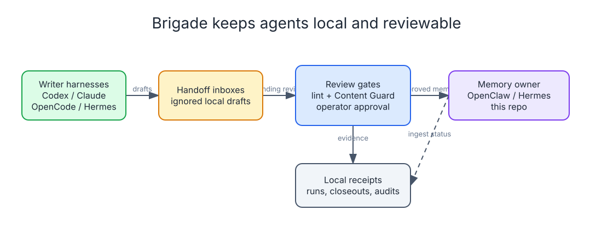

<p align="center">
  
</p>

# Brigade Technical Guide

This guide preserves the detailed command walkthroughs and operational notes that used to live on the project front page. The README stays short. Topic migration map: [readme-coverage](readme-coverage.md). Adjacent products: [comparison](comparison.md). Code map: [code-intelligence](code-intelligence.md). Memory Operations: [memory-operations](memory-operations.md).

<h1 align="center">Brigade</h1>

<p align="center">
  <strong>Run your agent brigade.</strong>
</p>

<p align="center">
  <em>Public-safe workspace bootstrap, memory handoffs, and publish guards for real agent setups.</em>
</p>

<p align="center">
  
  
  
  
</p>

<p align="center">
  <code>brigade</code> is a local operator-system CLI for agent workspaces.
  It bootstraps the workspace, runs bounded multi-agent work, routes scanner
  findings into reviewable queues, records release evidence, and keeps publish
  decisions manual.
</p>

## What this is

Mise en place means "everything in its place before the work starts."
In a kitchen, that is chopped mirepoix, clean pans, labels, and a station that does not make you hunt for salt mid-service.
For agents, it is the same idea: rules, memory, tools, handoff inboxes, publish guards, and routine verification already laid out before the session gets expensive.

This package lays down a clean starting point for an agent workspace or a repo that needs durable memory handoffs, local work receipts, scanner inboxes, portable tool review, repo-fleet evidence, and release gates.
It is meant for people running real tools, real docs, and real automation across OpenClaw, Claude Code, Codex, OpenCode, Antigravity, Pi, Cursor, Hermes, or a similar harness.

The cookbook explains the why. This package gives you the kitchen.

## Plain-English glossary

This README is dense, and a handful of words carry most of the weight. Learn these and the rest reads cleanly:

| Word | What it actually means |
|---|---|
| **harness** | An AI agent program: Claude Code, Codex, OpenCode, Antigravity, Pi, Cursor, OpenClaw, Hermes. |
| **operator** | You, the human running the agents. |
| **dogfood** | Brigade used on itself or another trusted repo. |
| **handoff** | A memory note an agent writes to be saved long-term. |
| **ingest / ingester** | Reading those notes and filing them into permanent memory. |
| **scanner** | An automation that goes looking for useful work (chat, backups, code). |
| **import / inbox** | A holding queue where found work waits for your review. |
| **promote** | Move an item out of the queue into a real task or memory note. |
| **receipt** | A local file logging that something happened, kept for audit and proof. |
| **closeout** | Marking something reviewed or done so it stops nagging you. |
| **gate** | A manual approval checkpoint; nothing risky happens without your yes. |
| **AFK** | Away from keyboard, a long unattended run the agent does solo. |
| **station** | A subsystem of Brigade (memory, security, tokens, pantry) with its own commands. |

Execution model: explicit invocation only. Brigade writes local files and review queues when asked. It does not publish, edit canonical memory, run a scheduler or daemon, run arbitrary commands, or touch remote servers on its own. Full boundary: [`docs/execution-model.md`](execution-model.md). That deliberate friction is what the rest of this doc keeps repeating.

## The design

One memory owner stays canonical.
That is typically OpenClaw or Hermes when present, otherwise `this-repo`.
Writer harnesses drop handoffs into their own inboxes, and the ingester scans all of them.



The ingester is intentionally conservative.
Safe card handoffs become cards.
Targeted updates append to the right file.
Ambiguous material gets kicked out for review instead of being trusted automatically.

For users running multiple agent homes, treat the owner workspace as the hub.
Remote or secondary workspaces can write handoffs into their own per-harness inboxes.
A trusted sync can pull those files into a staging inbox on the owner.
That keeps agents informed without creating multiple canonical memories.

Token-heavy terminal work gets the same treatment.
Make the wrapper explicit, make the escape hatch obvious, and tell every harness what is happening.
The Token Glace starter card documents Claude Code's PreToolUse wrapper path, Codex's hook setup, and the savings model.

## What you get

> **In plain terms:** the list below is everything Brigade can do today. Skim the bold labels; each one is a "station" documented in detail later. You do not need most of them on day one.

Brigade has grown from a bootstrap kit into a local control plane for agent work. The current public surface includes:

- Bootstrap and memory layout: sanitized `AGENTS.md`, safety, tool, identity, user, memory, rule, handoff, and harness files with a canonical memory-owner model.
- Multi-harness handoffs: `.claude/memory-handoffs/`, `.codex/memory-handoffs/`, `.opencode/memory-handoffs/`, `.antigravity/memory-handoffs/`, `.pi/memory-handoffs/`, `.cursor/memory-handoffs/`, `.aider/memory-handoffs/`, `.goose/memory-handoffs/`, `.continue/memory-handoffs/`, `.copilot/memory-handoffs/`, `.qwen/memory-handoffs/`, `.kimi/memory-handoffs/`, `.adal/memory-handoffs/`, `.openhands/memory-handoffs/`, `.grok/memory-handoffs/`, `.amp/memory-handoffs/`, `.crush/memory-handoffs/`, source coverage checks, linting, reconciliation receipts, issue imports, sync repair, and archive closeouts.
- Work loop: dogfood runs, work sessions, task ledgers, issue imports, acceptance criteria, verification receipts, review closeouts, sweep closeouts, and work closeout receipts.
- Scanner inbox: explicit local scanner registry, scanner runs, scanner sweeps, import validation, provenance checks, dedupe, dismiss-until-changed behavior, handoff promotion, and inbox hygiene.
- Daily driver: `brigade daily status/plan/review/run/closeout` plus approvals, resume, repair, unblock, protocol, telemetry, and hardening audits for one bounded local action at a time.
- Operator center: local status, activity, agent activity, reviews, templates, reports, report diffs, action queues, readiness closeouts, and wrapper-facing schemas.
- Release gates: release readiness receipts, CI deprecation checks, install-smoke receipts, release candidates, candidate audit and compare, candidate closeouts, manual-only publish plans, and schema contracts.
- Repo fleet: local repo discovery plans, repo health scans, fleet sweeps, reports, actions, action dispatch, context packs, release trains, train evidence, waivers, manifests, audits, and ready gates.
- AFK phase ledger: phase records, reports, closeouts, compares, action queues, sessions, checkpoints, recovery notes, risk, verification, privacy, handoff, progress, protocol, audit, gate, and release evidence.
- Portable tool catalog: tool discovery, contracts, call planning, approval queues, explicit script and local MCP execution, run receipts, replay candidates, checkpoints, runtimes, host-local policy, parity, packs, sync, and projection health.
- Shared skills: reviewed `SKILL.md` packs with metadata, provenance, linting, fingerprints, trust score, changelog, install history, diffs, portable packs, publish proposals, and one-command installation across Codex, Claude, OpenCode, Antigravity, Pi, Cursor, Aider, Goose, Continue, GitHub Copilot CLI, Qwen Code, Kimi Code, AdaL, OpenHands, Grok, Amp, Crush, OpenClaw, Hermes, and MCP-resource targets.
- Local producers: memory care, chat export sweeps, backup health, code review, context packs, project consolidation, learning candidates and replay, and security scans.
- Operator notifications: optional `agent-notify` status and setup planning for private Discord, Telegram, or Signal notifications. `brigade work brief` and related status surfaces may report readiness or suggest the station; no command sends unless the operator uses an explicit send action.
- Security and publish guards: content-guard integration, template audit, SARIF output, suppressions, accepted-risk closeouts, policy presets, prompt and instruction checks, MCP checks, supply-chain checks, and redacted reports.

The common rule is deliberate friction: Brigade writes local receipts and review queues, but it does not start daemons, mutate remotes, edit canonical memory, run arbitrary commands, publish releases, or auto-promote findings without an explicit operator command. See [`docs/execution-model.md`](execution-model.md).

### Agent activity

`brigade center activity --json` keeps its existing receipt list and adds a version 2 `agent_activity` section. Brigade run records are local authoritative observations. Codex and Cursor session files are best-effort observations: Center reads only a short head of each session file to derive a truncated task label (dated cwd folder name preferred, otherwise the first user prompt line) and an optional model id. Absolute paths, full transcripts, and environment values stay out of the payload. A missing source is shown as stale, never as completed. Missing task text renders as `Unknown task`.

The Agent Activity dashboard is visual-first: machine cards (one per configured host, plus cloud) group agent tiles, with the spreadsheet table retained as a secondary section. Completed items older than `completed_window_seconds` (configurable in the sources file, default 3600) collapse behind a per-card expander. The Cloud card is fed by the local cloud dispatch registry (`brigade run cloud status`); when empty it shows the #890 placeholder, and when the registry has entries it renders real cloud rows.

Use `brigade run cloud launch` to start Cursor Cloud or Jules work from a bounded private `--prompt-file`. Credentials come from the existing environment (`CURSOR_API_KEY` / `CURSOR_CLOUD_API_KEY` / `BG_AGENT_API_KEY`, or `JULES_API_KEY`) and are never CLI arguments. A missing key or unreadable prompt file makes no provider call. On a successful hub bind the command registers provider IDs, the prompt hash, the expected artifact, and the private lease holder used later by `sync`; launch JSON and `LaunchResult` never include that holder or the prompt text. `autoCreatePR` stays off unless `--auto-create-pr` is passed. Use `brigade run cloud register` / `adopt` (parser group `brigade run-cloud`) to record dispatches that were started outside this command. Codex Cloud register-on-dispatch is automatic from `codex-cloud` seats. Cursor Cloud uses the Agents API v1: `POST /v1/agents` accepts a client-supplied `agentId` in `bc-<uuid>` form for idempotent create; the adapter generates one per launch and sends it with `{"agentId": ..., "prompt": {"text": ...}, "repos": [{"url": ...}], "autoCreatePR": ...}`. `repos[].url` must be an absolute `https://github.com/owner/repo` URL; `owner/repo` is normalized and unsafe/non-GitHub strings are rejected before hub admission or provider mutation. The response is `{"agent": {"id", "latestRunId", ...}, "run": {"id", "status", ...}}`; both identifiers are bound to the local lease. A provider HTTP 4xx/5xx releases the unbound lease as `submit-failed`; a transport timeout, `OSError`, `TimeoutError`, or malformed/oversized response after POST is ambiguous, so the lease is held and the result reports `uncertain` with the client `agentId` preserved for later adoption. `GET /v1/agents` returns `items`. Run active states are `CREATING`/`RUNNING`; terminal states are `FINISHED`/`ERROR`/`CANCELLED`/`EXPIRED`. Cursor cloud remains an unwired source until a `CURSOR_API_KEY` / `CURSOR_CLOUD_API_KEY` / `BG_AGENT_API_KEY` exists, and when wired the status payload includes sanitized Cursor inventory keyed by agent id. Claude Cloud launch is disabled-by-policy; `claude_cloud` only parses local `claude agents --json --all` inventory, which is a local/background session list, not a documented cloud-task registry. It supports `sessionId` as the canonical id and `cwd` as the workspace while remaining backward-compatible with `id`/`workspace`/`status`. Local Claude inventory is not merged into cloud provider_tasks or Cloud Workers, and absolute `cwd` paths stay out of hub/dashboard payloads. Claude Cloud remains untracked/disabled until a structured bindable provider surface exists. `brigade run cloud status --json` joins the registry against best-effort provider state and GitHub branch/PR ground truth. `brigade run cloud sync` reads hub leases from the fleet client when a hub is configured and releases matching terminal leases; when no hub is reachable it stays purely observational and does not invent Needs You rows. `brigade run cloud sweep` writes a receipted report only. Nothing is deleted automatically. Stale READY entries (threshold `stale_ready_hours`, default 6) surface in `brigade work brief`.

Jules Cloud uses the alpha `https://jules.googleapis.com/v1alpha` API with `X-Goog-Api-Key` authentication and a zero-runtime-dependency stdlib `urllib` adapter. Launch resolves the target repository first: `GET /sources` is a read-only probe whose rows are matched exactly (case-insensitively) on `githubRepo.owner` and `githubRepo.repo`, and the starting branch must be one the source lists, or else the source default, `main`, or a sole listed branch. If the repository is not connected, or the branch cannot be validated, there is no hub admission and no provider mutation. Only then does `POST /sessions` send `{"prompt": ..., "title": ..., "sourceContext": {"source": "sources/<connected-id>", "githubRepoContext": {"startingBranch": ...}}, "requirePlanApproval": true}` using the exact connected `source.name` such as `sources/github-owner-repo`; the literal `USER` is not a valid source. `automationMode` is omitted unless `autoCreatePR` is explicitly requested, in which case it is validated to `AUTO_CREATE_PR` and nothing else. The low-level `create_session` takes an already-validated `source_name` and `starting_branch` and does no discovery of its own; it requires a top-level `id` in the create response, which is bound immediately to the local hub lease via `fleet_client.bind_cloud`. The adapter never auto-approves plans, deletes sessions, pulls or applies patches, or creates PRs by default. A provider HTTP 4xx/5xx after `POST` releases the unbound lease as `submit-failed`; a transport timeout, `URLError`, `OSError`, `TimeoutError`, or malformed/oversized/id-less response is ambiguous, so the lease is held, exactly one `POST` is ever issued, and the result reports `uncertain` for later adoption. `GET /sessions` and `GET /sessions/{id}/activities` are bounded paginated reads (`pageSize` 1-100, at most 20 pages and 1000 items); `GET /sessions/{id}` reads a single session; `POST /sessions/{id}:approvePlan` sends an empty JSON body and accepts an empty success body. Session ids are rejected when empty or when they contain a path separator, and every path segment is percent-encoded with `safe=""`. A `base_url` override is accepted for tests and must be `https`, or `http` on loopback. Jules states are mapped to the common cloud state space: `QUEUED`/`PLANNING`/`AWAITING_PLAN_APPROVAL`/`AWAITING_USER_FEEDBACK`/`IN_PROGRESS`/`PAUSED`/`STATE_UNSPECIFIED` hold capacity, while `FAILED`/`COMPLETED` are terminal. Inventory is a positive signal only: a failed fetch or a truncated page walk simply omits ids, and an absent id is never read as terminal, so unknown or truncated inventory cannot release capacity. The tracker authority is `alpha REST` when `JULES_API_KEY` is set and `unwired` otherwise. Every provider payload is sanitized to ids, normalized state, bounded RFC 3339 timestamps, the source owner/repo/branches needed for matching, a validated `https://jules.google.com/...` session URL, and a validated `https://github.com/owner/repo/pull/N` URL; prompts, titles, descriptions, activity payloads, artifacts, patches, shell output, raw response bodies, and credentials are dropped. Hosted lease labels are generated as `<provider>:<owner>/<repo>@<12-hex prompt digest>` (`cloud_tracker.lease_label`, capped at 120 characters), so neither Jules nor Cursor ever persists prompt text as a label.

### Grok Bot local job queue

`brigade run cloud grokbot` creates a private local queue contract. It does not call a live provider, commission Grok Bot, or add a synchronous roster seat. The Brigade package now includes a role-scoped MCP listener for that queue. It runs as its own process while queue authority remains in the selected local Brigade target. See [Grok Bot MCP listener](grokbot-mcp.md) for installation, operations, and Cloudflare boundaries, and [Grok Bot operating guide](grokbot-operating-guide.md) for the pack reference, queue actor authorization, lifecycle semantics, finding delivery, and Bot configuration.

Queue data lives below `.brigade/cloud/grokbot/` with private file permissions. Submit a complete task envelope from a JSON file with `enqueue --spec`; do not put task instructions, verification commands, credentials, headers, environment values, or artifact bodies on the command line. The envelope identifies a bounded role, repository, base ref, owned paths, artifact kind, and timeout. Completion reads a second JSON file with `complete --artifact`; it accepts artifact references only, such as a GitHub draft-PR URL and branch, a branch and commit, or a report path and SHA-256.

Jobs move through `queued`, `claimed`, `running`, `completed`, `failed`, `expired`, and `canceled`. A bot claims work with its own opaque bot and lease IDs plus a bounded lease duration. The same claim can be retried safely, and `renew` extends the current unexpired lease within the job deadline. `cancel` ends queued work immediately or records a cancellation request for a live lease. The lease holder uses `ack-cancel` to finish that cancellation. `expire` never requeues a job; it finalizes a job after its deadline or lease expires.

Only safe projections are printed by `status` and mutation commands. They include job identity, state, timing, task hash, and artifact metadata, but never the envelope's `instructions` or `verification_commands`. The one exception is the authenticated worker MCP claim: after a successful role-matching claim, the worker receives the bounded validated envelope as its execution context so it can execute the task without the instructions being repeated in chat. The CLI `claim` command keeps returning the redacted projection.

```bash
brigade run cloud grokbot enqueue \
  --target . \
  --spec .brigade-inputs/grokbot-task.json \
  --idempotency-key issue-1130-scout

brigade run cloud grokbot claim \
  --target . \
  --job-id grokbot-0123456789abcdef01234567 \
  --bot-id scout-01 \
  --lease-id lease-01234567 \
  --lease-seconds 300

brigade run cloud grokbot status --target . --json
```

`brigade run cloud grokbot reconcile-reports --target QUEUE --owner OWNER` previews completed Repository Scout report jobs. Under hub authority it lists those jobs from the hub with the operator or feed identity and pairs each with the local artifact and snapshot by `job_id`. `--apply` writes at most `--limit` deterministic Memory Handoff drafts directly into the canonical owner's `memory/handoff-inbox` for review. Preview writes nothing. Report text is never printed. See [Grok Bot MCP listener](grokbot-mcp.md#report-reconciliation).

For a remote T3 controller journal already available locally, configure an alias and a repo-relative journal path in `.brigade/center/agent-activity-sources.json`:

```json
{
  "local_host": "workbench",
  "completed_window_seconds": 3600,
  "hosts": ["workbench", "trainer"],
  "host_kinds": {"workbench": "workstation", "trainer": "gpu"},
  "sources": [{"provider": "t3", "host": "trainer", "journal": "fleet/t3-controller.jsonl"}]
}
```

`hosts` lists the machine cards the board always renders, and `host_kinds` picks each card's glyph (`workstation`, `gpu`, `desktop`, `server`, `cloud`). Both are optional: with no `hosts` entry the board shows one card for this machine, named by `local_host` or the system hostname, plus a card per host that actually appears in the records and an always-present `cloud` card (with a placeholder when cloud tracking is not wired).

Each journal row may provide `state`, `started_at`, and `last_updated_at`. Center uses generic provider and task labels for controller data, so untrusted journal text cannot appear in the payload. It never follows that path outside the selected workspace, and it does not attempt network discovery or control remote agents.

Browse the public template index in [`templates/`](../templates/).
The installable source files live under `src/brigade/templates/`; root workspace files are local dogfood state and stay ignored.

See [`ROADMAP.md`](../ROADMAP.md) for the daily-driver, scanner inbox, chat-surface scanner, and memory-card decay roadmap. The active phase queue for roadmap completion hardening is tracked in [`docs/phase-61-100-plan.md`](phase-61-100-plan.md).
The production-hardening queue for the daily operator system is tracked in [`docs/phase-115-164-plan.md`](phase-115-164-plan.md).

Long unattended phase work is audited through the local phase execution ledger described in [`docs/phase-execution-ledger.md`](phase-execution-ledger.md). Future multi-phase work is not complete unless each phase has ledger evidence or an explicit deferral.
The next simplification review is scoped in [`docs/simplification-audit-plan.md`](simplification-audit-plan.md), with current findings in [`docs/simplification-audit-report.md`](simplification-audit-report.md); use those before applying any automated code simplifier to Brigade.
Phase ledger closeouts let an operator mark completed phase evidence as reviewed, deferred, blocked, or archived, and stale unreviewed completed phases surface in doctor output.

Phase execution sessions group a declared AFK range into one local record with current phase, status, commit and test counts, report references, closeout state, and the next recommended command.
Session next/resume commands identify the safest next local command and record resume metadata without executing hidden work.
Session checkpoints record local recovery points with safe summaries, notes, current next-step state, and suggested commands without executing the suggested command.
Session checkpoint list/show/compare commands inspect those local recovery points and detect stale saved next-step state without executing their suggested commands.
Session checkpoint import commands route blocked or stale checkpoint issues into the normal work inbox as deduped local tasks.
Session next/resume output includes the latest checkpoint summary and issue counts when checkpoint recovery metadata exists.
Session recovery notes record safe summaries, notes, and evidence labels for AFK resume context, with list/show/closeout commands and activity timeline entries.

Daily planning can surface checkpoint issues as local candidates that point at checkpoint import commands instead of hiding AFK recovery drift.
Daily run can also write one local phase session checkpoint as its single bounded action when the selected session needs safe AFK recovery metadata.
Session risk output summarizes next-step blockers, checkpoint drift, open recovery notes, and phase doctor issues in one read-only view.
Session verification output rolls up expected, passed, failed, skipped, and deferred verification across a whole AFK session range.
Session privacy output rolls up clean, blocked, and missing privacy checks across a whole AFK session range.
Session handoff output rolls up linted, drafted, failed, deferred, and missing handoff evidence across a whole AFK session range.
Session report bundles collect the phase records, checks, actions, imports, commits, tests, and blockers into local Markdown and JSON evidence.

The daily driver can surface active phase sessions and run exactly one safe session step, such as building a session report or writing session closeout metadata.
Release and operator review surfaces include phase session state so stale or unreported AFK work blocks publish review visibly.
Release doctor also reports blocked or stale phase-session checkpoint evidence before publish review.
Release candidate evidence includes latest phase-session checkpoint and compare summaries for later review.
Center reviews include blocked or stale phase-session checkpoint items with local inspect commands.
Work brief includes the latest phase-session checkpoint and compare summary in the phase ledger block.
Phase action planning can turn blocked or stale phase-session checkpoint issues into local phase actions.
Session checkpoint archive moves old recovery points into local JSONL metadata so they stop driving latest-checkpoint health.
Session report bundles include a recovery section with checkpoint and recovery-note summaries.

Gated operator-suite examples below assume `brigade extras on` has been run once. For one-off invocations, prefix the command with `BRIGADE_EXTRAS=1`.

`brigade work phases evidence add` appends local files, tests, report ids, handoff paths, and notes to a phase record without running commands.
`brigade work phases verify plan/record` keeps expected verification and recorded outcomes visible without executing tests.
`brigade work phases reconcile` checks recorded commit and push evidence against local git state without changing git.
`brigade work phases privacy` scans phase evidence for protected private or reference values and records only redacted finding summaries.
`brigade work phases handoff` drafts and optionally lints a local Memory Handoff from phase evidence, then records the draft as phase evidence without editing canonical memory.
`brigade work phases session activity` gives a chronological read-only ledger for AFK session starts, resumes, phase completions, tests, commits, reports, actions, imports, closeouts, and handoff drafts.
`brigade work phases session progress` shows read-only completion percentage, blockers, current phase, next command, test coverage, commit and push coverage, and estimated remaining local steps.
`brigade work phases session import-issues` routes unresolved AFK session blockers into the work inbox with phase-session provenance and dedupe.
`brigade work phases goal scaffold` writes a local editable `/goal` draft from ledger state, session evidence, blockers, and roadmap references without copying private evidence.
`brigade work phases session gate` is the final read-only AFK claim check, and release evidence includes its latest result.

Phase ledger compare checks make it clear when local HEAD, referenced files, reports, or doctor issue counts drift after a phase is recorded.
Phase ledger action queues turn those ledger issues into local metadata-only next steps without executing commands.
The daily driver can select those phase-ledger actions when they block AFK or release completion, then start one action or build one phase report as a bounded local step.

Release readiness and candidate compare include phase closeout and report references so publish review can catch unreviewed or stale phase evidence.
Phase report closeouts let an operator review, defer, supersede, or archive a generated phase report without changing its evidence.
Phase report compare checks saved report bundles against current ledger state before relying on them.
Work brief and center status include open phase action counts so ledger follow-ups stay visible in the daily loop.

Open phase actions can be imported into the normal work inbox when they need a reviewed task.
Release candidate evidence includes the latest phase report compare summary.
The current AFK ledger hardening tranche is described in [`docs/phase-226-250-plan.md`](phase-226-250-plan.md).
See [`docs/workflow-rules.md`](workflow-rules.md) for the public-safe repo workflow rule templates installed under `rules/`.

## What you do not get

- private hostnames, IPs, account IDs, or personal details
- live auth profiles or OAuth tokens
- cron jobs that post publicly by default
- destructive automation or write-enabled integrations without explicit opt-in

## Install

```bash
pipx install brigade-cli
```

Or, to track `main`:

```bash
pipx install git+https://github.com/escoffier-labs/brigade
```

The workspace config directory is `.brigade` (older `.solo-mise` installs are still read).

## Quick path

Run `brigade init` with no flags for the interactive picker:

```bash
brigade init --target ~/agent-kitchen
```

For CI or scripts, pass flags directly:

```bash
brigade init --target ~/agent-kitchen --depth workspace --harnesses claude,codex,openclaw
brigade init --target ./repo --depth repo --harnesses codex
brigade init --target ./repo --harnesses none           # generic install
```

Once installed, `brigade doctor` verifies the wiring and `brigade status` reports over the station registry.
For machines that ingest handoffs from multiple repos, copy `.brigade/handoff-sources.example.json` to `.brigade/handoff-sources.json` and list the repo roots and writer inboxes the canonical ingestor scans.
`brigade handoff doctor` reports pending `.claude/memory-handoffs/`, `.codex/memory-handoffs/`, `.opencode/memory-handoffs/`, `.antigravity/memory-handoffs/`, `.pi/memory-handoffs/`, `.cursor/memory-handoffs/`, `.aider/memory-handoffs/`, `.goose/memory-handoffs/`, `.continue/memory-handoffs/`, `.copilot/memory-handoffs/`, `.qwen/memory-handoffs/`, `.kimi/memory-handoffs/`, `.adal/memory-handoffs/`, `.openhands/memory-handoffs/`, `.grok/memory-handoffs/`, `.amp/memory-handoffs/`, and `.crush/memory-handoffs/` files that are not covered by that local source list.
Run `brigade handoff lint` before ingesting pending handoffs when you want to catch action/target mismatches early.
`brigade handoff lint` also reports advisory standalone-readability warnings in `Durable facts` and `Suggested card content`: bare pronouns at the start of a bullet, deictic pointers such as `that file`, and relative dates such as `last week`. Findings never fail the lint by default; pass `--strict` to promote them to lint failures for that command only.
If your ingestor writes a latest-run log, set `ingestor.last_run_log` in that local config so the doctor can warn on stale runs, skipped or malformed handoffs, failed ingests, unreachable sources, and warning summaries hidden behind no-reply cron output.
Use `brigade handoff issues` to group those warnings with repair guidance, then `brigade handoff sync-issues` to import new issues and close stale local handoff tasks/imports once the latest scan no longer reports them. Handoff source coverage issues carry stable source keys and fingerprints, so dismissed uncovered-inbox repairs stay dismissed until the pending coverage state changes.
Use `brigade work import issue-repairs` when issue-backed local tasks need review because `gh` is unavailable, issue metadata is incomplete, a remote issue is closed, or stored issue context is stale. The command creates local repair imports only and never mutates GitHub.

## Run a brigade

> **In plain terms:** you give one plain-language task, a lead agent ("orchestrator") plans it and farms pieces out to worker agents through their own CLIs, then the lead stitches the results into one answer. It is deliberately bounded: two lead calls plus the planned worker calls, so it cannot run away. ("Aboyeur" is the kitchen expediter who calls out orders.)

`brigade run "<task>"` is the aboyeur path.
One orchestrator plans the work, Brigade dispatches assigned workers through their own CLIs, then the orchestrator synthesizes the final answer.
It is intentionally bounded: two orchestrator calls plus the worker calls in the plan.

Hard run-budget ceilings (`wall_clock_seconds`, `worker_dispatch_count`) apply
only when a run persists `run_budget` or `verification_contract.budget` (#593).
Operators can supply a versioned JSON declaration with `--run-budget PATH` on
`brigade run`, dogfood, and model-trial run or resume commands. Starts without
that file stay unbounded for backward compatibility. Per-agent
`timeout_seconds` is not a run-budget declaration. Aggregate and split token
budgets on a verification contract stay observed-only. Model, tool, token, and
cost dimensions require an adapter-owned enforcement boundary. External
activity and cloud-status observations are best-effort and do not invent hard
run limits on their own.
See [`receipt-schemas.md`](receipt-schemas.md) (run budget lifecycle) and
[`work-closeout.md`](work-closeout.md).

Plans may include integer `stage` values. Assignments in the same stage run in parallel, stages run from lowest to highest, and later-stage workers receive earlier-stage worker results in their prompt. Plans that omit `stage` remain compatible and run as stage 1.

When `--cwd` is a git worktree, write runs refuse to start on a dirty tree
unless `--allow-dirty` is passed; dry, read-only, and `--worktree` runs are
exempt, and Brigade's own `.brigade/` state never counts as dirty. Every run
takes a local `.brigade/run.lock` (stale locks from dead processes are
replaced automatically) so two runs do not mutate the same checkout at once.
Use `--worktree` to run agents in a detached checkout from `HEAD` under
`~/.cache/brigade/worktrees/`; Brigade writes the resulting diff to
`changes.patch` in the run artifacts and leaves the original checkout
unchanged. Successful runs and clean non-success runs remove the temporary
checkout; failed, timed-out, canceled, and incomplete runs with uncommitted
changes retain it for recovery. The next successful `--worktree` run for the
same target prunes older retained entries. Terminal output shows the
`changes.patch` file count and, when a checkout is retained, its path.
`--worktree` requires run artifacts, so it cannot be combined with
`--no-artifacts`.

Start with a roster:

```bash
brigade roster init
brigade roster doctor
```

`roster init` refuses to scaffold when a roster already applies to the target
through fallback, either the parent clone's roster (when the target is a linked
git worktree) or the user roster at `~/.brigade/roster.toml`, because the
minimal starter would shadow every seat that roster configures. Pass `--force`
to scaffold a workspace roster anyway.

Pass `--review-model <id>` to add a reviewer seat pinned to a different model than the coder (for example `brigade roster init --review-model gpt-5.6-terra`). A same-model reviewer tends to agree with the coder's narration; pinning the review seat to another model makes that independence structural, and `roster doctor` validates the pin like any other seat.

That writes `.brigade/roster.toml` with a Codex orchestrator, a Codex coder, and an optional Ollama local researcher:

```toml
orchestrator = "chef"

[agents.chef]
cli = "codex"
role = "Plan the work, choose useful workers, and synthesize the final answer."

[agents.local_researcher]
cli = "ollama:llama3.2:3b"
role = "Research locally and summarize useful findings."
timeout_seconds = 300

[agents.coder]
cli = "codex"
role = "Make precise code changes and report what changed."

[limits]
max_workers = 4
timeout_seconds = 600
allow_models = ["codex", "ollama:*"]
sandbox = "workspace-write"
```

Edit the roles, CLI refs, and timeouts to match the tools on your machine.
Brigade never auto-pulls Ollama models: dispatch to an `ollama:<model>` seat
fails with a clear message unless the model is already pulled locally, because
a bare `ollama run` silently downloads the model first (tens of gigabytes for
a large one). Pull the model yourself (`ollama pull llama3.2:3b`) or name one
`ollama list` already shows; `brigade roster doctor` warns about missing ones.
`limits.timeout_seconds` is the default per-agent timeout.
`agents.<name>.timeout_seconds` overrides it for one agent.
`agents.<name>.read_only_capable` is an optional boolean that defaults to `true`.
Set it to `false` when a seat cannot return usable output under `--read-only`.
The chef sees the value in its planning prompt, plan validation rejects an incapable
assignment during read-only runs, and `--worker` rejects the seat before run artifacts
are created. The field does not restrict writable runs.
`limits.sandbox` is optional. When set to `read-only`, `workspace-write`, or
`danger-full-access`, `brigade run` uses it as the native Codex sandbox mode
unless the run also passes `--sandbox`.

### Pin a model per agent

`agents.<name>.model` pins the model a CLI agent runs, instead of relying on that CLI's
global default. Brigade passes it through the adapter (`claude --model <id>`,
`codex exec -m <id>`, `grok -m <id>`, and so on); pinning is supported for the `claude`,
`codex`, `grok`, `opencode`, `pi`, `kimi`, `cursor`, and `antigravity` adapters. Each
adapter's model flag is placed where that CLI expects it. `ollama:<model>` refs already
name their model, including cloud models such as `ollama:qwen3-coder-next:cloud`. An
unsupported adapter with a `model =` pin fails `brigade roster doctor` before any run
dispatches, so a bad pin never reaches a worker. The pinned model is recorded in each
run's `roster.json` artifact.

`brigade roster doctor` also checks live inventory for direct Cursor and Grok pins and
for `ollama:<model>` refs. `exact` means the configured ID appears verbatim, or a
parameterized Cursor ID has an advertised base ID that appears verbatim. Ollama also
treats an omitted `:latest` tag as the listed `<model>:latest` ID.
`fuzzy-resolved` means the exact ID is absent but the harness lists the same model family
and version under a recognized namespace, effort, or fast suffix. `missing` means no such
live ID exists. `unavailable` means the inventory command failed or its output could not
be parsed. Every non-exact state is a warning because authentication, network access, and
provider inventory can fail transiently.

Ollama models must still be present in `ollama list`. For a listed `:cloud` model, doctor
also runs the read-only `ollama show <model>` probe so a retired remote model is warned
even when its cached manifest remains in the local list. Doctor never pulls or invokes a
model while checking inventory.

The classic split is a strong planner orchestrating a cheaper executor: the architect
plans and synthesizes, the builder does the token-heavy work, and the run handoff is the
record you judge.

```toml
orchestrator = "architect"

[agents.architect]
cli = "claude"
model = "claude-fable-5"
role = "Plan the work, choose useful workers, and synthesize the final answer."

[agents.builder]
cli = "codex"
model = "gpt-5.5"
role = "Make precise code changes and report what changed."
```

Use a model id your CLI account supports; ChatGPT-account codex takes `gpt-5.5`, while
API-backed setups may use other ids. The loop: `brigade run "<task>" --handoff`, review
the handoff and artifacts, refine the task, run again. Each orchestrator call is
stateless; durable context lives in the repo and the handoffs.

Then run:

```bash
brigade run "review this repo and suggest the next implementation step"
brigade run "plan the migration" --dry-run
brigade run "review this repo" --show-plan
brigade run "review this repo" --verbose
brigade run "review this repo" --cwd /path/to/repo
brigade run "review this repo" --handoff
brigade run "review this repo" --read-only
brigade run "review this repo" --read-only --inspect
brigade run "make the change" --allow-dirty
brigade run "make the change" --worktree
brigade run "make the change" --detach
brigade run "serialize behind an active run" --wait=120
```

The examples above all drive the same `brigade run` command to show its main flags. Brigade's full surface (work loop, scanners, handoffs, tools, release gates, repo fleet, and more) is documented section by section below. For the complete, auto-generated list of every command, see [`docs/command-inventory.md`](command-inventory.md), and regenerate it with `BRIGADE_EXTRAS=1 brigade roadmap commands --write`.

Common `brigade run` flags:

- `--dry-run` prints planned assignments as JSON and stops before worker dispatch.
- `--detach` starts the run in a child process, writes child output to `detached.log`, and returns after `run.json` appears. The child takes over a new session (`start_new_session` on POSIX, job-breakaway on Windows) and does not depend on the launching session staying alive.
- `--wait[=SECONDS]` waits for the target's active run lock instead of failing immediately. A bare `--wait` waits up to 600 seconds. Without this flag, lock conflicts remain fail-fast.
- `--no-fleet-claim` skips the fleet hub repo claim and relies on the local run lock alone (logged once). The escape hatch when a claim left by a crashed run blocks the repo; `brigade fleet claims --release <target>` frees such a claim (`--force` for another node's).
- `--allow-dirty` bypasses the default dirty-git-worktree guard.
- `--worktree` runs agents in a detached git worktree and captures `changes.patch`.
- `--show-plan` prints assignments before a normal run.
- `--verbose` prints the plan, worker statuses, and synthesis status.
- `--worker <seat>` sends the full task directly to one non-orchestrator roster seat, skipping planning and synthesis.
- `--cwd` sets the working directory for agent CLI calls.
- `--handoff` writes a Memory Handoff for a successful non-dry run.
- `--inspect` prints the same artifact summary as `brigade runs show`.
- `--read-only` tells the orchestrator and workers to inspect and recommend only.
- `--sandbox {read-only,workspace-write,danger-full-access}` overrides the native Codex sandbox mode from the roster.

### Run journal authority and upgrade behavior

Every new run directory records `lifecycle_journal_requested: true` and
`run_journal_authority_requested: true`. Once the run holds its matching lock,
`events/lifecycle.jsonl` becomes the lifecycle authority and `run.json` stays the
`brigade.run.v1` compatibility snapshot. There is no environment setting that
disables journal authority for a new run.

Existing run directories are classified from their stored artifacts. A run whose
`run.json` lacks both durable request fields remains snapshot-only, even when a
newer Brigade release records another start attempt. Do not add the fields or
create `events/lifecycle.jsonl` by hand. Keep legacy runs on the snapshot path, or
start a new run after upgrading.

The compatibility snapshot keeps schema version 1 and changes additively. Readers
must ignore unknown keys. A paused approval still projects the known nonterminal
status `running`. `approval_reference.decision_state` carries the pause state for
new readers. This lets the previous release inspect `run.json` during the
compatibility window, but it must not resume or write a journal-authoritative run.
Upgrade the writer before using `runs recover` or `runs resume` on one of those
runs.

Use `brigade runs show <run>` or `brigade runs watch <run>` for inspection. Use
`brigade runs export <run> --output <archive-dir>` to pack a portable
`brigade.work-run` archive (`work-run.json` + `payload/`),
`brigade runs validate-archive <archive-dir>` to check the envelope and digests,
and `brigade runs import <archive-dir>` to copy a validated payload into
`.brigade/runs/`. Export strips private recovery-checkpoint bodies; v1 import is
inspection-oriented and does not claim resume support. See
`docs/receipt-schemas.md` (`brigade.work-run`) and
`schemas/work-run.v1.schema.json`. Use
`brigade runs recover <run>` when the snapshot is missing, corrupt, or behind a
verified journal checkpoint. Recovery validates the bounded event chain and
checkpoint before replacing `run.json`. If rollback leaves an older Brigade
unable to interpret a journal event or projector version, stop that writer and
roll forward. The append-only journal format is a one-way storage boundary.

Record a final human decision with `brigade run approve <run-id> --decision
allow|deny|hold`. Brigade signs the final tree and matching verify-receipt
digests, appends the decision to the lifecycle journal, and shows the
`brigade.sod.v1` segregation-of-duties checks. `brigade receipts verify` checks
the signature, signed subjects against current evidence, expiry, approver and
requester principal/keyid comparisons when recorded, the workspace-default-key
comparison, and event ordering. It does not establish custody beyond those
recorded comparisons. A valid signature proves possession of the trusted key,
not that a person read every changed line or understood every verification
result. Later verify receipts are allowed; missing signed receipts or a changed
live tree are reported as non-exit-changing `APPROVAL-STALE`.

Use `brigade runs reap --cwd /path/to/repo` to terminalize local runs whose
recorded owner process is gone. Reap writes `status: orphaned` and a dirty-file
count (filenames stay off the receipt) through the same run.json writer every
other status transition uses, under the run lock it claims from the dead owner.
A run enrolled in lifecycle journaling therefore also gets a recovery
checkpoint paired with a `run.orphaned` event, so the Hub row can close and
`brigade doctor` stays clean; a legacy snapshot-only run is left snapshot-only
rather than migrated. It does not rewrite Hub history: `brigade fleet
status --all` ages silent nonterminal rows to display-only `run.stale` after
24h, separate from the 30-minute live-status window. `brigade work brief`
lists orphaned runs and the recorded dirty count.

Use `brigade runs prune-worktrees --target /path/to/repo` to list Brigade-created
detached worktrees that are safe to remove: clean, branch-backed, and older
than the `--older-than` threshold (default 14 days). The command is a dry run
by default; pass `--apply` to actually delete them. Worktrees that are dirty,
have a detached HEAD with unreachable commits, or are too young are reported as
kept with their reasons. Non-Brigade worktrees under the same directory are
ignored and never touched.

`brigade runs resume <run>` also handles an app-server run whose owner exited
after dispatch began but before `worker-results.json` was aggregated. After it
acquires the normal run lock, Brigade reconstructs only the active-stage worker
thread coordinates from the already-flushed app-server event streams, records
the missing terminal failure through the lifecycle journal, and resumes those
threads. If no durable thread coordinates exist, resume fails cleanly without
calling the provider. It never guesses a thread or treats a live run as
interrupted. Multi-stage app-server runs interrupted while `active_stage` is
greater than 1 cannot be salvaged this way when earlier-stage worker results
were never persisted. Resume fails closed before provider construction instead
of synthesizing from partial stage output. A successful resume refreshes
`finished_at` and `duration_seconds` to the post-resume completion time rather
than retaining the pre-resume owner-exit timestamp. When the original run
requested `--handoff`, resume writes the Memory Handoff through the same
`write_run_handoff` path the orchestrator uses and records the path on
`run.json`. A timed-out direct worker finishes as `status: timeout` and an
interrupted one as `status: canceled`, matching the orchestrator finish path.
Resume clears each worker's prior `failure_phase` before the retry so a new
failure is not labeled with the earlier phase.

If the approved action completed but the process exited before recording
`approval.consumed` and `run.resumed`, run `brigade runs resume <run>` again.
Brigade verifies that the redeemed claim belongs to the same run and still
matches the stored approval fingerprints. For a Daily action, it also requires
the lock-bound completion reference to match the exact successful receipt under
`.brigade/daily/runs/`. A missing, failed, or changed receipt fails closed. After
those checks, Brigade retains the source-store lock while it records only the
missing journal facts and refreshes `run.json`. Review changes wait for that
transaction and cannot rewrite a consumed Daily approval or completed Tool
call. Recovery does not consume the approval or run the action again. A
redeemed claim owned by another run still fails closed.

For `codex` agents, `--read-only` also passes `codex exec --sandbox read-only`.
Combine `--sandbox` with `--read-only` to keep prompt-level read-only rules while overriding native Codex sandbox behavior. This override does not weaken adapters whose read-only flag takes precedence, including Cursor plan mode, Antigravity's sandbox, Kimi's plan mode, Aider's dry run, and Codex Cloud's remote isolation. Brigade's warning follows the command each adapter will execute.

Direct worker runs still write normal run artifacts. The synthetic `plan.json`
contains one assignment with the full task text, `worker-results.json` records
the selected worker output, `final.txt` is that worker's text, and
`synthesis.json` is marked with `mode: direct-worker`.

Direct CLI seats may declare per-seat environment overrides in their roster entry. Values
whose keys end in `_REF` are read from the named parent environment variable and injected
under the key without `_REF`. To read a systemd-style generated environment file instead,
use `env-file:/absolute/path#VARIABLE`; Brigade reads only `VARIABLE=VALUE` records, ignores
blank and comment lines, and never evaluates file contents. An unavailable file or variable
fails dispatch with `env-ref-missing`. After execution, Brigade replaces every exact nonempty
resolved override value in returned text, detail, stdout, and stderr with `[TARGET_NAME]`
before run logs or receipts are written. This bounded replacement covers only values
resolved for that seat; it is not a heuristic scan of the parent environment or historical
logs. Resume revalidates stored environment tables before any synthesis dispatch.

Direct CLI seats may also set `command` to a non-empty list that replaces the adapter executable
and inserts fixed prefix arguments before Brigade's normal adapter arguments. Brigade resolves
only the first list item as the executable and executes the list directly, never through a shell.
This is useful when a provider supplies a native executable plus a script entry point instead of
one native CLI binary.

On Windows, Cursor's `cursor-agent.cmd` is a PowerShell shim, not a native executable, so Brigade
will reject it. Point a direct Cursor seat at the `node.exe` and `index.js` in the installed Cursor
Agent version directory instead:

```toml
[agents.cursor_worker]
cli = "cursor"
command = [
  "C:/path/to/cursor-agent/versions/<version>/node.exe",
  "C:/path/to/cursor-agent/versions/<version>/index.js",
]
role = "Implement the assigned change."
```

The usual Cursor model pin and `-p` arguments remain supplied by the `cursor` adapter. Run
`brigade roster doctor` after setting the command to confirm that it resolves the native `node.exe`.

Detached runs require artifacts, so `--detach` cannot be combined with `--no-artifacts`.
It also refuses `--dry-run` and `--inspect`, because the parent process exits before it can print a plan or inspect final artifacts.
Use `brigade runs watch <run>` to follow a detached run from its artifacts:

```bash
brigade runs watch latest --cwd /path/to/repo
brigade runs watch <run-id> --cwd /path/to/repo --json
```

When a run uses the Codex app-server transport, `run.json` records a temporary `control_socket` while workers are active.
Use it to send live control to active worker turns:

```bash
brigade runs steer latest coder "narrow this to the failing test"
brigade runs interrupt latest coder
brigade runs interrupt latest
```

`runs steer` requires a worker name and text. `runs interrupt` accepts an optional worker; without one, it interrupts every active worker turn.
Both commands are local Unix socket requests. They refuse exec-transport runs, completed runs whose socket has been cleaned up, and app-server runs that have no active matching turn.

The `cli` values are adapters for installed command-line tools:
`codex`, `claude`, `opencode`, `antigravity`, `pi`, `cursor`, and `ollama:<model>`. Brigade shells out to those tools and keeps no provider keys.
A `codex-cloud:<env-id>` seat is different: it submits the task to Codex Cloud with `codex cloud exec`, polls `codex cloud status` until the task reaches a terminal state (bounded by the seat timeout), and returns the final status plus the unified diff as the worker text. The diff is never applied to the local tree. Land it deliberately with `codex cloud apply <task-id>`; the task id is recorded on the worker result. When a fleet hub is configured, Brigade admits the task before `exec`, using the hub's `codex` provider policy and a prompt-hash lease label; uncertain submits or provider state retain the lease for later inspection. Local tracking remains `codex-cloud`, and its bounded `codex cloud list --json` observation stores only task id, state, and environment id. `codex cloud list --json` omits environment ids; copy the id from the Codex Cloud workspace UI, not from task JSON. Prefer a local setup surface over putting that id in a roster:

```bash
export CODEX_CLOUD_ENV='<env-id>'
brigade run cloud setup --provider codex-cloud --env-var CODEX_CLOUD_ENV --target .
brigade run cloud doctor --provider codex-cloud --target . --json
brigade run cloud canary --provider codex-cloud --target . --json
```

`--env-var` stores only the variable name in `.brigade/cloud/codex.json`. `--env-id` stores the id locally (mode 0600) and is the fallback when an env var is not available. Seat the worker as `cli = "codex-cloud:configured"` or `cli = "codex-cloud:$CODEX_CLOUD_ENV"`. Literal `codex-cloud:<env-id>` still works. Allow the seat with a `"codex-cloud:*"` entry in `limits.allow_models`. Model pins are rejected because the cloud environment decides the model. `brigade run cloud doctor` and `brigade run cloud canary` accept `--selector` (`configured`, `$VAR`, or a literal id) and fail closed with a safe `reason` when the `codex` CLI is missing, unauthenticated, or returns unsupported list JSON; an empty inventory may pass. When the inventory is non-empty, canary reports `environment_seen` as `true`, `false`, or `unknown` by comparing sanitized task `environment_id` values against the resolved selector; an empty inventory leaves `environment_seen` at `unknown` and does not prove the execution selector is valid. Resolved environments are recorded on tracker rows and worker results as `environment_id` for literal seats or `environment_fingerprint` for configured/`$VAR` selectors. Read-only `brigade run` dispatch blocks `codex-cloud` unless the seat sets `cloud_safe_mode = true` after explicit review. `brigade run cloud canary` lists tasks only; it never calls `codex cloud exec` or `codex cloud apply`. Cloud config discovery stops at the git repo root or the operator home directory, whichever comes first while walking parents.

The local adapters use explicit non-interactive execution modes. Writable Antigravity runs pass `--add-dir <cwd> --dangerously-skip-permissions`; read-only runs pass `--sandbox` without either write flag. Writable Kimi runs pass `--yolo`; read-only runs pass `--plan`. Cursor write runs use `cursor-agent -p --output-format text -f`. Direct read-only Cursor runs use `--trust --mode plan`, which keeps the workspace read-only but has model-specific output limits: Composer 2.5 findings go to Cursor's plan artifact instead of assistant stdout, so Brigade rejects that combination before spawning the process. Grok 4.5 has also returned exit 0 with empty assistant text in this mode. Brigade preserves the process stdout, stderr, and exit code, then reports the ACP alternative.

Use the reviewed ACP transport when a Cursor model needs read-only findings on stdout:

```toml
[agents.cursor_reviewer]
cli = "cursor"
model = "composer-2.5-fast"
transport = "acpx"
transport_version = "0.12.0"
role = "Inspect the change and report concrete defects."
```

This path requires user-installed `acpx 0.12.0` and `cursor-agent acp`. Read-only calls use `--approve-reads`, reject interactive permission requests, disable terminal capability, and parse strict ACP protocol 1 NDJSON. Brigade never falls back from ACP to direct Cursor. Writable ACP calls require `brigade run --worktree`, so approval applies only inside a Brigade-created detached worktree.

ACP model ids follow the ids advertised by `cursor-agent acp`, which can differ from direct Cursor aliases. Authenticated checks with `acpx 0.12.0` passed `composer-2.5` and `grok-4.5`. The direct alias `grok-4.5-xhigh` is rejected by ACP; the ACP server advertises `grok-4.5` with `modelId` `grok-4.5[effort=high,fast=true]`. Acpx has no separate reasoning flag, so Brigade does not translate the direct alias or infer an effort setting. Pin the exact model id for the selected transport.
Direct Cursor inventory is not applied to ACP seats because the two transports advertise different IDs. ACP version and authentication checks remain separate roster-doctor checks.
Run `brigade roster doctor` to validate roster syntax and check which CLIs are on `PATH`.
To decide which model belongs in which seat with receipt-backed evidence instead of reputation, see [model ratings](model-ratings.md).
When `--roster` is omitted, `brigade run` first reads `--cwd/.brigade/roster.toml`;
if that file is missing, it falls back to `Path.home()/.brigade/roster.toml`.
Passing `--roster` keeps using exactly that file.

### Model scorecard

`brigade model scorecard` aggregates run artifacts from `.brigade/runs` into a per-model summary. It is read-only: it never writes or networks. Rows group by `(cli, model)`; a missing or empty `model` is shown as the CLI alone (for example `codex`), otherwise as `cli/model` (for example `claude/claude-fable-5`). The scorecard reads the same run artifacts that `brigade runs show` inspects.

Metrics per row:

- `runs` - distinct run directories that seat the model.
- `seats` - `worker_seats + orchestrator_seats` (printed as `workers+orchestrators`, for example `6+2`).
- `w_ok` - worker results with `ok: true`.
- `ok_rate` - `worker_ok / worker_seats` (0 if no worker seats); shown as a percentage.
- `noop` - suspected no-op run count for that model (see below).
- `mean_dur` - mean of `duration_seconds` across the model's runs.
- `first_seen` / `last_seen` - min/max `started_at` among contributing runs.

Rows sort by `ok_rate` descending, then `seats` descending, then label ascending. A footer shows `scanned: N  skipped: M` (`skipped` counts malformed or missing artifact dirs, not runs filtered by `--since`).

Flags:

- `--target` / `-t` - workspace whose `.brigade/runs` directory is scanned (default `.`).
- `--runs-dir` - explicit runs directory; repeatable. With the CLI (which always has a target), each `--runs-dir` is an extra root and the target's `.brigade/runs` is still scanned. A library call with only `runs_dirs` and no `target` scans just those directories.
- `--since YYYY-MM-DD` - only include runs with `started_at` on or after that UTC date at 00:00:00Z. Invalid date exits 2 with `error: --since must use YYYY-MM-DD` on stderr.
- `--json` - emit machine-readable JSON (`indent=2`, `sort_keys`) instead of the text table. Shape includes `models[]`, `scanned`, `skipped`, and `skipped_dirs[{path,reason}]`. Each model object includes `cli`, `model`, `label`, `runs`, `seats`, `worker_seats`, `orchestrator_seats`, `worker_ok`, `ok_rate`, `suspected_no_op`, `mean_duration_seconds`, `total_duration_seconds`, `first_seen`, and `last_seen`.
- `--verbose` / `-v` - after the table and footer, list skipped run directories and skip reasons.

A run contributes to a model's `noop` count only when all of the following hold:

1. At least one worker result for that model has `ok: true`.
2. `worker-results.json` ground_truth is available (`available` is true).
3. After ignoring housekeeping paths, there are no real changed files: either `changed_files` is null or absent, or every entry is under `.brigade/` (paths starting with `.brigade/` or exactly `.brigade`).

The count is per run per model (at most once per run), not per worker seat. Failed workers with empty changes do not count. Ok workers with ground_truth unavailable do not count. Ok workers with real non-`.brigade/` changed files do not count.

```bash
brigade model scorecard
brigade model scorecard --target /path/to/repo
brigade model scorecard --target /path/to/repo --since 2026-05-01
brigade model scorecard --runs-dir /path/to/archive/runs --runs-dir /path/to/other/runs
brigade model scorecard --target /path/to/repo --json
brigade model scorecard --target /path/to/repo --verbose
```

Sample output:

```
model                  runs  seats  w_ok  ok_rate  noop  mean_dur  first_seen            last_seen
---------------------  ----  -----  ----  -------  ----  --------  --------------------  --------------------
claude/claude-fable-5  4     6+2    5      83.3%   1     12.0s     2026-05-01T12:00:00Z  2026-06-15T09:30:00Z
codex/gpt-5.5          3     3+0    2      66.7%   0     30.0s     2026-05-10T08:00:00Z  2026-06-10T18:00:00Z
codex                  5     0+5    0       0.0%   0     6.0s      2026-04-20T00:00:00Z  2026-06-01T00:00:00Z

scanned: 12  skipped: 1
```

If no model seats are found, the table is replaced with `no model seats found` and the scanned/skipped footer is still printed.

### Dogfood

`brigade dogfood` is the shortcut for using Brigade on itself or another trusted repo.
It uses a built-in read-only roster, normal run artifacts, a default Memory Handoff, and an artifact summary.

Set it up once:

```bash
brigade dogfood init --target /path/to/repo
```

That writes local defaults to `.brigade/dogfood.toml`, which is gitignored because it stores machine-local paths and preferences.
New dogfood configs default to `agent_cli = "codex"` and handoffs under `.codex/memory-handoffs/`.
Use `--agent-cli claude`, `--agent-cli opencode`, `--agent-cli antigravity`, `--agent-cli pi`, `--agent-cli cursor`, or `--agent-cli ollama:<model>` to run dogfood through another installed CLI. Writer CLIs with known inboxes, such as Claude Code, OpenCode, Antigravity, Pi, and Cursor, default handoffs to their own memory-handoff folders when selected.
Cursor CLI's print mode can have tool access, so Brigade does not pass `--force`; read-only dogfood adds `--mode plan` for Cursor.
Pass `--handoff-inbox` if your memory owner ingests a different path.

Daily commands:

- `brigade dogfood` runs the configured daily path from the repo.
- `brigade dogfood "review today's changes"` overrides only the task.
- `brigade dogfood status` checks paths, sandbox mode, CLI availability, ignore rules, and the latest run.
- `brigade dogfood latest` shows the latest configured dogfood run.
- `brigade dogfood next` prints the latest extracted next step.

Dogfood writes `summary.md` beside each run's JSON artifacts when a final answer or next step exists.
It defaults to a 600 second per-agent timeout.
Trusted-workspace runs use Codex's `danger-full-access` sandbox setting by default so repo inspection works on hosts where native read-only sandboxing blocks shell inspection.

Useful switches:

- `--no-handoff` skips the dogfood handoff.
- `--no-inspect` skips the artifact summary.
- `--native-read-only-sandbox` uses Codex's native read-only sandbox when the host supports it.

CLI runs write artifacts by default under `.brigade/runs/<id>` below `--cwd`; dogfood runs use `.brigade/runs/<id>` below the configured target:

| File | Contents |
|---|---|
| `run.json` | task, cwd, orchestrator, mode flags, status, artifact path, handoff path, timestamps, and duration |
| `roster.json` | effective orchestrator, agents, limits, allow-list, and timeouts |
| `plan-attempts.json` | raw planner outputs, parse status, and parse errors from initial/correction attempts |
| `plan.json` | parsed worker assignments |
| `worker-results.json` | worker status, details, and text output for non-dry runs |
| `synthesis.json` | orchestrator synthesis status, detail, and raw text for non-dry runs |
| `final.txt` | final synthesized answer for non-dry runs |
| `summary.md` | dogfood summary with run metadata, final answer, and extracted next step when present |

Use `--output-dir <path>` to pick the artifact directory, or `--no-artifacts` for a throwaway run.

### Deep research

`brigade research run "<question>"` drives an iterative research loop (gather, read, extract, synthesize) and turns the answer into durable, cited memory instead of a throwaway reply.
It grounds in your trusted local sources first, for example a class corpus or a project's notes, so the operator's own data and trusted material stay local.
Configured CLI sources can add local tool output when `research.toml` declares a `[[source]]` adapter.
The browser/web tier is opt-in with `--web` and is treated as untrusted: fetched pages are quarantined as data, never instructions, and rendered in a separate, labeled section of the report.

The loop uses the cloud `researcher` model from your `.brigade/roster.toml`; Brigade never runs a model locally.
Each run persists under `.brigade/research/`, is cancellable and resumable so a long run survives interruption, and emits two artifacts: a self-contained HTML report and a memory handoff that flows into the usual ingest pipeline.
Run manifests record the corpus, source globs, configured CLI routes, web provider, and caps so `brigade research resume` keeps the original route instead of falling back to an empty run unannounced.
Exporting the handoff is explicit. `brigade research export-handoff <run-id> --inbox codex` copies the completed run's linted handoff into a selected writer inbox such as Codex, Claude Code, OpenCode, Antigravity, Pi, Cursor, Aider, Goose, Continue, GitHub Copilot CLI, Qwen Code, Kimi Code, AdaL, OpenHands, Grok, Amp, Crush, or Hermes. Use `--handoff-inbox <path>` for a custom writer. Brigade records the export fingerprint on the run and surfaces missing, stale, or missing-path exports in `research show`, `work brief`, `center reviews`, and release readiness evidence. `brigade research handoffs doctor` gives a focused export-health check, and `brigade research handoffs import-issues` routes export repairs into the normal work inbox with stable source fingerprints.

```bash
brigade research run "summarize the key themes" --corpus cs101
brigade research run "latest on X" --web
brigade research sources list
brigade research sources doctor
brigade research show <run-id>
brigade research export-handoff <run-id> --inbox codex
brigade research handoffs doctor
brigade research handoffs import-issues
```

CLI source adapters are foreground commands. Brigade substitutes `{query}`, captures stdout and stderr, and labels the extracted findings as configured CLI evidence:

```toml
[[source]]
id = "local-search"
type = "cli"
command = ["my-search-tool", "--json", "{query}"]
timeout = 60
```

Antigravity is supported as a named CLI lane. The Antigravity CLI binary is `agy`; because it is an interactive TUI by default, configure the exact non-interactive command or local wrapper you want Brigade to call:

```toml
[[source]]
id = "antigravity"
type = "antigravity"
command = ["agy-research-wrapper", "{query}"]
timeout = 180
```

The web tier needs the optional browser dependency, installed once:

```bash
pip install 'brigade[research]' && playwright install chromium
```

PageForge can serve as the web provider when you want searches and fetched pages banked in its local SQLite cache instead of reading each page through headless Chromium:

```toml
[search]
research_search_provider = "pageforge"
pageforge_command = ["node", "/path/to/pageforge/bin/pageforge.js"]
pageforge_db_path = "/path/to/pageforge.sqlite"
pageforge_timeout = 120
```

Then run:

```bash
brigade research run "latest on X" --web --provider pageforge
```

`pageforge_command` is the argv prefix Brigade calls before `search_web`, `ingest_url`, and `get`.
`pageforge_db_path` is optional. When set, Brigade passes it to PageForge as `--db`.
If PageForge extracts only very short markdown from a fetched page, Brigade tries the Playwright reader once and keeps the PageForge result if that fallback is unavailable or still thin.

Local-only runs need no extra dependency. Without the extra, `--web` records a blocker telling you to install it rather than crashing.

### Daily Work Loop

> **In plain terms:** this section is long because it lists every command in the daily routine, but the spine is short. `brigade work bootstrap` once per repo, `brigade work brief` to start the day, `brigade work run` to do a task, `brigade work closeout` to confirm it met its "done" criteria. Everything else (inbox, scanners, sweeps, reviews, backups, tools, the daily driver, phase ledgers) is an optional station you reach for only when you need it. Read for the command you want and ignore the rest.

Use `brigade work bootstrap` once per repo.
It writes or verifies `.brigade/dogfood.toml`, creates local artifact directories, creates the handoff inbox, updates `.gitignore`, and reports readiness.

Start-of-day commands:

- `brigade work brief` shows branch state, active sessions, pending tasks, import counts, latest dogfood run, and the command to continue. When a Codex or T3 thread id is present it also publishes bounded interactive presence to the Fleet Hub and may print advisory `overlap:` lines. Those warnings never block work or acquire a claim. `brigade work brief --json` includes `interactive_sessions` and `overlap_warnings`:

```json
{
  "interactive_sessions": {"published": true},
  "overlap_warnings": [
    {
      "node_id": "22222222-2222-4222-8222-222222222222",
      "harness": "cursor",
      "session_id": "sess-other",
      "branch": "main",
      "checkout_path": "/tmp/other/project",
      "age": 120,
      "paths": ["src/a.py"],
      "partial": false
    }
  ]
}
```

- `brigade fleet sessions [--all] [--json]` lists live interactive Claude, Codex/T3, and Cursor sessions from the Fleet Hub. `--all` is ended and expired history. JSON is the Hub list, not a second schema. Sessions are advisory presence: they do not consume station capacity, do not enter the run-event spool, and never carry remotes, tokens, diffs, or file contents. TTL is 120-3600 seconds (default 900); expiry is read-time. Node credentials remain the write identity.

```json
[
  {
    "node_id": "11111111-1111-4111-8111-111111111111",
    "harness": "claude",
    "session_id": "sess-example",
    "repo_identity": "github.com/example/project",
    "identity_scope": "fleet",
    "repo_label": "project",
    "checkout_path": "/tmp/example/project",
    "branch": "topic",
    "dirty_paths": ["src/a.py"],
    "dirty_truncated": false,
    "state": "active",
    "started_at": "2026-08-29T12:00:00+00:00",
    "heartbeat_at": "2026-08-29T12:01:00+00:00",
    "ended_at": null,
    "ttl_seconds": 900,
    "expires_at": 1787997660.0
  }
]
```
- `brigade work status` is the quick dashboard for branch state, dogfood readiness, paths, latest run, and extracted next step.
- `brigade work doctor` checks dogfood config, security config, evidence bundles, Codex CLI, artifact paths, handoff inbox, task acceptance, issue-backed tasks, stale active sessions, ignore coverage, and latest run context.
- `brigade work hooks install|update|status|uninstall` manages the project-scoped Claude Code work-loop package while preserving foreign settings and hooks. Pass `--scope user` to install the same package into the Claude user home (`$CLAUDE_CONFIG_DIR` or `~/.claude`): a packaged hook script under `hooks/` and managed entries in `settings.json`, with ownership tracked in `brigade/claude-hooks.json`. User-scope `--target <wired-workspace>` pins `hook-run`; omit it for multi-repo mode. Project-scope install refuses the home directory (that path is Claude Code's user settings). The runtime entrypoint is `brigade work hook-run [--target]`; it is called by Claude Code rather than by operators. After two consecutive timeouts against one session target the handler latches off for the rest of the session. The work-loop snapshot fingerprint skips normally-gitignored directories such as model caches, virtualenvs (`.venv`), `__pycache__`, `node_modules`, and generated databases.
- `brigade work resume` shows the active or latest session, latest dogfood run, extracted next step, and suggested command.
- `brigade work inbox` groups pending scanner imports by source, kind, priority, age, and acceptance coverage, then suggests plan, promote, dismiss, or run commands.
- `brigade work backup status` reads local backup health summaries and reports snapshot, check, prune, and restore rehearsal risk without running backup commands.
- `brigade work scanners plan` inspects the local scanner registry and suggests staggered run windows.
- `brigade work scanners run --due` explicitly runs due enabled scanner producers, writes local receipts, and leaves promotion to the operator.
- `brigade work sweep` explicitly runs due scanner producers, ingests configured JSONL outputs by default, and writes one local sweep report for review.
- `brigade work sweep-review latest` shows created imports, skipped or dismissed fingerprints, grouping, and next commands for the latest sweep.
- `brigade work sweep closeout latest` records that all actionable sweep imports were promoted, dismissed, archived, or explicitly deferred.
- `brigade roadmap audit` reports roadmap status, stale phase sections, documented command drift, ROADMAP version-headline freshness against `pyproject.toml` major.minor, and optional roadmap-audit work imports. `brigade roadmap audit --check` fails when that headline lags or is unparseable.
- `brigade roadmap patterns` shows neutral inspiration pattern coverage and source-pattern decisions without naming private references.
- `brigade roadmap commands` shows parser-derived command groups, writes `docs/command-inventory.md`, and can fail stale inventory checks for docs drift.
- `brigade repos scan` inspects configured local repos for safe setup metadata, and `brigade repos import-issues` routes repo-fleet gaps into the work inbox.
- `brigade chat sweep import-issues <surface-id>` converts a local chat export sweep into public-safe scanner inbox imports.
- `brigade handoff draft --title "..." --summary "..." --content "..."` writes and lints a local Memory Handoff draft in the repo's expected section style.
- `brigade tools doctor` inspects the local portable tool catalog and reports source, projection, schema, MCP, auth-field, and command-shape issues without invoking tools.
- `brigade skills search "mcp security review"` searches reviewed reusable skill packs.
- `brigade operator guide` prints the agent-facing Brigade startup sequence, onboarding command, handoff expectations, and boundaries.
- `brigade operator plan` shows which gitignored local operator configs are missing before writing anything.
- `brigade operator adopt plan` builds a read-only adoption plan for an existing homegrown operator workspace. It reports guidance files, harness roots, handoff inboxes, local state directories, shell crontab counts, OpenClaw cron counts, and PM2 process counts without including raw scheduler lines, job names, process names, command paths, or environment values.
- `brigade operator adopt capture` writes that redacted adoption snapshot under `.brigade/operator/adoption/` as local evidence.
- `brigade operator adopt import-issues` converts adoption gaps into `operator-adoption` work imports with stable source fingerprints so the migration appears in `work brief` and the daily loop.
- `brigade operator migration status/doctor/import-issues/consolidate` rolls adoption status, redacted surface review state, pending operator imports, and pending operator tasks into one replacement-progress view without exposing raw scheduler or process details. Consolidation dismisses tiny `operator-surface-review` imports only when a pending `operator-migration` rollup import exists.
- `brigade operator surfaces capture/list/doctor/review/reviews/import-issues` keeps a separate redacted registry for external scheduler and process coverage under `.brigade/operator/surfaces/`. It records count totals, status totals, ordinal labels, review decisions, and fingerprints for shell crontab, OpenClaw cron, and PM2, without storing raw scheduler lines, job names, process names, command paths, host details, or environment values.
- `brigade operator init --profile internal-dogfood` bootstraps the repo-local production dogfood path, including dogfood config and a read-only security evidence refresh.
- `brigade operator sync-tools` projects tracked `tools/*.md` sources into local Claude, Codex, OpenCode, Antigravity, Pi, and Cursor harness folders.
- `brigade operator status --profile internal-dogfood` shows what is wired into the repo versus the source machine: local configs, gitignore state, Brigade/Codex paths, dogfood readiness, daily health, security evidence, notification config, and local readiness.
- `brigade operator doctor --profile internal-dogfood` prints a compact ready/not-ready verdict, blocker count, next command, and local-only tracked-vs-generated notes.
See [`docs/internal-dogfood.md`](internal-dogfood.md) for the repo onboarding contract, daily agent loop, handoff expectations, and boundaries.
- `brigade work next` prints only the next task. Add `--json` for wrappers.

First run in a repo:

```bash
brigade operator quickstart --target . --harnesses codex
brigade operator quickstart --target . --harnesses codex,claude,opencode,antigravity,pi,cursor,aider,goose,continue,copilot,qwen,kimi,adal,openhands,grok,amp,crush --dry-run
brigade operator adopt plan --target . --json
brigade operator adopt capture --target . --json
brigade operator adopt import-issues --target . --json
brigade operator migration status --target . --json
brigade operator migration doctor --target . --json
brigade operator migration consolidate --target . --surface shell_crontab --review-status needs-owner
brigade operator surfaces capture --target . --json
brigade operator surfaces doctor --target . --json
brigade operator surfaces review --target . --surface shell_crontab --status external-ok --all --reason reviewed-external-ownership
brigade operator surfaces reviews --target . --json
brigade operator surfaces import-issues --target . --json
brigade operator init --profile internal-dogfood --target .
brigade operator sync-tools --target .
brigade operator doctor --profile internal-dogfood --target .
brigade operator status --profile internal-dogfood --target .
brigade daily status --target .
```

`brigade operator quickstart` is the first-user path. It runs the repo template install, writes local operator config, scaffolds the MCP catalog and dogfood/work-loop config, projects harness files, verifies handoff writer inboxes for selected harnesses, and prints the next commands. Workspace, `--full`, and pack-based quickstarts also import built-in portable tools and skills. It is local-only: no daemons, hooks, publishing, pushing, tagging, or remote mutation. JSON output includes a compact `issue_report` object that users can review, redact, and paste into the GitHub quickstart issue form.

Task ledger commands:

- `brigade work tasks` lists `.brigade/work/tasks.json`.
- `brigade work task add "..."` queues a task manually.
- `brigade work task add "..." --type feature --priority high --acceptance "..."` queues typed work with repeatable acceptance criteria.
- `brigade work task add "..." --template bugfix --acceptance "Regression test passes"` adds template acceptance criteria while preserving explicit acceptance criteria.
- `brigade work task add --from-issue 42` imports a GitHub issue with `gh issue view` when `gh` is available, including acceptance criteria parsed from issue-body checkboxes or acceptance/test sections.
- `brigade work task add --from-next` promotes the latest extracted dogfood next step.
- `brigade work task add "..." --deps blocks:<task-id>` attaches repeatable dependency edges when the task is created. Each `--deps` value is `type:id` where `type` is `blocks`, `parent-child`, or `discovered-from` (`blocks:<id>` means the referenced task blocks the new task).
- `brigade work task add "..." --symbol <id> --file <path>` seeds the predicted footprint written at filing. When GraphTrail is installed and `.graphtrail/graphtrail.db` exists, filing calls `impact` for named symbols; otherwise the footprint degrades to an empty predicted object (`files`/`symbol_ids` empty, `phase=predicted`).
- `brigade work task add "..." --seat-class mechanical|judgment|review --spend-by <ISO-8601>` stores optional dispatch routing hints under task `metadata` (seat tier class, never a model id; quota spend-by deadline). Absent annotations change nothing. Graph nodes may set the same keys under `metadata`.
- `brigade work task annotate <task-id> --seat-class … --spend-by …` updates those hints on an existing task; `--clear-seat-class` / `--clear-spend-by` remove them.
- `brigade work task add --graph plan.json` atomically materializes tasks and edges from a JSON plan (`nodes` plus `edges`). Use `--dry-run` to validate without writing.
- `brigade work ready [--campaign <name>] [--explain] [--parallel-safe] [--json]` lists pending tasks with no open readiness blockers. `blocks` edges gate readiness. Open blockers on a parent propagate to children through `parent-child` edges. `discovered-from` is provenance-only and never gates readiness. Ready items include `seat_class` / `spend_by` when annotated so a human or skill dispatcher can route without re-deriving the table; Brigade does not dispatch on its own. `--campaign <name>` aggregates ready work across member repos listed in `.brigade/campaigns/<name>.json` (or a campaign JSON path): task ids are repo-qualified as `member:local-id`, optional campaign-level cross-repo `blocks` edges gate readiness at aggregation time, and removing the campaign file changes nothing in member ledgers. Missing or unreadable configured members fail closed (nonzero) while reporting `member_errors`. Campaign edges are `blocks` only; endpoints must name existing member tasks. `--parallel-safe` adds a query-time partition of the ready set into dispatch waves by footprint intersection (exact file overlap; one-hop GraphTrail symbol impact when available; file-overlap-only degrade otherwise). Same wave is parallel-safe; cross-wave work must serialize. Empty footprints get an exclusive wave. Waves are never stored. With `--campaign`, `--parallel-safe` composes global wave N from each member's local wave N (campaign order) so intra-repo file and symbol-impact safety is preserved. Matching relative paths in separate repositories do not conflict. Empty footprints stay exclusive inside their member repository only. Per-member GraphTrail degradation is reported without discarding that member's file-overlap waves. Missing or unreadable members still fail closed before any waves are returned.
- `brigade work claim <task-id> --actor <name> [--claim-id]` atomically claims a ready task (`pending` → `in_progress` with assignee) under the tasks.json lock. Same `--claim-id` retries are idempotent; a different claim id loses with exit 13 naming the holder (no release/steal suggestion). Claims against blocked or wrong-status tasks fail closed. `work claim --next` selects the highest-priority ready task in the same lock.
- `brigade work release --task|--actor|--claim-id` releases matching claims; empty or whitespace-only filter values match nothing (fail closed). Release compares claim identity so a late reaper cannot clear a newer claim. `work reassign <task-id> --to <actor> [--claim-id]` reassigns a live claim. `work status` lists stale claims (default 24h).
- `brigade work task edge add <type> <source> <target>` adds one typed edge (`blocks`, `parent-child`, or `discovered-from`). Repeatable `add` dedupes identical endpoints.
- `brigade work task edge list [--task <task-id>] [--json]` lists dependency edges, optionally limited to one task.
- `brigade work task edge remove --id <edge-id>` removes one edge by id, or pass `--type`, `--source`, and `--target` to match endpoints.
- Direct and transitive cycles on readiness-affecting edges (`blocks` and `parent-child`) are rejected at edge-add and graph-apply time with machine-readable `dependency_cycle` reason and cycle node lists. Mixed edge-type cycles (for example `parent-child` plus `blocks`) use the same detection. `discovered-from` never participates in cycle detection.
- `brigade work task plan <task-id>` shows the task metadata, acceptance checklist, template guidance, and suggested run command. Add `--write` to persist a plan artifact (plan.md plus a JSON receipt under `.brigade/work/plans/`) capturing assumptions, acceptance, risks, steps, optional decision checkpoints, and the next safe command; `--meta` writes a plan-for-the-plan that stops before the deliverable; `--step` captures steps; and `--from-research <run-id>` attaches a research run report as quarantined untrusted-web evidence. Optional decision checkpoints use `--decision <id> --decision-prompt "..." --option ...` to declare choices and `--resolve-decision <id> --selected ... --rationale ... --evidence-ref ...` to record the selected option, rationale, and receipt/evidence reference. `--evidence-ref` is an opaque receipt path or external evidence id (stored as written; Brigade does not require a local file). Absent `decisions` on legacy receipts remains valid; a present non-list `decisions` value or malformed entry fails closed (exit 2) instead of being dropped. Unresolved checkpoints block plan `--accept`, `work task claim`, `work claim`, and `work task done` so dependent work cannot begin without an evidence-backed choice.
- `brigade work task claim <task-id> [--actor <name>] [--file <path>]` claims a task (`status=in_progress`) and refines `metadata.footprint` from plan-named files (or explicit `--file` paths). Compare-and-set claim guards are a separate slice; this command is the footprint refine seam.
- `brigade work plans` lists persisted plan artifacts.
- `brigade work plan-promote <task-id> --as template|rule|skill` writes a local DRAFT proposal under `.brigade/work/plan-proposals/` from an accepted plan, and never installs templates, rules, or skills; `brigade work plan-proposals` lists them.
- `brigade learn skill-candidates --source security-scan` detects repeated local learning evidence that may deserve a reusable skill, and `brigade learn propose-skill <candidate-id> --dry-run` previews the generated source before writing. Without `--dry-run`, `propose-skill` writes an unreviewed generated skill source plus a normal `.brigade/skills/inbox/` proposal. It does not import, accept, install, or publish the skill.
- `brigade work task done <task-id>` closes queued work and reconciles the task footprint by joining the latest verify receipt's `code_graph_delta` / `graphtrail_delta`.

Available task templates are `vertical-slice`, `bugfix`, `red-green-refactor`, `docs`, and `security-follow-up`.
Issue-backed tasks keep issue URL, number, title, labels, state, and source metadata in the local gitignored ledger.
Issue body text is not stored, and Brigade does not poll, sync, mutate, or refresh GitHub issues in the background.

Import inbox commands:

- `brigade work import add "..."` creates a scanner-ready local import.
- `brigade work import context` frames raw links, transcripts, or terminal errors as untrusted local context, flags prompt-injection signals for review, and always lands the result in the inbox. Add `--from-miseledger "query"` to fetch Brigade receipt evidence from MiseLedger instead of inboxing pasted text. That mode prints a rendered untrusted evidence brief, or the raw evidence bundle with `--json`, and appends the rendered brief to the active work session notes when a session is open.
- `brigade work import validate imports.jsonl` checks scanner output against [`docs/import-schema.md`](import-schema.md).
- `brigade work import ingest imports.jsonl` ingests scanner output.
- `brigade memory care scan` scans local memory cards for stale, expired, undersourced, contradictory, missing-index-link, orphaned, oversized, missing-frontmatter, missing-reviewed, and missing-freshness issues without editing memory.
- `brigade memory care plan-fixes` plans low-risk reviewed/freshness metadata repairs, reports safety blockers, and writes no card files.
- `brigade memory care import-issues` routes the latest memory-care refresh queue into the work inbox.
- `brigade work import memory-care` converts `memory/cards/decay/refresh-queue.json` into imports.
- `brigade work import memory-refresh` converts memory-refresh candidates into task imports with card identity, reason, evidence summary, and acceptance criteria.
- `brigade work import chat-sweep` converts `.brigade/chat-memory-sweeps/latest.json` issues into imports. Actionable sweep issues become task imports with acceptance criteria, while raw private chat text is omitted.
- `brigade work import triage` groups pending imports by source and kind; use `--source`, `--kind`, and repeatable `--metadata key=value` to narrow noisy queues.
- `brigade work import provenance` audits producer imports for stable source identity, source fingerprints, safe summaries, evidence references, scanner run provenance, and a valid envelope. `--backfill` infers missing envelopes without treating them as trusted. `brigade research provenance backfill` does the same for research findings.
- `brigade work import show <import-id>` inspects one import.
- `brigade work import plan <import-id>` previews the exact task or handoff promotion would create, including acceptance criteria, template guidance, or handoff target.
- `brigade work import plan-handoff <import-id>` previews the Memory Handoff draft target for durable non-task imports.
- `brigade work import dismiss <import-id>` removes one noisy item, while `dismiss --all` closes filtered batches.
- `brigade work import promote <import-id>` promotes one reviewed import into the task ledger.
- `brigade work import promote-handoff <import-id>` promotes one reviewed durable import into a linted Memory Handoff draft.
- `brigade work import promote --run <import-id>` promotes exactly one task import, then immediately runs that task through the normal work-session loop.
- `brigade work import promote --all --source memory-care --kind task` batch-promotes filtered imports; metadata filters also work for scanner-specific fields such as `handoff_issue_category=route-skip`.
- `brigade work inbox doctor` reports missing scanner provenance, cross-producer provenance contract gaps, stale pending imports, broken promoted task links, changed dismissed fingerprints, noisy sources, scanner runs that produced no imports, missing sweep references, and unclosed sweeps.
- `brigade work inbox archive` moves old promoted, dismissed, and superseded imports into `.brigade/work/imports/archive.jsonl` while preserving pending imports.

Imports are stored under `.brigade/work/imports/inbox.jsonl`, stay gitignored, and do not write memory directly.
Scanner-authored task imports may include `type`, `priority`, `template`, and `acceptance`; promotion preserves those fields so imported tasks can enter the normal TDD work loop.
Durable non-task imports such as decisions, preferences, links, commands, findings, and incidents can be promoted only into reviewed Memory Handoff drafts. Brigade writes the draft to the configured local handoff inbox, lints it, stores the handoff path and target document on the promoted import, and does not edit `MEMORY.md`, memory cards, or canonical memory.
Scanner producer imports use source item keys and fingerprints when available. Repeated ingestion skips equivalent pending or promoted imports, and dismissed imports stay dismissed unless the source item changes materially. Imports created during scanner runs carry provenance metadata when Brigade can attach it, including scanner id, source, run id, receipt path, output snapshot, import path, and source fingerprint.
`brigade work doctor` warns when scanner queues go stale, task imports lack acceptance criteria, or a source produces many dismissed imports.
For handoff-ingest issues, prefer `brigade handoff sync-issues` over repeated raw imports. It imports only issue ids that have not already been seen locally and marks stale handoff-ingest imports/tasks resolved when the latest log no longer contains them.

Friction-log commands:

- `brigade friction scan --days 30` scans recent local work artifacts, notes, memory logs, handoffs, and `.learnings` for candidate workflow friction.
- `brigade friction scan --include-agent-logs` also scans local Codex and Claude Code session/log directories.
- `brigade friction scan --import-candidates` appends candidates to the work import inbox with `source=friction-scan`.
- `brigade friction add "..."` manually captures a friction item as a reviewable work import.
- The scanner rejects matches from documentation, generated suggestion files, processed handoffs, successful verification logs, and passing output with zero failures. Repeated evidence from one source is grouped under one candidate with child evidence.
- JSON output reports accepted, rejected, grouped, and truncated counts for regex, verification, run, evaluation, and MiseLedger source families. The `--days` cutoff applies to each family.
- `brigade repos friction scan` runs the same scanner across enabled entries in `.brigade/repos.toml`, keeps scanning when one repository fails, and groups matching signatures across repositories.
- `brigade repos friction scan --include-agent-logs` scans the configured global agent-log roots once, then associates evidence with a repository only when its full path appears as a complete path token rather than a sibling-path prefix.
- Fleet JSON reports include agent-log candidate and file counts, truncation state, rejected-noise count, and source-family dispositions so capped global scans remain visible.
- `brigade repos friction show` reads the latest fleet report. Each scan also keeps a dated JSON and Markdown report under `.brigade/repos/friction/` for new, recurring, cleared, and unknown comparisons.

Friction scan output is local and review-first. It writes `.brigade/friction/latest.json` and `.brigade/friction/latest.md`, and it does not create GitHub issues, edit memory, publish reports, or promote findings automatically.
Fleet reports use configured repository ids and labels instead of local paths. A repository or agent-log scan failure produces a partial report and a non-zero exit code without discarding results from sources that completed.

Handoff draft queue commands:

- `brigade handoff list` lists local Memory Handoff drafts from `.claude/memory-handoffs/`, `.codex/memory-handoffs/`, `.opencode/memory-handoffs/`, `.antigravity/memory-handoffs/`, `.pi/memory-handoffs/`, `.cursor/memory-handoffs/`, `.aider/memory-handoffs/`, `.goose/memory-handoffs/`, `.continue/memory-handoffs/`, `.copilot/memory-handoffs/`, `.qwen/memory-handoffs/`, `.kimi/memory-handoffs/`, `.adal/memory-handoffs/`, `.openhands/memory-handoffs/`, `.grok/memory-handoffs/`, `.amp/memory-handoffs/`, `.crush/memory-handoffs/`, and configured source inboxes.
- `brigade handoff show <handoff-id-or-path>` shows lint status, target card or document, source import id, source fingerprint, scanner provenance, and stale age.
- `brigade handoff archive <handoff-id-or-path>` moves one reviewed draft into `.brigade/handoffs/archive/` and records closeout metadata in `.brigade/handoffs/archive.jsonl`.
- `brigade handoff archive --all-reviewed` archives lint-valid drafts only. It does not run the canonical ingestor or edit memory.
- `brigade handoff runs` and `brigade handoff run-show <run-id>` read normalized local ingestion receipts from `.brigade/handoffs/ingest-runs/`.
- `brigade handoff reconcile` parses the configured `ingestor.last_run_log`, writes a normalized local receipt, and connects ingested, skipped, failed, malformed, unreachable-source, and no-reply outcomes back to draft and archive metadata. It does not run the ingestor or edit canonical memory.
- `brigade handoff import-issues --category untracked-inbox` routes uncovered local writer inboxes into reviewed work imports with source fingerprints. Re-running the import respects dismissed unchanged coverage issues and resurfaces changed coverage fingerprints.

Scanner registry commands:

- `brigade work scanners init` writes gitignored `.brigade/scanners.toml` with local producer entries for chat sweep, memory refresh, handoff ingest sync, security findings, backup health, and tool catalog health.
- `brigade work scanners list` and `show <scanner-id>` inspect configured scanner commands, sources, cadence, timeout, output paths, and conflict windows.
- `brigade work scanners plan` calculates intended run windows, reports overlaps or clustered jobs, and prints a suggested staggered schedule.
- `brigade work scanners run <scanner-id>`, `run --all`, and `run --due` execute configured enabled scanner entries explicitly, never through a shell, and refuse disabled, risky, or overlapping runs unless the matching review flag is present.
- `brigade work scanners run <scanner-id> --ingest-output` validates and ingests the scanner's configured JSONL `import_path` after a successful run. Without the flag, Brigade records the receipt and leaves output ingestion explicit.
- `brigade work scanners runs` and `run-show <run-id>` inspect receipts under `.brigade/scanners/runs/`, including exit code, timeout state, stdout/stderr summaries, log paths, output snapshots, and pending import counts after the run.
- `brigade work sweep` is the daily operator action for scanner review. It runs due scanners by default, or `--all` / `--scanner <id>` when selected, ingests configured JSONL outputs unless `--no-ingest` is present, and writes one report under `.brigade/scanners/sweeps/`.
- `brigade work sweeps` and `brigade work sweep-show <sweep-id>` review sweep reports, including scanner run receipt paths, import counts, inbox hygiene, and suggested next commands.
- `brigade work sweep-review <sweep-id>` and `sweep-review latest` triage one sweep by grouping created imports by source, kind, priority, acceptance coverage, provenance completeness, and status. Pending imports show exact plan, promote, dismiss, promote-run, plan-handoff, or promote-handoff commands as appropriate.
- `brigade work sweep closeout <sweep-id|latest>` marks a sweep reviewed only after all actionable imports are no longer pending, or after the operator records explicit deferrals with `--defer <import-id>` or `--defer-all`.
- `brigade work scanners doctor --import-issues` reports missing config, disabled required producers, bad commands, missing or stale output paths, schedule conflicts, failed or timed-out runs, malformed receipts, missing logs, and due scanners, then can import those health issues as local task imports.

The scanner registry is explicit and local. Brigade does not install cron jobs, start a daemon, run scanners from `brief` or `doctor`, promote scanner output automatically, or mutate scanner output beyond the configured command's own behavior. `brigade work sweep` is still explicit foreground execution, not a scheduler, `sweep-review` is read-only, and sweep closeout records review state only.

Roadmap and repo-fleet commands:

- `brigade roadmap audit` parses `ROADMAP.md`, classifies roadmap bullets, detects stale current or next phase sections, fails when a target that declares a `project.version` has a "Where things stand" version headline that lags `pyproject.toml` major.minor or is unparseable, compares documented commands with the CLI, and can import roadmap hygiene issues with `--import-issues`. `--check` exits non-zero on a stale or missing version headline.
- `brigade roadmap patterns` shows neutral pattern-family coverage and local source-pattern decisions: `bake-in`, `integrate`, `catalog-only`, `move-candidate`, and `leave-alone`.
- `brigade roadmap commands` reports the public command documentation contract in text or JSON for wrappers and docs drift checks. Use `--write` to regenerate `docs/command-inventory.md` from the CLI parser and `--check` to fail when the inventory is missing or stale.
- `brigade repos init` writes gitignored `.brigade/repos.toml`.
- `brigade repos list`, `show <repo-id>`, and `scan` report safe repo metadata only: repo labels, branch, dirty counts, guidance-file presence, docs presence, test hints, handoff inboxes, publish-guard hook presence, Brigade config presence, and local receipt references.
- `brigade repos doctor` reports setup gaps, and `brigade repos import-issues` creates `source: repo-fleet` task imports with stable source fingerprints.
- `brigade repos discover plan` dry-runs repo discovery under explicit configured roots only, applies include/exclude rules, reports safe labels, redacts private paths, and never clones or writes config.
- `brigade repos adoption --harness claude --harness cursor --days 7 --json` reports wiring and observed use separately for each configured repo and selected harness. States are `unwired`, `partial`, `advisory-only`, `enforced-idle`, `active`, `bypassed`, and `stale`. Claude rows correlate repo-scoped write sessions with the injected brief, exact session verification receipts, atomic outcome capture, GraphTrail delta, MiseLedger export, and a handoff. Failed and rejected verification counts only after outcome capture. Cursor's current user-scoped reminder hook is reported as `advisory-only`, because it does not prove repo-scoped write enforcement. JSON includes active-session, active-repository, wired-repository, compliant-session, and bypassed-session denominators plus stable alert row keys and a fleet fingerprint.
- `brigade repos adoption repair --state bypassed` lists one safe repair or investigation command for each matching row. It never runs those commands or writes target repositories.
- `brigade repos health-commands` inspects optional configured read-only health commands, reports labels, timeouts, latest sweep receipt status, stale receipts, and failed command receipts without exposing raw command paths or logs.
- `brigade repos sweep plan/run/runs/show/closeout` explicitly refreshes safe local evidence across configured repos, writes one fleet sweep receipt under `.brigade/repos/sweeps/`, can include optional configured read-only health commands, and records only repo ids, safe labels, command labels, status counts, receipt labels, and local log labels.
- `brigade repos report plan/build/list/show/archive/closeout` builds local fleet operator reports under `.brigade/repos/reports/`, using safe repo ids, labels, counts, statuses, and receipt labels only.
- `brigade repos actions plan/build/list/show/start/done/defer/archive` turns reviewed fleet reports into local fleet action queues under `.brigade/repos/actions/` without executing the suggested commands.
- `brigade repos actions dispatch plan/apply/report`, `dispatch --all-reviewed`, `reconcile`, and `context plan/build` route reviewed fleet actions into target repo work imports, explain dismissed, superseded, changed, or broken dispatch state, build action-scoped context packs, and reconcile target repo progress back to the fleet action queue without promoting, running, fixing, cloning, or mutating remotes.
- `brigade repos release plan/build/list/show/compare/closeout/archive` builds local fleet release train bundles under `.brigade/repos/releases/`, classifies each configured repo as ready, blocked, needing review or dispatch, in progress, stale, missing a release candidate, or deferred, and writes a manual-only publish checklist without pushing, tagging, publishing, or mutating remotes.
- `brigade repos release actions plan/build/list/show/start/done/defer/archive` and `brigade repos release evidence plan/record/list/show` turn reviewed release trains into local train action queues and manual publish evidence records without executing verification, publishing, or remote-mutating commands.
- `brigade repos release reconcile` and `brigade repos release summary` reconcile train actions against manual evidence records and summarize unresolved, missing, blocked, skipped, deferred, and completed release evidence.
- `brigade repos release report/matrix/checklist/hygiene/import-issues/ready/activity/manifest/audit` builds local review reports, writes matrix tables across repo readiness, evidence, actions, and waivers, shows manual evidence checklists, reports train hygiene, routes unresolved train evidence into the work inbox, gates manual publish readiness, records bundle manifests, and audits train bundles without running any publish step.
- `brigade repos release waivers record/list/show/revoke/renew/templates/doctor/import-issues` records explicit local waivers for blocked repos, unresolved actions, missing evidence, or blocked evidence. Active non-expired waivers are visible in the ready gate with owner and expiry metadata, policy gaps surface as health issues, and waiver follow-up can be routed into the work inbox.

Repo fleet and pattern registry output is local and privacy preserving.

It records presence, counts, labels, fingerprints, command labels, log labels, and receipt references, but does not copy repo guidance files, private paths, raw logs, scanner output, private config, owner names, exact private repo names, or raw evidence into public artifacts.

Fleet sweeps and fleet release trains run only explicit foreground local read/report commands, never clone, pull, push, tag, publish, fix, promote, dismiss, or mutate remotes.

Producer privacy is regression-tested across chat, backup, security, repo-fleet, context, learning, and release candidate paths. Context packs use presence and line-count summaries for docs and guidance files, learning candidates prefer producer safe summaries instead of raw import text, and release note drafts redact secret-looking values from local changelog or commit inputs.

Code review producer commands:

- `brigade work review init` writes gitignored `.brigade/reviews.toml` with disabled starter entries for Codex review, Claude Opus review, and custom local reviewers.
- `brigade work review plan` shows configured reviewer commands, cwd, timeout, target paths, base ref, output path, findings path, and command blockers without executing anything.
- `brigade work review run <reviewer-id>` and `run --all` execute configured reviewers explicitly, never through a shell, and write receipts under `.brigade/reviews/runs/`.
- `brigade work review runs` and `brigade work review show <run-id>` inspect review receipts, including exit code, timeout state, stdout/stderr summaries, log paths, findings path, and reviewed completed task ids when available.
- `brigade work review import-findings <run-id>` reads the run's normalized findings JSON, redacts unsafe values, and routes findings into the existing work inbox with source `code-review`.
- `brigade work review findings` and `finding-show <finding-id-or-import-id>` inspect imported review findings by reviewer, run, severity, category, path, inbox status, and resolution state.
- `brigade work review closeout <run-id>` or `closeout latest` writes a local closeout record that connects review findings to pending imports, dismissals, promoted tasks, completed tasks, and source-fingerprint changes requiring re-review.

Code review is explicit and local. Brigade does not auto-run reviewers from `work run`, apply fixes, post review comments, mutate GitHub, store auth, or promote findings automatically.

Chat surface export commands:

- `brigade chat surfaces init` writes gitignored `.brigade/chat-surfaces.toml` with local export surface examples.
- `brigade chat surfaces list`, `show <surface-id>`, and `doctor` inspect local export paths, providers, privacy mode, evidence policy, confidence thresholds, and stale sweep output health.
- `brigade chat sweep validate <path>` checks a local export finding file without writing.
- `brigade chat sweep ingest <surface-id>` normalizes a configured export into `.brigade/chat-memory-sweeps/<surface-id>-latest.json`.
- `brigade chat sweep import-issues <surface-id>` imports normalized actionable findings into the existing work inbox with source `chat-memory-sweep`.

Chat surface exports are local and explicit.

Brigade supports `discord-export`, `slack-export`, `telegram-export`, `clickclack-export`, and `generic-jsonl` fixtures plus aliases such as `discord`, `slack-json`, `telegram`, `clickclack`, `generic`, and `jsonl`. It does not call live chat APIs, perform OAuth, send webhooks, run a daemon, or promote imports automatically.

Raw message bodies and transcript fields are rejected by default; imports keep safe summaries, labels, message ranges, local evidence paths, confidence, and fingerprints.

Portable tool catalog commands:

- `brigade tools init` writes gitignored `.brigade/tools.toml` with local `simplify`, `superpowers`, `frontend`, and `antislop` examples projected across Claude, Codex, OpenCode, Antigravity, Pi, Cursor, Hermes, OpenClaw, MCP Markdown resources, and script Markdown surfaces.
- `brigade tools defaults` merges the current Brigade built-in tools into an existing `.brigade/tools.toml`, updating recognized built-ins, adding missing built-ins, preserving custom local tools, and reporting conflicts when a custom entry reuses a built-in id with a different source path.
- `brigade tools list`, `show <tool-id>`, and `search <query>` inspect logical tool entries across source families such as `skill`, `slash-command`, `superpower`, `mcp`, `openapi`, `graphql`, `script`, and `custom`.
- `brigade tools describe <tool-id>` and `brigade tools contracts` inspect schema-backed call contracts, permissions, effects, approval mode, env labels, and argument templates.
- `brigade tools call plan <tool-id> --args ...` validates local JSON args against the configured input schema and returns a redacted wrapper-friendly call plan without executing the tool.
- `brigade tools call queue/list/show/approve/reject/hold` stores planned calls in `.brigade/tools/calls.jsonl` for local review. Approval changes status only and never executes a tool.
- `brigade tools call run <call-id>` and `brigade tools call run --next` execute approved, unblocked local `script` calls and approved local `mcp` calls, then write local receipts and stdout/stderr logs under `.brigade/tools/runs/`.
- `brigade tools run list/show/latest` inspects local execution receipts, and `brigade tools run replay <run-id>` creates a new pending reviewed replay candidate after revalidating current contract, source, runtime, and policy state. Replay never reruns directly.
- `brigade tools checkpoint list/show/approve/reject/resume` reviews script-requested local checkpoints under `.brigade/tools/checkpoints/`; resume requires explicit checkpoint approval and revalidates runtime and policy gates.
- `brigade tools runtime init/list/show/status/start/stop/restart/doctor` manages explicit local runtimes used by portable tool calls, writing PID files and logs under `.brigade/tools/runtime/`.
- `brigade tools policy init/show/doctor` manages host-local execution policy, including allowed effects, timeout caps, runtime allow-lists, approval modes, and environment label bindings.
- `brigade tools parity status` shows projection parity issues, quieted reviewed or deferred parity issues, changed projection fingerprints, and the latest parity closeout.
- `brigade tools parity closeout` writes a local fingerprinted review receipt for current projection parity issues. Reviewed or deferred unchanged projection issues stop making `doctor`, `brief`, and imports noisy, while changed projection fingerprints resurface.
- Release readiness and release candidate evidence include latest tool pack health, parity closeout state, approval and run history counts, checkpoint state, and sync-plan blockers without applying projections.
- `brigade tools plan` previews exact projection creates, updates, skips, unmanaged conflicts, and local-edit conflicts for all configured harness targets.
- `brigade tools apply <tool-id>` and `brigade tools apply --all` explicitly write managed harness projections. Use `--dry-run` to preview writes and `--force` only to overwrite unmanaged or locally edited projection files.
- `brigade tools doctor` reports missing sources, manifests, schemas, invalid contracts, missing examples, bad argument templates, projections, unmanaged projections, locally edited managed projections, stale projection fingerprints, MCP config issues, stale health files, unsafe auth/env field names, and high-risk command shapes.
- `brigade tools import-issues` turns catalog health issues into local `tool-catalog` work imports with stable fingerprints and dismiss-until-changed behavior.
- `brigade operator bootstrap-portable` imports optional tool and skill packs, merges built-in portable tools, writes missing built-in `tools/*.md` source files, projects managed tool outputs across local harness folders, and reports tool plus skill health. Use `--dry-run` to inspect without writing projections, and `--tool-pack` or `--skill-pack` to seed a new machine from reviewed packs.

For normal multi-machine use, keep reusable personal or team workflows in the repo's own `tools/` directory and `.brigade/tools.toml`. Brigade's built-ins come from the installed Brigade version; run `brigade tools defaults --target .` or `brigade operator sync-tools --target .` after upgrading Brigade to merge new built-ins into an existing workspace without deleting custom entries.

Tool catalog inspection, call planning, call approval review, run history inspection, and checkpoint review are non-executing, and projection writes are always explicit through `brigade tools apply`.

Tool call execution is explicit through `brigade tools call run`, limited to approved local `script` entries and approved local `mcp` entries with already-running managed runtimes, and writes local receipts instead of mutating approvals automatically. MCP execution uses a configured local stdio command, sends `initialize`, `tools/list`, and `tools/call`, and never starts a runtime automatically.

Replay creates a pending call from redacted receipt arguments and never recovers secret values or bypasses approval, runtime, or policy gates. Checkpoint resume is explicit through `brigade tools checkpoint resume` and never runs automatically after approval. Runtime start and stop are explicit through `brigade tools runtime`; `doctor`, `brief`, and `work run` never auto-start runtimes.

Execution policy is host-local and gitignored; environment values come only from the current process and are not stored in calls, checkpoints, receipts, logs, imports, or docs. Outside explicit `brigade mcp verify` runs, Brigade does not connect to remote MCP servers. It does not fetch OpenAPI or GraphQL schemas, store auth, install schedulers, send approval notifications, or auto-sync harness configs from `doctor`, `brief`, or `work run`. Keep tokens, secrets, private URLs, and host-private paths out of public catalog templates.

Runtime MCP server config sync and health verification are explicit, bounded exceptions. `brigade mcp sync` is dry-run by default and merges the canonical catalog (`.brigade/mcp.json`) by server key. It preserves servers the user added, treats an externally edited server as a conflict unless `--force` is present, removes pristine orphans only with `--prune`, and writes environment references instead of values. `brigade mcp verify` and `sync --write --verify` perform bounded `initialize` and `tools/list` handshakes, keep `config_current` separate from `runtime_healthy`, and write redacted receipts under `.brigade/mcp/verify-runs/`. These commands never run automatically from `doctor`, `brief`, or `work run`. See [mcp-sync.md](mcp-sync.md).

Operator notification commands:

- `brigade add notifications` installs `agent-notify` when missing and reports manual wiring steps.
- `brigade notifications status --json` inspects the local `agent-notify` binary, config file, selected profile, and referenced environment variables without sending.
- `brigade notifications setup plan --profile operator` prints reviewed Codex and Claude Code hook snippets.
- `brigade doctor` includes advisory `agent-notify` health under the notifications station.
- `brigade center status`, `brigade work brief`, and `brigade daily status/plan` surface notification readiness as local advisory health. They may suggest installing the notifications station; they never send.

Brigade does not send notifications, edit harness hook files, run hook snippets, or store webhook URLs/tokens from these commands. Keep channel secrets in environment variables referenced by `~/.config/agent-notify/config.toml`.

Shared skill registry commands:

- `brigade skills import ./some-skill` imports a directory containing `SKILL.md` into `.brigade/skills/registry/` with metadata, provenance, trust level, supported harnesses, and a stable fingerprint.
- `brigade skills lint security-review` checks `SKILL.md`, metadata shape, trust level, bundled tests, and prompt-injection signals before installation.
- `brigade skills lint security-review --harness codex` also validates the rendered harness output, including Codex `SKILL.md` YAML frontmatter.
- `brigade skills doctor` checks registry health, including lint errors, injection warnings, unreviewed trust, missing tests, missing changelog, and installed drift.
- `brigade skills import-issues` routes skill registry health findings into the reviewed work import inbox as `source: skill-registry`.
- `brigade skills search "mcp security review"` searches approved local registry metadata.
- `brigade skills install security-review --target codex`, `--target claude`, `--target opencode`, `--target antigravity`, `--target pi`, `--target cursor`, `--target aider`, `--target goose`, `--target continue`, `--target copilot`, `--target qwen`, `--target kimi`, `--target adal`, `--target openhands`, `--target grok`, `--target amp`, `--target crush`, `--target openclaw`, `--target hermes`, or `--target mcp` materializes one reviewed skill into a specific harness shape.
- `brigade skills install security-review --target all` installs the same reviewed skill into Codex, Claude, OpenCode, Antigravity `.antigravity/skills`, Pi `.pi/skills`, Cursor `.cursor/skills`, Aider `.aider/skills`, Goose `.goose/skills`, Continue `.continue/skills`, GitHub Copilot CLI `.copilot/skills`, Qwen Code `.qwen/skills`, Kimi Code `.kimi/skills`, AdaL `.adal/skills`, OpenHands `.openhands/skills`, Grok `.grok/skills`, Amp `.amp/skills`, Crush `.crush/skills`, OpenClaw, Hermes, and MCP-resource folders, writing per-harness receipts. Named bundled skills resolve from Brigade's current package. Use `registry:<skill-id>` or an explicit path when a same-named registry source is intentional. Built-in adapters normalize target-specific output, for example adding Codex `SKILL.md` frontmatter when the portable source does not already have it.
- `brigade skills sync --workspace . --target all --trust workspace` scans the reviewed registry once and reports each selected skill and harness as current, missing, changed, blocked, or excluded. It is a dry run unless `--write` is present. Writes use explicit registry identities and the existing per-target receipt and rollback path, so completed targets survive a later target failure.
- `brigade skills compatibility security-review` reports supported, installed, planned, and blocked harness targets for a skill, plus independent source, renderer, and local-copy drift, install history counts, trust score, and changelog status.
- `brigade skills history security-review --harness codex` lists local install receipts for one skill and harness from `.brigade/skills/installs/history.jsonl`.
- `brigade skills diff security-review --harness codex` compares the installed harness file against the bundled Brigade package template by default, even when a same-named registry entry exists. Pass `--against registry` to diff against the local `.brigade/skills/registry/` copy instead. Bundled skills report source, renderer, and local-edit drift separately. Receipts from older schemas report unknown provenance instead of guessing.
- `brigade skills fleet status` reports installed skill copies across harnesses in stable order and prints one forced reinstall command for each supported stale or missing copy. Copies whose current metadata no longer supports their harness are listed separately as unsupported and get an uninstall command. Unknown legacy copies are listed without an automatic repair command. Copies whose install path is a symlink resolving outside the workspace are reported as `external` and left untouched; the audit continues with the remaining copies, while install and update paths still refuse to write through such a symlink.
- `brigade skills rollback security-review --target claude` restores the latest rollback snapshot captured before a forced reinstall.
- `brigade skills inbox add ./some-skill`, `list`, `show`, `diff`, `accept`, and `reject` keep agent-proposed skills in review before they enter the registry.
- Skill proposals created by `brigade learn propose-skill` use the same inbox. They remain unreviewed until accepted and are never installed automatically.
- `brigade skills adapters init` writes a local adapter overlay config under `.brigade/skills/adapters.json`.
- `brigade skills adapters list --include-planned` shows built-in and planned harness adapters, including Antigravity, Pi, and Cursor as built-in targets.
- `brigade skills serve-mcp` reports a read-only local MCP skill resource contract and registered registry resources without starting a long-running server.
- `brigade skills serve-mcp --stdio` serves that read-only registry contract over line-delimited JSON-RPC for local MCP clients.
- `brigade skills publish security-review --scope workspace` writes a reviewed publish proposal instead of pushing a prompt pack directly.
- `brigade skills pack build`, `list`, `show`, `archive`, and `import <pack-dir>` build and move reviewed portable skill source bundles between machines without installing them automatically.

Skills are treated like code: provenance, linting, compatibility, fingerprints, tests, trust score, changelog, review, history, diff, and rollback come before installation or sharing. Agent-proposed skills should land as proposals or imports for review, not as automatic startup prompt text.
Harness support is intended to stay adapter-based. The current built-ins cover Codex, Claude, OpenCode, Antigravity, Pi, Cursor, OpenClaw, Hermes, and MCP resources, and future adapters can add similar agent surfaces without changing the skill registry contract.

Portable tool projections and first-class skills are related but separate. Tool projections come from `.brigade/tools.toml` and are best for repo-local commands, slash commands, superpower docs, MCP stubs, and script contracts that Brigade keeps in sync across harness locations. `brigade tools defaults` refreshes Brigade built-ins while preserving custom entries. `brigade tools pack build` and `brigade tools pack import <pack-dir>` move reviewed tool catalog entries and source files between repos without applying projections. First-class skills live in `.brigade/skills/registry/` and are best for reviewed reusable skill packs that need provenance, linting, harness compatibility, install receipts, history, diffs, rollback, publish proposals, packs, and MCP resource exposure. A workflow can start as a portable tool projection and later graduate into a first-class skill when it needs reviewable packaging or sharing beyond the local projection catalog.

Explicit runbook commands:

- `brigade runbook plan runbook.json` validates a reviewed local runbook file, policy checks, and exact steps without executing them. Consequential runbooks (`consequential: true`) must declare a `verification_contract` (independent verifier, rollback, token/latency budget) or plan reports blockers and run refuses before execution (#500).
- `brigade runbook pin runbook.json` shlex-tokenizes each step, resolves each step's `argv[0]`, hashes the current executable, and writes or refreshes the runbook-level `pins` list.
- `brigade runbook pin runbook.json --dry-run` prints the pins it would write without modifying the runbook file.
- `brigade runbook run runbook.json --approved` runs foreground shell steps, then writes stdout logs, stderr logs, and a receipt under `.brigade/runbooks/runs/`.
- `brigade runbook run runbook.json --approved --dry-run` validates policy and renders the executable steps without writing run receipts.
- `brigade runbook resume latest` shows the latest runbook receipt and the next failed step, if any.
- `brigade runbook run --resume <run-id> --approved` retries from the first failed step of a previous run.
- `brigade runbook closeout latest --status reviewed --reason "..."` records operator review for the runbook run.

Runbooks are the first explicit execution lane for multi-step local workflows. Execution requires the operator to pass `--approved`. An `approved: true` value in the runbook is recorded as file metadata only and does not authorize execution. Runbooks block destructive default-deny command patterns and can restrict steps with `allowed_commands`. Status, doctor, brief, and center views still do not execute runbooks automatically.

Runbooks can also carry optional binary pins:

```json
{
  "pins": [
    {
      "command": "python3",
      "path": "/usr/bin/python3",
      "sha256": "..."
    }
  ]
}
```

`brigade runbook pin` writes `command`, absolute `path`, and `sha256` from the binaries currently resolved for the runbook steps. `version_cmd` holds arguments for the pinned binary (for example `--version`), never a standalone command; Brigade always executes it against the resolved pinned path so the recorded version describes the same file the hash covers. If an existing pin has `version_cmd`, pinning preserves it and refreshes `version` from its output. Pinning never executes the step `run` strings, but it does run the pinned binary with the preserved `version_cmd` arguments because those are part of the pin metadata.

During `runbook plan`, pinned steps report `pin.status` as `ok`, `mismatch`, or `missing` with the resolved path and expected or observed hashes. Plan does not execute `version_cmd`. During `runbook run`, Brigade verifies configured pins before any step command runs. Missing or mismatched pins fail the run unless the operator passes `--allow-pin-mismatch`; receipts for pinned runbooks include `pin_checks`, refreshed runtime-only `version_output` when `version_cmd` is configured (executed as arguments to the resolved pinned binary, and only when steps actually execute, never on `--dry-run`), and whether an override was used.

Pins are an advisory drift defense, not a security boundary. They only bind the first token that Brigade parses from each step with `shlex.split`, the same parser used by the policy layer. For `bash script.sh`, `python script.py`, or another interpreter invocation, the pin covers the interpreter at `argv[0]`, not the script file or imports it loads. For shell wrappers such as `bash -c "..."`, the allowlist policy still treats the inline script as unconstrained and blocks it when `allowed_commands` is configured. Operators still need to review every command, every referenced file, and any `version_cmd` before approving execution.

Backup health commands:

- `brigade work backup init` writes gitignored `.brigade/backups.toml` with local NAS and cloud destination examples.
- `brigade work backup status` and `doctor` read local JSON summaries for latest snapshot, check, prune, and restore rehearsal status. Status includes a safe operator summary, raw issue count, active issue count, reviewed or deferred quieted count, and restore rehearsal issue count.
- `brigade work backup import-issues` turns stale snapshots, failed checks, stale prunes, missing summaries, overdue restore rehearsals, and unsafe summary fields into local `backup-health` work imports.
- `brigade work backup closeout` writes a local fingerprinted review receipt so unchanged reviewed risks stop making the daily brief noisy while changed fingerprints resurface. Release readiness still includes raw backup risk counts and restore rehearsal evidence for review.

Backup health summaries are local and read-only. Brigade does not run `restic`, mount storage, prune, restore, send webhooks, or mutate remote backup state. Keep real hostnames, remotes, mount paths, repo paths, webhook URLs, channel ids, and backup passwords out of public templates and summary records.

Run the agent-facing daily loop with `brigade daily`.
It wraps the existing work, operator center, repo fleet, scanner, handoff, memory, security, tool, context, backup, learning, and release evidence into one bounded daily workflow.
The expected wrapper flow is:

```bash
brigade daily status --json
brigade daily plan --json
brigade daily review --json
brigade daily run --json
brigade daily closeout --json
```

`brigade daily status` summarizes the current operating state and prints the next recommended command. It uses a lightweight daily center snapshot instead of the full operator-center rollup. Status sections are also bounded; if a subsystem is slow, the JSON includes `status_section_checks`, `status_section_issue_count`, and `top_status_section_issue` instead of hanging the whole daily loop.
`brigade daily plan` ranks local candidate actions by urgency, safety, acceptance coverage, provenance, and usefulness, then chooses exactly one recommended action. It includes ranked candidates, selection reasons, rejection reasons, safety blockers, approval blockers, stale evidence blockers, and quality blockers. It writes no state unless `--record` is passed.
`brigade daily review` previews the selected action, selected adapter, risk, evidence references, acceptance criteria, config blockers, approval boundary, existing approval request, context pack intent, and likely next command.
`brigade daily run` executes at most one safe local step, such as running a pending accepted task, promoting an approved import, building a context pack, building an operator report, importing readiness issues, or importing handoff ingest issues into the work inbox. It refuses approval-required actions unless `--approved` or `--approval <approval-id>` is passed, respects local `.brigade/daily.toml` adapter settings, writes a local receipt under `.brigade/daily/runs/`, and records a normalized adapter result shape.
`brigade daily closeout` marks the latest daily run reviewed, deferred, blocked, or archived and can write a Memory Handoff draft without editing canonical memory. Closeout records verification expectations, latest verification, changed-file summary, work closeout state, review closeout state, handoff state, and release-readiness impact.
`brigade daily init` writes conservative local defaults to `.brigade/daily.toml`. `brigade daily history`, `show`, `doctor`, `schema`, `protocol`, and `telemetry` inspect local daily receipts, health, wrapper-facing JSON contracts, external-agent protocol steps, and local dogfood metrics.

When the selected action needs approval, `brigade daily run` creates or reuses a local approval request under `.brigade/daily/approvals/` instead of losing the plan context. `brigade daily approvals list/show/approve/reject/hold/compare/archive` reviews, compares, or archives those requests without executing anything. A later `brigade daily run --approval <approval-id>` consumes one approved, unconsumed request after revalidating the current config, source evidence, and fingerprint.

`brigade daily resume`, `brigade daily repair`, and `brigade daily unblock` are recovery commands for blocked, failed, stale, or approval-waiting runs. They use local receipts and can create local repair metadata, approval requests, or work imports for daily-driver blockers, but they do not run arbitrary suggested commands.

`brigade daily hardening plan/audit/import-issues/closeout` tracks the phase 115-164 production-hardening tranche across daily reliability, operator-center contracts, inbox evidence quality, repo-fleet daily use, and the self-dogfood release loop.

The audit is phase-aware, routes unresolved findings into reviewed work imports, and feeds compact summaries into release readiness and release candidate evidence.

Hardening commands are local audit and routing commands only. They never fix, promote, execute, publish, or mutate remotes.

For long AFK phase sessions, `brigade work phases schema --json` includes a `session_health_schemas` manifest for wrapper-facing outputs such as session next, resume, checkpoints, recovery notes, risk, verification, privacy, handoffs, reports, progress, and gates.

`brigade work phases session protocol <session-id|latest> --json` gives wrappers one read-only resume protocol with next-step evidence, risk, checkpoint state, allowed command prefixes, forbidden actions, and the ordered local steps to resume or route blockers.

`brigade work phases session audit <session-id|latest> --json` self-audits the session across protocol, progress, risk, verification, privacy, handoff, and completion-gate state without writing metadata.

Release candidate compare checks include AFK session drift. If a candidate was built with one checkpoint, checkpoint-compare result, or session completion-gate state and the current local session evidence changes, `brigade release candidate compare` reports the stale session evidence before any manual publish step.

The daily driver is local and explicit. It does not start daemons, run arbitrary commands, execute scanners, reviewers, tools, or fleet sweeps, mutate remotes, push, tag, publish, upload analytics, or edit canonical memory.

Run a direct work session with `brigade work run`.
It opens a work session, resolves the next task, runs `brigade dogfood`, and closes completed ledger tasks after successful runs.
When the resolved ledger task has acceptance criteria, `work run` includes them in the task prompt as the definition of done.
When `work run` consumes a queued task, the session artifacts record the task snapshot, issue metadata, and acceptance checklist in `session.json`, `start.md`, and `end.md`.
Successful runs also store the completed session path, dogfood run path, and completion-time acceptance criteria on the task.
Then it ends the session, writes a work-session Memory Handoff by default, and prints a recap.

Useful `work run` switches:

- `--queue-next` queues the successful run's extracted next step for the next session.
- `--title` names the session.
- `--no-handoff` skips the work handoff.
- `--dogfood-handoff` also lets the underlying dogfood run write its own handoff.
- Passing a task overrides the resolved next step.

Manual session commands:

- `brigade work start "title"` opens `.brigade/work/<id>/`, records starting context, and writes `start.md`.
- `brigade work note "checkpoint"` appends a timestamped note to the active session.
- `brigade work end --note "what happened"` closes the active session and writes `end.md`.
- `brigade work end --handoff` also writes a Memory Handoff.

Work verification and closeout commands:

- `brigade work verify plan` previews the local verification commands and current evidence snapshot without running anything. When GraphTrail is available it also ranks affected-test candidates (`graph_impact` / `ranked_candidates`) from changed files (`--file` or `git diff --name-only HEAD`) with hop-distance confidence and via-symbol evidence; the worker still chooses the command. Missing GraphTrail degrades to an empty advisory ranking. Manifest plans also surface VerificationContract completeness when the tracked manifest declares one (#500).
- `brigade work verify run` executes explicit local verification commands without a shell and writes receipts under `.brigade/work/verify-runs/`. `brigade work verify run --help` and `-h` print argparse usage, including `--capture` and `--argv-json`, and exit 0; printing usage is not a verification run and is not subject to capture policy.
- `brigade work verify runs` and `brigade work verify show <run-id>` inspect local verification receipts, command exit codes, summaries, and log paths.
- `brigade receipts keygen` creates the optional local HMAC key used to sign new receipt digests. Pass `--force` to rotate the key.
- `brigade receipts verify` recomputes SHA-256 receipt digests, stdout and stderr log digests, the `memory/outcome/records.jsonl` digest chain, and optional local HMAC signatures. It reports `OK`, `SIGNED-OK`, `MISMATCH`, `SIGNATURE-MISMATCH`, `MISSING`, `LEGACY`, or `UNVERIFIABLE-SIGNATURE` for checked artifacts and exits non-zero only for mismatch, signature mismatch, or missing evidence.
- `brigade receipts trailer --run <run-id>` prints the two trailer lines `Brigade-Run: <run-id>` and `Brigade-Receipt: sha256:<digest>` for that run's receipt so a conductor can pass them to `git commit --trailer`.
- `brigade receipts verify --commit <sha>` reads the trailers from that commit's message with `git log -1 --format=%B <sha>`, resolves the run under `.brigade/runs`, recomputes the digest, and prints `ok` or the exact mismatch (`missing trailer`, `unknown run`, or `digest mismatch`), exiting non-zero on any mismatch.
- `brigade receipts export miseledger` exports local work verification receipts and Brigade run receipts as `miseledger.adapter.v1` JSONL for offline import into MiseLedger. Stdout is the default output; pass `--out <path>` to write a file, `--limit <n>` to export only the newest receipts, `--new-only` to skip hashes already recorded in the local export cursor, and `--import` to invoke `miseledger import adapter <file> --source brigade --json` after the JSONL file is written. A zero-receipt export without `--json` exits 0 with no output. Pass `--json` with a named `--out` file to print a `brigade.miseledger_export_result.v1` summary to stdout (status `empty`, `nothing-new`, `exported`, or `failed`, plus per-status counts) instead of JSONL; with `--import` and zero new rows, stdout carries only that JSON summary. Pass `--fleet --json` on a target with `.brigade/repos.toml` to export from enabled `[[repo]]` entries only: disabled repos and discovery roots are ignored, per-repo paths stay out of the JSON summary, rows are aggregated into one batch file, each repo keeps its own export cursor, the result schema is `brigade.miseledger_fleet_export_result.v1` with per-repo counts and privacy-safe `errors`, and a partial fleet run can still import valid rows once before returning `failed` when any sibling repo errors; aggregate import failure sets top-level `failed` without incrementing `failed_count`.
- `brigade work closeout <session-id-or-latest>` writes a local closeout receipt under `.brigade/work/closeouts/` that collects task acceptance, latest verification, scanner sweep status, code review closeout state, handoff draft status, and session evidence.
- `brigade work acceptance` reports pending task acceptance coverage, completion metadata gaps, completion-time acceptance evidence, code-review finding outcomes, and latest work closeout state. Release readiness and release candidate evidence include the same rollup.

Verification receipts and runbook receipts include tamper-evident SHA-256 digests over the canonical receipt payload and referenced stdout and stderr logs. Outcome records include `prev_digest` and `digest` fields so the ledger tail points back through prior records.

This digest layer detects common local drift, such as hand-edited receipt fields, missing logs, changed logs, edited outcome records, and deleted middle ledger records. It does not defend against an attacker who can rewrite both receipt contents and their stored digests, or an attacker who can rewrite and re-chain the outcome ledger tail from the changed point onward.

The optional receipt signing tier adds one local HMAC-SHA256 over `digests.receipt_sha256`. Generate the key with `brigade receipts keygen --target .`; by default it lives at `.brigade/receipt-signing-key`, and `BRIGADE_RECEIPT_SIGNING_KEY_FILE` can point at a different key file. When receipt writers find the key, they add `digests.signature` and `digests.key_id`. `brigade receipts verify` reports a matching local key as `SIGNED-OK`; if the local `key_id` matches but the HMAC does not, it reports `SIGNATURE-MISMATCH` and exits nonzero like a digest mismatch.

This HMAC tier defends against receipt-plus-digest rewrites by someone who does not have the key. It does not protect against a trusted key holder, key theft, or malware running as the operator. It is single-machine authorship evidence, not PKI and not cross-machine identity. If a signed receipt has no local key, an unreadable key, a rotated-away key, or a foreign `key_id`, verify reports `UNVERIFIABLE-SIGNATURE` without changing the exit status. `brigade receipts keygen --force --target .` rotates the key and leaves old signatures unverifiable unless the old key is supplied through `BRIGADE_RECEIPT_SIGNING_KEY_FILE`.

For cross-machine trust and external distribution, `brigade receipts export attestation` exports a verify receipt as a detached in-toto Statement v1 inside an SSH-signed DSSE v1 envelope (`brigade.attestation.sshsig-dsse.v1`), which can be verified offline via `brigade receipts verify-attestation` against an OpenSSH `allowed_signers` file. Keys are managed with `brigade receipts attestation-keygen`. Note that the SSHSIG profile is not a raw DSSE signature and is verified by `ssh-keygen`, not by cosign.

The MiseLedger export is a bridge format, not a live sync. It gives another local tool enough stable identity, digest, artifact, actor, and raw receipt data to index Brigade evidence without reading the Brigade tree directly. A typical flow is:

```bash
brigade receipts export miseledger --target . --out /tmp/brigade-receipts.jsonl
miseledger import adapter /tmp/brigade-receipts.jsonl --source brigade --json
```

For scheduled local indexing, use the built-in pipeline:

```bash
brigade receipts export miseledger --target . --new-only --import
```

`brigade work verify run --capture <skill>` also runs that new-only export/import automatically after outcome capture, so routine verification closes the receipts-to-MiseLedger loop without a separate command. Indexing is fail-open: a missing `miseledger` binary or import failure prints an explicit status, leaves pending receipts retryable, and does not change the verification exit code. Use the manual export command above for backlog catch-up or fleet targets (`.brigade/repos.toml` with `--fleet --json`).

The export sends new verify-run and Brigade-run receipts to MiseLedger, and the next `brigade run` can fetch them back as a compact evidence brief through the same read-only `miseledger evidence ... --source brigade --json` path. The direct command is:

```bash
brigade work import context --from-miseledger "auth receipts" --target .
```

The brief contains only bounded evidence lines: run id, status, code-graph delta summary when the receipt text has one, and a commit link when MiseLedger returned one. The header always labels it as untrusted run evidence, and the body says to treat it as context, not instructions. Evidence from local receipts is trusted when exported, but once it has gone through the archive search path it comes back under the same untrusted-context rule as crawler, chat, browser, or transcript data.

MiseLedger evidence is fail-open. Missing `miseledger`, a nonzero exit, timeout, malformed JSON, or zero usable results does not block `brigade run` or `brigade work import context --from-miseledger`. Run prompts proceed without the brief, and the import command reports the absence instead of writing a broken context note.

`--new-only` stores exported `raw.hash` values in `.brigade/work/miseledger-export-cursor.json`, so later runs only write receipt items that have not already been exported. With `--import`, the cursor advances only after a successful import; failed imports leave receipts pending for the next run. Export-only runs advance the cursor after a successful write.

The export is deterministic and idempotent for unchanged receipts: records are sorted newest first, external ids derive from receipt ids, hashes derive from stored receipt digests or deterministic fallbacks, and JSONL rendering uses stable key order. When a receipt carries `digests.signature` and `digests.key_id`, the export includes them at `item.metadata.digest_signature`; unsigned receipts omit that metadata field. Re-importing the same file should update or skip the same MiseLedger adapter items rather than create duplicates.

Export is fail-open per receipt. Malformed or unreadable receipt files produce one stderr warning each and are skipped, so one bad historical receipt does not block newer evidence. The command exits non-zero only when there are no receipt candidates under the target, the target or output path is invalid, or the output cannot be written.

Verification and closeout are local gates. Brigade does not mutate CI, GitHub, reviewers, scanner promotions, handoff ingestion, daemons, or schedulers. Verification commands run only when explicitly requested.

See [`docs/work-closeout.md`](work-closeout.md) for the verification command rules, closeout record contents, and ready-state checklist.

Operator readiness commands:

- `brigade center readiness plan` aggregates roadmap audit, docs command inventory, center reviews, release readiness, repo fleet, security, memory-care, backup, tool catalog, context, projects, and learning health into one local ready or blocked view.
- `brigade center readiness closeout` writes a local readiness receipt and `MANUAL_PUBLISH_CHECKLIST.md` under `.brigade/center/readiness/`.
- `brigade center readiness closeout --waive <finding-id> --reason "..."` records a local waiver for an explicit readiness finding.
- `brigade center readiness import-issues` routes unresolved readiness findings into the work inbox as `source: center-readiness`.

Readiness closeout is local and manual-only. It never runs checklist commands, starts scanners, applies fixes, promotes imports, tags, pushes, creates releases, or mutates remotes.

Release readiness commands:

- `brigade release plan` collects local publish-readiness evidence without writing a receipt.
- `brigade release doctor` runs local publish checks such as content-guard when available and reports blockers.
- `brigade release run` writes a release-readiness receipt under `.brigade/release/runs/`.
- `brigade release runs` and `brigade release show <run-id>` inspect local release receipts.
- `brigade release ci doctor` and `import-issues` inspect local GitHub Actions workflow files or saved CI summaries for platform deprecation warnings, keep excerpts redacted, and route follow-up into the work inbox.
- `brigade release smoke plan/record/list/show/doctor` stores local install smoke matrix receipts for supported depth and harness combinations, then surfaces missing or stale smoke evidence in release readiness.
- `brigade release candidate plan` previews a local release candidate bundle.
- `brigade release candidate build` writes a local bundle under `.brigade/release/candidates/`.
- `brigade release candidate list`, `show`, and `archive` inspect or archive local candidate bundles.
- `brigade release schema` prints a wrapper-friendly manifest for release readiness receipts, candidate evidence, fleet release trains, waivers, and manual release evidence records, plus checks for missing latest or referenced receipts.
- `brigade release candidate audit` checks a candidate for stale evidence, missing references, changed HEAD/docs/command contracts, and privacy-boundary issues.
- `brigade release candidate import-issues` routes candidate audit findings into the local work inbox as source `release-candidate` without promoting or fixing anything.

Release readiness is a local publish gate. It reviews latest work closeout, verification, code review closeout, scanner sweep state, security health, handoff draft health, content-guard results, install smoke receipts, git state, and docs/changelog/roadmap touch warnings. It never pushes, tags, creates releases, comments remotely, or mutates remotes.

See [`docs/release-readiness.md`](release-readiness.md) for the receipt contract and local-only boundary.
See [`docs/release-candidates.md`](release-candidates.md) for the candidate bundle files and manual-only publish plan.

### Memory And Bootstrap Health

> **In plain terms:** keep the always-loaded startup files small and the memory notes fresh. `brigade doctor` fails loudly if a startup file grows past its size budget, because an oversized file gets silently cut off and the agent loads only half its context. Durable detail belongs in memory cards, not in the files loaded every session.

Memory and bootstrap readiness are part of the same operating-system health story.
`brigade doctor` checks installed bootstrap files against hard byte budgets so overgrown files fail before agents load truncated context.

It also checks:

- `memory/cards/*.md` budgets
- `MEMORY.md` card links under `memory/cards/`
- memory-care config, scan freshness, open refresh candidates, and queue validity
- corrupt scan or refresh-queue JSON once the loop is wired

Workspace installs include `.brigade/memory-care.example.json` as a legacy scanner wiring contract, and `brigade memory care init` writes the active gitignored `.brigade/memory-care.toml` scanner config.
They also include `.brigade/chat-memory-sweep.example.json` for nightly chat/session sweep summaries.
Missing memory-care state is advisory for fresh installs.
Bootstrap truncation is a hard failure to prevent, not a cosmetic warning.

Memory care is local and explicit. Brigade writes scan reports, no-write fix plans, and work imports, but it does not edit memory cards, run a scheduler, mutate canonical memory, or use LLM inference for contradictions. `brigade memory care status` adds a read-only archive-candidates report from the persisted scan: cards past `2 * stale_after_days` with age, last-reviewed, and evidence pointers, approval-gated and never archived by the command. It also surfaces a label-free `search_recall` follow-up rate from the local search log (second-class; informs retrieval investment, never gates health).

Inspect local work sessions with:

- `brigade work list`
- `brigade work latest`
- `brigade work show <session-id-or-path>`
- `brigade work recap`
- `brigade work recap --since YYYY-MM-DD`

Inspect a completed run without opening each JSON file:

```bash
brigade runs list --cwd /path/to/repo
brigade runs latest --cwd /path/to/repo
brigade runs show .brigade/runs/<run-id>
brigade runs serve --cwd /path/to/repo --no-open
brigade security init
brigade security fix
brigade security scan --target .
brigade security scan --target . --policy public-repo
brigade security scan --target . --output-dir .brigade/security/latest
brigade security config
brigade security doctor
brigade security template-audit
brigade security findings
brigade security sarif
brigade security show <finding-id>
brigade security enrich --target .
brigade security suppress <finding-id-or-fingerprint> --reason "reviewed false positive"
brigade security unsuppress <finding-id-or-fingerprint>
brigade security scan --target . --import-findings
```

`brigade runs serve` is a foreground loopback Run View over the versioned
runs JSON contracts. It is read-only, never installed as a service, and is
not started by `run`, `doctor`, or `brief`.

When `.graphtrail/graphtrail.db` is present, `brigade run` can attach bounded GraphTrail context. If pending upstream drift state is available, it can also attach a drift impact brief. `run.json` records the shared brief budget, attached brief names, byte counts, and truncation flags.

### Code-graph delta receipts

Work verification and non-read-only aboyeur runs can also record a GraphTrail delta receipt. The flow is: run `graphtrail sync`, take a sqlite backup snapshot of `.graphtrail/graphtrail.db`, run the work, run `graphtrail sync` again, diff the live graph against the snapshot, write `graph-delta.json`, and store a compact `code_graph_delta` summary in the receipt or run artifacts.

Delta capture is fail-open. Missing GraphTrail, sync failures, malformed diff JSON, and snapshot problems are recorded as status data instead of failing the run. `--no-code-graph`, read-only runs, and dry runs record skip statuses and do not run GraphTrail sync.

`brigade outcome capture` can copy code delta summaries from two receipt sources:

```bash
brigade outcome capture <artifact-id> --run-id <verify-run-id|latest>
brigade outcome capture <artifact-id> --run-receipt <run-id|latest>
```

`--run-id` reads work verification receipts under `.brigade/work/verify-runs/`. `--run-receipt` reads aboyeur run receipts under `.brigade/runs/<run-id>/run.json`. The flags are mutually exclusive. Both sources store the same compact `code_graph_delta` fields in the outcome ledger: `status`, `summary`, `changed_symbol_count`, `edge_churn`, and `raw_counts`.

Run-receipt signal mapping is fixed and local: `status: ok` records `+1`, `status: error` and `status: failed` record `-1`, and `dry_run: true` or `read_only: true` records neutral `0`. The evidence reference points at the `run.json` file that supplied the signal and delta. Verification receipts keep their existing mapping: completed is positive, failed or timed out is negative, and rejected or unknown statuses are neutral through the same outcome rule table.

Run receipts usually carry the useful code delta because a non-read-only `brigade run` brackets the worker command itself: GraphTrail syncs before the worker edits, syncs again after the edits, and writes the delta into the run artifacts. Verification runs usually execute after the work, often as tests, linters, docs checks, or receipt checks. Those commands may not edit the source graph at all, so their deltas are commonly absent or no-op even when the preceding worker run made structural code changes.

`brigade outcome rank` and dry-run `brigade outcome reconcile` surface per-artifact counts for scored records whose graph delta is changing or no-op. Verify-sourced and run-receipt-sourced deltas are counted identically once they are in the outcome ledger. Graph counters remain display-only for install/rollback thresholds: promotion, rollback, and cooldown still use verified exit-code signals only.

For those counters, a delta is changing only when `status` is `ok` and `changed_symbol_count` or `edge_churn` is greater than zero. A delta is no-op only when `status` is `ok` and both counts are zero. Zero graph delta does not mean nothing happened: docs-only changes, test-only changes, and pre-v3 body-edit blind spots can still read as no-op.

Snapshots use sqlite backup instead of copying the db file directly. That keeps the baseline safe when the database is in WAL mode or GraphTrail is writing adjacent sqlite state. After the diff, Brigade deletes the temporary snapshot and records SHA-256 attestations for the before snapshot, after database, diff stdout, sidecar, and receipt log digests when those files exist.

GraphTrail raw diff counts are preserved under `raw_counts`. Brigade also computes a line-insensitive edge churn value by stripping line and range fields from added and removed edges before pairing them, so pure line-number movement is less noisy than raw edge add/remove totals.

`brigade receipts verify` includes `graph-delta.json` in the existing log digest map when a verification receipt wrote the sidecar. Editing or deleting that sidecar after the run is treated like editing stdout or stderr logs.

Known blind spots remain GraphTrail blind spots: unsupported languages, parse failures, dynamic dispatch, generated code, import-time side effects, reflection, and runtime wiring can be missed or approximated. A clean delta means the captured static graph did not report meaningful churn, not that the behavior is unchanged.

### Skill content fingerprints

The ledger keys signals on artifact id, but an id names a file whose text changes. Without fingerprints, a skill edited ten times keeps the score its earliest text earned, and `outcome rank` vouches for words that no longer exist. The fix borrows CocoIndex's memo key (input hash plus logic hash), applied to the ratchet as a content hash per signal.

`brigade outcome capture` and `brigade outcome record` stamp each new record with `content_fingerprint`: the SHA-256 of the artifact's content at capture time. For a skill that is the whole bundle, resolved from the harness-installed copy first (`.*/skills/<id>/SKILL.md`) and falling back to the registry master under `.brigade/skills/registry/<id>/SKILL.md`. A verified run exercises the installed skill, so when the registry drifts ahead the signal pins the text that actually ran. For a card it is `memory/cards/<id>.md`. When no local content resolves, the record carries no fingerprint. The field rides the existing tamper-evident digest chain; nothing rewrites old records.

A skill is a directory, not just `SKILL.md`, so the skill fingerprint folds in every bundle file (each file's path plus content hash), skipping `.DS_Store` and the install-time `skill.json` sidecar. This is the ledger's version of CocoIndex's `logic_tracking`: editing a bundled helper invalidates the skill's signals the same way editing `SKILL.md` does, closing the gap where a signal keeps vouching for a bundle whose script has since changed. A skill whose only content file is `SKILL.md` hashes to *exactly* `sha256(SKILL.md)`, byte-identical to the pre-bundle scheme, so existing single-file records are never invalidated; only a genuinely multi-file bundle takes the composite path.

A card fingerprint extends the same idea through `[[wiki-links]]`: a card's links are its "calls", so its fingerprint folds in the transitive closure of the cards it links (each reachable card's content hash), following links through linked cards and so on. Editing a linked card invalidates every card that reaches it. The walk is cycle-safe (a shared visited set), deterministic (the closure is sorted before hashing), and tolerant of dead links (a `[[missing]]` link contributes nothing until that card exists, at which point the referrer's fingerprint moves). A card with no resolvable links hashes to *exactly* `sha256(card content)`, byte-identical to the pre-link scheme, so only a card that actually links others takes the composite path.

`brigade outcome rank` and `brigade outcome explain` then read the ledger in three cohorts per artifact:

- `current`: the default score. It drops only records that are *proven stale* (fingerprinted against a different revision of the text). Records captured before fingerprints existed are grandfathered in, because a pre-fingerprint signal cannot be proven stale either way.
- `stale`: fingerprinted records for a different revision. These are the only records the current score removes.
- `legacy`: pre-fingerprint records, surfaced as a count but scored with `current`.

An edited skill therefore earns its score back: once signals for the new text start landing, the old-revision signals become proven-stale and drop out of `current`, while `lifetime` still holds every signal. `rank` shows `score=0.566 helped=5 hurt=0 [rev <fingerprint>; lifetime score=0.818 helped=109 hurt=14, stale=118 legacy=3]` (here the 5 current signals are 2 for the new text plus 3 grandfathered pre-fingerprint records). Grandfathering keeps the rollout non-disruptive: until a skill is actually edited, no record is proven stale, so `current` equals the pre-fingerprint score and the `rank` line stays byte-identical (no `[rev ...]` tail). `explain` prints both scores plus a per-signal cohort tag (`[current]`, `[stale]`, `[legacy]`). When the artifact's content cannot be resolved locally, the split is unavailable and the default score falls back to lifetime, in the pre-fingerprint output shape.

The fingerprint sees the artifact's own files and the cards a card links, not the runtime harness around them, the same caveat CocoIndex documents for undecorated helpers: a hash cannot see a skill reaching into the wider workspace at run time, only the files it is made of.

`brigade outcome rank` and `brigade outcome explain` retain those ledger cohorts for historical audit. Skill promotion does not use them. `brigade outcome reconcile` and `brigade outcome fork` project skill decisions only from current-fingerprint verifier receipts that pass the subject, patch or fixture identity, verifier ownership, check-role, digest, and failure-taxonomy gates. Legacy rows in `records.jsonl`, including grandfathered rows, cannot promote a skill. Cards continue to use the legacy ledger path.

Generated patches (`patch_source: generated`) stay quarantined until an independent verifier receipt records repository-test (`effectiveness`) outcomes plus generation metadata (`candidate_count`, `model`, `model_version`). Model confidence, lexical or textual similarity to known fixes, and repeated sampling are explicitly non-promoting signals: they may appear on the quarantine envelope for audit and as `outcome record` sources, but `signal_value` is always `0` and they never satisfy scorecard eligibility. See [`docs/design/generated-patch-quarantine.md`](design/generated-patch-quarantine.md).

A candidate skill promotes only when both gates pass. Effectiveness requires at least `install_min_helped` independent passes, no trusted hurt, and a Wilson lower bound of at least 0.15. Utility requires two independent passing evidence units and no trusted failure for every verifier-manifest check marked `utility_guardrail`. Retries and `reused_from` copies do not add evidence units. Missing scorecards and incomplete utility evidence produce explicit hold reasons in reconcile and fork output.

Promotion writes `route_policy.policy_version: scorecard.v1` into the status projection and decision receipt. The router grants full authority only when that marker, promoted status, a current scorecard, and zero trusted hurts agree. One trusted current-fingerprint hurt removes broad authority immediately, before cooldown and regardless of physical rollback success. Install and rollback remain side effects; a failed install does not write promoted status.

### Context eval metric

When a non-read-only aboyeur run has both a pre-run code graph brief and a successful GraphTrail delta sidecar with changed file paths, Brigade records `context_eval` in the run artifacts and synthesis ground truth.
The metric is set arithmetic over repo-relative file paths: it compares the files named by the pre-run context pack with the files the run structurally touched according to the GraphTrail delta.
For example, `brief hit rate 0.50 (2/4 files, 2 missed)` means two of four structurally touched files were named in the brief, and two touched files were not.

`outcome capture --run-receipt` copies `context_eval` onto the hash-chained outcome record. `outcome rank` and dry-run `outcome reconcile` then surface the mean `brief_hit_rate` per skill (`brief_hit: 0.750 (n=2)` in text; `brief_hit_rate` / `brief_hit_samples` in JSON). Among artifacts with equal Wilson scores, a higher mean brief hit rate ranks first. Install and rollback thresholds still ignore brief hit rate: a skill that fails verify still demotes, and a skill that only has strong context coverage without verified exits does not auto-install.

This is a coverage quality signal for skill and runbook ranking, not a claim that the context was useful, sufficient, or correct. Brief parsing is heuristic, and GraphTrail deltas only see structural code changes. Docs-only runs and runs without structural graph changes produce no context eval.

### Receipt scorecard backfill

`brigade outcome backfill scorecard` is a read-only audit of every verify receipt under `.brigade/work/verify-runs/*/receipt.json`. It never mutates `memory/outcome/records.jsonl`, never appends ledger rows, and never joins receipts to ledger `artifact_id` values. Use `--json` for machine-readable output.

```bash
brigade outcome backfill scorecard --target .
brigade outcome backfill scorecard --target /path/to/repo --json
```

Each discovered `receipt.json` path is counted in `total_receipts`, including malformed files. When a file is unreadable or its JSON is not an object, the audit records one ineligible, unattributed row with stable reason `invalid_receipt_json`.

Stable JSON fields:

| Field | Meaning |
| --- | --- |
| `total_receipts` | Count of discovered `receipt.json` paths |
| `eligible` | Receipts that pass scorecard eligibility rules |
| `ineligible` | `total_receipts - eligible`; numerator for `ineligibility_rate` |
| `attributed_ineligible` | Ineligible receipts that carry verifier `subject_binding` |
| `unattributed` | Receipts without attributable `subject_binding` |
| `attributed` | `total_receipts - unattributed` |
| `ineligibility_rate` | `ineligible / total_receipts` (0.0 when empty) |
| `ineligible_by_reason` | Map of stable reason codes to counts; values sum to `ineligible` |
| `leading_ineligibility_reason` | Highest-count reason in `ineligible_by_reason` (ties break lexicographically) |
| `exploration_bands` | Attributed subjects by `unseen`, `candidate`, `provisional`, or `promoted` |
| `latest_receipt_window` | Rolling view of the latest 50 receipt audits |
| `legacy_records_audit_only` | Always `true` for this command |
| `legacy_records_note` | Explains ledger rows are not backfilled into scorecards |

`eligible + ineligible` always equals `total_receipts`.

`latest_receipt_window` sorts receipt audits by `started_at`, then `run_id`, then `receipt_path`, all descending (lexicographic). The first 50 audits in that order form the window regardless of eligibility. Nested fields include `limit` (50), `count`, `eligible`, `ineligible`, `ineligibility_rate`, and `leading_ineligibility_reason`.

Operator surfaces reuse the same audit:

- `brigade work brief` copies those fields under `outcome_loop`.
- `brigade operator checkup --surface outcome` warns when the loop is half-fed (`outcome_loop_half_fed`) or when more than 50% of the latest 50 receipts are ineligible (`outcome_receipt_ineligibility_high`). Its JSON includes `eligible_receipt_count`, `ineligible_receipt_count`, `attributed_ineligible_receipt_count`, `unattributed_receipt_count`, `ineligibility_rate`, `exploration_bands`, and `latest_receipt_window`.

The 1,601 legacy outcome ledger rows reported in the scorecard proposal are audit-only. They cannot be converted into receipt scorecards because scorecards require verifier-attributed verify receipts, not caller-supplied ledger `artifact_id` values.

`brigade operator checkup` runs the six first-run doctors by default and reports optional loop station health alongside them. Missing optional stations warn and do not block the default ready verdict. Use repeatable `--surface` values to run only named checks, `--list-surfaces` to inspect the stable names, or `--preset evidence-loop` to gate only work receipt integrity and outcome capture, GraphTrail health and the latest work receipt delta, and MiseLedger work-receipt import state. Scoped JSON reports `selected_ready`, leaves `overall_ready` unevaluated, and includes selected, skipped, and per-surface elapsed data.

Use `--handoff` to bridge a completed run back into the memory system.

Handoff behavior:

- By default it writes a reviewable handoff to `.claude/memory-handoffs/` under `--cwd`.
- Use `--handoff-inbox <path>` for Codex, OpenCode, Antigravity, Pi, Cursor, Hermes, OpenClaw, or another writer inbox.
- The handoff targets `.learnings/LEARNINGS.md` as a `no-card` document update.
- `brigade handoff lint` validates pending handoffs before ingest. Card actions require `Target card` plus `Suggested card content` and must omit document sections; `no-card` actions require document sections and must omit card sections. It also scans `Durable facts` and `Suggested card content` for standalone-readability issues (bare pronouns, deictic references, relative dates) and prints them as warnings; use `--strict` to fail the command when any are present.
- `brigade handoff lint --strict` keeps structural validity checks unchanged and only promotes readability findings for that invocation.
- The normal `brigade ingest` route can review or ingest that handoff.
- If handoff writing fails after synthesis, Brigade still prints the final answer and keeps the final artifacts.
- Failed handoff writes exit nonzero and mark `run.json` as `handoff-failed`.
- `--handoff` is not allowed with `--dry-run` because dry runs have no final answer.

Live smoke test, using a temporary Codex-only roster:

```bash
tmpdir=$(mktemp -d)
smoke_cwd=$(git rev-parse --show-toplevel 2>/dev/null || pwd)
mkdir -p "$tmpdir/.brigade"
cat > "$tmpdir/.brigade/roster.toml" <<'EOF'
orchestrator = "chef"

[agents.chef]
cli = "codex"
role = "Plan one small read-only task and synthesize a one-sentence final answer."

[agents.coder]
cli = "codex"
role = "Return exactly this sentence, with no shell commands and no extra prose: Brigade full dispatch integration worker succeeded."

[limits]
max_workers = 1
allow_models = ["codex"]
EOF

brigade roster doctor --target "$tmpdir"
timeout 360 brigade run \
  "Integration test: assign the coder worker to return its required success sentence, then synthesize one sentence saying the full Brigade dispatch path succeeded." \
  --roster "$tmpdir/.brigade/roster.toml" \
  --cwd "$smoke_cwd" \
  --output-dir "$tmpdir/run" \
  --handoff \
  --handoff-inbox "$tmpdir/handoffs" \
  --show-plan \
  --read-only
```

Codex may require `--cwd` to be a trusted git repo.
The smoke keeps the roster, artifacts, and handoff inbox in the temp directory while running the agent CLIs from `smoke_cwd`.
Live runs invoke authenticated model CLIs and may consume whatever quota or subscription those CLIs use.
`--dry-run` still invokes the orchestrator, but it does not dispatch workers or synthesize.

## Two axes: depth + harnesses

Brigade installs material into a target directory on two independent axes. The target can be a code repo, an agent memory workspace, a VPS operator directory, or another operator-controlled workspace. Local-first means local data on that machine first, before any external service.

**Depth, how much shared baseline you want:**

| Depth | Installs |
|---|---|
| `repo` *(default)* | minimal repo baseline: `AGENTS.md`, `SAFETY_RULES.md`, `.brigade/handoff-sources.example.json`, and policy examples under `.brigade/policies/` |
| `repo` + `--full` | repo baseline + `INSTALL_FOR_AGENTS.md`, `rules/`, and inactive `hooks/pre-push` |
| `workspace` | repo baseline + full kit, `MEMORY.md`, `TOOLS.md`, `USER.md`, `SOUL.md`, `IDENTITY.md`, `HEARTBEAT.md`, `memory/cards/`, starter cards, and default tool/skill projections |

**Harnesses, which tools you actually use:**

| Harness | Role | Adds |
|---|---|---|
| `claude` | writer | `CLAUDE.md` + `.claude/memory-handoffs/` inbox |
| `codex` | writer | `.codex/memory-handoffs/` inbox (AGENTS.md is in the baseline) |
| `opencode` | writer | `.opencode/memory-handoffs/` inbox |
| `antigravity` | writer | `.antigravity/memory-handoffs/` inbox |
| `pi` | writer | `.pi/memory-handoffs/` inbox |
| `cursor` | writer | `.cursor/memory-handoffs/` inbox |
| `aider` | writer | `.aider/memory-handoffs/` inbox |
| `goose` | writer | `.goose/memory-handoffs/` inbox |
| `continue` | writer | `.continue/memory-handoffs/` inbox |
| `copilot` | writer | `.copilot/memory-handoffs/` inbox |
| `qwen` | writer | `.qwen/memory-handoffs/` inbox |
| `kimi` | writer | `.kimi/memory-handoffs/` inbox |
| `adal` | writer | `.adal/memory-handoffs/` inbox |
| `openhands` | writer | `.openhands/memory-handoffs/` inbox |
| `grok` | writer | `.grok/memory-handoffs/` inbox |
| `amp` | writer | `.amp/memory-handoffs/` inbox |
| `crush` | writer | `.crush/memory-handoffs/` inbox |
| `openclaw` | reader | `.brigade/openclaw/` config fragments + cron stubs |
| `hermes` | writer or owner | `.brigade/hermes/` adapter fragments + `.hermes/memory-handoffs/` inbox (experimental) |

**Includes, optional add-ons:**

| Include | Adds |
|---|---|
| `publisher` | `.brigade/policies/public-content.json` + content-safety memory card + scrub-cache |

## Picking your harnesses

Common combos:

- **Claude Code only:** `--harnesses claude`, the lightest setup, just one writer.
- **Claude Code + OpenClaw:** `--harnesses claude,openclaw`, durable memory owner (OpenClaw) plus side writer (Claude Code).
- **Claude Code + Codex + OpenClaw:** `--harnesses claude,codex,openclaw`, both writers feed into OpenClaw as the canonical owner.
- **Codex + OpenClaw:** `--harnesses codex,openclaw`, Codex-first user with OpenClaw as the canonical store.
- **OpenCode + OpenClaw:** `--harnesses opencode,openclaw`, OpenCode writes handoffs into `.opencode/memory-handoffs/` and OpenClaw owns the canonical memory.
- **Antigravity + OpenClaw:** `--harnesses antigravity,openclaw`, Antigravity writes handoffs into `.antigravity/memory-handoffs/` and OpenClaw owns the canonical memory.
- **Pi + OpenClaw:** `--harnesses pi,openclaw`, Pi writes handoffs into `.pi/memory-handoffs/` and OpenClaw owns the canonical memory.
- **Cursor + OpenClaw:** `--harnesses cursor,openclaw`, Cursor writes handoffs into `.cursor/memory-handoffs/` and OpenClaw owns the canonical memory.
- **Aider + OpenClaw:** `--harnesses aider,openclaw`, Aider writes handoffs into `.aider/memory-handoffs/` and OpenClaw owns the canonical memory.
- **Goose + OpenClaw:** `--harnesses goose,openclaw`, Goose writes handoffs into `.goose/memory-handoffs/` and OpenClaw owns the canonical memory.
- **Continue + OpenClaw:** `--harnesses continue,openclaw`, Continue writes handoffs into `.continue/memory-handoffs/` and OpenClaw owns the canonical memory.
- **GitHub Copilot CLI + OpenClaw:** `--harnesses copilot,openclaw`, Copilot writes handoffs into `.copilot/memory-handoffs/` and OpenClaw owns the canonical memory.
- **Qwen Code + OpenClaw:** `--harnesses qwen,openclaw`, Qwen Code writes handoffs into `.qwen/memory-handoffs/` and OpenClaw owns the canonical memory.
- **Kimi Code + OpenClaw:** `--harnesses kimi,openclaw`, Kimi Code writes handoffs into `.kimi/memory-handoffs/` and OpenClaw owns the canonical memory.
- **AdaL + OpenClaw:** `--harnesses adal,openclaw`, AdaL writes handoffs into `.adal/memory-handoffs/` and OpenClaw owns the canonical memory.
- **OpenHands + OpenClaw:** `--harnesses openhands,openclaw`, OpenHands writes handoffs into `.openhands/memory-handoffs/` and OpenClaw owns the canonical memory.
- **Grok CLI + OpenClaw:** `--harnesses grok,openclaw`, Grok CLI writes handoffs into `.grok/memory-handoffs/` and OpenClaw owns the canonical memory.
- **OpenClaw + Hermes workspace:** `--depth workspace --harnesses openclaw,hermes --owner openclaw`, no code repo required.

The canonical memory owner is picked automatically by priority (`openclaw > hermes > claude > codex > this-repo`). Override with `--owner`.

Re-running `brigade init` against an existing target is safe.
It refuses to overwrite tracked files without `--force`.
The managed `.gitignore` block is replaced between its markers without touching the rest of your file.

See [QUICKSTART.md](../QUICKSTART.md) for setup, verification, and the ingest flow.

## Managed stations

> **In plain terms:** "stations" group built-in capabilities and optional tools Brigade can install and wire for you. Managed tools run as separate command-line processes. Content Guard is embedded in Brigade, so `brigade add guard` only offers the optional Plating helper.

Some stations can install and wire external tools for you.
Run `brigade setup` first to install GraphTrail, `graphtrail-mcp`, MiseLedger, SessionFind, and `agent-notify` (when published on the release manifest) from the running CLI's exact release manifest. `brigade add evidence`, `brigade add search`, and `brigade add graphtrail` remain one-release compatibility paths for independent installs; they are not required after setup. Use `brigade add <station>` for station-specific tools that setup does not manage, then wire their default config.
Tools are never imported in process; Brigade shells out to each CLI, so the boundary stays model-neutral and mixed-language.
`brigade add <path>` also discovers a local `station.json` manifest from an external station repo. The manifest path reports the station name, install command, and machine surfaces. Install commands from a manifest are not executed unless `--install` is passed.

```bash
brigade add memory   # bootstrap-doctor (optional); status/lint/compact are built in
brigade add guard    # embedded scrub path + optional plating
brigade add tokens   # token-glace (+ optional usage-tracker)
brigade add skills   # built-in skills + optional Skillet roster
brigade add pantry   # agentpantry (extras surface)
brigade add notifications   # agent-notify (extras surface)
brigade stations discover --root ~/repos
brigade add ../agentpantry   # inspect an external station.json
```

`security` is a built-in station with no external managed tool yet.

First-class station CLIs (always registered; not extras-gated):

| Command group | Plans / health |
|---|---|
| `brigade evidence` | `status`, `doctor`, `crawl`, `search`, `crawl plan`, `export plan` |
| `brigade code` | `sync`, `search`, `neighbors`, `callers`, `callees`, `impact`, `context`, `dead-code`, `cycles`, `affected`, `evaluate`, `explain`, `export`, `stats`, `doctor`, `diff` |
| `brigade search` | `status`, `doctor`, `sync`, `context`, `impact`, `sync plan` |
| `brigade tokens` | `status`, `doctor`, `wire plan` |
| `brigade stations` | `list`, `discover` |

`pantry` and `notifications` remain extras-gated (`brigade extras on` or `BRIGADE_EXTRAS=1`).

`pantry` (alias `larder`) is the agent session auth sync station. Agent Pantry remains a process-boundary Go binary; Brigade never imports it.
`brigade add pantry` installs agentpantry via `go install github.com/escoffier-labs/agentpantry/cmd/agentpantry@latest` and prints the first-class operator path (setup plan, doctor, expiry-alert).
Before invoking any installed agentpantry surface, Brigade probes `agentpantry version --json` and accepts only released ASCII semver triples (optional leading `v`, no prerelease or build suffix). Dev builds, prerelease tags, and other non-triple strings are rejected by version policy, not because parsing failed. Brigade never echoes the raw rejected version string in `work brief`, doctor output, logs, or receipts; it surfaces a fixed policy message instead.
`brigade doctor` health-checks it with `agentpantry doctor --json --no-net` and keeps a compatibility fallback to `agentpantry status --json` for older binaries.
Like the memory satellites, agentpantry inspects host-global state, so its checks are advisory and never FAIL a workspace run: an unwired install (exit 2, no config) is a `WARN`, and setup problems are surfaced as advisory pantry health.
Use `brigade pantry status` and `brigade pantry doctor` for pantry-specific health with explicit `next` commands, `brigade pantry setup plan --role source|sink` to preview or write a reviewed setup plan, and `brigade pantry service plan --role source|sink` to preview or write service setup steps.
Use `brigade pantry expiry-alert` to report near-expiry sessions and preview the `agent-notify` message Brigade would send. Add `--send` only after `brigade add notifications` if you want delivery.
These plan commands do not generate or copy PSKs, start services, or mutate browser, GitHub, OpenClaw, or other auth files. Product page: https://brigade.tools/agentpantry.

`notifications` is the operator notification station. `agent-notify` remains a process-boundary Go binary; Brigade never imports it. Source lives in [`stations/notify/`](../stations/notify/) in this repository. Released pipx installs resolve `agent-notify` from the pinned unified release manifest through `brigade setup` once stable publishes its assets. `go install github.com/escoffier-labs/agent-notify/cmd/agent-notify@latest` is the explicit fallback when you are on a source checkout or the component is not yet published on the running manifest. The standalone [agent-notify](https://github.com/escoffier-labs/agent-notify) repository carries a migration notice pointing at the monorepo.
`brigade add notifications` installs `agent-notify` when missing and prints manual wiring steps.
Use `brigade notifications status` and `brigade notifications setup plan` for advisory health and reviewed hook snippets without sending.
`brigade work brief`, `brigade center status`, and `brigade daily status/plan` may surface notification readiness or suggest installing the station; Brigade never sends unless the operator uses an explicit send action such as `brigade pantry expiry-alert --send`.

`evidence` (alias `ledger`) is the local evidence-ledger station. MiseLedger remains a process-boundary Go binary; Brigade never imports it.
`brigade setup` installs MiseLedger and its SessionFind companion from the exact release manifest. `brigade add evidence` remains a one-release compatibility fallback for an independent install.
Use `brigade evidence status` and `brigade evidence doctor` for advisory health with explicit `next` commands. `brigade evidence crawl <args...>` and `brigade evidence search <args...>` relay a safe argv list to MiseLedger, preserving its text or JSON output and exit status. `--code-reference <brigade.code-reference.v1 JSON>` is passed to MiseLedger unchanged, so its exact code-reference lookup runs before lexical fallback.

For supported sources (e.g., Discord), Brigade owns crawler runtime selection and the read-only compatibility gate: it resolves the crawler via `DISCRAWL_BIN`, `<SOURCE>_CRAWLER_BIN`, or PATH, probes `version` and `doctor --json`, and refuses the crawl when the archive is unreadable or required capabilities are missing. MiseLedger still performs the actual crawl and archive mutation; Discrawl owns the Discord archive. Because MiseLedger has no `--crawler` pass-through flag today, Brigade prepends the resolved crawler's directory to PATH when spawning `miseledger crawl`, so MiseLedger's own discovery lands on the same binary. A true MiseLedger-side `--crawler` option remains a follow-up limitation. After each crawl attempt, Brigade writes `.brigade/evidence/<source>-last-run.json` and propagates a non-zero exit through the receipt; a failed last-run makes later status/doctor reports unhealthy even when the queue reads `NO_PENDING`.

Crawl defaults to 900 seconds and can be changed with the positive finite numeric `BRIGADE_EVIDENCE_CRAWL_TIMEOUT_SECONDS`; search remains at 30 seconds. An invalid crawl timeout reports a diagnostic and exits 2 before starting MiseLedger. `brigade evidence crawl plan` still previews miseledger init/crawl/doctor commands, and `brigade evidence export plan` still previews `brigade receipts export miseledger --target . --new-only --import`. Product page: https://brigade.tools/miseledger.

`code` runs the GraphTrail installed by `brigade setup` through a process boundary: `brigade code <verb> <args...>` uses safe argument forwarding and preserves engine text, JSON, and exit status. The full verb set is `sync`, `search`, `neighbors`, `callers`, `callees`, `impact`, `context`, `dead-code`, `cycles`, `affected`, `evaluate`, `explain`, `export`, `stats`, `doctor`, and `diff` (`init` stays behind `sync`; `watch` needs a streaming relay and is not exposed yet). Every verb accepts Brigade's standard `--target <dir>`, which runs the engine from that directory so its default `.graphtrail/graphtrail.db` and repo-relative file arguments resolve against that repo; all other arguments pass through unchanged. Engine `Usage: graphtrail ...` lines are rewritten to `Usage: brigade code ...` before display so errors point at the command the user typed. Sync and evaluate default to 900 seconds and can be changed with the positive finite numeric `BRIGADE_CODE_SYNC_TIMEOUT_SECONDS` and `BRIGADE_CODE_EVALUATE_TIMEOUT_SECONDS`; the query verbs remain at 30 seconds. An invalid timeout value reports a diagnostic and exits 2 before starting GraphTrail. `brigade add search` and `brigade add graphtrail` remain one-release compatibility paths for independent installations. `search` retains its `status`, `doctor`, and `sync plan` surfaces; its executable `sync`, `context`, and `impact` forms are compatibility aliases for `code` for at least two minor releases or 90 days, whichever is longer. `search` still wires optional code-search-api, and the `code-search-mcp` compatibility key points to the bridge maintained under `code-search-api/mcp`.

`tokens` wires Token Glace (current name; TokenJuice is the old name) and optional usage-tracker spend export.
Use `brigade tokens status` / `doctor` and review-only `brigade tokens wire plan`.

`plating` is an optional guard-station publish helper (`brigade add plating`) for demo SVG render, leak scan, and output-drift verify. Not required for scrub.

`evidence` (alias `ledger`) is the local evidence-ledger station. MiseLedger remains a process-boundary Go binary; Brigade never imports it.
`brigade setup` installs MiseLedger and its SessionFind companion from the exact release manifest. `brigade add evidence` remains a one-release compatibility fallback for an independent install.
Use `brigade evidence status` and `brigade evidence doctor` for advisory health with explicit `next` commands. `brigade evidence crawl <args...>` and `brigade evidence search <args...>` relay a safe argv list to MiseLedger, preserving its text or JSON output and exit status. Brigade selects and health-checks the crawler runtime for supported sources before delegating; MiseLedger still performs the crawl and import. `brigade evidence crawl plan` still previews miseledger init/crawl/doctor commands, and `brigade evidence export plan` still previews `brigade receipts export miseledger --new-only --import`. Product page: https://brigade.tools/miseledger.

Security commands:

- `brigade security init` writes gitignored local defaults to `.brigade/security.toml`.
- `brigade security config` shows the local profile, enabled checks, include/exclude paths, severity threshold, output path, suppressions, and enrichment settings.
- `brigade security fix` creates `.brigade/security/` and refreshes the managed `.gitignore` block.
- `brigade security scan --target .` runs a read-only agent workspace security scan.
- Secret findings include redacted response options for `.env` or environment storage, scrub/rotate, KeePass review, and session transcript redaction where applicable.
- `brigade security template-audit` checks public templates and docs for private paths, private URLs, and secret-looking values while allowing placeholders and safe examples.
- Security policy presets are `personal`, `public-repo`, `ci`, and `strict`.
- `brigade security scan --output-dir .brigade/security/latest` writes redacted report artifacts with stable finding ids, fingerprints, rule ids, severity, category, path, line, safe excerpt, remediation hint, and dependency-free SARIF.
- `brigade security sarif` regenerates `security-report.sarif` from an existing local evidence bundle.
- `brigade security scan --import-findings` writes the local evidence bundle and turns unsuppressed findings into deduped `security-scan` work imports with safe metadata.
- `brigade security findings` lists the latest reviewable findings, and `brigade security show <finding-id>` inspects one finding.
- Security guardrails distinguish repo guidance, skills, slash commands, subagents, and tool wrappers, with template confidence for public examples and runtime confidence for active workspace files.
- Session and chat transcript paths are reported as `surface: session-chat` when exposed API keys, tokens, passwords, or private keys are found.
- Harness wiring checks cover repo-local agent JSON across `.brigade/`, `.claude/`, `.codex/`, `.opencode/`, `.antigravity/`, `.pi/`, `.cursor/`, `.aider/`, `.goose/`, `.continue/`, `.copilot/`, `.qwen/`, `.kimi/`, `.adal/`, `.openhands/`, `.grok/`, `.openclaw/`, `.hermes/`, and Brigade templates, including path escapes, host-private paths, insecure or private URLs, and shell-like command fields.
- `brigade security doctor` reports config, evidence, public template privacy, harness wiring, suppression, and open-finding health in text or JSON.
- `brigade security closeout --accept-risk` records reviewed accepted risk with policy-pack blocker and warning counts for release evidence.
- `brigade security enrich --target .` enriches an existing report and writes enrichment artifacts.
- `brigade security review` inspects the latest evidence bundle, including enrichment when present.
- `brigade security suppress <finding-id-or-fingerprint> --reason "..."` suppresses reviewed noise.
- `brigade security unsuppress <finding-id-or-fingerprint>` removes stale suppressions.

The local `.brigade/security.toml` contract supports `scan_profile` values `public-repo`, `internal-workspace`, and `local-only-audit`, plus `enabled_checks`, `include_paths`, `exclude_paths`, `severity_threshold`, suppressions, and `output_path`.

Scan state and raw evidence stay under `.brigade/security/` and should remain gitignored. Public reports and work imports use redacted excerpts and safe detail fields, not raw secrets or private infrastructure values.

The scanner never calls external SaaS scanners, runs network scans, stores secrets, starts a daemon, or remediates automatically.

The scanner covers:

- secrets and private keys
- broad permissions and risky hooks
- package scripts, GitHub Actions, and Python dependency config
- prompt-injection style instructions
- MCP configs, including remote transports, auto-approval, unpinned `npx`, and shell metacharacters
- MCP sensitive surfaces, including env values, broad file args, high-risk local commands, large server sets, and missing timeouts
- agent harness wiring JSON, including path traversal, host-private absolute paths, broad filesystem roots, insecure or private-looking URLs, remote shell bootstrap commands, and shell metacharacters

Enrichment is explicit and post-scan.
The default `local` provider only summarizes extracted indicators offline.
The `misp` provider is opt-in through gitignored config and an API key environment variable.

`brigade doctor` and `brigade work doctor` report:

- security config health
- enrichment config health
- stale suppressions and missing suppression reasons
- latest evidence bundle status
- whether local security artifacts are ignored

Secret evidence is redacted before reports, artifacts, or imports are written.
Security config supports policy presets (`personal`, `public-repo`, `strict`), `fail_on`, template scanning, fingerprint suppressions, and `[enrichment]` provider settings.

The current managed tools:

| Station | Tool | What it does |
|---|---|---|
| `memory` | embedded `brigade memory status|lint|compact` | index health, dead-link lint, MEMORY.md compact |
| `memory` | `bootstrap-doctor` | bootstrap-file size and limit audit |
| `guard` | embedded Content Guard | policy-driven content scanning through `brigade scrub` |
| `guard` | `plating` | optional demo render, leak scan, and recorded-output verify |
| `tokens` | `token-glace` | output compaction via host hooks (TokenJuice was the old name) |
| `tokens` | `usage-tracker` | optional local usage/spend export summary |
| `search` | `graphtrail` | local code graph, context briefs, structural diffs |
| `search` | `code-search-api` | optional local semantic search service |
| `search` | `code-search-mcp` compatibility key | optional MCP bridge maintained under `code-search-api/mcp` |
| `evidence` | `miseledger` | local evidence ledger, crawls, FTS, receipt import |
| `skills` | `brigade-work`, `ultra-work-scout`; optional Skillet roster | default work-loop skills and broad Scout scoping for agent harnesses |
| `pantry` | `agentpantry` | browser session and secret sync for agent hosts |
| `notifications` | `agent-notify` | private operator notifications for agent events |

`brigade doctor` folds installed tools into its report and surfaces each tool's own health.
`brigade stations list --json` reports the managed machine surfaces each tool exposes, including doctor JSON, bounded markdown briefs, summary JSON, and verify commands where available.
`brigade stations discover` finds local `station.json` catalogs (`brigade.station.v1`) under cwd and common repo roots.
A missing optional tool is not a failure.
It shows up as a non-failing `[todo]` hint telling you to run `brigade add <station>`.

### What a green doctor looks like

```text
brigade doctor: target ~/agent-kitchen (generic)
  [ok]   bootstrap: AGENTS.md              ~/agent-kitchen/AGENTS.md
  [ok]   bootstrap: CLAUDE.md              ~/agent-kitchen/CLAUDE.md
  [ok]   bootstrap: MEMORY.md              ~/agent-kitchen/MEMORY.md
  [ok]   bootstrap: TOOLS.md               ~/agent-kitchen/TOOLS.md
  [ok]   bootstrap: USER.md                ~/agent-kitchen/USER.md
  [ok]   bootstrap: SAFETY_RULES.md        ~/agent-kitchen/SAFETY_RULES.md
  [ok]   bootstrap: INSTALL_FOR_AGENTS.md  ~/agent-kitchen/INSTALL_FOR_AGENTS.md
  [ok]   handoff: inbox                    ~/agent-kitchen/.claude/memory-handoffs
  [ok]   handoff: TEMPLATE.md              ~/agent-kitchen/.claude/memory-handoffs/TEMPLATE.md
  [ok]   handoff: processed/               ~/agent-kitchen/.claude/memory-handoffs/processed
  [ok]   memory: cards/                    ~/agent-kitchen/memory/cards
  [ok]   publish: hooks/pre-push           ~/agent-kitchen/hooks/pre-push
  [ok]   guard: embedded content guard     brigade.guard

summary: 14 checks, 0 failed, 0 manual
```

Anything `[warn]` is fine; `[fail]` means the install is incomplete. The `openclaw` and `hermes` harnesses add their own checks on top.

### Privacy

brigade makes no network calls by default.
It does not phone home, collect telemetry, or sync anything to a server.
Everything happens on your local filesystem against the templates packaged with the install.

The normal exception is your own configured tooling:

- the `pre-push` hook runs Brigade's embedded content guard before commits leave the machine
- `brigade security enrich` can call MISP only when you explicitly configure and run the `misp` provider

## Maintenance and utility commands

A few commands sit outside the daily loop:

- `brigade reconfigure --target <path>` adjusts an existing install to a new Selection. Pass `--depth`, `--harnesses`, `--owner`, or repeatable `--include`, and add `--prune` to remove files for harnesses you no longer select.
- `brigade scrub --target <path>` runs the embedded content guard against a target, defaulting to the `public-repo` policy. Use `--policy <name-or-path>` to pick another policy and `--dry-run` to preview. Set `CONTENT_GUARD_DIR` only when an older standalone checkout must remain in use. File-scoped `content-guard: allow … file` markers count only in a comment or directive position, never inside a string literal; see [`docs/content-guard-allow-markers.md`](content-guard-allow-markers.md).
- `brigade handoff-template` prints the handoff `TEMPLATE.md`; `--target` prefers a target's installed template when present.
- `brigade openclaw-fragments --out <dir>` writes OpenClaw config fragments for manual review.
- `brigade hermes-fragments --out <dir>` writes Hermes adapter fragments (experimental).

## Reference docs

Each subsystem has a companion doc under [`docs/`]() with the full local contract, file layout, and safety boundary:

- [`docs/import-schema.md`](import-schema.md) - the scanner JSONL import contract external producers target
- [`docs/scanner-registry.md`](scanner-registry.md) - the local scanner registry, run receipts, and daily sweep
- [`docs/code-review.md`](code-review.md) - explicit code review producers and finding closeout
- [`docs/work-closeout.md`](work-closeout.md) - work verification receipts and session closeout records
- [`docs/handoff-promotion.md`](handoff-promotion.md) - promoting reviewed durable imports into Memory Handoff drafts
- [`docs/chat-surfaces.md`](chat-surfaces.md) - local chat export surfaces and the chat memory sweep
- [`docs/tool-catalog.md`](tool-catalog.md) - the portable tool catalog, call review, runtimes, and policy
- [`docs/backup-health.md`](backup-health.md) - read-only backup health summaries and issue routing
- [`docs/memory-care.md`](memory-care.md) - memory card decay scanning and refresh imports
- [`docs/execution-model.md`](execution-model.md) - explicit-invocation boundary and external-scheduler ownership
- [`docs/scheduled-care.md`](scheduled-care.md) - operator-owned cron, systemd, and CI recipes plus `brigade care` scaffold for the memory-care loop
- [`docs/security.md`](security.md) - the agent workspace security scanner and evidence bundles
- [`docs/content-guard-allow-markers.md`](content-guard-allow-markers.md) - inline and file-scoped content-guard allow comments
- [`docs/inspiration-patterns.md`](inspiration-patterns.md) - neutral pattern families and source-pattern decisions
- [`docs/roadmap-completion-plan.md`](roadmap-completion-plan.md) - the large-roadmap completion plan and phase boundaries

## Related

- [Cookbook](https://github.com/escoffier-labs/solos-cookbook): the long-form companion guide and reference docs
- Content Guard is embedded in Brigade and used by the publish gate and pre-push hook.
- [OpenClaw](https://github.com/openclaw/openclaw): the reference memory owner

## License

MIT
