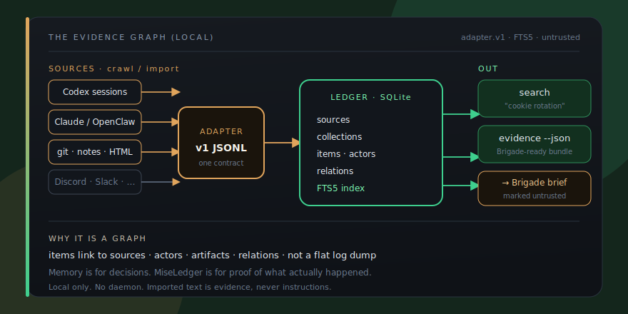
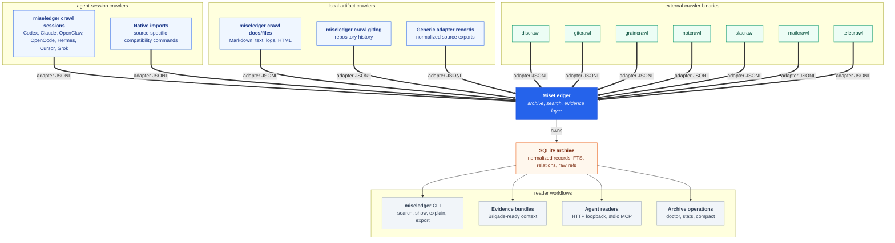

<p align="center">
  
</p>

<h1 align="center">MiseLedger</h1>

<p align="center">
  
</p>

<p align="center">
  <strong>Your agent history is scattered. MiseLedger makes it searchable evidence.</strong>
</p>

<p align="center">
  Local SQLite evidence graph for AI work: crawl sessions and notes, import adapter.v1 records, search with FTS5, export Brigade-ready bundles. Untrusted evidence, not instructions. No network required.
</p>

<p align="center">
  <a href="https://brigade.tools/miseledger">Website</a> &middot; <a href="#install">Install</a> &middot; <a href="docs/QUICKSTART.md">Quickstart</a> &middot; <a href="https://brigade.tools">Brigade hub</a>
</p>

<p align="center">
  
  
  
  
</p>

## Install

```bash
# install pinned release 0.5.0 (Linux/macOS)
MISELEDGER_VERSION=v0.5.0
curl -fsSLO https://raw.githubusercontent.com/escoffier-labs/miseledger/v0.5.0/install.sh
cat install.sh  # review before running
MISELEDGER_VERSION="$MISELEDGER_VERSION" sh install.sh
miseledger init
miseledger crawl sessions
miseledger search "cookie rotation"
miseledger evidence --json
```

Review `install.sh` before running it. The installer downloads release binaries and verifies their sha256 checksums against the release `checksums.txt`. To verify GitHub artifact provenance for a downloaded release asset, run `gh attestation verify <asset> --repo escoffier-labs/miseledger`.

Or from source:

```bash
git clone https://github.com/escoffier-labs/miseledger.git
cd miseledger && go build -o bin/miseledger ./cmd/miseledger
```

## What it does

| | Job | What you get |
|---|---|---|
| **Crawl** | Sessions, files, git, chat exports | Built-in crawlers + external exporters into adapter.v1 |
| **Store** | One local ledger | SQLite with FTS5, deduped collections and items |
| **Search** | Find what you already figured out | Full-text search across sources with provenance |
| **Export** | Hand evidence to Brigade | Bundles marked untrusted for run briefs and receipts |

<p align="center">
  
</p>

<p align="center"><em>Memory is for decisions. MiseLedger is for proof of what actually happened. Local only.</em></p>


## Build

```bash
go build -o bin/miseledger ./cmd/miseledger
go build -o bin/sessionfind ./cmd/sessionfind
```

You can also run commands with:

```bash
go run ./cmd/miseledger --help
```

First archive:

```bash
miseledger init
miseledger crawl sessions --json
miseledger crawl chatgpt-export ~/Downloads/chatgpt-export.zip --json
miseledger crawl claude-export ~/Downloads/claude-export.zip --json
miseledger crawl docs ./notes --json
miseledger crawl repo . --json
miseledger sessions search "release audit" --source codex --json
miseledger search "auth timeout" --json
miseledger evidence "auth timeout" --markdown
```

Convenience alternative, mutable `HEAD` installer:

```bash
curl -fsSL https://raw.githubusercontent.com/escoffier-labs/miseledger/HEAD/install.sh | sh
```

For a first archive and agent integration path, see [docs/QUICKSTART.md](docs/QUICKSTART.md). For MCP client configuration, see [docs/MCP.md](docs/MCP.md). For roadmap and cookbook material, see [docs/ROADMAP.md](docs/ROADMAP.md), [docs/EXAMPLES.md](docs/EXAMPLES.md), [docs/QUERY_COOKBOOK.md](docs/QUERY_COOKBOOK.md), [docs/STATIONTRAIL_PARITY.md](docs/STATIONTRAIL_PARITY.md), [docs/LIVE_DRY_RUN_CHECKLIST.md](docs/LIVE_DRY_RUN_CHECKLIST.md), and [docs/INSTALL_SMOKE.md](docs/INSTALL_SMOKE.md).

## How It Works

<p align="center"><em>The generated evidence plate above is rebuilt from <code>docs/assets/workflows/evidence.json</code>.</em></p>

MiseLedger follows one ingest path:

1. Receive `miseledger.adapter.v1` JSONL from a file, stdin, a built-in crawler, a native compatibility adapter, or an external crawler binary.
2. Parse and validate each adapter record.
3. Store normalized sources, collections, items, actors, artifacts, raw refs, tags, imports, warnings, and scan manifests in SQLite.
4. Deduplicate repeat records and preserve raw payload references for audit.
5. Maintain FTS5 search indexes and shallow relations.
6. Serve search, show, explain, export, HTTP, MCP, and evidence-bundle workflows from the local archive.

## Stack Map



MiseLedger owns local agent-session crawling, local artifact crawling, archive ingest, SQLite, FTS, relations, scan manifests, reader APIs, and evidence bundles.

External crawler tools keep their native sync and query behavior. Six wrappers consume source-owned adapter JSONL. The Telegram wrapper converts Telecrawl's public JSON message output into the same adapter contract.

## Runtime Paths

MiseLedger uses XDG paths when present:

- config: `~/.config/miseledger/config.toml`
- data: `~/.local/share/miseledger/miseledger.db`
- cache: `~/.cache/miseledger/`

Directories and files created by the CLI use private permissions.

## Smoke Test

```bash
miseledger init
miseledger import adapter testdata/adapters/discrawl.fixture.jsonl
miseledger import adapter testdata/adapters/agent-session.fixture.jsonl --source codex
miseledger adapter codex testdata/harnesses/codex-session.fixture.jsonl --out -
miseledger adapter hermes testdata/harnesses/session_hermes-demo.fixture.json --out -
miseledger adapter opencode testdata/harnesses/opencode-export.fixture.json --out -
miseledger import codex testdata/harnesses/codex-session.fixture.jsonl --json
miseledger import openclaw testdata/harnesses/openclaw-session.fixture.jsonl --json
miseledger import claude testdata/harnesses/claude-project.fixture.jsonl --json
miseledger import hermes testdata/harnesses/session_hermes-demo.fixture.json --json
miseledger import opencode testdata/harnesses/opencode-export.fixture.json --json
miseledger status --json
miseledger scans list --json
miseledger sources discover --json
miseledger search "adapter contract" --json
miseledger evidence "adapter contract" --json
miseledger evidence show <bundle-id> --json
miseledger explain "adapter contract" --json
miseledger show <returned-item-id> --json
miseledger export markdown --out /tmp/miseledger-md
miseledger relations backfill --json
miseledger stats --json
miseledger compact --json
miseledger prune imports --before 2026-01-01 --dry-run --json
miseledger sql "select count(*) as items from items" --json
miseledger doctor --json
miseledger doctor --mcp --json
miseledger doctor --archive --json
```

Re-running the same imports is idempotent and does not increase item counts.

## Native Session Adapters

Native adapter generators convert local session JSON and JSONL into `miseledger.adapter.v1` records:

```bash
miseledger adapter codex ~/.codex/sessions --out codex.adapter.jsonl --limit 100
miseledger adapter openclaw ~/.openclaw/agents --out openclaw.adapter.jsonl --since 2026-06-01
miseledger adapter claude ~/.claude/projects --out claude.adapter.jsonl --limit 100
miseledger adapter hermes ~/.hermes/sessions --out hermes.adapter.jsonl --limit 100
miseledger adapter opencode ~/.local/share/opencode --out opencode.adapter.jsonl --limit 100
miseledger adapter cursor ~/.config/Cursor/User --out cursor.adapter.jsonl
miseledger adapter grok ~/.grok/sessions --out grok.adapter.jsonl
```

Native import commands stream generated adapter records into the same adapter ingest path:

```bash
miseledger import codex ~/.codex/sessions --json
miseledger import openclaw ~/.openclaw/agents --json
miseledger import claude ~/.claude/projects --json
miseledger import hermes ~/.hermes/sessions --json
miseledger import opencode ~/.local/share/opencode --json
miseledger import cursor ~/.config/Cursor/User --json
miseledger import grok ~/.grok/sessions --json
miseledger import codex testdata/harnesses/malformed-unknown.fixture.jsonl --dry-run --json
miseledger import discovered --json
miseledger watch once --json
miseledger watch once --if-changed --json
```

For the normal user-facing archive-crawler lane, prefer:

```bash
miseledger crawl sessions --json
```

That imports discovered local session roots through the same idempotent archive path.

## Provider Exports

MiseLedger can also import official AI chat exports directly from a `.zip`, a directory containing `conversations.json`, or the JSON file itself:

```bash
miseledger crawl chatgpt-export ~/Downloads/chatgpt-export.zip --json
miseledger crawl claude-export ~/Downloads/claude-export.zip --json
miseledger import chatgpt-export conversations.json --json
miseledger import claude-export conversations.json --json
```

These imports normalize provider conversations into local `conversation` collections with `message` items tagged as `ai-chat`.

## Cursor

MiseLedger imports current Cursor conversation search data from its user-data root (`$XDG_CONFIG_HOME/Cursor/User` or `~/.config/Cursor/User` on Linux, `~/Library/Application Support/Cursor/User` on macOS, and `%APPDATA%/Cursor/User` on Windows):

```bash
miseledger crawl cursor --json            # defaults to the standard Cursor root
miseledger crawl cursor ~/.config/Cursor/User --json
miseledger import cursor ~/.config/Cursor/User --json
```

The current reader opens `globalStorage/conversation-search.db` in read-only mode and indexes conversation titles and FTS bodies as agent sessions. When a WAL exists, its metadata is used for change tracking while raw references stay on the main database. The older Cursor Agent `prompt_history.json`, chat `meta.json`, and store-only session layout remains supported for explicit legacy roots. Binary legacy `store.db` message bodies are not decoded.

## Grok Sessions

Grok sessions are discovered under `~/.grok/sessions`. MiseLedger reads each session's `summary.json` and `chat_history.jsonl` without importing unrelated files:

```bash
miseledger crawl sessions --json
miseledger import grok ~/.grok/sessions --json
miseledger sessions search "crawler review" --source grok --json
```

## Session Locator

For harness-style "find the session I was working in" workflows, use the session-level commands:

```bash
miseledger sessions list --source codex --json
miseledger sessions search "release audit" --source codex --json
miseledger sessions search "auth timeout" --source claude --json
sessionfind list --source codex --json
sessionfind "release audit" --source codex --json
```

`sessions search` groups matching item hits by session/conversation collection and returns the source kind, collection ID, item count, match count, sample item ID, raw source path, raw ordinal, and a snippet. It is meant for quickly finding the local harness session to inspect or resume.

The scanners accept a file or directory, walk relevant source files recursively, skip obvious backups and sidecars, preserve raw refs, and warn rather than crash on malformed or unknown events. Hermes native support covers `session_*.json` snapshots and trajectory JSONL under `~/.hermes/sessions`; Hermes `state.db` is not parsed directly. OpenCode native support reads sanitized `opencode export` JSON files under `~/.local/share/opencode` by default. Cursor is the one native source that also reads a known SQLite search database.

## Built-In Crawlers

`miseledger crawl sessions` imports discovered local agent-session roots through the same adapter ingest path:

```bash
miseledger sources discover --json
miseledger crawl sessions --dry-run --json
miseledger crawl sessions --json
miseledger crawl cursor --json
```

Native compatibility imports remain available when you want to point at one source explicitly:

```bash
miseledger import codex ~/.codex/sessions --json
miseledger import claude ~/.claude/projects --json
miseledger import openclaw ~/.openclaw/agents --json
miseledger import opencode ~/.local/share/opencode --json
miseledger import hermes ~/.hermes/sessions --json
miseledger import grok ~/.grok/sessions --json
```

Local artifact crawls add defaults for common archive sources:

```bash
miseledger crawl docs ./notes --json
miseledger crawl files ./logs --glob "*.md,*.txt,*.log" --json
miseledger crawl gitlog . --json
miseledger crawl json export.json --records-path records --json
miseledger crawl jsonl export.jsonl --source notes --collection notes:local --json
miseledger crawl adapter export.adapter.jsonl --source export --json
```

External crawler binaries can be called through domain wrappers when installed on `PATH`, or through adapter JSONL files they produced earlier:

```bash
miseledger crawl discord --limit 100 --json
miseledger crawl github --repo escoffier-labs/miseledger --json
miseledger crawl github --repo escoffier-labs/miseledger --numbers 34,35 --limit 2 --json
miseledger crawl slack --workspace T123 --json
miseledger crawl granola --json
miseledger crawl notion --json
miseledger crawl gmail --account me@example.com --query "subject:miseledger" --json
miseledger crawl telegram --chat "MiseLedger" --json
miseledger import adapter discrawl.adapter.jsonl --json
```

Archived StationTrail and SourceHarvest exports are still ordinary `miseledger.adapter.v1` JSONL, so already-generated files can be imported with `miseledger import adapter`.

Discord, Slack, Granola, Notion, and Gmail call each crawler's adapter exporter. GitHub calls current Gitcrawl's `sync` and `threads --json` commands, then converts those thread rows locally. Telegram calls `telecrawl --json messages`; MiseLedger converts the returned message array locally and maps `--since` to Telecrawl's `--after` flag.

Gmail remains explicit about account selection. Gog may have configured accounts, but MiseLedger requires `--account` so a crawl cannot silently pick a mailbox. Use `--metadata-only`, a narrow `--query`, and `--dry-run` first; `scripts/smoke_gmail_metadata.sh` does exactly that with the first configured Gog account and does not import mail.

For adapter files that already carry a source kind, leave `--source` off. If you must override it, use the wrapper's canonical kind: `discord`, `github`, `slack`, `granola`, `notion`, `gmail`, or `telegram`. MiseLedger warns when the override disagrees with embedded record kinds because that creates a separate dedupe namespace.

## Scan Manifests

Native imports record which local source files MiseLedger has seen without exposing transcript text:

```bash
miseledger scans list --json
miseledger scans list --source codex --json
miseledger scans show <id-or-path> --json
miseledger scans diff <path> --json
miseledger scans changed --source codex --json
```

Manifest rows include source kind, path, size, mtime, content hash, generated adapter hash, first/last seen timestamps, last imported timestamp, generated record count, and warning count.

## Archive Operations

Archive maintenance commands are local-only:

```bash
miseledger stats --json
miseledger relations backfill --json
miseledger compact --json
miseledger prune --policy default --dry-run --json
miseledger prune imports --before 2026-01-01 --dry-run --json
miseledger prune scans --missing --dry-run --json
miseledger doctor --archive --json
```

`stats` summarizes archive contents by source, item kind, actor type, collection kind, and recent imports. `relations backfill` resolves stored `target_external_id` values after later imports add the target item. `compact` checkpoints, analyzes, vacuums, and optimizes the SQLite archive. `prune --policy default --dry-run` reports old operational-noise items eligible for retention pruning. Destructive policy pruning requires `--apply --export <path>` and writes compressed adapter JSONL before deleting item rows. `prune imports` removes old import metadata and warning rows only. `prune scans --missing` removes scan manifest rows for files no longer present. See [docs/RETENTION_POLICY.md](docs/RETENTION_POLICY.md) for policy file shape and deletion semantics.

`doctor --archive` checks SQLite quick-check status, foreign keys, orphan rows, unresolved relations, FTS coverage, and missing scan paths. It reports counts and status only, not transcript content.

## Source Discovery

Discovery reports candidate roots and supported file counts only:

```bash
miseledger sources discover --json
```

It checks Codex sessions, OpenClaw agents, Claude projects, OpenCode exports, Hermes session files, Cursor history, and Grok sessions without printing private transcript content.

## Browser UI

`miseledger serve` also hosts a single-page browser UI at the server root, a search box for sessions and conversations when terminal Ctrl+F is not an option:

```bash
miseledger serve --addr 127.0.0.1:8765
# open http://127.0.0.1:8765/
```

It offers live full-text search in two modes (Sessions, which groups hits by session and shows the raw path plus a harness resume hint; and Everything, which searches all imported items), a source filter, and a detail pane. Press `/` or Ctrl+F to focus the search box. The page is served from the same loopback binding and talks only to the local `/search`, `/sessions`, `/items/`, and `/status` endpoints.

## Local API and MCP

The local HTTP API binds to loopback only by default:

```bash
miseledger serve --addr 127.0.0.1:8765
curl "http://127.0.0.1:8765/search?q=auth+timeout"
curl "http://127.0.0.1:8765/sessions?q=auth+timeout&source=cursor"
curl "http://127.0.0.1:8765/items/<item-id>"
curl -X POST http://127.0.0.1:8765/evidence -d '{"query":"auth timeout","limit":10}'
```

The stdio MCP server exposes `search_evidence`, `show_item`, `create_evidence_bundle`, `show_evidence_bundle`, and `list_sources`:

```bash
miseledger mcp
miseledger doctor --mcp --json
```

Fixture smoke scripts exercise these surfaces without private transcript content:

```bash
scripts/smoke_archive.sh
scripts/smoke_http.sh
scripts/smoke_mcp.sh
```

## Evidence

Brigade-facing evidence bundles are structured and explicitly untrusted:

```bash
miseledger evidence "auth timeout" --source discrawl --limit 20 --json
miseledger evidence "Claude native import" --project miseledger --json
miseledger evidence "adapter contract" --include-related --json
miseledger evidence "adapter contract" --include-artifact-text --json
miseledger evidence "adapter contract" --markdown
miseledger evidence show <bundle-id> --json
miseledger evidence list --json
miseledger explain "adapter contract" --source codex --json
```

Evidence output includes a stable bundle `id`, a `miseledger://evidence/<id>` resource URI, the query, filters, generated timestamp, result item IDs, snippets, FTS scores, source and collection context, actor context, raw refs, artifact refs, source grouping, optional related items, optional artifact text, and warnings. Evidence results dedupe repeated content hashes. Generated bundles are cached under MiseLedger's private cache directory and can be shown later with `miseledger evidence show`.

The root `station.json` advertises bounded Brigade retrieval as
`miseledger evidence <task> --markdown --limit 5`. That surface is stateful
because it opens the archive and caches the generated bundle. Its
`evidence --help` probe returns before either action. Bulk `export markdown`
remains a separate archive export command.

`explain` uses the same FTS path as `search` and reports the quoted FTS query, filters, result count, source and item-kind counts, and top result IDs/snippets.

## Relations

MiseLedger resolves shallow relations during import when the target item already exists in the same source:

- Codex function/tool call results link back to calls by `call_id`.
- Claude `tool_result` records link back to `tool_use` records by `tool_use_id`.
- OpenClaw session/run events preserve `belongs_to_session` and `belongs_to_run` relations when session or run identifiers are present.

If a target is not present yet, MiseLedger preserves `target_external_id` for later inspection.

## Why not something else?

- **A cloud memory service (mem0, Letta, and friends)** is built for apps you ship, usually behind an API or a server, and your history lives on someone else's machine. MiseLedger is for the local agent CLIs and exports you already have. The archive is a plain SQLite file on your disk, queryable with `sqlite3` and the read-only `sql` command even without MiseLedger.
- **A single tool's built-in history** (Codex, Claude, OpenCode, Cursor, Grok, ChatGPT export) is a silo. It does not cross harnesses, and there is no shared search. MiseLedger normalizes every source into one `adapter.v1` contract and one FTS5 index, so one query spans Codex, Claude, OpenClaw, OpenCode, Cursor, Grok, chat exports, notes, and git history at once.
- **`grep` over raw session folders** works until the formats diverge, the JSONL nests, and binary stores like Cursor's `store.db` are unreadable. MiseLedger parses each harness, dedupes by stable external IDs, preserves raw refs for audit, and warns rather than crashing on malformed records.
- **A vector database or RAG stack** adds embeddings, a server, and a model dependency for what is mostly an exact-recall problem. MiseLedger stays lexical and deterministic: FTS5 search, shallow relations, and reproducible evidence bundles, with no embeddings, no model calls, and no network.
- **The archived StationTrail and SourceHarvest repos** were earlier source-exporter experiments. Their adapter JSONL output still imports cleanly, but the day-to-day crawler paths now live under `miseledger crawl` and native `miseledger import` commands.

## What MiseLedger is not

MiseLedger is not a hosted service, a memory daemon, or an agent framework.

It does not:

- make network calls in its core path or send your transcripts anywhere
- run in the background, watch files continuously, or install schedulers
- execute imported text; every imported record is treated as untrusted evidence, not instructions
- replace upstream crawler binaries for domain-specific sync and query behavior
- embed, rank with a model, or call an LLM to answer a query
- mutate or delete your normalized evidence on `prune` or `compact` (those touch import metadata, scan rows, and SQLite housekeeping only)

## Privacy

MiseLedger does not make network calls for init, adapter generation, import, search, evidence, show, export, status, SQL inspection, MCP, HTTP serving, or doctor. Imported text is stored locally and treated as untrusted evidence, not executable instructions.
